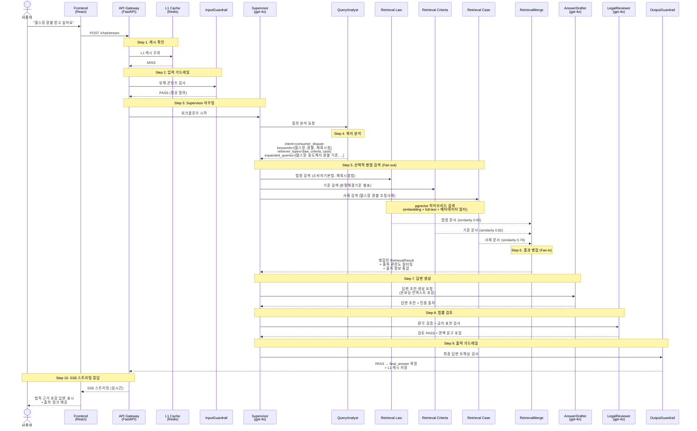
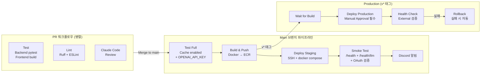
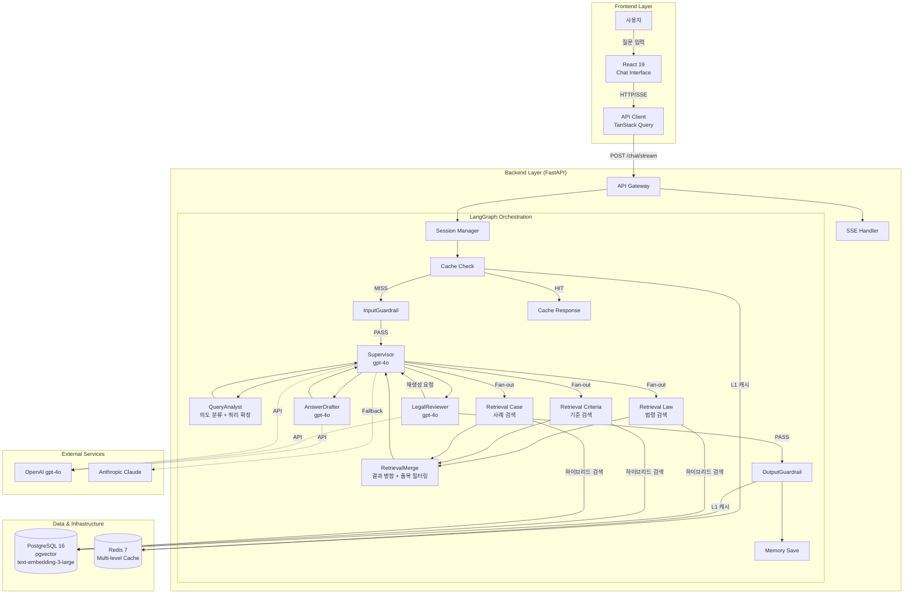

# 똑소리 (DDOKSORI)

**한국 소비자 분쟁 해결을 위한 RAG + Multi-Agent System 챗봇**

> 복잡한 소비자 분쟁 문의에 대해 법령, 분쟁조정사례, 상담사례를 기반으로 정확하고 신뢰도 높은 답변을 제공합니다.

최종 수정일: 2026-07-05

---

## 목차

- [프로젝트 개요](#1-프로젝트-개요)
- [왜 MAS인가?](#2-왜-mas인가)
- [변형(Variant) 아키텍처 & 측정 비교](#변형variant-아키텍처--측정-비교)
- [Happy Path (E2E)](#3-happy-path-e2e)
- [CI/CD 파이프라인](#4-cicd-파이프라인)
- [Quickstart](#5-quickstart)
- [Configuration](#6-configuration)
- [Architecture](#7-architecture)
- [Documentation Hub](#8-documentation-hub)

---

## 1. 프로젝트 개요

본 프로젝트는 React, FastAPI, LangGraph, PostgreSQL 등 현대적인 기술 스택을 활용하여 한국 소비자 분쟁 관련 문의에 대해 법적 근거가 포함된 신뢰성 높은 답변을 제공하는 MAS(Multi-Agent System) 챗봇입니다.

### 핵심 기능

| 기능 | 설명 |
|------|------|
| **MAS Supervisor v2** | **규칙 기반(결정론적)** Supervisor가 전문 에이전트를 조율하는 Hub-Spoke 구조 (variant A). LLM 라우팅은 A-hub·측정 전용 — [변형 비교](#변형variant-아키텍처--측정-비교) 참조 |
| **Selective Retrieval** | 쿼리 분석 결과에 따라 필요한 Retrieval Agent만 선택적 병렬 실행 (법령/기준/사례) |
| **Progressive Disclosure** | 적응형 응답 모드 (legacy/minimal/adaptive) + 후속 질문 기반 점진적 상세 안내 |
| **온보딩 컨텍스트 영속화** | 구매일/품목/금액 등 온보딩 데이터를 세션 간 유지, 경과 일수 자동 계산 |
| **하이브리드 검색** | pgvector (text-embedding-3-large 1536d) + 전문(Full-text) 검색 결합 + 품목 관련도 필터링 |
| **실시간 스트리밍** | SSE(Server-Sent Events)를 통한 실시간 답변 생성 및 출처 제공 |
| **신뢰성 보장** | 법률 검토 에이전트(gpt-4o)를 통한 환각 방지 및 면책 문구 자동 포함 |
| **Fallback 체인** | LLM 실패 시 자동 전환 (gpt-4o → gpt-4o-mini → claude-3-haiku → rule_based → safe_fallback) |

### 기술 스택

| 레이어 | 기술 |
|--------|------|
| Frontend | React 19, TypeScript (strict), Vite, TailwindCSS, Zustand, TanStack Query |
| Backend | FastAPI, LangGraph, Pydantic v2, Python 3.11 |
| Database | PostgreSQL 16 + pgvector (AWS RDS), Redis 7 |
| Infra | Docker Compose, AWS ECR, EC2, GitHub Actions CI/CD |
| LLM | OpenAI gpt-4o, text-embedding-3-large (1536d) |

---

## 2. 왜 MAS인가?

### 단순 RAG vs MAS 비교

| 항목 | 단순 RAG | MAS (본 프로젝트) |
|------|----------|-------------------|
| **쿼리 처리** | 원본 쿼리 그대로 검색 | QueryAnalyst가 의도 분류, 키워드 추출, 쿼리 확장 수행 |
| **검색 전략** | 단일 벡터 DB 검색 | 법령/기준/사례 3개 전문 Agent가 선택적 병렬 검색 |
| **결과 병합** | 단순 similarity top-k | RetrievalMerge가 품목 관련도 필터링 + 출처 통합 |
| **답변 생성** | 검색 결과 + LLM 직결 | AnswerDrafter가 온보딩 컨텍스트 반영 + 구조화된 답변 생성 |
| **품질 검증** | 없음 | LegalReviewer가 환각 검증 + 금지 표현 검사 + 면책 문구 포함 |
| **오류 복원** | 단일 실패점 | Fallback 체인 (gpt-4o → gpt-4o-mini → rule_based → safe_fallback) |
| **입출력 보호** | 없음 | InputGuardrail / OutputGuardrail로 유해 콘텐츠 차단 |

### Hub-Spoke 패턴을 선택한 이유

```
                    ┌─────────────┐
                    │  Supervisor  │  ← 중앙 관제자 (라우팅 + 상태 관리)
                    └──────┬──────┘
           ┌───────────────┼───────────────┐
           v               v               v
    ┌─────────────┐ ┌─────────────┐ ┌─────────────┐
    │ QueryAnalyst│ │  Retrieval  │ │   Review    │
    │  (분석)      │ │  Team (검색) │ │  (검증)      │
    └─────────────┘ └──────┬──────┘ └─────────────┘
                    ┌──────┼──────┐
                    v      v      v
                  Law  Criteria  Case
```

1. **도메인 전문성** -- 법령/기준/사례 각각에 최적화된 메타데이터 필터와 검색 전략 적용
2. **선택적 실행** -- 쿼리 유형에 따라 필요한 Agent만 병렬 호출하여 불필요한 검색 비용 절감
3. **품질 게이트** -- LegalReviewer가 최종 답변의 법적 정확성을 검증하는 별도 단계 확보
4. **장애 격리** -- 개별 Agent 실패가 전체 시스템에 전파되지 않음 (Agent별 에러 핸들링)
5. **재생성 루프** -- LegalReviewer 검토 결과에 따라 AnswerDrafter에게 재생성 요청 가능 (max 1회)

---

## 변형(Variant) 아키텍처 & 측정 비교

DDOKSORI의 목표는 "답변 잘하는 챗봇 하나"가 아니라 **서로 다른 아키텍처의 챗봇을 동일 조건에서 측정·비교하는 시스템**이다. 하나의 백엔드가 여러 **변형(variant)** 을 실행하고, 각 요청은 variant 라벨로 DB·Prometheus에 적재되어 SQL·대시보드로 A/B 비교된다. 핵심 대비는 **workflow(결정론 조율) vs agent(LLM 자율 판단)** — Anthropic *"Building Effective Agents"* 의 구분과 일치한다.

| 변형 | 정의 | 의사결정 | LLM tool-calling | 모델 | 상태 |
|------|------|----------|:---:|------|------|
| **A** | MAS Hub-Spoke **고정 파이프라인** (결정론) | 규칙 기반 | ❌ | gpt-4o | **프로덕션 기본(동결)** |
| **A-hub** | A와 동일 그래프 + **LLM 슈퍼바이저 라우팅** | LLM 라우팅 | ❌(라우팅만) | gpt-4o | 측정 전용(M8) |
| **B-frontier** | **ReAct 자율 에이전트** | LLM 자율 | ✅ | gpt-4o-mini | opt-in 비교 |
| **B-exaone** | ReAct 자율 에이전트 (자체 호스팅) | LLM 자율 | ✅ | EXAONE 4.5-33B (RunPod H100) | 연구/비교 전용 |

> A와 A-hub는 **같은 LangGraph 그래프**를 공유(차이는 라우팅 방식뿐). B-frontier와 B-exaone은 **같은 ReAct 에이전트**를 공유(차이는 chat model뿐). A에는 LLM tool-calling이 없다 — 진짜 agentic tool-calling은 B에만 있다.

### 측정 비교 (핵심 지표)

| 지표 | A (결정론 MAS) | B-frontier (ReAct) | B-exaone | 출처 |
|------|:---:|:---:|:---:|------|
| faithfulness | **2.00** | 1.92 | — | M5-5 |
| safety pass | **1.00** | 0.83 | — | M5-5 |
| 보안 decided | **100%** | 96% | 96.2% | M4-A |
| leak_rate | 0% | 0% | 0% | M4-A |
| latency median | 10.2s | **6.4s** | ≈84s | M5-5 |
| 자율성/유연성 | 낮음 | **높음** | **높음** | 구조 |

**A vs A-hub (M8, "LLM 라우팅이 이득인가")**: A-hub의 LLM 슈퍼바이저는 결정론 라우터와 **100% 동일한 결정**(60/60)을 내리면서 **지연 +74%**(10.8s→18.9s)와 요청당 +5 LLM 호출만 더했다. 약모델(gpt-4o-mini)에선 루프→에러. → **선형 파이프라인에서 LLM 라우팅은 순수 오버헤드**이며, A의 결정론 동결이 정당함을 실측으로 입증.

**결론**: 도메인 핵심 축(안전·보안·충실성)은 A(workflow)가, 속도·유연성은 B-frontier(agent)가 우위. 보안 격차는 **모델이 아니라 아키텍처**(고정 파이프라인 vs 자율 에이전트) 차이. 전체 구조·의사결정·측정 상세는 **[변형 시스템 아키텍처 문서](docs/architecture/2026-07-05-variant-system-architecture.md)** 참조.

---

## 3. Happy Path (E2E)

### 예시 시나리오: "헬스장 환불 받고 싶어요"

사용자가 헬스장 환불에 대해 질문하면, 시스템은 다음 10단계를 거쳐 법적 근거가 포함된 답변을 생성합니다.



### 주요 분기 경로

| 경로 | 조건 | 동작 |
|------|------|------|
| **Cache Hit** | L1 캐시 존재 | Supervisor 이하 전체 생략, 즉시 응답 |
| **Fast Path** | mode = NO_RETRIEVAL / META_CONVERSATIONAL | Retrieval 생략, 바로 AnswerDrafter |
| **Followup Path** | mode = FOLLOWUP_WITH_CONTEXT | 이전 턴의 캐시된 검색 결과 재사용 |
| **Retry Loop** | LegalReviewer 거부 | AnswerDrafter 재생성 (max 1회) |
| **Guardrail Block** | 입력/출력 유해 판정 | 안전한 fallback 메시지 반환 |

---

## 4. CI/CD 파이프라인

### PR 워크플로우 (develop/main 브랜치)

Pull Request가 생성되면 3개의 워크플로우가 병렬 실행됩니다.

| 워크플로우 | 내용 |
|-----------|------|
| **Test** | Backend pytest (`-m "not skip_ci and not llm"`) + Frontend build 검증 |
| **Lint** | Backend Ruff (format + check) + Frontend ESLint |
| **Claude Code Review** | AI 코드 리뷰 (버그/보안/품질 자동 검토, PR 코멘트) |

### Main 브랜치 파이프라인

main에 머지되면 Build → Deploy → Notify 순서로 자동 배포됩니다.



### 파이프라인 상세

| 단계 | 트리거 | 주요 동작 |
|------|--------|----------|
| **Test (PR)** | `pull_request` | pytest (fast, LLM 제외) + pgvector/Redis 서비스 컨테이너 |
| **Test (main)** | `push: main` | pytest (full, Cache 활성화, OPENAI_API_KEY 포함) |
| **Lint** | `pull_request`, `push: main` | `ruff format --check` + `ruff check` + `npm run lint` |
| **Claude Code Review** | `pull_request` → main/develop | Anthropic Claude가 PR diff를 분석, 심각도별 코멘트 |
| **Build & Push** | `push: main`, `tags: v*` | Docker Buildx → AWS ECR (backend/frontend 이미지, GHA 캐시) |
| **Deploy Staging** | Build 완료 후 자동 | SSH → ECR pull → `docker compose up -d` → Smoke Test |
| **Deploy Production** | `tags: v*` | Manual Approval 필수 → 배포 → Health Check → 실패 시 자동 Rollback |
| **Discord 알림** | Deploy 성공/실패 | Webhook으로 팀 채널에 배포 결과 통보 |

### Smoke Test 항목

| 검사 | 필수 여부 | 설명 |
|------|----------|------|
| `GET /health` | 필수 | DB 연결 상태 확인 |
| `GET /health/llm/supervisor` | 경고 | LLM API 연결 확인 |
| `GET /health/embedding` | 경고 | 임베딩 서비스 확인 |
| `GET /` | 필수 | API 서버 응답 확인 |
| OAuth 환경변수 | 경고 | GOOGLE/NAVER CLIENT_ID 설정 여부 |

---

## 5. Quickstart

### Local 개발 환경

#### Backend

```bash
# 1. 가상환경 활성화 (Conda 필수)
conda activate dsr

# 2. 의존성 설치
cd backend
pip install -r requirements.txt

# 3. 환경 변수 설정
cp .env.example .env
# .env 파일에 OPENAI_API_KEY 등 설정

# 4. 서버 실행
uvicorn app.main:app --reload --port 8000
```

#### Frontend

```bash
# 1. 의존성 설치
cd frontend
npm install

# 2. 개발 서버 실행
npm run dev
```

### Docker Compose

Docker Compose를 사용하여 서비스 스택(Backend, Frontend, Redis, PostgreSQL/pgvector)을 실행할 수 있습니다.
PostgreSQL/pgvector service는 Ddoksori가 관리하는 local RAG DB volume을 만들며, 실제 vector data restore는 M1-7 dump restore 단계에서 수행합니다.

```bash
# M1-6: 로컬 pgvector DB service만 실행하고 extension 확인
POSTGRES_HOST_PORT=5433 docker compose up -d postgres

# 전체 서비스 실행 (M1-7 restore 이후 RAG 데이터 사용 가능)
docker compose up -d

# Redis만 실행 (로컬 개발 시)
docker compose up redis -d

# 서비스 중지 (DB volume은 보존됨)
docker compose down
```

### 서비스 포트 정보

| 서비스 | 포트 | 설명 |
|--------|------|------|
| Frontend | 5173 | React Web UI |
| Backend | 8000 | FastAPI API Server |
| PostgreSQL/pgvector | 5433 -> 5432 | Local RAG DB target (`POSTGRES_HOST_PORT`로 변경 가능) |
| Redis | 6379 | Answer Caching (인증 필수) |

### Key URLs

| URL | 설명 |
|-----|------|
| `http://localhost:5173` | Web UI |
| `http://localhost:8000/docs` | Swagger API 문서 |
| `http://localhost:8000/health` | 서버 상태 확인 |

---

## 6. Configuration

`.env` 파일을 통해 시스템 동작을 제어합니다. `.env.example`을 복사하여 사용하세요.

### 기본 설정

| 변수명 | 설명 | 기본값/예시 |
|--------|------|------------|
| `OPENAI_API_KEY` | OpenAI API 키 | `sk-...` |
| `ANTHROPIC_API_KEY` | Anthropic API 키 | `sk-ant-...` |
| `RETRIEVAL_MODE` | 검색 모드 | `hybrid` |
| `ENABLE_ANSWER_CACHE` | Redis 캐싱 활성화 | `false` |
| `RESPONSE_MODE` | 응답 처리 방식 | `legacy` / `minimal` / `adaptive` |

### 모델 설정

| 변수명 | 설명 | 기본값 |
|--------|------|--------|
| `MODEL_SUPERVISOR` | Supervisor 모델 (라우팅/조율) | `gpt-4o` |
| `MODEL_DRAFT_AGENT` | Draft Agent 모델 (답변 생성) | `gpt-4o` |
| `MODEL_REVIEW_AGENT` | Review Agent 모델 (법률 검토) | `gpt-4o` |

### 임베딩 설정

| 변수명 | 설명 | 기본값 |
|--------|------|--------|
| `EMBEDDING_MODEL` | 임베딩 모델 | `text-embedding-3-large` |
| `EMBEDDING_DIMENSION` | 임베딩 차원 | `1536` |
| `USE_OPENAI_EMBEDDING` | OpenAI 임베딩 사용 | `true` |

### 인증 설정

| 변수명 | 설명 |
|--------|------|
| `JWT_SECRET_KEY` | JWT 서명 비밀키 |
| `GOOGLE_CLIENT_ID` / `GOOGLE_CLIENT_SECRET` | Google OAuth 2.0 |
| `NAVER_CLIENT_ID` / `NAVER_CLIENT_SECRET` | Naver OAuth 2.0 |

### 에이전트별 모델 할당

| 에이전트 | Primary 모델 | Fallback |
|---------|-------------|----------|
| **Supervisor** | gpt-4o | Claude 3.5 Sonnet → Rule-based |
| **AnswerDrafter** | gpt-4o | gpt-4o-mini → rule_based → safe_fallback |
| **LegalReviewer** | gpt-4o | 규칙 기반 검토 |

---

## 7. Architecture

### 전체 시스템 구조



### MAS 노드 실행 순서

```
Entry → CacheCheck ──HIT──→ CacheResponse → END
                    │
                   MISS
                    │
                    v
              InputGuardrail ──BLOCK──→ END (fallback message)
                    │
                   PASS
                    │
                    v
               Supervisor ──→ QueryAnalyst ──→ Supervisor
                    │
                    v
              Fan-out (병렬)
           ┌────────┼────────┐
           v        v        v
       Law Agent  Criteria  Case Agent
           │      Agent      │
           └────────┼────────┘
                    v
             RetrievalMerge ──→ Supervisor
                    │
                    v
              AnswerDrafter ──→ Supervisor
                    │
                    v
              LegalReviewer ──→ Supervisor
                    │                │
                  PASS          RETRY (max 1)
                    │                │
                    v                v
             OutputGuardrail    AnswerDrafter
                    │
                    v
               MemorySave ──→ END
```

---

## 8. Documentation Hub

| 문서 | 링크 | 설명 |
|------|------|------|
| **변형 시스템 아키텍처** ⭐ | [docs/architecture/2026-07-05-variant-system-architecture.md](docs/architecture/2026-07-05-variant-system-architecture.md) | A/A-hub/B-frontier/B-exaone 4개 변형 구조·의사결정·측정 비교 (단일 출처) |
| **A 결정 기록** | [docs/architecture/2026-07-05-a-orchestration-decision.md](docs/architecture/2026-07-05-a-orchestration-decision.md) | A가 결정론적 orchestration인 이유(설계→동결 히스토리) |
| **LLM 클라이언트 레이어** | [backend/app/llm/README.md](backend/app/llm/README.md) | OpenAI/EXAONE(vLLM)/Anthropic 클라이언트 + 변형별 매핑 |
| **Backend** | [backend/README.md](backend/README.md) | 백엔드 MAS 아키텍처 전체 구조 |
| **Frontend** | [frontend/README.md](frontend/README.md) | 프론트엔드 구조 및 기능 모듈 |
| **에이전트 통합** | [backend/app/agents/README.md](backend/app/agents/README.md) | 에이전트 인터페이스 및 통합 가이드 |
| **쿼리 분석** | [backend/app/agents/query_analysis/README.md](backend/app/agents/query_analysis/README.md) | QueryAnalyst 의도 분류 및 쿼리 확장 |
| **검색 에이전트** | [backend/app/agents/retrieval/README.md](backend/app/agents/retrieval/README.md) | Law/Criteria/Case 검색 에이전트 |
| **답변 생성** | [backend/app/agents/answer_generation/README.md](backend/app/agents/answer_generation/README.md) | AnswerDrafter 답변 생성 및 Fallback |
| **법률 검토** | [backend/app/agents/legal_review/README.md](backend/app/agents/legal_review/README.md) | LegalReviewer 환각 검증 및 가드레일 |
| **Supervisor** | [backend/app/supervisor/README.md](backend/app/supervisor/README.md) | Supervisor 라우팅 및 상태 관리 |
