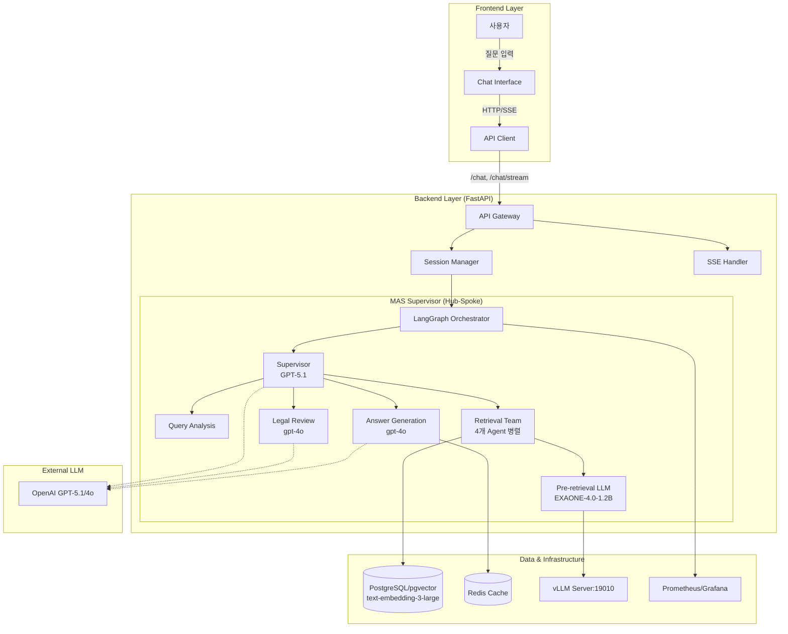
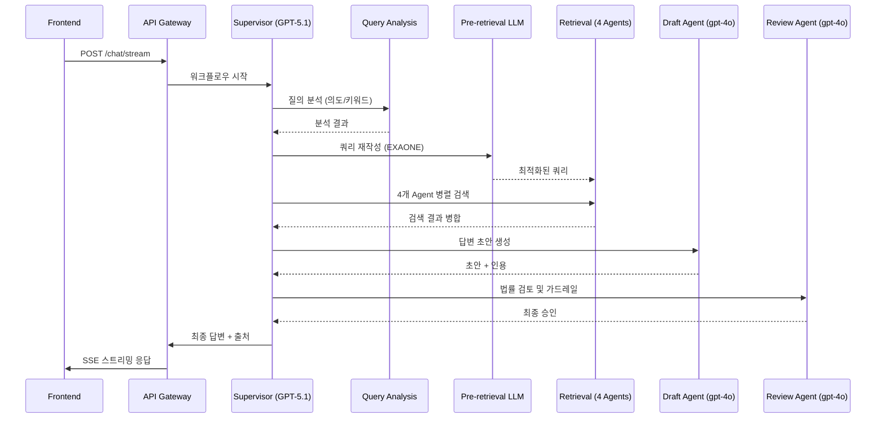

# 똑소리 (ddoksori_demo)

**한국 소비자 분쟁 조정을 위한 멀티 에이전트 챗봇 시스템**

## 1. 프로젝트 개요

본 프로젝트는 복잡하고 전문적인 한국의 소비자 분쟁 관련 문의에 대해 정확하고 신뢰도 높은 답변을 제공하는 MAS(Multi-Agent System) 챗봇입니다. React, FastAPI, LangGraph, PostgreSQL 등 현대적인 기술 스택을 활용하여 분쟁조정사례, 상담사례, 법령 데이터를 기반으로 최적의 해결 방안을 제시합니다.

### 핵심 기능
- **MAS Supervisor 아키텍처**: GPT-5.1 기반 Supervisor가 7개 전문 에이전트를 조율하는 Hub-Spoke 구조
- **Conversation Phase System**: Rule-based 대화 단계 상태 머신으로 점진적 정보 수집 및 단계별 안내 (법령→사례→절차)
- **Pre-retrieval LLM**: EXAONE-4.0-1.2B 기반 도메인 특화 쿼리 재작성으로 검색 정확도 향상
- **하이브리드 검색**: pgvector (text-embedding-3-large 1536d) + 전문(Full-text) 검색 결합
- **실시간 스트리밍**: SSE(Server-Sent Events)를 통한 실시간 답변 생성 및 출처 제공
- **신뢰성 보장**: 법률 검토 에이전트(gpt-4o)를 통한 환각 방지 및 면책 문구 자동 포함

---

## 2. Quickstart (Local)

### Backend
```bash
# 1. 가상환경 활성화 (Conda 필수)
conda activate dsr

# 2. 의존성 설치
cd backend
pip install -r requirements.txt

# 3. 서버 실행
uvicorn app.main:app --reload --port 8000
```

### Frontend
```bash
# 1. 의존성 설치
cd frontend
npm install

# 2. 개발 서버 실행
npm run dev
```

---

## 3. Quickstart (Docker)

Docker Compose를 사용하여 전체 스택(DB, Redis, Backend, Frontend, Monitoring)을 한 번에 실행할 수 있습니다.

```bash
# 전체 서비스 실행
docker compose up --build -d

# BGE-M3 임베딩 서버 포함 실행 (선택)
docker compose --profile bge-m3 up -d
```

### 서비스 포트 정보
| 서비스 | 포트 | 설명 |
|--------|------|------|
| Frontend | 5173 | React Web UI |
| Backend | 8000 | FastAPI API Server |
| Database | 5432 | PostgreSQL + pgvector |
| Redis | 6379 | Answer Caching |
| Embedding API | 8003 | BGE-M3 Embedding Server |
| CloudBeaver | 8978 | Web-based DB Manager |
| Prometheus | 9090 | Monitoring Metrics |
| Grafana | 3000 | Monitoring Dashboard |

---

## 4. Key URLs & Endpoints

상세 API 명세는 [backend/app/api/README.md](backend/app/api/README.md)를 참고하세요.

- **Web UI**: `http://localhost:5173`
- **API Docs**: `http://localhost:8000/docs`
- **주요 API**:
  - `POST /chat`: 챗봇 응답 생성
  - `POST /chat/stream`: SSE 스트리밍 응답
  - `POST /search`: 벡터 검색 (LLM 미사용)
  - `GET /health`: 서버 상태 확인

---

## 5. Configuration

`.env` 파일 설정을 통해 시스템 동작을 제어합니다. `backend/.env.example`을 복사하여 사용하세요.

### 기본 설정
| 변수명 | 설명 | 기본값/예시 |
|--------|------|------------|
| `OPENAI_API_KEY` | OpenAI API 키 | `sk-...` |
| `ANTHROPIC_API_KEY` | Anthropic API 키 | `sk-ant-...` |
| `RETRIEVAL_MODE` | 검색 모드 | `hybrid` |
| `ENABLE_ANSWER_CACHE` | Redis 캐싱 활성화 | `false` |

### 모델 설정 (Phase 8)
| 변수명 | 설명 | 기본값 |
|--------|------|--------|
| `MODEL_SUPERVISOR` | Supervisor 모델 (라우팅/조율) | `gpt-5.1` |
| `MODEL_DRAFT_AGENT` | Draft Agent 모델 (답변 생성) | `gpt-4o` |
| `MODEL_REVIEW_AGENT` | Review Agent 모델 (법률 검토) | `gpt-4o` |
| `MODEL_RETRIEVAL_LLM` | Pre-retrieval LLM (쿼리 재작성) | `LGAI-EXAONE/EXAONE-4.0-1.2B` |
| `MODEL_RETRIEVAL_FALLBACK` | Retrieval LLM 폴백 | `gpt-4.1-nano` |
| `PORT_EXAONE_VLLM` | EXAONE vLLM 서버 포트 | `19010` |

### 임베딩 설정
| 변수명 | 설명 | 기본값 |
|--------|------|--------|
| `EMBEDDING_MODEL` | 임베딩 모델 | `text-embedding-3-large` |
| `EMBEDDING_DIMENSION` | 임베딩 차원 | `1536` |
| `USE_OPENAI_EMBEDDING` | OpenAI 임베딩 사용 | `true` |

### RDS 테스트 설정
| 변수명 | 설명 | 기본값 |
|--------|------|--------|
| `DB_TEST_HOST` | RDS 테스트 호스트 | (RDS endpoint) |
| `DB_TEST_USER` | READ_ONLY 계정 | `readonly_user` |
| `USE_RDS_FOR_TESTS` | RDS 테스트 모드 활성화 | `false` |

---

## 6. Architecture

### 전체 시스템 구조


### 에이전트별 모델 할당
| 에이전트 | 모델 | Fallback |
|---------|------|----------|
| **Supervisor** | GPT-5.1 | Claude 3.5 Sonnet → Rule-based |
| **Draft Agent** | gpt-4o | gpt-4o-mini → rule_based → safe_fallback |
| **Review Agent** | gpt-4o | 규칙 기반 검토 |
| **Retrieval LLM** | EXAONE-4.0-1.2B | gpt-4.1-nano → original query |

### 에이전트 데이터 흐름


---

## 7. Documentation Hub

| 대상 | 문서 링크 | 설명 |
|------|-----------|------|
| **시작하기** | [EASY_START_GUIDE_KR.md](docs/guides/EASY_START_GUIDE_KR.md) | 상세 설치 및 실행 가이드 |
| **API** | [backend/app/api/README.md](backend/app/api/README.md) | 엔드포인트 및 데이터 모델 명세 |
| **아키텍처** | [backend/app/orchestrator/README.md](backend/app/orchestrator/README.md) | 에이전트 상세 설계 및 구현 가이드 |
| **인프라** | [docs/infrastructure/runpod-vllm-setup.md](docs/infrastructure/runpod-vllm-setup.md) | RunPod vLLM 서버 설정 가이드 |
| **로드맵** | [docs/plans/sprint-roadmap.md](docs/plans/sprint-roadmap.md) | 스프린트별 개발 계획 및 PR 목록 |
| **평가** | [docs/guides/evaluation-strategy.md](docs/guides/evaluation-strategy.md) | 에이전트별 평가 지표 및 전략 |
| **테스트** | [backend/scripts/testing/README.md](backend/scripts/testing/README.md) | 테스트 전략 및 데이터 파이프라인 |
