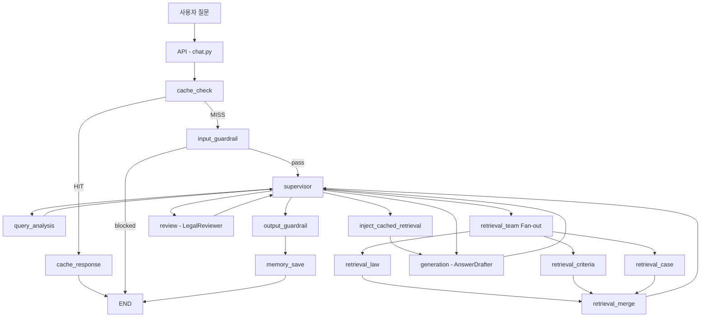
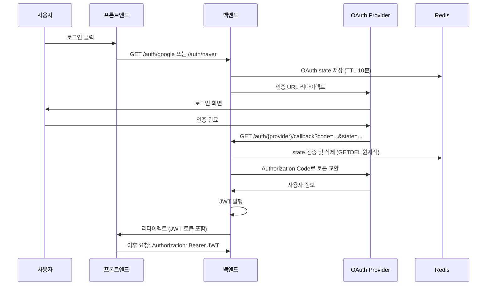
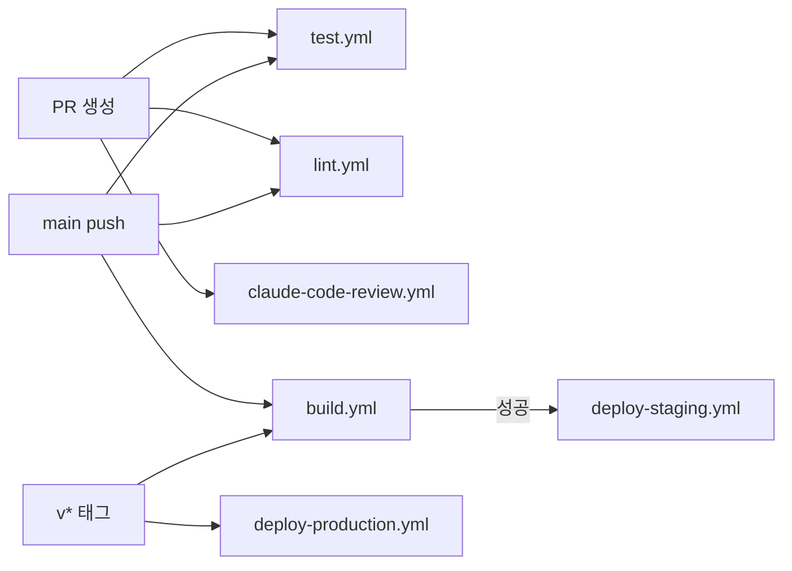
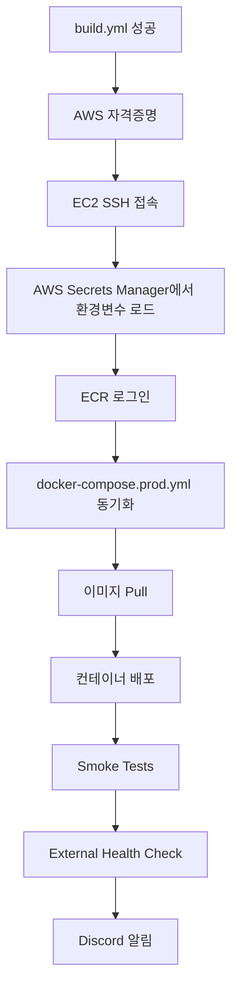

# Backend -- DDOKSORI

> **똑소리 프로젝트** -- 한국 소비자 분쟁 해결 Multi-Agent System 백엔드
> **스택**: FastAPI . LangGraph . PostgreSQL + pgvector . Redis . OpenAI

---

## 목차

### Part 1: AI/MAS 아키텍처
1. [MAS Supervisor 개요](#1-mas-supervisor-개요)
2. [에이전트 파이프라인](#2-에이전트-파이프라인)
3. [모델 설정](#3-모델-설정)
4. [Fallback Chain](#4-fallback-chain)
5. [프롬프트 시스템](#5-프롬프트-시스템)

### Part 2: 백엔드 인프라
6. [모듈 구조](#6-모듈-구조)
7. [API 엔드포인트](#7-api-엔드포인트)
8. [인증 체계](#8-인증-체계)
9. [캐시 시스템](#9-캐시-시스템)
10. [데이터베이스](#10-데이터베이스)
11. [미들웨어 및 안전장치](#11-미들웨어-및-안전장치)

### Part 3: CI/CD 파이프라인
12. [워크플로우 개요](#12-워크플로우-개요)
13. [테스트 (test.yml)](#13-테스트-testyml)
14. [린트 (lint.yml)](#14-린트-lintyml)
15. [빌드 (build.yml)](#15-빌드-buildyml)
16. [스테이징 배포 (deploy-staging.yml)](#16-스테이징-배포-deploy-stagingyml)
17. [프로덕션 배포 (deploy-production.yml)](#17-프로덕션-배포-deploy-productionyml)
18. [AI 코드 리뷰 (claude-code-review.yml)](#18-ai-코드-리뷰-claude-code-reviewyml)
19. [pytest 마커](#19-pytest-마커)

---

# Part 1: AI/MAS 아키텍처

## 1. MAS Supervisor 개요

Hub-Spoke 패턴의 Multi-Agent System(MAS)으로, LangGraph `StateGraph`가 에이전트 실행 흐름을 오케스트레이션합니다. Supervisor 노드가 중앙 허브 역할을 하며, 각 에이전트 노드의 실행 순서와 조건부 라우팅을 결정합니다.



**핵심 파일**: `supervisor/graph_mas.py` -- `create_mas_supervisor_graph()`

## 2. 에이전트 파이프라인

Supervisor Graph의 노드 실행 순서입니다. Supervisor 노드가 각 단계의 라우팅을 결정합니다.

| 순서 | 노드 | 모듈 | 역할 |
|------|------|------|------|
| 0 | `cache_check` | `supervisor/graph_mas.py` | L1 응답 캐시 확인 |
| 1 | `input_guardrail` | `guardrail/nodes.py` | 입력 안전성 검사 (OpenAI Moderation) |
| 2 | `supervisor` | `supervisor/nodes/supervisor.py` | 라우팅 결정 (Hub) |
| 3 | `query_analysis` | `agents/query_analysis/` | 의도 분류, 키워드 추출, 쿼리 확장 |
| 4 | `retrieval_*` | `agents/retrieval/` | 3개 에이전트 병렬 검색 (Fan-out) |
| 5 | `retrieval_merge` | `supervisor/nodes/retrieval_merge.py` | 검색 결과 병합 및 필터링 (Fan-in) |
| 6 | `generation` | `agents/answer_generation/` | LLM 답변 생성 (gpt-4o) |
| 7 | `review` | `agents/legal_review/` | 법적 정확성 검증 (조건부) |
| 8 | `output_guardrail` | `guardrail/nodes.py` | 출력 안전성 검사 |
| 9 | `memory_save` | `supervisor/nodes/memory_save.py` | 대화 메모리 저장 |

**Fast Path**: `general`/`system_meta`/`NO_RETRIEVAL`/`META_CONVERSATIONAL` 모드 쿼리는 검색 및 법률 검토를 생략하고 바로 generation으로 라우팅됩니다.

**FOLLOWUP_WITH_CONTEXT**: 후속 질문 시 `inject_cached_retrieval` 노드가 이전 턴의 검색 결과를 재사용합니다.

### Retrieval 에이전트

| 에이전트 | 검색 대상 | 메타데이터 필터 |
|----------|----------|----------------|
| `retrieval_law` | 법령, 시행령 | `dataset_type: law_guide` |
| `retrieval_criteria` | 분쟁조정기준 (행정규칙, 별표) | `dataset_type: law_guide` |
| `retrieval_case` | 분쟁/상담 사례 | `categories: [조정, 해결, 상담]` |

### ChatState

`supervisor/state/`에 서브모듈로 분리된 상태 스키마:

| 모듈 | 관리 영역 |
|------|----------|
| `session` | 세션 ID, 채팅 타입, 온보딩 정보 |
| `control` | 라우팅 모드, 실행 제어 |
| `agent_results` | 각 에이전트 출력 결과 |
| `memory` | 대화 이력, 컨텍스트 |
| `output` | 최종 응답, 인용, 후속 질문 |
| `supervisor` | Supervisor 의사결정 로그 |

## 3. 모델 설정

| 환경변수 | 기본값 | 역할 |
|----------|--------|------|
| `MODEL_SUPERVISOR` | `gpt-4o` | Supervisor 의사결정 및 쿼리 분석 |
| `MODEL_DRAFT_AGENT` | `gpt-4o` | AnswerDrafter 답변 생성 |
| `MODEL_REVIEW_AGENT` | `gpt-4o` | LegalReviewer 법적 검증 |
| `SUPERVISOR_LLM_MODEL` | `gpt-4o-mini` | Supervisor LLM 라우팅 (활성화 시) |
| `EMBEDDING_MODEL` | `text-embedding-3-large` | 임베딩 모델 (1536d) |
| `EMBEDDING_DIMENSION` | `1536` | 임베딩 벡터 차원 |

Supervisor LLM은 `SUPERVISOR_LLM_ENABLED=true`로 활성화하며, 비활성화 시 규칙 기반(rule-based) 라우팅을 사용합니다.

## 4. Fallback Chain

답변 생성 실패 시 자동으로 하위 모델로 폴백합니다:

```
gpt-4o  -->  gpt-4o-mini  -->  rule_based  -->  safe_fallback
  |              |                  |                  |
  |         1차 폴백           2차 폴백          최종 안전 응답
  |      (경량 LLM)        (템플릿 기반)     ("답변을 드리기 어렵습니다")
  v
정상 응답
```

SSE 스트리밍 시 `generation_fallback` 이벤트로 클라이언트에 폴백 전환을 알립니다.

## 5. 프롬프트 시스템

각 에이전트는 프롬프트 모듈에서 역할별 시스템 프롬프트를 관리합니다:

| 에이전트 | 프롬프트 위치 | 주요 지시사항 |
|----------|-------------|-------------|
| QueryAnalyst | `agents/query_analysis/` | 의도 분류, 쿼리 확장, 키워드 추출 |
| AnswerDrafter | `agents/answer_generation/` | 인용 기반 답변 생성, 출처 명시 |
| LegalReviewer | `agents/legal_review/` | 금지 표현 검사, 인용 검증 |
| FollowupGenerator | `agents/followup/` | 맥락 기반 후속 질문 생성 |

상세 문서: [agents/README.md](app/agents/README.md)

---

# Part 2: 백엔드 인프라

## 6. 모듈 구조

```
backend/
├── app/
│   ├── main.py                  # FastAPI 진입점
│   ├── supervisor/              # MAS 오케스트레이션 (LangGraph)
│   │   ├── graph_mas.py         # Hub-Spoke 그래프 정의
│   │   ├── state/               # ChatState 스키마 (서브모듈)
│   │   ├── nodes/               # 그래프 노드 (supervisor, retrieval_merge, clarify, memory_save)
│   │   ├── persistence/         # 체크포인터 & 정리
│   │   ├── cache.py             # L1 응답 캐시
│   │   ├── memory.py            # 대화 메모리
│   │   └── conversation_manager.py
│   │
│   ├── agents/                  # 전문 에이전트 구현
│   │   ├── query_analysis/      # 의도 분류, 키워드 추출, 쿼리 확장
│   │   ├── retrieval/           # 3개 검색 에이전트 (law, criteria, case)
│   │   ├── answer_generation/   # LLM 답변 생성 + Fallback 체인
│   │   ├── legal_review/        # 법적 정확성 검증
│   │   ├── followup/            # 후속 질문 생성
│   │   ├── registry/            # 에이전트 레지스트리 (동적 발견)
│   │   ├── protocols.py         # 에이전트 인터페이스 참조 문서
│   │   └── base.py              # 베이스 에이전트 클래스
│   │
│   ├── api/                     # FastAPI 라우터 (58개 엔드포인트)
│   │   ├── chat.py              # 채팅 (6개)
│   │   ├── auth.py              # OAuth 인증 (7개)
│   │   ├── board.py             # 커뮤니티 게시판 (15개)
│   │   ├── admin.py             # 관리자 (17개)
│   │   ├── health.py            # 헬스체크 (5개)
│   │   ├── users.py             # 마이페이지 (3개)
│   │   ├── metrics.py           # 메트릭스 (3개)
│   │   ├── search.py            # 검색 (1개)
│   │   ├── case.py              # 사례 조회 (1개)
│   │   ├── models.py            # Pydantic 모델
│   │   ├── dependencies.py      # 의존성 주입
│   │   └── response_builder.py  # 응답 직렬화
│   │
│   ├── common/                  # 공유 인프라
│   │   ├── config.py            # Pydantic Settings 설정
│   │   ├── logging/             # 구조화 로깅 (PII 마스킹)
│   │   ├── cache/               # Redis 캐시 (base, embedding_cache)
│   │   ├── embedding/           # 임베딩 추상화 (OpenAI provider)
│   │   ├── sanitization.py      # 입력 정제
│   │   └── secrets.py           # AWS Secrets Manager
│   │
│   ├── auth/                    # 인증/인가
│   │   ├── oauth.py             # Google/Naver OAuth 2.0
│   │   ├── service.py           # 인증 서비스 로직
│   │   ├── models.py            # 사용자 모델
│   │   ├── user_db.py           # 사용자 DB 연산
│   │   └── dependencies.py      # JWT 의존성
│   │
│   ├── board/                   # 커뮤니티 게시판
│   │   └── board_db.py          # 게시판 DB 연산
│   │
│   ├── admin/                   # 관리자 백엔드
│   │   ├── admin_db.py          # 관리자 DB 연산
│   │   ├── models.py            # 관리자 모델
│   │   └── dependencies.py      # 관리자 의존성
│   │
│   ├── guardrail/               # 안전장치
│   │   ├── moderation.py        # OpenAI Moderation API
│   │   ├── policies.py          # 정책 정의
│   │   └── nodes.py             # 입출력 가드레일 노드
│   │
│   ├── llm/                     # LLM 클라이언트
│   │   ├── tool_calling_client.py  # 도구 호출 래퍼
│   │   ├── query_cache.py       # 쿼리 응답 캐시 (L2)
│   │   ├── exaone_client.py     # EXAONE 모델 클라이언트
│   │   └── providers/           # LLM 프로바이더 추상화
│   │
│   ├── domain/                  # 도메인 로직
│   │   ├── classifier.py        # 쿼리 분류기
│   │   └── config.py            # 도메인 설정
│   │
│   ├── middleware/               # 미들웨어
│   │   └── rate_limiter.py      # 속도 제한 (SlowAPI)
│   │
│   └── database/                # DB 스키마 & 마이그레이션
│       └── migrations/
│
├── scripts/
│   ├── testing/                 # 테스트 스위트
│   ├── data_loading/            # ETL 스크립트
│   └── evaluation/              # 평가 벤치마크
│
├── _archive/                    # 레거시 코드 (구 RAG 패턴)
├── Dockerfile                   # 개발용 Docker
├── Dockerfile.prod              # 프로덕션 Docker
├── requirements.txt             # Python 의존성
├── pyproject.toml               # Ruff 설정
└── pytest.ini                   # 테스트 설정
```

## 7. API 엔드포인트

총 **58개** 엔드포인트, **9개** 라우터.

### Chat (6개) -- `chat.py`

| Method | Path | 인증 | 설명 |
|--------|------|------|------|
| `POST` | `/chat` | 선택 | LangGraph 기반 멀티턴 챗봇 응답 생성 |
| `POST` | `/chat/stream` | 선택 | SSE 스트리밍 챗봇 응답 (실시간 토큰 전송) |
| `GET` | `/chat/sessions` | 필수 | 사용자 대화 세션 목록 조회 |
| `GET` | `/chat/sessions/{session_id}/history` | 필수 | 특정 세션 대화 내역 조회 |
| `DELETE` | `/chat/sessions/{session_id}` | 필수 | 세션 삭제 (비활성화) |
| `POST` | `/chat/sessions/claim` | 필수 | 게스트 세션을 로그인 계정으로 이전 |

### Auth (7개) -- `auth.py` (`/auth` prefix)

| Method | Path | 인증 | 설명 |
|--------|------|------|------|
| `GET` | `/auth/google` | - | Google OAuth 로그인 시작 |
| `GET` | `/auth/google/callback` | - | Google OAuth 콜백 처리 |
| `GET` | `/auth/naver` | - | Naver OAuth 로그인 시작 |
| `GET` | `/auth/naver/callback` | - | Naver OAuth 콜백 처리 |
| `GET` | `/auth/me` | 필수 | 현재 사용자 정보 조회 |
| `GET` | `/auth/verify` | - | JWT 토큰 검증 |
| `DELETE` | `/auth/delete-account` | 필수 | 회원탈퇴 |

### Board (15개) -- `board.py` (`/api/board` prefix)

| Method | Path | 인증 | 설명 |
|--------|------|------|------|
| `GET` | `/api/board/categories` | - | 카테고리 목록 조회 |
| `GET` | `/api/board/posts` | 선택 | 게시글 목록 조회 (검색/필터) |
| `GET` | `/api/board/posts/{post_id}` | 선택 | 게시글 상세 조회 |
| `POST` | `/api/board/posts` | 필수 | 게시글 작성 |
| `PUT` | `/api/board/posts/{post_id}` | 필수 | 게시글 수정 |
| `DELETE` | `/api/board/posts/{post_id}` | 필수 | 게시글 삭제 |
| `POST` | `/api/board/posts/{post_id}/like` | 필수 | 게시글 좋아요 토글 |
| `POST` | `/api/board/posts/{post_id}/report` | 필수 | 게시글 신고 |
| `GET` | `/api/board/posts/{post_id}/comments` | 선택 | 댓글 목록 조회 |
| `POST` | `/api/board/posts/{post_id}/comments` | 필수 | 댓글 작성 |
| `PUT` | `/api/board/comments/{comment_id}` | 필수 | 댓글 수정 |
| `DELETE` | `/api/board/comments/{comment_id}` | 필수 | 댓글 삭제 |
| `POST` | `/api/board/comments/{comment_id}/like` | 필수 | 댓글 좋아요 토글 |
| `POST` | `/api/board/comments/{comment_id}/report` | 필수 | 댓글 신고 |
| `POST` | `/api/board/comments/{comment_id}/replies` | 필수 | 대댓글 작성 |

### Admin (17개) -- `admin.py` (`/api/admin` prefix)

| Method | Path | 인증 | 설명 |
|--------|------|------|------|
| `POST` | `/api/admin/login` | - | 관리자 로그인 |
| `GET` | `/api/admin/stats` | 관리자 | 대시보드 통계 |
| `GET` | `/api/admin/posts` | 관리자 | 게시글 목록 (관리) |
| `GET` | `/api/admin/posts/{post_id}` | 관리자 | 게시글 상세 |
| `PUT` | `/api/admin/posts/{post_id}/visibility` | 관리자 | 게시글 공개/비공개 전환 |
| `DELETE` | `/api/admin/posts/{post_id}` | 관리자 | 게시글 삭제 (soft delete) |
| `POST` | `/api/admin/posts/notice` | 관리자 | 공지사항 작성 |
| `GET` | `/api/admin/comments` | 관리자 | 댓글 목록 (관리) |
| `PUT` | `/api/admin/comments/{comment_id}/visibility` | 관리자 | 댓글 공개/비공개 전환 |
| `DELETE` | `/api/admin/comments/{comment_id}` | 관리자 | 댓글 삭제 (soft delete) |
| `GET` | `/api/admin/users` | 관리자 | 회원 목록 |
| `GET` | `/api/admin/users/{user_id}` | 관리자 | 회원 상세 |
| `PUT` | `/api/admin/users/{user_id}/status` | 관리자 | 회원 상태 변경 (active/suspended/banned) |
| `GET` | `/api/admin/reports` | 관리자 | 신고 목록 |
| `GET` | `/api/admin/reports/{report_id}` | 관리자 | 신고 상세 |
| `PUT` | `/api/admin/reports/{report_id}/status` | 관리자 | 신고 처리 (reviewed/resolved/rejected) |
| `POST` | `/api/admin/cache/clear` | 관리자 | 전체 Supervisor 캐시 초기화 |

### Health (5개) -- `health.py`

| Method | Path | 인증 | 설명 |
|--------|------|------|------|
| `GET` | `/` | - | API 서버 기본 정보 (버전, 기능) |
| `GET` | `/health` | - | DB 연결 상태 확인 |
| `GET` | `/health/llm/supervisor` | - | OpenAI API 상태 확인 |
| `GET` | `/health/llm/exaone` | - | EXAONE (vLLM) 상태 확인 |
| `GET` | `/health/embedding` | - | 임베딩 API 상태 확인 |

### Users (3개) -- `users.py` (`/api/users` prefix)

| Method | Path | 인증 | 설명 |
|--------|------|------|------|
| `GET` | `/api/users/me/posts` | 필수 | 내가 작성한 게시글 |
| `GET` | `/api/users/me/commented-posts` | 필수 | 내가 댓글 단 게시글 |
| `PATCH` | `/api/users/me/profile` | 필수 | 프로필(닉네임) 수정 |

### Metrics (3개) -- `metrics.py` (`/metrics` prefix)

| Method | Path | 인증 | 설명 |
|--------|------|------|------|
| `GET` | `/metrics/agents` | 관리자 | 에이전트 성능 메트릭 |
| `GET` | `/metrics/agents/summary` | 관리자 | 전체 에이전트 성능 요약 |
| `GET` | `/metrics/agents/recent` | 관리자 | 최근 메트릭 레코드 |

### Search (1개) -- `search.py`

| Method | Path | 인증 | 설명 |
|--------|------|------|------|
| `POST` | `/search` | - | Vector DB 유사 사례 검색 (LLM 미사용) |

### Case (1개) -- `case.py`

| Method | Path | 인증 | 설명 |
|--------|------|------|------|
| `GET` | `/case/{case_uid}` | - | 특정 사례 전체 정보 조회 |

## 8. 인증 체계

### OAuth 2.0 Flow



| 구분 | 방식 |
|------|------|
| **일반 사용자** | Google/Naver OAuth 2.0 -> JWT 발급 |
| **관리자** | `/api/admin/login` -> 관리자 JWT -> Admin API 접근 |
| **OAuth State** | Redis 기반 CSRF 방지 (GETDEL 원자적 검증) |

### 주요 환경변수

| 변수 | 설명 |
|------|------|
| `JWT_SECRET_KEY` | JWT 서명 키 |
| `GOOGLE_CLIENT_ID` / `GOOGLE_CLIENT_SECRET` | Google OAuth |
| `NAVER_CLIENT_ID` / `NAVER_CLIENT_SECRET` | Naver OAuth |

## 9. 캐시 시스템

4개 레이어로 구성된 계층적 캐시 시스템입니다.

| 레이어 | 위치 | 대상 | TTL |
|--------|------|------|-----|
| **L1** | `supervisor/cache.py` | Supervisor 응답 (동일 쿼리 캐시) | 설정 기반 |
| **L2** | `llm/query_cache.py` | LLM 쿼리 응답 | 설정 기반 |
| **L3** | `common/cache/embedding_cache.py` | 임베딩 벡터 | 설정 기반 |
| **L4** | Redis | 검색 결과 (`RetrievalResultCache`) | 설정 기반 |

- `ENABLE_ANSWER_CACHE` 환경변수로 캐시 활성화/비활성화
- L1 캐시는 턴 번호를 포함하여 반복 답변 방지 (`turn2+` 시 캐시 키 변경)
- 관리자 API `/api/admin/cache/clear`로 전체 캐시 초기화 가능

## 10. 데이터베이스

PostgreSQL 16 + pgvector (AWS RDS). 로컬 PostgreSQL이 아닌 원격 RDS를 사용합니다.

### 핵심 테이블

| 테이블 | 설명 |
|--------|------|
| `documents` | 문서 메타데이터 (상담사례, 분쟁조정사례, 법령) |
| `chunks` | 텍스트 청크 + 1536d 임베딩 벡터 |
| `mv_searchable_chunks` | 하이브리드 검색용 Materialized View |
| `laws` | 법령 메타데이터 |
| `law_units` | 법령 조/항/호/목 계층 구조 |
| `criteria` | 분쟁조정기준 원천 분류 |

### 검색 방식

| 방식 | 구현 | 설명 |
|------|------|------|
| **Dense** | pgvector 코사인 유사도 | 의미적 유사도 검색 |
| **Lexical** | PostgreSQL Full-Text Search (FTS) | 키워드 기반 검색 |
| **Hybrid** | RRF (Reciprocal Rank Fusion) | Dense + Lexical 결과 융합 |

## 11. 미들웨어 및 안전장치

### 속도 제한

`middleware/rate_limiter.py` -- SlowAPI 기반 엔드포인트별 Rate Limiting:

| 엔드포인트 | 제한 |
|-----------|------|
| `/chat`, `/chat/stream` | `RateLimits.CHAT_GUEST` |
| `/search` | `RateLimits.SEARCH` |
| `/auth/*` | `RateLimits.AUTH` |
| `/auth/*/callback` | `RateLimits.AUTH_CALLBACK` |

### 입출력 가드레일

| 단계 | 구현 | 설명 |
|------|------|------|
| 입력 | `guardrail/moderation.py` | OpenAI Moderation API로 유해 입력 차단 |
| 정책 | `guardrail/policies.py` | 도메인 특화 정책 규칙 |
| 출력 | `guardrail/nodes.py` | 응답 안전성 최종 검증 |

### 추가 보호

- **입력 정제**: `common/sanitization.py`
- **PII 마스킹**: `common/logging/` (로그 내 개인정보 자동 제거)
- **법률 검토**: `agents/legal_review/` (금지 표현, 인용 검증)

---

# Part 3: CI/CD 파이프라인

## 12. 워크플로우 개요

GitHub Actions 기반 6개 워크플로우로 구성된 CI/CD 파이프라인입니다.



| 워크플로우 | 트리거 | 목적 |
|-----------|--------|------|
| `test.yml` | PR + main push | 코드 정확성 검증 (백엔드 테스트 + 프론트엔드 빌드) |
| `lint.yml` | PR + main push | 코드 품질 (Ruff + ESLint) |
| `build.yml` | main push + `v*` 태그 + 수동 | Docker 이미지 빌드 -> Amazon ECR 푸시 |
| `deploy-staging.yml` | build.yml 성공 (main) | EC2 SSH 배포 + Smoke Test + Discord 알림 |
| `deploy-production.yml` | `v*` 태그 + 수동 | 프로덕션 배포 + 롤백 지원 |
| `claude-code-review.yml` | PR (main/develop) | AI 코드 리뷰 (보안, 품질, 패턴) |

## 13. 테스트 (test.yml)

### 트리거

- **Pull Request**: 모든 PR
- **Push**: `main` 브랜치

### 서비스 컨테이너

| 서비스 | 이미지 | 포트 |
|--------|--------|------|
| PostgreSQL | `pgvector/pgvector:pg16` | 5432 |
| Redis | `redis:7-alpine` | 6379 |

### 실행 전략

```
PR 시:        pytest -m "not skip_ci and not llm"   (빠른 피드백)
main push 시: pytest -m "not skip_ci and not llm"   (전체 + OPENAI_API_KEY 사용)
```

- PR: `ENABLE_ANSWER_CACHE=false`, `RESPONSE_MODE=minimal`
- main: `ENABLE_ANSWER_CACHE=true`, `OPENAI_API_KEY` 시크릿 사용

프론트엔드는 별도 job에서 `npm ci && npm run build`로 빌드 검증합니다.

## 14. 린트 (lint.yml)

### 트리거

- **Pull Request**: 모든 PR
- **Push**: `main` 브랜치

### 검사 항목

| 대상 | 도구 | 명령 |
|------|------|------|
| 백엔드 (Python) | Ruff 0.15.0 | `ruff format --check` + `ruff check` |
| 프론트엔드 (TypeScript) | ESLint | `npm run lint` |

## 15. 빌드 (build.yml)

### 트리거

- **Push**: `main` 브랜치
- **Tag**: `v*` 패턴
- **수동**: `workflow_dispatch`

### 빌드 프로세스

1. OIDC 기반 AWS 자격증명 획득 (`role-to-assume`)
2. Amazon ECR 로그인
3. Docker Buildx 설정
4. 백엔드 이미지 빌드 (`Dockerfile.prod`) -> ECR 푸시
5. 프론트엔드 이미지 빌드 (`Dockerfile.prod`) -> ECR 푸시

### 이미지 태깅

| 태그 | 조건 |
|------|------|
| `latest` | main 브랜치 (기본) |
| `sha-<commit>` | 모든 빌드 |
| `<version>` | `v*` 태그 시 (semver) |

### 캐시

GitHub Actions Cache (`type=gha`)를 사용하여 레이어 캐시를 유지합니다.

## 16. 스테이징 배포 (deploy-staging.yml)

### 트리거

- **workflow_run**: `build.yml` 성공 시 (`main` 브랜치)

### 배포 프로세스



### Smoke Tests (5개)

| 테스트 | 엔드포인트 | 실패 시 |
|--------|-----------|---------|
| Health Check | `/health` | **배포 중단** (exit 1) |
| LLM Check | `/health/llm/supervisor` | 경고만 (non-blocking) |
| Embedding Check | `/health/embedding` | 경고만 (non-blocking) |
| Root Endpoint | `/` | **배포 중단** (exit 1) |
| OAuth Config | `GOOGLE_CLIENT_ID`, `NAVER_CLIENT_ID` 환경변수 | 경고만 |

### 시크릿 관리

AWS Secrets Manager에서 환경변수를 자동으로 로드합니다:

| Secret ID | 포함 항목 |
|-----------|----------|
| `ddoksori/staging/infra` | `REDIS_PASSWORD` |
| `ddoksori/staging/app` | `JWT_SECRET_KEY`, OAuth 시크릿 |

## 17. 프로덕션 배포 (deploy-production.yml)

### 트리거

- **Tag Push**: `v*` 패턴
- **수동**: `workflow_dispatch` (이미지 태그 지정 가능)

### 배포 프로세스

1. Build 워크플로우 완료 대기 (`wait-on-check-action`)
2. GitHub Environment `production`에서 **수동 승인** 필요
3. EC2 SSH 접속 후 롤링 업데이트
4. 배포 전 백업 생성
5. Smoke Tests (5개)
6. Discord 성공/실패 알림

### 롤백

배포 실패 시 자동으로 `rollback` job이 트리거됩니다:

- `production-rollback` Environment 사용
- `latest` 태그 이미지로 자동 롤백
- Discord 롤백 알림 전송

## 18. AI 코드 리뷰 (claude-code-review.yml)

### 트리거

- **Pull Request**: `main` 또는 `develop` 브랜치 대상
- **이벤트**: `opened`, `synchronize`
- **제외**: `*.md`, `docs/**`, `LICENSE`, `.gitignore`

### 리뷰 항목

| 카테고리 | 검사 내용 |
|----------|----------|
| **버그 & 보안 (Critical)** | 런타임 에러, OWASP Top 10, 인증/인가 로직, 민감 정보 노출 |
| **품질 & 패턴 (Important)** | 코드 가독성, 네이밍 컨벤션, 에러 핸들링, 테스트 커버리지 |

### 심각도 체계

| 표시 | 의미 |
|------|------|
| Critical | 즉시 수정 필요 |
| Warning | 수정 권장 |
| Suggestion | 개선 제안 |

- Anthropic Claude Code Action (`anthropics/claude-code-action@v1`) 사용
- `gh pr diff`로 변경사항 확인 후 `gh pr comment`로 리뷰 코멘트 작성
- 동시 실행 제한: PR 번호 기준 `cancel-in-progress: true`

## 19. pytest 마커

| 마커 | 설명 | CI 포함 |
|------|------|---------|
| `unit` | DB 의존성 없는 단위 테스트 | PR + main |
| `integration` | PostgreSQL 필요 통합 테스트 | PR + main |
| `api` | API 엔드포인트 테스트 | PR + main |
| `supervisor` | MAS Supervisor 테스트 | PR + main |
| `agent` | 에이전트 테스트 | PR + main |
| `retrieval` | 검색 테스트 | PR + main |
| `generation` | 답변 생성 테스트 | PR + main |
| `review` | 검토 테스트 | PR + main |
| `llm` | LLM API 호출 필요 (OPENAI_API_KEY) | main only (*) |
| `slow` | 느린 테스트 (LLM 호출 등) | main only (*) |
| `e2e` | 전체 워크플로우 검증 (Docker DB 필요) | main only (*) |
| `docker` | Docker 환경 필요 (RUN_DOCKER_TESTS=1) | 제외 |
| `skip_ci` | CI에서 스킵 (GITHUB_ACTIONS 환경) | 제외 |
| `needs_db` | DB 연결 필요 | PR + main |
| `needs_data` | 시드 데이터 필요 | 조건부 |

(*) 현재 CI에서는 `not skip_ci and not llm`으로 필터링됩니다. `slow`, `e2e`는 별도 마커 제외 없이 실행되나, `llm` 의존 테스트는 `main` push에서만 `OPENAI_API_KEY`가 제공됩니다.

### 테스트 실행 예시

```bash
# 전체 테스트
conda run -n dsr pytest -c backend/pytest.ini backend/scripts/testing/

# 마커별 실행
conda run -n dsr pytest -m unit              # 단위 테스트 (DB 불필요)
conda run -n dsr pytest -m integration       # 통합 테스트 (PostgreSQL 필요)
conda run -n dsr pytest -m "not slow"        # 느린 테스트 제외
conda run -n dsr pytest -m llm              # LLM 테스트 (OPENAI_API_KEY 필요)

# 특정 모듈
conda run -n dsr pytest backend/scripts/testing/supervisor/
conda run -n dsr pytest backend/scripts/testing/query_analysis/
conda run -n dsr pytest backend/scripts/testing/retrieval/
```

---

## 기술 스택

| 분류 | 기술 |
|------|------|
| 웹 프레임워크 | FastAPI 0.115.6, Uvicorn |
| 그래프 오케스트레이션 | LangGraph 1.0.1 |
| LLM 프레임워크 | LangChain 0.3.27 |
| LLM | OpenAI GPT-4o (Supervisor/Draft/Review), EXAONE (실험적) |
| 임베딩 | OpenAI text-embedding-3-large (1536d) |
| 데이터베이스 | PostgreSQL 16 + pgvector (AWS RDS) |
| 캐시 | Redis 5.2.1 |
| 인증 | OAuth 2.0 (Google, Naver) + JWT |
| 테스트 | pytest, pytest-asyncio, httpx |
| 린팅 | Ruff (Black 호환, line-length 88) |
| 컨테이너 | Docker |
| CI/CD | GitHub Actions (6 workflows) |
| 인프라 | AWS ECR, EC2, Secrets Manager |

## 실행 방법

### 로컬 개발

```bash
# 1. 환경변수 설정
cp .env.example .env
# DB_HOST, OPENAI_API_KEY, JWT_SECRET_KEY 등 설정

# 2. 의존성 설치 (Conda 환경 필수)
conda run -n dsr pip install -r backend/requirements.txt

# 3. 서버 실행
conda run -n dsr uvicorn app.main:app --reload --port 8000
```

### Docker

```bash
# 개발
docker build -t ddoksori-backend -f backend/Dockerfile backend/
docker run -p 8000:8000 --env-file backend/.env ddoksori-backend

# 프로덕션
docker build -t ddoksori-backend:prod -f backend/Dockerfile.prod backend/
```

### Docker Compose (루트에서)

```bash
docker compose up -d          # 전체 스택
docker compose up redis -d    # Redis만
```

---

## 참조

- 에이전트 인터페이스: [agents/README.md](app/agents/README.md)
- API 엔드포인트: [api/README.md](app/api/README.md)
- 레거시 코드: `_archive/` (구 RAG 패턴, 참고용)

---

> 최종 수정: 2026-02-09
