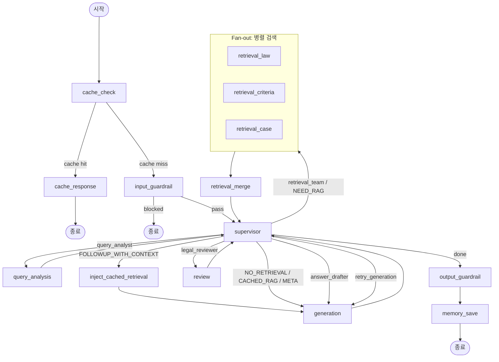
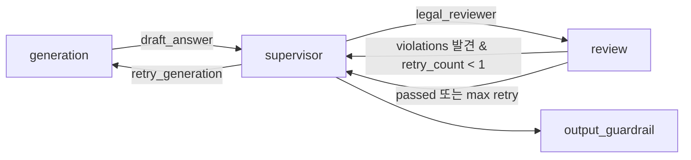

# DDOKSORI MAS 에이전트 시스템

> **최종 수정**: 2026-02-09
>
> MAS(Multi-Agent System) Supervisor 아키텍처 기반의 에이전트 계층 문서입니다.
> 각 에이전트의 역할, 인터페이스 프로토콜, 실행 흐름을 정의합니다.

---

## 목차

1. [개요](#1-개요)
2. [BaseAgent 추상 클래스](#2-baseagent-추상-클래스)
3. [프로토콜 (protocols.py) 상세](#3-프로토콜-protocolspy-상세)
4. [에이전트 호출 순서 (MAS Graph Flow)](#4-에이전트-호출-순서-mas-graph-flow)
5. [에이전트 간 데이터 흐름](#5-에이전트-간-데이터-흐름)
6. [보조 모듈 (followup, registry)](#6-보조-모듈-followup-registry)
7. [에이전트 목록 및 개별 문서 링크](#7-에이전트-목록-및-개별-문서-링크)

---

## 1. 개요

DDOKSORI(똑소리)는 한국 소비자 분쟁 해결을 위한 RAG + MAS 챗봇입니다.
에이전트 시스템은 **Hub-Spoke 패턴**의 Supervisor 아키텍처로 구성되어 있으며,
LangGraph 기반 StateGraph 위에서 동작합니다.

### 핵심 설계 원칙

| 원칙 | 설명 |
|------|------|
| **Hub-Spoke** | Supervisor(Hub)가 모든 에이전트(Spoke)를 중앙에서 조율 |
| **Fan-out/Fan-in** | Retrieval Agent 3개가 병렬 실행 후 결과를 병합 |
| **상태 기반** | `ChatState`가 유일한 데이터 운반체 -- 에이전트는 State를 직접 수정하지 않음 |
| **재생성 루프** | LegalReviewer 위반 시 AnswerDrafter로 1회 재생성 |
| **Fast Path** | `NO_RETRIEVAL` / `META_CONVERSATIONAL` 모드에서 Retrieval + Review 생략 |

### 아키텍처 개요

```
사용자 질문 ──▶ API ──▶ Supervisor(Hub)
                            │
                ┌───────────┼───────────┐
                ▼           ▼           ▼
          QueryAnalyst  Retrieval   AnswerDrafter
          (질의분석)    Team(Fan-out) (답변생성)
                        │  │  │         │
                        ▼  ▼  ▼         ▼
                       Law Criteria  LegalReviewer
                       Case          (법률검토)
                        │               │
                        └──▶ Merge ──▶  │
                                        ▼
                                    최종 답변
```

---

## 2. BaseAgent 추상 클래스

**파일**: [`base.py`](./base.py)

모든 에이전트가 상속하는 추상 기본 클래스입니다. Supervisor와의 통신 프로토콜을 표준화합니다.

### ClassVar (서브클래스에서 오버라이드 필수)

| ClassVar | 타입 | 설명 | 예시 |
|----------|------|------|------|
| `agent_name` | `str` | 에이전트 고유 식별자 | `"query_analyst"` |
| `agent_description` | `str` | Supervisor 참조용 설명 | `"사용자 질문을 분석하여 의도와 엔티티를 추출합니다."` |
| `required_inputs` | `List[str]` | 필수 입력 필드 목록 | `["user_query"]` |
| `provided_outputs` | `List[str]` | 출력 필드 목록 | `["intent", "entities", "query_type"]` |

### 메서드

| 메서드 | 시그니처 | 설명 |
|--------|---------|------|
| `process()` | `async (request: Dict) -> Dict` | **추상 메서드**. Supervisor 요청을 처리하고 결과를 반환. 서브클래스 구현 필수 |
| `report_to_supervisor()` | `(status, result, message) -> Dict` | 표준 응답 형식 생성. `status`는 `"success"` / `"failure"` / `"need_more_info"` |
| `as_node()` | `() -> Callable` | LangGraph 노드 함수로 변환. `graph.add_node(name, agent.as_node())` 형태로 사용 |
| `validate_request()` | `(request: Dict) -> Optional[str]` | `required_inputs` 기반 입력 필드 검증. 유효하면 `None`, 누락 시 오류 메시지 반환 |
| `create_agent_message()` | `(to_agent, message_type, content) -> AgentMessage` | 에이전트 간 메시지(`AgentMessage` TypedDict) 생성 |
| `get_info()` | `() -> Dict` | 에이전트 메타데이터 반환 (name, description, inputs, outputs) |

### `as_node()` 내부 동작

```python
async def node_function(state: ChatState) -> Dict[str, Any]:
    # 1. ChatState에서 context 추출
    request = {
        "task": f"process_{agent.agent_name}",
        "context": {
            "user_query": state["user_query"],
            "chat_type": state["chat_type"],
            "onboarding": state["onboarding"],
            "query_analysis": state["query_analysis"],
            "retrieval": state["retrieval"],
            "draft_answer": state["draft_answer"],
            "review": state["review"],
        },
    }
    # 2. agent.process(request) 호출
    response = await agent.process(request)
    # 3. AgentMessage 생성 + completed_tasks 업데이트
    # 4. supervisor 상태에 agent_messages, completed_tasks 반환
```

### 사용 예시

```python
from app.agents.base import BaseAgent

class QueryAnalystAgent(BaseAgent):
    agent_name = "query_analyst"
    agent_description = "사용자 질문을 분석하여 의도와 엔티티를 추출합니다."
    required_inputs = ["user_query"]
    provided_outputs = ["intent", "entities", "query_type"]

    async def process(self, request: Dict[str, Any]) -> Dict[str, Any]:
        user_query = request["context"]["user_query"]
        result = await self._analyze_query(user_query)
        return self.report_to_supervisor(
            status="success",
            result=result,
            message=f"분석 완료: {result['query_type']}"
        )
```

---

## 3. 프로토콜 (protocols.py) 상세

**파일**: [`protocols.py`](./protocols.py)

에이전트 간 인터페이스를 TypedDict로 **문서화/참조용**으로 정의합니다.
실제 런타임 구현은 `supervisor/state/`에 있습니다. `__all__`에 **33개** 항목이 공개되어 있습니다.

### 3.1 공통 타입 (Literal)

| 타입 | 값 개수 | 값 목록 |
|------|---------|---------|
| `RoutingMode` | 6 | `NO_RETRIEVAL`, `NEED_RAG`, `CACHED_RAG`, `RESTRICTED_DOMAIN`, `META_CONVERSATIONAL`, `FOLLOWUP_WITH_CONTEXT` |
| `RetrieverType` | 4 | `law`, `criteria`, `case`, `counsel` |
| `IntentType` | 2 | `general`, `information_search` |
| `ChatType` | 2 | `dispute`, `general` |
| `ViolationType` | 10 | `hallucination`, `legal_judgment`, `prohibited_expression`, `query_mismatch`, `terminology_missing`, `terminology_mismatch`, `forbidden_header`, `format_violation`, `template_variable`, `data_isolation` |
| `SeverityLevel` | 2 | `critical`, `warning` |
| `CaseCategory` | 3 | `조정`, `해결`, `상담` |
| `EvidenceSource` | 4 | `law`, `criteria`, `case`, `counsel` |

### 3.2 주요 TypedDict

#### OnboardingInfo (`total=False`)

온보딩 폼 데이터. 프론트엔드 `DisputeFormData`를 camelCase에서 snake_case로 매핑합니다.

| 필드 | 타입 | 설명 |
|------|------|------|
| `purchase_date` | `Optional[str]` | 구매일자 |
| `purchase_place` | `Optional[str]` | 구매처 |
| `purchase_platform` | `Optional[str]` | 구매 플랫폼 (온라인/오프라인) |
| `purchase_item` | `Optional[str]` | 구매 품목 |
| `purchase_amount` | `Optional[str]` | 구매 금액 |
| `dispute_details` | `Optional[str]` | 분쟁 상세 내용 |
| `days_since_purchase` | `Optional[int]` | 구매 후 경과 일수 (자동 계산) |
| `product_category` | `Optional[str]` | 품목 카테고리 |

#### QueryAnalysisOutput

질의분석 에이전트의 출력. LLM 기반 다중 쿼리 확장이 적용됩니다.

| 필드 | 타입 | 설명 |
|------|------|------|
| `intent` | `IntentType` | 의도 분류 |
| `original_query` | `str` | 원본 질문 |
| `expanded_queries` | `List[str]` | 확장 쿼리 리스트 (최대 5개) |
| `keywords` | `List[str]` | 핵심 키워드 |
| `retriever_types` | `List[RetrieverType]` | 추천 검색 에이전트 타입 |

#### IndividualRetrievalResult (`total=False`)

개별 Retrieval Agent 결과. `state['individual_retrieval_results']`에 `operator.add`로 누적됩니다.

| 필드 | 타입 | 설명 |
|------|------|------|
| `source` | `str` | 검색 소스 (`law` / `criteria` / `case` / `counsel`) |
| `documents` | `List[Dict]` | 검색된 문서 목록 |
| `max_similarity` | `float` | 최대 유사도 |
| `avg_similarity` | `float` | 평균 유사도 |
| `search_time_ms` | `float` | 검색 소요 시간 (ms) |
| `error` | `Optional[str]` | 오류 메시지 (실패 시) |

#### MergedRetrievalResult (`total=False`)

`retrieval_merge` 노드가 생성하는 병합 결과. `state['retrieval']`에 저장됩니다.

| 필드 | 타입 | 설명 |
|------|------|------|
| `agency` | `Dict[str, Any]` | 추천 기관 정보 |
| `disputes` | `List[Dict]` | 분쟁조정 사례 |
| `counsels` | `List[Dict]` | 상담 사례 |
| `laws` | `List[Dict]` | 관련 법령 조항 |
| `criteria` | `List[Dict]` | 분쟁해결기준 |
| `max_similarity` | `float` | 최대 유사도 |
| `avg_similarity` | `float` | 평균 유사도 |

#### GenerationOutput

답변생성 에이전트의 출력.

| 필드 | 타입 | 설명 |
|------|------|------|
| `draft_answer` | `str` | 생성된 답변 초안 |
| `claim_evidence_map` | `List[ClaimEvidence]` | 주장-근거 매핑 목록 |
| `cited_cases` | `List[CitedCase]` | 인용된 사례 정보 |
| `has_sufficient_evidence` | `bool` | 근거 충분 여부 |
| `generation_time_ms` | `float` | 생성 소요 시간 (ms) |
| `response_depth` | `Optional[str]` | `"summary"` / `"detail"` / `"full"` |
| `available_details` | `Optional[Dict]` | 미표시 상세 정보 메타 |
| `followup_questions` | `Optional[List[str]]` | 제안 후속 질문 |

#### ReviewOutput

법률검토 에이전트의 출력. `state['review']`에 저장됩니다.

| 필드 | 타입 | 설명 |
|------|------|------|
| `passed` | `bool` | 검토 통과 여부 |
| `violations` | `List[Violation]` | 위반 사항 목록 |
| `final_answer` | `Optional[str]` | 수정된 최종 답변 (`passed=True`일 때) |
| `review_time_ms` | `float` | 검토 소요 시간 (ms) |

### 3.3 보조 TypedDict

| TypedDict | 용도 |
|-----------|------|
| `QueryAnalysisInput` | 질의분석 노드 입력 (`user_query`, `chat_type`, `onboarding`) |
| `MetadataFilter` | 검색 메타데이터 필터 (`dataset_type`, `document_types`, `categories`) |
| `SupervisorPhase` | Supervisor 현재 단계 |
| `SupervisorState` | Supervisor 전체 상태 (`current_phase`, `selected_retrievers`, `agent_keywords` 등) |
| `RetrievalTaskInput` | Supervisor -> Retrieval Agent 입력 |
| `DocumentMetadata` | 검색된 문서 메타데이터 |
| `RetrievedDocument` | 검색된 단일 문서 (chunk 단위) |
| `RetryContext` | 재생성 컨텍스트 (`violations`, `previous_draft`, `retry_count`) |
| `GenerationInput` | 답변생성 노드 입력 |
| `ClaimEvidence` | 주장-근거 매핑 단위 |
| `CitedCase` | 인용된 사례 정보 (`case_id`, `category`, `title`, `summary`, `relevance`) |
| `ReviewInput` | 법률검토 노드 입력 |
| `Violation` | 위반 사항 상세 (`type`, `description`, `location`, `severity`, `suggestion`) |
| `ProtocolChatState` | 통합 채팅 상태 (참조용, 실제는 `supervisor/state/`) |

### 3.4 검증 유틸리티

| 함수 | 검증 대상 |
|------|-----------|
| `validate_query_analysis_output()` | `QueryAnalysisOutput` 필수 키 검증 |
| `validate_individual_retrieval_result()` | `IndividualRetrievalResult` 필수 키 검증 |
| `validate_merged_retrieval_result()` | `MergedRetrievalResult` 필수 키 검증 |
| `validate_generation_output()` | `GenerationOutput` 필수 키 검증 |
| `validate_review_output()` | `ReviewOutput` 필수 키 검증 |

---

## 4. 에이전트 호출 순서 (MAS Graph Flow)

**파일**: [`supervisor/graph_mas.py`](../../supervisor/graph_mas.py)

`create_mas_supervisor_graph()`가 정의하는 LangGraph StateGraph의 실행 흐름입니다.

### 노드 순서

```
cache_check ──▶ [cache hit?]
  │ YES ──▶ cache_response ──▶ END
  │ NO  ──▶ input_guardrail ──▶ [blocked?]
                │ YES ──▶ END
                │ NO  ──▶ supervisor ──▶ [routing]
                             │
                ┌────────────┼─────────────────────────┐
                ▼            ▼                         ▼
          query_analysis   retrieval_team         generation
                │            (Fan-out)                 │
                │         ┌────┼────┐                  │
                │         ▼    ▼    ▼                  │
                │       law criteria case              │
                │         │    │    │                   │
                │         └────┼────┘                   │
                │              ▼                        │
                │        retrieval_merge                │
                │              │                        │
                └──────▶ supervisor ◀───────────────────┘
                             │
                             ▼
                         generation ──▶ supervisor ──▶ review
                                                        │
                                                        ▼
                                              output_guardrail
                                                        │
                                                        ▼
                                                   memory_save ──▶ END
```

### 라우팅 분기 상세

| 모드 | Supervisor `next_agent` | 경로 |
|------|------------------------|------|
| `NEED_RAG` | `retrieval_team` | retrieval_law + retrieval_criteria + retrieval_case (병렬 Fan-out) -> retrieval_merge -> supervisor -> generation -> supervisor -> review -> output_guardrail -> memory_save |
| `NO_RETRIEVAL` | `retrieval_team` (skip) | generation -> supervisor -> output_guardrail -> memory_save |
| `CACHED_RAG` | `retrieval_team` (skip) | generation -> supervisor -> output_guardrail -> memory_save |
| `META_CONVERSATIONAL` | `retrieval_team` (skip) | generation -> supervisor -> output_guardrail -> memory_save |
| `FOLLOWUP_WITH_CONTEXT` | `retrieval_team` | inject_cached_retrieval -> generation -> supervisor -> review -> output_guardrail -> memory_save |
| 재생성 (`retry_generation`) | - | generation (retry_count < 1) -> supervisor -> review |

### Mermaid 플로우차트



### 재생성 루프



- 최대 재생성 횟수: **1회** (`retry_count < 1`)
- 재생성 초과 시 `output_guardrail`로 직접 이동

---

## 5. 에이전트 간 데이터 흐름

### ChatState: 중앙 데이터 운반체

모든 에이전트는 `ChatState`를 통해 데이터를 주고받습니다. 에이전트는 State를 직접 수정하지 않고,
결과를 반환하면 LangGraph 런타임이 State를 업데이트합니다.

**정의**: `supervisor/state/__init__.py`의 `ChatState(MessagesState)`

### 에이전트별 Input/Output TypedDict 매핑

| 노드 | ChatState 읽기 (Input) | ChatState 쓰기 (Output) | TypedDict |
|------|----------------------|------------------------|-----------|
| **cache_check** | `user_query`, `session_id`, `total_turn_count` | `_cache_hit`, `_cached_response` | - |
| **input_guardrail** | `user_query` | `guardrail_blocked`, `guardrail_type` | - |
| **supervisor** | `query_analysis`, `retrieval`, `draft_answer`, `review`, `mode`, `retry_count` | `supervisor` (`next_agent`, `current_phase`, `selected_retrievers`, `agent_keywords`) | `SupervisorState` |
| **query_analysis** | `user_query`, `chat_type`, `onboarding` | `query_analysis` (`intent`, `original_query`, `expanded_queries`, `keywords`, `retriever_types`), `mode` | `QueryAnalysisInput` -> `QueryAnalysisOutput` |
| **retrieval_law** | `query_analysis`, `user_query`, `supervisor.agent_keywords` | `individual_retrieval_results` (append) | `RetrievalTaskInput` -> `IndividualRetrievalResult` |
| **retrieval_criteria** | `query_analysis`, `user_query`, `supervisor.agent_keywords` | `individual_retrieval_results` (append) | `RetrievalTaskInput` -> `IndividualRetrievalResult` |
| **retrieval_case** | `query_analysis`, `user_query`, `supervisor.agent_keywords` | `individual_retrieval_results` (append) | `RetrievalTaskInput` -> `IndividualRetrievalResult` |
| **retrieval_merge** | `individual_retrieval_results`, `onboarding` | `retrieval` (4섹션 병합 결과) | `IndividualRetrievalResult[]` -> `MergedRetrievalResult` |
| **generation** | `user_query`, `query_analysis`, `retrieval`, `retry_context`, `onboarding`, `chat_type` | `draft_answer`, `claim_evidence_map`, `cited_cases`, `followup_questions`, `response_depth`, `available_details` | `GenerationInput` -> `GenerationOutput` |
| **review** | `draft_answer`, `user_query`, `claim_evidence_map`, `cited_cases`, `retrieval`, `retry_count` | `review` (`passed`, `violations`, `final_answer`), `final_answer`, `retry_count` | `ReviewInput` -> `ReviewOutput` |
| **output_guardrail** | `final_answer`, `draft_answer` | `final_answer` (필터링), `guardrail_blocked` | - |
| **memory_save** | `user_query`, `final_answer`, `session_id`, `conversation_history` | `conversation_history`, `compact_summary`, `total_turn_count` | - |

### 데이터 흐름 요약

```python
# 1. QueryAnalyst 출력 -> Supervisor 라우팅 + 모든 Retrieval Agent 입력
QueryAnalysisOutput.expanded_queries   -> RetrievalTaskInput.expanded_queries
QueryAnalysisOutput.retriever_types    -> Supervisor (Fan-out 대상 결정)
QueryAnalysisOutput.keywords           -> RetrievalTaskInput.agent_keywords

# 2. 3개 Retrieval Agent 출력 -> 병합 -> AnswerDrafter 입력
IndividualRetrievalResult[] -> retrieval_merge -> MergedRetrievalResult
                                                  -> state['retrieval']

# 3. AnswerDrafter 출력 -> LegalReviewer 입력
GenerationOutput.draft_answer        -> ReviewInput.draft_answer
GenerationOutput.claim_evidence_map  -> ReviewInput.claim_evidence_map
GenerationOutput.cited_cases         -> ReviewInput.cited_cases

# 4. LegalReviewer 출력 -> 최종 응답 또는 재생성
ReviewOutput.passed == True  -> state['final_answer'] -> API Response
ReviewOutput.passed == False -> RetryContext -> AnswerDrafter 재호출 (max 1)
```

---

## 6. 보조 모듈 (followup, registry)

### 6.1 FollowupQuestionGenerator

**디렉토리**: [`followup/`](./followup/)

답변 생성 후 사용자에게 제안할 후속 질문과 명확화 질문을 생성합니다.
**LLM을 사용하지 않고** 규칙 기반 템플릿 매칭으로 동작합니다.

#### 동작 방식

```
1. 컨텍스트 구축 (dispute_type, missing_fields, has_cases 등)
2. 분쟁 유형별 템플릿 필터링 (get_templates_by_dispute_type)
3. 조건 매칭 (_check_conditions)
4. format_id 기반 우선 필터링 (선택적)
5. 우선순위 정렬
6. 최대 개수 제한 (followup: 3개, clarifying: 2개)
```

#### 호출 시점

AnswerDrafter(답변생성) 에이전트가 답변 생성 후 내부적으로 호출합니다.
결과는 `state['followup_questions']`에 저장됩니다.

#### 질문 유형

| 유형 | 목적 | 예시 |
|------|------|------|
| `followup` | 현재 답변 기반 추가 탐색 | "환불 처리 기간은 얼마나 걸리나요?" |
| `clarifying` | 불명확 정보 명확화 | "제품을 언제 구매하셨나요?" |

#### 분쟁 유형별 템플릿

| 분쟁 유형 | 한국어 | 템플릿 수 |
|-----------|--------|-----------|
| `refund` | 환불 | 4개 |
| `exchange` | 교환 | 3개 |
| `repair` | 수리/AS | 3개 |
| `delivery` | 배송 | 3개 |
| `quality` | 품질/하자 | 3개 |
| `cancellation` | 계약해지 | 3개 |
| `general` | 일반 | 5개 |
| `clarifying` | 명확화 (공통) | 5개 |
| `format_guided` | 형식별 유도 | 6개 |

#### QuestionTemplate 구조

```python
@dataclass
class QuestionTemplate:
    template_id: str                          # 템플릿 식별자
    question_type: Literal["followup", "clarifying"]
    dispute_types: List[str]                  # 적용 가능 분쟁 유형
    question_text: str                        # 질문 텍스트
    conditions: Dict[str, bool]              # 표시 조건
    priority: int = 1                         # 우선순위 (높을수록 우선)
```

#### 조건 키 목록

| 조건 키 | 의미 |
|---------|------|
| `has_cases` | 분쟁/상담 사례 검색 결과 존재 여부 |
| `has_laws` | 법령 검색 결과 존재 여부 |
| `has_criteria` | 분쟁해결기준 검색 결과 존재 여부 |
| `has_agency_recommendation` | 추천 기관 정보 존재 여부 |
| `no_timeline_mentioned` | 답변에 기간 정보 미포함 |
| `no_procedure_mentioned` | 답변에 절차 정보 미포함 |
| `missing_purchase_date` | 구매일자 미입력 |
| `missing_product_name` | 제품명 미입력 |
| `missing_issue_detail` | 문제 상세 미입력 |
| `missing_seller_response` | 판매자 응답 미입력 |
| `missing_amount` | 금액 미입력 |

### 6.2 AgentRegistry

**디렉토리**: [`registry/`](./registry/)

에이전트 중앙 등록 및 관리를 위한 레지스트리 패턴 구현입니다.
Supervisor와 에이전트 간의 결합도를 낮추기 위해 사용됩니다.

#### 설계 패턴

- **싱글톤**: `get_agent_registry()` 함수로 전역 인스턴스 접근
- **카테고리 인덱싱**: `analysis`, `retrieval`, `generation`, `review` 카테고리별 관리
- **AgentHandler Protocol**: `runtime_checkable` 프로토콜로 구조적 서브타이핑 지원

#### AgentHandler Protocol

```python
@runtime_checkable
class AgentHandler(Protocol):
    async def process(self, request: Dict[str, Any]) -> Dict[str, Any]: ...
```

`process()` 메서드를 가진 모든 객체가 이 프로토콜을 만족합니다. `BaseAgent`는 자동으로 호환됩니다.

#### AgentInfo 데이터 클래스

| 필드 | 타입 | 설명 |
|------|------|------|
| `name` | `str` | 에이전트 고유 이름 |
| `description` | `str` | 에이전트 설명 (Supervisor 프롬프트에 사용) |
| `handler` | `Optional[AgentHandler]` | 에이전트 핸들러 인스턴스 |
| `category` | `str` | 카테고리 (`analysis` / `retrieval` / `generation` / `review`) |
| `required_inputs` | `List[str]` | 필수 입력 필드 |
| `provided_outputs` | `List[str]` | 제공 출력 필드 |
| `priority` | `int` | 실행 우선순위 (높을수록 우선) |
| `enabled` | `bool` | 활성화 여부 |

#### 주요 API

| 메서드 | 설명 |
|--------|------|
| `register(name, description, handler, category, ...)` | 에이전트 등록 |
| `unregister(name)` | 에이전트 제거 |
| `get(name)` | AgentInfo 조회 |
| `get_handler(name)` | AgentHandler 조회 |
| `get_by_category(category)` | 카테고리별 에이전트 목록 |
| `get_all(enabled_only=True)` | 전체 에이전트 목록 (우선순위 정렬) |
| `get_for_prompt(enabled_only=True)` | Supervisor 프롬프트용 `{name: description}` |
| `list_names(enabled_only=True)` | 에이전트 이름 목록 |
| `enable(name)` / `disable(name)` | 활성화/비활성화 토글 |
| `clear()` | 전체 제거 (테스트용) |

#### 기본 등록 에이전트

`get_agent_registry()` 최초 호출 시 `_register_default_agents()`가 자동 실행되어 기본 에이전트를 등록합니다.

| 이름 | 카테고리 | 우선순위 | 설명 |
|------|----------|----------|------|
| `query_analyst` | `analysis` | 100 | 질문 분석 및 의도 파악 |
| `retrieval_team` | `retrieval` | 80 | 검색 팀 (병렬 실행 그룹) |
| `retrieval_law` | `retrieval` | 75 | 관련 법령 조항 검색 |
| `retrieval_criteria` | `retrieval` | 75 | 분쟁해결기준 검색 |
| `retrieval_case` | `retrieval` | 75 | 분쟁조정사례 검색 |
| `retrieval_counsel` | `retrieval` | 75 | 상담사례 검색 |
| `answer_drafter` | `generation` | 60 | 답변 초안 작성 |
| `legal_reviewer` | `review` | 40 | 법적 정확성 검토 |

#### 사용 예시

```python
from app.agents.registry import get_agent_registry

registry = get_agent_registry()

# Supervisor 프롬프트용 에이전트 목록
agents_for_prompt = registry.get_for_prompt()

# 카테고리별 조회
retrieval_agents = registry.get_by_category("retrieval")

# 동적 에이전트 등록
registry.register(
    name="custom_agent",
    description="커스텀 에이전트",
    handler=my_handler,
    category="analysis",
    priority=50,
)
```

---

## 7. 에이전트 목록 및 개별 문서 링크

| 모듈 | 에이전트 | 설명 | 개별 README |
|------|----------|------|-------------|
| `query_analysis/` | QueryAnalyst | LLM 기반 의도 분류, 키워드 추출, 다중 쿼리 확장 | [README](./query_analysis/README.md) |
| `retrieval/` | LawAgent, CriteriaAgent, CaseAgent | 법령/기준/사례 메타데이터 필터 기반 병렬 검색 (3개 Agent) | [README](./retrieval/README.md) |
| `answer_generation/` | AnswerDrafter | 템플릿 기반 답변 생성 + Fallback 체인 + Progressive Disclosure | [README](./answer_generation/README.md) |
| `legal_review/` | LegalReviewer | 10종 위반 유형 검증 (환각/금지표현/인용/용어 등) | [README](./legal_review/README.md) |
| `followup/` | FollowupQuestionGenerator | 규칙 기반 후속 질문/명확화 질문 생성 (LLM 미사용) | [상세](#6-보조-모듈) |
| `registry/` | AgentRegistry | 싱글톤 에이전트 레지스트리 (등록/발견/생명주기 관리) | [상세](#6-보조-모듈) |

### 공통 파일

| 파일 | 설명 |
|------|------|
| [`base.py`](./base.py) | `BaseAgent` 추상 클래스 -- 모든 에이전트의 부모 클래스 |
| [`protocols.py`](./protocols.py) | 에이전트 간 인터페이스 TypedDict 정의 (33개 공개 항목, 문서화/참조용) |
| [`__init__.py`](./__init__.py) | `BaseAgent` export |

---

## 주의사항

1. **타입 준수 필수**: `protocols.py`에 정의된 TypedDict 형식을 정확히 따라야 합니다.
2. **State 직접 수정 금지**: 에이전트는 결과를 반환하고, LangGraph 런타임이 State를 업데이트합니다.
3. **에러 처리**: 에러 발생 시 적절한 기본값을 반환하고 로깅해야 합니다. `print()` 대신 `get_rag_logger()` 사용.
4. **비동기 필수**: 모든 에이전트 `process()` 메서드는 `async def`로 구현합니다.
5. **런타임 vs 문서**: `protocols.py`는 문서화/참조용이며, 실제 런타임 타입은 `supervisor/state/`에 정의되어 있습니다.

## 테스트 실행 방법

```bash
# 전체 테스트
conda run -n dsr pytest backend/scripts/testing/

# 특정 에이전트 테스트
conda run -n dsr pytest backend/scripts/testing/query_analysis/
conda run -n dsr pytest backend/scripts/testing/retrieval/
conda run -n dsr pytest backend/scripts/testing/answer_generation/
conda run -n dsr pytest backend/scripts/testing/review/

# 단위 테스트만 (DB 불필요)
conda run -n dsr pytest -m unit
```
