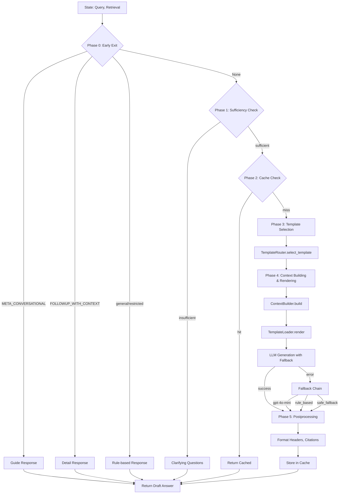

# Answer Generation Agent (답변 생성 에이전트)

**최종 수정**: 2026-02-09

## 1. 개요 (Overview)

**Answer Generation Agent**는 사용자 질문과 검색된 정보(Evidence)를 종합하여 최종 답변을 생성하는 역할을 합니다. 단순히 정보를 요약하는 것을 넘어, 사용자의 상황에 맞는 공감적이고 전문적인 답변을 작성하며, 답변의 근거를 명시(Citation)하여 할루시네이션(Hallucination)을 방지합니다.

### 주요 책임
1. **답변 초안 생성 (Drafting)**: LLM을 활용하여 구조화된 답변을 작성합니다.
2. **근거 매핑 (Grounding)**: 답변의 각 주장이 검색된 문서의 어떤 부분에 기반하는지 연결합니다.
3. **안전 장치 (Fallback)**: LLM 호출 실패 시 규칙 기반 답변으로 우회하거나, 제한된 영역(금융/의료)에 대해 방어적인 응답을 제공합니다.
4. **응답 캐싱 (Caching)**: 동일한 질문에 대해 빠르게 응답하기 위해 생성된 답변을 캐싱합니다.

---

## 2. 아키텍처 (Architecture)

### 2.1. 전체 파이프라인



### 2.2. Phase별 세부 동작

| Phase | 이름 | 역할 | 조건 |
|-------|------|------|------|
| **Phase 0** | Early Exit | LLM 불필요한 경로 즉시 처리 | mode=META_CONVERSATIONAL, FOLLOWUP_WITH_CONTEXT, query_type=general/restricted |
| **Phase 1** | Sufficiency Check | 검색 결과 충분성 검사 | retrieval이 있는 경우 |
| **Phase 2** | Cache Check | 캐시된 답변 확인 | retry_context 없음 |
| **Phase 3** | Template Selection | 하드 라우팅 + Phase 기반 템플릿 선택 | - |
| **Phase 4** | Context Building & LLM | 템플릿 렌더링 및 LLM 생성 | - |
| **Phase 5** | Postprocessing | 헤더 포맷팅, 출처 보강, 캐싱 | - |

---

## 3. 생성 전략 (Generation Strategies)

### 3.1. Template-Based Generation

검색된 4가지 섹션(law, criteria, disputes, counsels)의 정보를 종합하여 답변을 생성합니다.

#### 생성 파이프라인

1. **TemplateRouter**: 질문 의도와 분쟁 단계를 분석하여 7가지 템플릿 유형 중 하나를 선택합니다.
2. **ContextBuilder**: 검색된 데이터를 템플릿 변수로 변환합니다. 빈 섹션은 완전히 생략하여 할루시네이션을 방지합니다.
3. **TemplateLoader**: `prompts/` 디렉토리에서 선택된 Markdown 템플릿을 로드하고, 변수를 주입하여 최종 프롬프트를 생성합니다.

#### 모델 설정

| 설정 | 값 | 환경변수 |
|------|-----|---------|
| 기본 모델 | 설정 파일에서 로드 | `MODEL_DRAFT_AGENT` (config.models.draft_agent) |
| 1차 폴백 | gpt-4o-mini | - |
| 2차 폴백 | rule_based | - |
| 최종 폴백 | safe_fallback | - |

**참고**: 모델명은 코드에 하드코딩되지 않으며, `app/common/config.py`의 `config.models.draft_agent`에서 로드됩니다.

#### 템플릿 구성 (7종)

| 파일명 | 템플릿 키 | 주요 역할 |
|:---|:---|:---|
| `base_persona.md` | `base` | 똑소리의 정체성, 공통 규칙 정의 (모든 템플릿에 삽입) |
| `solution_template.md` | `solution` | 기초 상담 단계에서 법적 권리와 환불 가능성 안내 (Phase 1) |
| `action_guide_template.md` | `action` | 업체와 협상 시 유리한 고지를 점할 수 있는 대화 시나리오 제공 (Phase 2) |
| `execution_guide_template.md` | `execution` | 협의 결렬 시 사건 요약 및 행정적 이행 절차 가이드 (Phase 3) |
| `inquiry_template.md` | `inquiry` | 정보 부족 시 상황 구체화를 위한 소크라틱 질문 생성 |
| `fallback_template.md` | `fallback` | 고액/형사/해외 사안에 대한 공적 전문 기관 매칭 및 인계 |
| `reject_template.md` | `reject` | 서비스 범위 외 질문에 대한 정중한 거절 및 안내 |
| `general_info_template.md` | `general_info` | 일반 대화(인사, 감사) 응답 |

**참고**: `intent_classifier.md`는 query_analysis 단계에서 사용되며, answer_generation에서는 사용하지 않습니다.

### 3.2. Hard Routing (하드 라우팅)

Python 코드 레벨에서 특정 조건을 사전 감지하여 LLM 생성을 우회하고 fallback 경로로 즉시 전환합니다.

#### 하드 라우팅 규칙

| 조건 | 임계값/키워드 | 결과 | 출처 |
|------|-------------|------|------|
| **고액 분쟁** | 5,000,000원 초과 | `fallback` 템플릿 | `routing_config.py` |
| **형사 사건** | "사기", "잠적", "먹튀", "고소", "경찰", "벽돌", "고발", "야반도주", "신고" | `fallback` 템플릿 | `routing_config.py` |
| **해외 거래** | "직구", "해외결제", "알리", "테무", "아마존", "배대지", "관세", "해외 사이트" | `fallback` 템플릿 | `routing_config.py` |

**설정 외부화**: 임계값과 키워드는 `routing_config.py`에서 관리되며, JSON 파일(`routing_rules.json`)로 런타임 오버라이드 가능합니다.

### 3.3. 제한된 영역 (Restricted Domain)

금융(금감원), 의료(의료분쟁조정원) 등 전문성이 요구되는 분야는 직접적인 답변 대신 **해당 기관 안내 및 접수 방법**을 제공합니다.

- **Trigger**: `query_analysis.query_type == "restricted"`
- **Output**: 고정된 템플릿에 기관 정보와 유사 사례 제목만 포함하여 반환.

### 3.4. 일반 대화 (General Chat)

"안녕", "고마워" 등의 인사말은 LLM 토큰 소모를 줄이기 위해 규칙 기반으로 즉시 응답합니다.

- **Trigger**: `query_type == "general"`
- **Output**: `_build_general_response()` 함수의 패턴 매칭 결과

### 3.5. Fallback 체인

LLM 호출 실패 시 자동으로 다음 모델로 전환됩니다:

```
gpt-4o (또는 config.models.draft_agent)
    ↓ API 오류/타임아웃
gpt-4o-mini (1차 폴백)
    ↓ 실패
rule_based (2차 폴백)
    ↓ 실패
safe_fallback (최종 안전 메시지 - 1372 안내)
```

---

## 4. 코드 구조 (Code Structure)

### 4.1. 주요 파일

| 파일 | 역할 |
|:---|:---|
| **`agent.py`** | 에이전트 진입점 (`generation_node_v2`). Phase 0-5 파이프라인 통합, 도메인 라우팅 포함. |
| **`template_router.py`** | 하드 라우팅(형사/해외/고액) + Phase 기반 템플릿 유형 선택 (`select_template`). |
| **`context_builder.py`** | 검색 결과(laws/criteria/disputes/counsels)를 템플릿 변수로 변환 (`build`). |
| **`template_loader.py`** | `prompts/` 디렉토리에서 Markdown 템플릿 로드 및 변수 주입 (Singleton 패턴, `render`). |
| **`routing_config.py`** | 하드 라우팅 규칙(키워드, 임계값) 외부화 관리. JSON 파일 오버라이드 지원. |
| **`postprocessor.py`** | 답변 형식 후처리 (코드블록 제거, 윗첨자 제거, 헤더 줄바꿈, 불릿 분리, 출처 보강 + DB PDF URL 조회). |
| **`fallback.py`** | LLM 오류 시 안전하게 답변을 생성하는 Fallback 클래스 (`AnswerGenerationFallback`). |
| **`cache.py`** | 답변 캐싱(Redis 기반, Singleton) 로직. `get_answer_cache()` 팩토리 함수 제공. |
| **`drafter_agent.py`** | MAS `BaseAgent` 인터페이스 구현 (`AnswerDrafterAgent`). Supervisor에서 호출. |
| **`__init__.py`** | Public API exports (`generation_node_v2`, `AnswerCache`, `AnswerDrafterAgent` 등). |
| **`prompts/`** | 9개 파일 (8 .md + 1 .py). TemplateLoader가 8개 .md를 로드 (base + 7종 answer 템플릿). `intent_classifier.md`는 query_analysis에서 사용. |
| **`tools/`** | LLM 호출 유틸리티 (`generator.py`: RAGGenerator, `prompts.py`: 저유사도 처리, `constants.py`: 상수). |
| **`tests/`** | 실험용 클래스 (`ddoksori_response_engine.py`, `ddoksori_reviewer.py`, `test_set.json`) - **프로덕션 코드에서 사용 안 함**. |

### 4.2. 주요 함수

#### `generation_node_v2(state, config) -> Dict`
답변 생성 노드 v2 진입점. 통합 단일 파이프라인을 통해 모든 response_mode에서 동일한 흐름을 거칩니다.

**파이프라인**:
1. Phase 0: `_try_early_exit()` - 빠른 탈출
2. Phase 1: `_check_sufficiency()` - 검색 결과 충분성 검사
3. Phase 2: `_try_cache()` - 캐시 확인
4. Phase 3-4: `_render_and_generate()` - 템플릿 선택 및 LLM 생성
5. Phase 5: `postprocess_answer()` - 후처리 및 캐싱

#### `TemplateRouter.select_template(state) -> str`
하드 라우팅 + Phase 분석으로 최적 템플릿 유형 선택.

**라우팅 순서** (첫 매칭 우선):
1. `chat_type == "general"` → `"general_info"`
2. `chat_type != "dispute"` → `"reject"`
3. 하드 라우팅 검사:
   - `amount > 5,000,000원` → `"fallback"`
   - 형사 키워드 포함 → `"fallback"`
   - 해외 키워드 포함 → `"fallback"`
4. `needs_clarification == True` → `"inquiry"`
5. 검색 결과 없음 → `"fallback"`
6. Phase 기반 라우팅 (`"solution"`, `"action"`, `"execution"`)

#### `ContextBuilder.build(state) -> Dict[str, str]`
검색 데이터를 템플릿 변수로 변환.

**반환 변수**:
- `user_query`: 사용자 질문
- `refined_user_case`: 온보딩 정보(분쟁 상세)
- `target_category`: 구매 품목
- `law_data`: 법령 섹션 포맷팅
- `criteria_data`: 분쟁해결기준 섹션 포맷팅
- `case_data`: 사례(disputes + counsels) 섹션 포맷팅
- `dispute_reason`: 분쟁 사유 (단순변심/하자/미확인)
- `conversation_history`: 대화 히스토리 (최근 3턴)

#### `TemplateLoader.render(template_key, context) -> str`
템플릿 로드 및 변수 주입 (Singleton 패턴, thread-safe).

1. `base_persona` 템플릿을 로드
2. 요청된 템플릿을 로드하고 `{base_persona}` 플레이스홀더를 치환
3. context 변수들을 `format_map()`으로 치환 (미치환 변수는 원본 유지)

#### `AnswerGenerationFallback.generate_with_fallback(...)` / `generate_with_fallback_streaming(...)`
Fallback 체인을 통한 답변 생성. 동기(`generate_with_fallback`) 및 비동기 스트리밍(`generate_with_fallback_streaming`) 버전 제공.

- 동기: `(answer, model_used, claim_evidence_map)` 튜플 반환
- 스트리밍: `AsyncGenerator`로 토큰 단위 yield (`type: token/fallback/complete/error`)

---

## 5. 테스트 방법 (Testing)

답변 생성 테스트는 LLM 호출을 모킹(Mocking)하여 Fallback 체인, 규칙 기반 생성, 안전 장치 동작을 검증합니다.

### 5.1. 테스트 위치

답변 생성 관련 테스트는 `backend/scripts/testing/answer_generation/`에 위치합니다:

- `test_fallback_chain.py`: Fallback 체인 동작 테스트 (LLM 실패 시 전환 검증)
- `test_followup.py`: 후속 질문 생성 테스트
- `test_formats.py`: 답변 포맷 테스트
- `test_specialist_agency.py`: 전문 기관 안내 테스트

### 5.2. 실행 방법

```bash
# Python 환경 활성화 (필수)
conda activate dsr

# 답변 생성 관련 테스트 실행
conda run -n dsr pytest backend/scripts/testing/answer_generation/ -v

# 특정 테스트 파일 실행
conda run -n dsr pytest backend/scripts/testing/answer_generation/test_followup.py -v

# 특정 테스트 함수 실행
conda run -n dsr pytest backend/scripts/testing/answer_generation/test_followup.py::test_function_name -v
```

### 5.3. 테스트 항목

#### test_fallback_chain.py
- LLM 호출 실패 시 Fallback 체인 동작 검증
- 모델 순차 전환 및 최종 safe_fallback 테스트

#### test_followup.py
- 사용자 대화 맥락 기반 후속 질문 생성
- 온보딩 정보 슬롯 미충족 시 추가 질문 유도

#### test_formats.py
- 답변 포맷 검증 (구조화된 응답)
- 근거 인용(Citation) 형식 검증

#### test_specialist_agency.py
- 제한된 영역(금융/의료) 감지 시 전문 기관 안내
- 안전한 템플릿 응답 생성

---

## 6. 설정 (Configuration)

### 6.1. 환경 변수

| 변수명 | 설명 | 기본값 |
|--------|------|--------|
| `MODEL_DRAFT_AGENT` | 답변 생성에 사용할 기본 LLM 모델 | `gpt-4o-mini` (config 파일 참조) |
| `ENABLE_ANSWER_CACHE` | 답변 캐싱 활성화 여부 | `false` |
| `ANSWER_CACHE_TTL_HOURS` | 캐시 만료 시간 (시간 단위) | `24` |
| `REDIS_HOST` | Redis 호스트 (캐싱용) | `localhost` |
| `REDIS_PORT` | Redis 포트 | `6379` |
| `REDIS_DB` | Redis DB 번호 | `0` |

### 6.2. 라우팅 규칙 외부화

`routing_config.py`는 하드 라우팅 규칙을 관리합니다. `routing_rules.json` 파일을 통해 런타임에 설정을 오버라이드할 수 있습니다.

**기본값** (`routing_config.py`):
```python
_DEFAULT_CONFIG = {
    "criminal_keywords": ["사기", "잠적", "먹튀", "고소", "경찰", "벽돌", "고발", "야반도주", "신고"],
    "intl_keywords": ["직구", "해외결제", "알리", "테무", "아마존", "배대지", "관세", "해외 사이트"],
    "high_amount_threshold": 5_000_000,
}
```

**JSON 오버라이드** (선택사항):
`backend/app/agents/answer_generation/routing_rules.json` 파일 생성:
```json
{
    "high_amount_threshold": 10000000,
    "criminal_keywords": ["사기", "잠적"]
}
```

---

## 7. 알려진 제약사항

### 7.1. 프로덕션에 없는 컴포넌트

다음 클래스들은 `tests/` 디렉토리에만 존재하며, 실제 프로덕션 코드에서는 사용되지 않습니다:

- `TerminologyChecker`: 법률 용어 병기 검증 (테스트용)
- `DdoksoriResponseEngine`: 답변 생성 엔진 (테스트용)
- `DdoksoriReviewer`: 답변 검토 에이전트 (테스트용)

실제 프로덕션에서는 `generation_node_v2()` 함수와 `AnswerGenerationFallback` 클래스가 답변 생성을 담당합니다.

### 7.2. LegalReviewer 통합 미완료

현재 답변 생성 후 LegalReviewer와의 2중 검증 루프는 구현되지 않았습니다. `retry_context` 필드는 코드에 존재하지만, 실제 재생성 요청은 supervisor 레벨에서 처리됩니다.

---

## 8. 변경 이력 (History)

| 날짜 | 내용 |
|------|------|
| 2026-01-14 | 초기 RAG 생성 로직 구현 (Sprint 1) |
| 2026-01-22 | `classify_domain` 도입으로 제한 영역(금융/의료) 필터링 추가 |
| 2026-01-27 | Draft Agent 모델 업그레이드. Fallback 체인 정비 (Phase 8) |
| 2026-01-28 | v2: 사례 인용 + retry_context 지원 추가 |
| 2026-02-03 | MD 템플릿 시스템 도입 (TemplateRouter, ContextBuilder, TemplateLoader) |
| 2026-02-09 | README 정확성 개선 (실제 코드 구조 반영) |

---

## 9. 참고 자료 (References)

### 9.1. 관련 코드

- **Supervisor Graph**: `backend/app/supervisor/graph_mas.py`
- **Query Analysis**: `backend/app/agents/query_analysis/`
- **Legal Reviewer**: `backend/app/agents/legal_review/`
- **Retrieval Agents**: `backend/app/agents/retrieval/`

### 9.2. 설정 파일

- **전역 설정**: `backend/app/common/config.py`
- **라우팅 규칙**: `backend/app/agents/answer_generation/routing_config.py`

### 9.3. 테스트

- **테스트 디렉토리**: `backend/scripts/testing/answer_generation/`
- **Pytest 설정**: `backend/pytest.ini`

---

## 10. 고도화 계획 (To-Be)

1. **Personalization**: 사용자의 말투나 수준에 맞춰 답변 톤앤매너 조절.
2. **Streaming 완성**: `fallback.py`에 `generate_with_fallback_streaming()` 구현 완료. API 레이어 연동 필요.
3. **Multi-turn Context**: 이전 대화 맥락을 프롬프트에 포함하여 연속적인 질문 처리 강화 (현재 최근 3턴 제공 중).
4. **LegalReviewer 통합**: 2중 검증 루프 완성 (답변 생성 → 검토 → 재생성).
