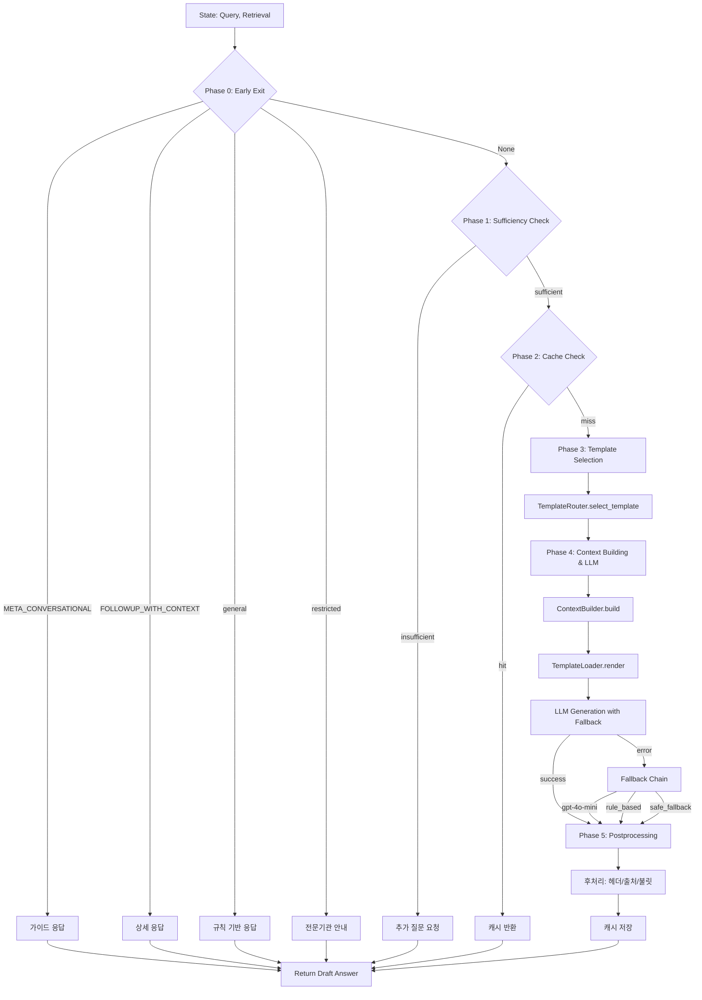

# Answer Generation Agent (답변생성 에이전트)

**최종 수정**: 2026-02-09

## 1. 개요 (Overview)

**Answer Generation Agent**는 사용자 질문과 검색된 정보(Evidence)를 종합하여 최종 답변을 생성하는 에이전트입니다. 단순 정보 요약을 넘어, 사용자의 상황에 맞는 공감적이고 전문적인 답변을 작성하며, 답변의 근거를 명시(Citation)하여 할루시네이션(Hallucination)을 방지합니다.

### 주요 책임

1. **답변 초안 생성 (Drafting)**: Markdown 템플릿 시스템과 LLM을 결합하여 구조화된 답변을 작성합니다.
2. **근거 매핑 (Grounding)**: 답변의 각 주장이 검색된 문서의 어떤 부분에 기반하는지 `claim_evidence_map`으로 연결합니다.
3. **안전 장치 (Fallback)**: LLM 호출 실패 시 다중 폴백 체인으로 안전한 답변을 보장합니다.
4. **응답 캐싱 (Caching)**: Redis 기반으로 동일 질문에 대해 캐시된 답변을 반환하여 LLM 비용을 절감합니다.
5. **후처리 (Postprocessing)**: 헤더 포맷팅, 출처 보강(DB PDF URL 조회 포함), 불릿 분리 등 답변 형식을 자동 교정합니다.

---

## 2. 아키텍처 (Architecture)

### 2.1. 전체 파이프라인



### 2.2. Phase별 세부 동작

| Phase | 이름 | 역할 | 조건 |
|-------|------|------|------|
| **Phase 0** | Early Exit | LLM 불필요한 경로 즉시 처리 | `mode=META_CONVERSATIONAL`, `FOLLOWUP_WITH_CONTEXT`, `query_type=general/restricted/followup` |
| **Phase 1** | Sufficiency Check | `RetrievalSufficiencyChecker`로 검색 결과 충분성 검사 | retrieval이 있는 경우 |
| **Phase 2** | Cache Check | Redis 캐시된 답변 확인 | `retry_context` 없음 |
| **Phase 3** | Template Selection | `TemplateRouter`로 하드 라우팅 + Phase 기반 템플릿 선택 | - |
| **Phase 4** | Context Building & LLM | `ContextBuilder` + `TemplateLoader`로 프롬프트 렌더링 후 `AnswerGenerationFallback`으로 LLM 생성 | - |
| **Phase 5** | Postprocessing | `postprocess_answer()`로 헤더 줄바꿈, 불릿 분리, 출처 보강 + 캐시 저장 | - |

---

## 3. 코드 구조 (Code Structure)

### 3.1. Template-Based Generation

검색된 4가지 카테고리(law, criteria, disputes, counsels)의 정보를 종합하여 답변을 생성합니다.

#### 생성 파이프라인

1. **TemplateRouter** (`template_router.py`): 질문 의도와 분쟁 단계를 분석하여 7가지 템플릿 유형 중 하나를 선택합니다.
2. **ContextBuilder** (`context_builder.py`): 검색 결과를 템플릿 변수로 변환합니다. 빈 섹션은 "데이터 없음"으로 표시하여 할루시네이션을 방지합니다.
3. **TemplateLoader** (`template_loader.py`): `prompts/` 디렉토리에서 Markdown 템플릿을 로드하고, 변수를 주입하여 최종 프롬프트를 생성합니다 (Singleton 패턴, thread-safe).

#### 모델 설정

| 설정 | 값 | 환경변수 |
|------|-----|---------|
| 기본 모델 | 설정 파일에서 로드 | `MODEL_DRAFT_AGENT` (`config.models.draft_agent`) |
| 1차 폴백 | gpt-4o-mini | - |
| 2차 폴백 | rule_based (로컬 규칙) | - |
| 최종 폴백 | safe_fallback (1372 안내) | - |

#### 템플릿 구성 (`prompts/` 디렉토리 - 10개 파일)

**TemplateLoader가 로드하는 8개 .md 템플릿:**

| 파일명 | 템플릿 키 | 주요 역할 |
|:---|:---|:---|
| `base_persona.md` | `base` | 똑소리의 정체성, 공통 규칙 정의 (모든 템플릿에 `{base_persona}`로 삽입) |
| `solution_template.md` | `solution` | 기초 상담 단계 - 법적 권리와 환불 가능성 안내 (Phase 1: initial/providing_case_summary) |
| `action_guide_template.md` | `action` | 업체 협상 시 유리한 대화 시나리오 제공 (Phase 2: providing_law_detail) |
| `execution_guide_template.md` | `execution` | 협의 결렬 시 행정적 이행 절차 가이드 (Phase 3: providing_procedure) |
| `inquiry_template.md` | `inquiry` | 정보 부족 시 소크라틱 질문으로 상황 구체화 |
| `fallback_template.md` | `fallback` | 고액/형사/해외 사안에 대한 전문 기관 안내 |
| `reject_template.md` | `reject` | 서비스 범위 외 질문에 대한 정중한 거절 |
| `general_info_template.md` | `general_info` | 일반 대화(인사, 감사) 응답 |

**answer_generation에서 사용하지 않는 파일 (2개):**

| 파일명 | 설명 |
|:---|:---|
| `intent_classifier.md` | query_analysis 단계에서 사용하는 의도 분류 프롬프트 |
| `consumer_law.py` | 소비자 관련 법률 상수 정의 |

### 3.2. Hard Routing (하드 라우팅)

`TemplateRouter`에서 특정 조건을 사전 감지하여 LLM 생성을 우회하고 `fallback` 경로로 즉시 전환합니다.

#### 라우팅 규칙

| 조건 | 임계값/키워드 | 결과 | 출처 |
|------|-------------|------|------|
| **고액 분쟁** | 5,000,000원 초과 | `fallback` 템플릿 | `routing_config.py` |
| **형사 사건** | "사기", "잠적", "먹튀", "고소", "경찰", "벽돌", "고발", "야반도주", "신고" | `fallback` 템플릿 | `routing_config.py` |
| **해외 거래** | "직구", "해외결제", "알리", "테무", "아마존", "배대지", "관세", "해외 사이트" | `fallback` 템플릿 | `routing_config.py` |

**설정 외부화**: 임계값과 키워드는 `routing_config.py`에서 관리되며, JSON 파일(`routing_rules.json`)로 런타임 오버라이드가 가능합니다. 캐시는 thread-safe하게 동작합니다.

#### 전체 라우팅 순서 (첫 매칭 우선)

1. `chat_type == "general"` --> `"general_info"`
2. `chat_type != "dispute"` --> `"reject"`
3. 고액 분쟁 (`amount > 5,000,000원`) --> `"fallback"`
4. 형사 키워드 포함 --> `"fallback"`
5. 해외 키워드 포함 --> `"fallback"`
6. `needs_clarification == True` --> `"inquiry"`
7. 검색 결과 없음 --> `"fallback"`
8. Phase 기반 라우팅 (`"solution"`, `"action"`, `"execution"`)

### 3.3. 제한된 영역 (Restricted Domain)

금융(금감원), 의료(의료분쟁조정원), 개인정보, 부동산, 건설 등 전문성이 요구되는 분야는 직접적인 답변 대신 **전문기관 안내 + 유사 사례**를 제공합니다.

- **Trigger**: `query_analysis.query_type == "restricted"`
- **처리**: `_build_specialist_agency_response()` - `SPECIALIST_AGENCY_RESPONSE_TEMPLATE`에 기관 정보와 유사 사례를 포맷팅하여 반환
- **지원 도메인**: finance(금융), medical(의료), privacy(개인정보), realestate(부동산 임대차), construction(건설/건축)

### 3.4. 일반 대화 (General Chat)

"안녕", "고마워" 등의 인사말은 LLM 토큰 소모를 줄이기 위해 규칙 기반으로 즉시 응답합니다.

- **Trigger**: `query_type == "general"`
- **처리**: `_build_general_response()` - 패턴 매칭(greetings/thanks)으로 응답 생성
- **모델**: `rule_based` (LLM 호출 없음)

### 3.5. Fallback 체인

LLM 호출 실패 시 `AnswerGenerationFallback` 클래스가 자동으로 다음 모델로 전환합니다:

```
config.models.draft_agent (primary, .env의 MODEL_DRAFT_AGENT)
    | API 오류/타임아웃
    v
gpt-4o-mini (1차 폴백)
    | 실패
    v
rule_based (2차 폴백 - 로컬 규칙 기반 생성)
    | 실패
    v
safe_fallback (최종 안전 메시지 - 1372/공정위/소비자24 안내)
```

**스트리밍 지원**: `generate_with_fallback_streaming()` 메서드로 토큰 단위 비동기 스트리밍도 동일한 폴백 체인을 따릅니다. 폴백 전환 시 `type: "fallback"` 이벤트를 yield합니다.

---

## 4. 핵심 로직 상세 (Key Logic)

### 4.1. 주요 파일

| 파일 | 역할 |
|:---|:---|
| **`agent.py`** | 에이전트 진입점. `generation_node_v2()` Phase 0-5 파이프라인 통합. Early Exit, Sufficiency Check, Cache, Template+LLM, Postprocessing 순서. |
| **`drafter_agent.py`** | MAS `BaseAgent` 인터페이스 구현 (`AnswerDrafterAgent`). Supervisor에서 호출. |
| **`template_router.py`** | 하드 라우팅(형사/해외/고액) + Phase 기반 템플릿 유형 선택 (`select_template`). |
| **`context_builder.py`** | 검색 결과(laws/criteria/disputes/counsels)를 템플릿 변수로 변환. 대화 히스토리(최근 3턴), 분쟁 사유(단순변심/하자) 포함. |
| **`template_loader.py`** | `prompts/` 디렉토리에서 Markdown 템플릿 로드 및 변수 주입 (Singleton 패턴, thread-safe double-checked locking). |
| **`routing_config.py`** | 하드 라우팅 규칙(키워드, 임계값) 외부화 관리. JSON 파일 오버라이드 지원, 캐시 + 스레드 락. |
| **`postprocessor.py`** | 답변 형식 후처리 6단계: 코드블록 마커 제거, 윗첨자 제거, 헤더 줄바꿈, 불릿 분리, 사례 번호 불릿 변환, 출처 보강(DB에서 PDF URL 조회). |
| **`fallback.py`** | LLM 다중 폴백 체인 (`AnswerGenerationFallback`). 동기 + 비동기 스트리밍 지원. |
| **`cache.py`** | Redis 기반 답변 캐싱 (Singleton). Prometheus 메트릭 연동 (hit/miss/error 카운터). |

| 하위 디렉토리 | 파일 | 역할 |
|:---|:---|:---|
| **`formats/`** | `config.py` | 7종 `ResponseFormat` 정의 (law_response, law_onboarding, criteria_response, case_response, comprehensive_dispute, general_greeting, info_only). 각 형식에 섹션 구성, 톤, 면책 문구 포함 여부 설정. |
| **`formats/`** | `selector.py` | `FormatSelector` - 쿼리 타입 + 검색 결과 + 온보딩 정보 기반으로 8단계 우선순위 매칭으로 최적 `ResponseFormat` 선택. |
| **`formats/`** | `prompt_builder.py` | `PromptBuilder` - 7종 형식별 시스템/사용자 프롬프트 생성. 대화 히스토리, 온보딩, sanitization 처리 포함. |
| **`tools/`** | `generator.py` | `RAGGenerator` - OpenAI API 호출로 구조화된 답변 생성. `generate_flexible_answer()` (Track 2), `generate_structured_answer_streaming()` (비동기 스트리밍) 포함. `claim_evidence_map` 추출 로직 내장. |
| **`tools/`** | `constants.py` | 답변 생성 상수 (면책 문구, 섹션 구조, 기관 정보 AGENCY_INFO, 콘텐츠/개인거래 키워드, 핵심 용어). |
| **`tools/`** | `prompts.py` | 낮은 유사도 처리 노드 (`low_similarity_prompt_node`). 유사도 40% 미만 시 사용자에게 선택지(출력/재검색) 제공. |
| **`prompts/`** | 10개 파일 | 8개 .md 템플릿 (base + 7종 answer) + `intent_classifier.md` (query_analysis용) + `consumer_law.py` (법률 상수). |

### 4.2. 주요 함수

#### `generation_node_v2(state, config) -> Dict`

답변 생성 노드 v2 진입점. 모든 `response_mode`(legacy/minimal/adaptive)에서 동일한 파이프라인을 거칩니다.

**파이프라인**:
1. Phase 0: `_try_early_exit()` - 빠른 탈출 (META_CONVERSATIONAL, FOLLOWUP_WITH_CONTEXT, general, restricted)
2. Phase 1: `_check_sufficiency()` - `RetrievalSufficiencyChecker`로 검색 결과 충분성 검사
3. Phase 2: `_try_cache()` - Redis 캐시 확인 (retry_context 있으면 스킵)
4. Phase 3-4: `_render_and_generate()` - 템플릿 선택, 렌더링, LLM 생성 (Fallback 체인 적용)
5. Phase 5: `postprocess_answer()` - 후처리 + `_extract_cited_cases()` + 캐시 저장

#### `TemplateRouter.select_template(state) -> str`

하드 라우팅 + Phase 분석으로 최적 템플릿 유형 선택. 반환값: `"solution"`, `"action"`, `"execution"`, `"inquiry"`, `"fallback"`, `"reject"`, `"general_info"` 중 하나.

#### `ContextBuilder.build(state) -> Dict[str, str]`

검색 데이터를 템플릿 변수로 변환. `{variable}` 인젝션 방지를 위해 `user_query`, `refined_user_case`, `target_category`에 `{` -> `{{` 이스케이프 적용.

**반환 변수**:
- `user_query`: 사용자 질문
- `refined_user_case`: 온보딩 정보(분쟁 상세)
- `target_category`: 구매 품목
- `law_data`: 법령 섹션 포맷팅 (`『법령명』 제X조 (제목)`)
- `criteria_data`: 분쟁해결기준 섹션 포맷팅
- `case_data`: 사례(disputes + counsels) 섹션 포맷팅 (출처 URL/PDF/문서ID 포함)
- `dispute_reason`: 분쟁 사유 한글 변환 (단순변심/하자/미확인)
- `conversation_history`: 대화 히스토리 텍스트 (최근 3턴, 항목당 200자 제한)

#### `AnswerGenerationFallback`

Fallback 체인을 통한 답변 생성 클래스.

- **동기**: `generate_with_fallback(...)` -> `(answer, model_used, claim_evidence_map)` 튜플 반환
- **비동기 스트리밍**: `generate_with_fallback_streaming(...)` -> `AsyncGenerator`로 토큰 단위 yield (`type: token/fallback/complete/error`)
- **폴백 체인**: `_get_fallback_chain()`에서 `config.models.draft_agent` -> `gpt-4o-mini` -> `rule_based` 순서로 구성

#### `postprocess_answer(answer, retrieval, query_type) -> str`

LLM 생성 답변의 형식 후처리 6단계:
1. 코드 블록 마커 제거
2. 윗첨자(superscript) 제거
3. 헤더 뒤 줄바꿈 추가 (`[규정] 내용` -> `[규정]\n\n내용`)
4. 같은 줄 불릿 분리
5. `[면책 문구]` -> `[주의 사항]` 변환 + 사례 번호를 불릿으로 변환
6. 출처 섹션 보강 (법령 chunk_id에서 조문 추출, 기준 source_label, 사례 URL/PDF 링크 + DB에서 PDF URL 조회)

---

## 5. 설정 (Configuration)

### 5.1. 환경 변수

| 변수명 | 설명 | 기본값 |
|--------|------|--------|
| `MODEL_DRAFT_AGENT` | 답변 생성에 사용할 기본 LLM 모델 | `gpt-4o-mini` (config 파일 참조) |
| `OPENAI_API_KEY` | OpenAI API 키 (없으면 stub 모드) | - |
| `ENABLE_ANSWER_CACHE` | 답변 캐싱 활성화 여부 | `false` |
| `ANSWER_CACHE_TTL_HOURS` | 캐시 만료 시간 (시간 단위) | `24` |
| `REDIS_HOST` | Redis 호스트 (캐싱용) | `localhost` |
| `REDIS_PORT` | Redis 포트 | `6379` |
| `REDIS_DB` | Redis DB 번호 | `0` |

### 5.2. 라우팅 규칙 외부화

`routing_config.py`는 하드 라우팅 규칙을 관리합니다. `routing_rules.json` 파일을 통해 런타임에 설정을 오버라이드할 수 있습니다.

**기본값** (`routing_config.py`):
```python
_DEFAULT_CONFIG = {
    "criminal_keywords": ["사기", "잠적", "먹튀", "고소", "경찰", "벽돌", "고발", "야반도주", "신고"],
    "intl_keywords": ["직구", "해외결제", "알리", "테무", "아마존", "배대지", "관세", "해외 사이트"],
    "high_amount_threshold": 5_000_000,
}
```

**JSON 오버라이드** (선택사항):
`backend/app/agents/answer_generation/routing_rules.json` 파일 생성:
```json
{
    "high_amount_threshold": 10000000,
    "criminal_keywords": ["사기", "잠적"]
}
```

### 5.3. 답변 형식 설정 (`formats/config.py`)

7종 `ResponseFormat` 정의:

| format_id | 대상 query_type | 톤 | 면책 문구 |
|:---|:---|:---|:---|
| `law_response` | law | formal | O |
| `law_onboarding` | law, dispute (온보딩 있을 때) | formal | O |
| `criteria_response` | criteria | formal | O |
| `case_response` | dispute (사례만 있을 때) | formal | O |
| `comprehensive_dispute` | dispute, procedure, ambiguous | formal | O |
| `general_greeting` | general, system_meta, meta_conversational | friendly | X |
| `info_only` | restricted | informative | O |

---

## 6. 테스트 (Testing)

답변 생성 테스트는 LLM 호출을 모킹(Mocking)하여 Fallback 체인, 규칙 기반 생성, 안전 장치 동작을 검증합니다.

### 6.1. 테스트 위치

`backend/scripts/testing/answer_generation/` 디렉토리:

- `test_fallback_chain.py`: Fallback 체인 동작 테스트 (LLM 실패 시 전환 검증)
- `test_followup.py`: 후속 질문 생성 테스트
- `test_formats.py`: 답변 포맷 테스트
- `test_specialist_agency.py`: 전문 기관 안내 테스트

### 6.2. 실행 방법

```bash
# Python 환경 활성화 (필수)
conda activate dsr

# 답변 생성 관련 테스트 실행
conda run -n dsr pytest backend/scripts/testing/answer_generation/ -v

# 특정 테스트 파일 실행
conda run -n dsr pytest backend/scripts/testing/answer_generation/test_fallback_chain.py -v

# 특정 테스트 함수 실행
conda run -n dsr pytest backend/scripts/testing/answer_generation/test_fallback_chain.py::test_function_name -v
```

---

## 7. 타입 정의 (Type References)

### 7.1. generation_node_v2 반환 타입

```python
{
    "draft_answer": str,              # 생성된 답변 본문
    "claim_evidence_map": List[Dict],  # 주장-근거 매핑
    "cited_cases": List[Dict],         # 인용된 사례 정보
    "has_sufficient_evidence": bool,   # 근거 충분 여부
    "retrieval_confidence": float,     # 검색 신뢰도 (0.0~1.0)
    "followup_questions": List[str],   # 후속 질문
    "response_depth": str,             # "full" | "detail"
    "available_details": Dict | None,  # 추가 상세 정보 가능 여부
    "generation_time_ms": float,       # 생성 소요 시간 (ms)
    "messages": List[AIMessage],       # LangChain 메시지
    "generation_model_used": str,      # 사용된 모델명
    "is_followup": bool,               # 후속 질문 여부
    "_cache_hit": bool,                # 캐시 히트 여부
}
```

### 7.2. claim_evidence_map 항목 구조

```python
{
    "claim": str,                 # 답변의 주장 문장
    "evidence_chunk_ids": List[str],  # 근거 chunk ID 목록
    "evidence_texts": List[str],      # 근거 텍스트 (200자 제한)
    "grounded": bool,                 # 근거 있음 여부
}
```

### 7.3. AnswerCache 메트릭

```python
{
    "enabled": bool,       # 캐싱 활성화 여부
    "connected": bool,     # Redis 연결 상태
    "hit_count": int,      # 캐시 히트 수
    "miss_count": int,     # 캐시 미스 수
    "error_count": int,    # 오류 수
    "hit_rate": float,     # 히트율 (0.0~1.0)
    "ttl_hours": int,      # TTL (시간)
}
```

---

## 8. 변경 이력 (History)

| 날짜 | 내용 |
|------|------|
| 2026-01-14 | 초기 RAG 생성 로직 구현 (Sprint 1) |
| 2026-01-22 | `classify_domain` 도입으로 제한 영역(금융/의료) 필터링 추가 |
| 2026-01-27 | Draft Agent 모델 업그레이드. Fallback 체인 정비 (Phase 8) |
| 2026-01-28 | v2: 사례 인용 + retry_context 지원. Track 2 유연한 답변 형식 (formats/ 모듈). 토큰 스트리밍 지원 |
| 2026-02-01 | formats/ 모듈 온보딩 인식 우선순위 기반 선택 로직 |
| 2026-02-03 | MD 템플릿 시스템 도입 (TemplateRouter, ContextBuilder, TemplateLoader) |
| 2026-02-04 | 답변 후처리 모듈 (postprocessor.py) 추가 - 헤더/불릿/출처 보강 |
| 2026-02-09 | README 전면 개편 - 실제 코드 구조 반영, 10개 템플릿 정확히 문서화 |

---

## 9. 고도화 계획 (To-Be)

1. **Personalization**: 사용자의 말투나 수준에 맞춰 답변 톤앤매너 조절.
2. **Streaming API 연동**: `fallback.py`의 `generate_with_fallback_streaming()` 구현 완료. API 레이어(SSE/WebSocket) 연동 필요.
3. **Multi-turn Context 강화**: 현재 최근 3턴 대화 히스토리를 프롬프트에 포함 중. 장기 컨텍스트 관리 고도화 필요.
4. **LegalReviewer 통합**: 2중 검증 루프 완성 (답변 생성 -> 검토 -> 재생성). 현재 `retry_context` 필드만 존재.
5. **formats/ 통합 완료**: `RAGGenerator`의 레거시 프롬프트 빌더(`_get_structured_system_prompt`, `_build_structured_prompt`)를 `formats.PromptBuilder`로 완전 통합.

---

## 10. 참고 자료 (References)

### 10.1. 관련 코드

- **Supervisor Graph**: `backend/app/supervisor/graph_mas.py`
- **Query Analysis**: `backend/app/agents/query_analysis/`
- **Legal Reviewer**: `backend/app/agents/legal_review/`
- **Retrieval Agents**: `backend/app/agents/retrieval/`
- **Sufficiency Checker**: `backend/app/agents/retrieval/sufficiency.py`

### 10.2. 설정 파일

- **전역 설정**: `backend/app/common/config.py`
- **라우팅 규칙**: `backend/app/agents/answer_generation/routing_config.py`
- **도메인 기관 정보**: `backend/app/domain.py` (`AGENCY_INFO`)

### 10.3. 테스트

- **테스트 디렉토리**: `backend/scripts/testing/answer_generation/`
- **Pytest 설정**: `backend/pytest.ini`
