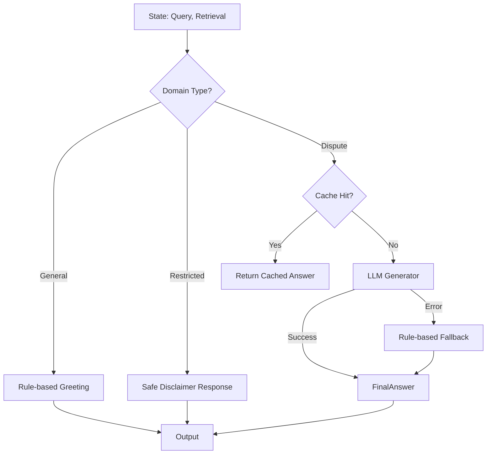

# Answer Generation Agent (답변 생성 에이전트)

**최종 수정**: 2026-01-27 (Phase 8: gpt-4o 모델 업그레이드)

## 1. 개요 (Overview)

**Answer Generation Agent**는 사용자 질문과 검색된 정보(Evidence)를 종합하여 최종 답변을 생성하는 역할을 합니다. 단순히 정보를 요약하는 것을 넘어, 사용자의 상황에 맞는 공감적이고 전문적인 답변을 작성하며, 답변의 근거를 명시(Citation)하여 할루시네이션(Hallucination)을 방지합니다.

### 주요 책임
1.  **답변 초안 생성 (Drafting)**: LLM을 활용하여 구조화된 답변을 작성합니다.
2.  **근거 매핑 (Grounding)**: 답변의 각 주장이 검색된 문서의 어떤 부분에 기반하는지 연결합니다.
3.  **안전 장치 (Fallback)**: LLM 호출 실패 시 규칙 기반 답변으로 우회하거나, 제한된 영역(금융/의료)에 대해 방어적인 응답을 제공합니다.
4.  **응답 캐싱 (Caching)**: 동일한 질문에 대해 빠르게 응답하기 위해 생성된 답변을 캐싱합니다.

---

## 2. 아키텍처 (Architecture)



---

## 3. 생성 전략 (Generation Strategies)

### 3.1. RAG 기반 생성 (Standard)
검색된 4가지 섹션(사례, 상담, 법령, 기준)의 정보를 종합하여 답변을 생성합니다.

| 설정 | 값 | 환경변수 |
|------|-----|---------|
| 기본 모델 | gpt-4o | `MODEL_DRAFT_AGENT` |
| 1차 폴백 | gpt-4o-mini | - |
| 2차 폴백 | rule_based | - |

- **Prompting**: "당신은 한국소비자원 상담사입니다..." 페르소나 부여.
- **Structure**: [결론] -> [상세 근거] -> [관련 규정] -> [해결 방안] 순서로 구조화.

### 3.2. 제한된 영역 (Restricted Domain)
금융(금감원), 의료(의료분쟁조정원) 등 전문성이 요구되는 분야는 직접적인 답변 대신 **해당 기관 안내 및 접수 방법**을 제공합니다.
- **Trigger**: `domain.classify_domain()` 함수로 감지.
- **Output**: 고정된 템플릿에 기관 정보와 유사 사례 제목만 포함하여 반환.

### 3.3. 일반 대화 (General Chat)
"안녕", "고마워" 등의 인사말은 LLM 토큰 소모를 줄이기 위해 규칙 기반으로 즉시 응답합니다.

### 3.4. Fallback 체인 (Phase 8)

LLM 호출 실패 시 자동으로 다음 모델로 전환됩니다:

| 순서 | 모델 | 설명 |
|------|------|------|
| 1 | **gpt-4o** | 기본 Draft Agent (고품질 답변) |
| 2 | gpt-4o-mini | 1차 폴백 (빠른 응답) |
| 3 | rule_based | 2차 폴백 (규칙 기반 템플릿) |
| 4 | safe_fallback | 최종 안전 메시지 (1372 안내) |

```
gpt-4o (기본)
    ↓ API 오류/타임아웃
gpt-4o-mini (1차 폴백)
    ↓ 실패
rule_based (2차 폴백)
    ↓ 실패
safe_fallback (최종 안전 메시지)
```

---

## 4. 코드 구조 (Code Structure)

- **`agent.py`**: 에이전트 진입점 (`generation_node`). 라우팅 및 Fallback 로직 포함.
- **`fallback.py`**: LLM 오류 시 안전하게 답변을 생성하는 Fallback 클래스.
- **`cache.py`**: 답변 캐싱(In-memory/Redis) 로직.
- **`tools/`**: 프롬프트 템플릿 및 LLM 호출 유틸리티.

### 주요 함수
- `generation_node(state)`: 상태를 받아 답변을 생성하고 `draft_answer` 필드를 업데이트합니다.
- `_build_restricted_response(...)`: 제한 영역에 대한 안전한 응답 템플릿을 채웁니다.

---

## 5. 테스트 방법 (Testing)

답변 생성 테스트는 LLM 호출을 모킹(Mocking)하여 Fallback 체인, 규칙 기반 생성, 안전 장치 동작을 검증합니다.

### 주요 테스트 스크립트
- **`backend/scripts/testing/answer_generation/`**: 답변 생성 관련 테스트
  - `test_followup.py`: 후속 질문 생성 테스트
  - `test_formats.py`: 답변 포맷 테스트
  - `test_specialist_agency.py`: 전문 기관 안내 테스트

### 테스트 항목 상세

답변 생성 관련 테스트는 다음 영역을 다룹니다:

#### test_followup.py
- 사용자 대화 맥락 기반 후속 질문 생성
- 온보딩 정보 슬롯 미충족 시 추가 질문 유도

#### test_formats.py
- 답변 포맷 검증 (구조화된 응답)
- 근거 인용(Citation) 형식 검증

#### test_specialist_agency.py
- 제한된 영역(금융/의료) 감지 시 전문 기관 안내
- 안전한 템플릿 응답 생성

### 실행 방법
```bash
conda activate dsr
cd backend
pytest scripts/testing/answer_generation/ -v
```

---

## 6. 변경 이력 (History)

| 날짜 | PR | 내용 |
|------|----|------|
| 2026-01-14 | **Sprint 1** | 초기 RAG 생성 로직 구현. |
| 2026-01-22 | **PR 2** | `classify_domain` 도입으로 제한 영역(금융/의료) 필터링 추가. |
| 2026-01-27 | **Phase 8** | Draft Agent 모델 gpt-4o 업그레이드. Fallback 체인 정비. |

---

## 7. 고도화 계획 (To-Be)

1.  **Personalization**: 사용자의 말투나 수준에 맞춰 답변 톤앤매너 조절.
2.  **Streaming**: 토큰 단위 스트리밍을 통해 체감 대기 시간 단축.
3.  **Multi-turn Context**: 이전 대화 맥락을 프롬프트에 포함하여 연속적인 질문 처리 강화.
