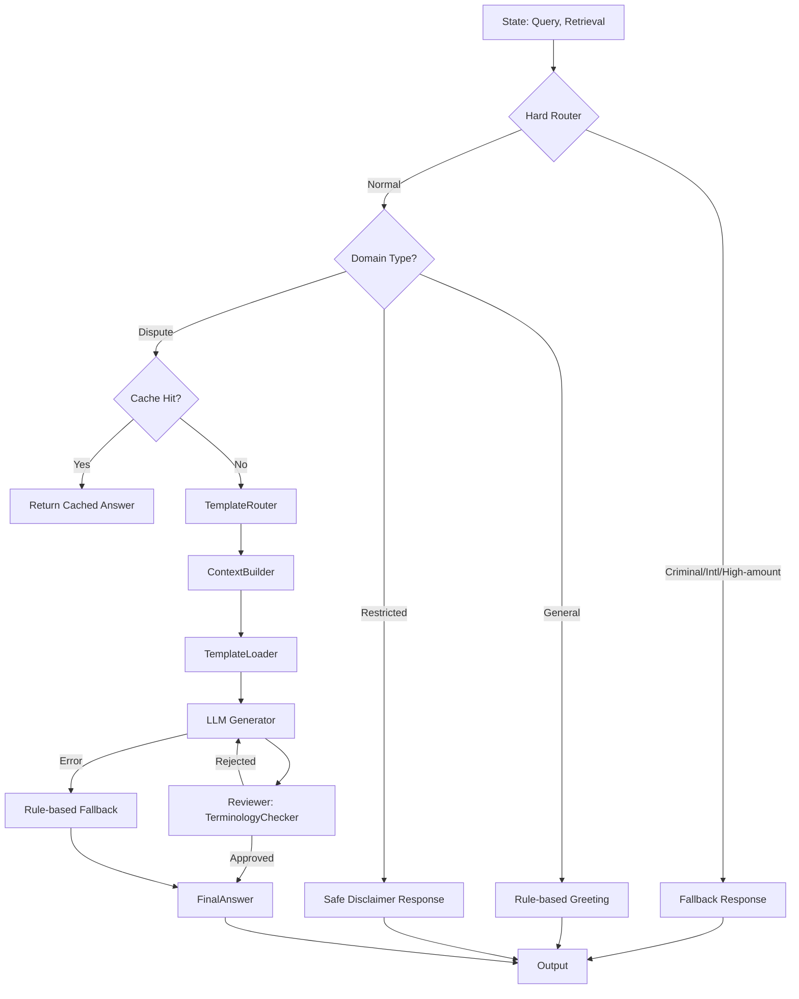

# Answer Generation Agent (답변 생성 에이전트)

**최종 수정**: 2026-02-03 (v2.2: MD 템플릿 시스템 + 용어 병기 사전)

## 1. 개요 (Overview)

**Answer Generation Agent**는 사용자 질문과 검색된 정보(Evidence)를 종합하여 최종 답변을 생성하는 역할을 합니다. 단순히 정보를 요약하는 것을 넘어, 사용자의 상황에 맞는 공감적이고 전문적인 답변을 작성하며, 답변의 근거를 명시(Citation)하여 할루시네이션(Hallucination)을 방지합니다.

### 주요 책임
1.  **답변 초안 생성 (Drafting)**: LLM을 활용하여 구조화된 답변을 작성합니다.
2.  **근거 매핑 (Grounding)**: 답변의 각 주장이 검색된 문서의 어떤 부분에 기반하는지 연결합니다.
3.  **안전 장치 (Fallback)**: LLM 호출 실패 시 규칙 기반 답변으로 우회하거나, 제한된 영역(금융/의료)에 대해 방어적인 응답을 제공합니다.
4.  **응답 캐싱 (Caching)**: 동일한 질문에 대해 빠르게 응답하기 위해 생성된 답변을 캐싱합니다.

---

## 2. v2.2 주요 업데이트

### 2.1. 법률 용어 병기 사전 (Terminology Mapping)
7개 핵심 법률 용어에 대해 `전문 용어(일상 용어 풀이)` 형식의 괄호 병기를 필수화하여 소비자의 직관적 이해를 보장합니다.

### 2.2. 자가 교정형 리뷰 시스템 (Dual-Agent QC)
생성 엔진(`DdoksoriResponseEngine`)이 답변을 작성하면, 검토 에이전트(`DdoksoriReviewer`)가 용어 사전 준수 여부와 데이터 정합성을 기계적으로 검토하여 반려 또는 승인하는 2중 가드레일을 운영합니다. `TerminologyChecker`가 법률 용어 병기 준수를 자동 검증합니다.

### 2.3. 완벽한 데이터 고립 (Strict Grounding)
검색 결과가 없는 섹션은 완전히 생략됩니다. "데이터 없음" 상태의 법령, 유사사례 등은 제목조차 출력하지 않아 할루시네이션을 원천 차단합니다.

### 2.4. 8종 MD 템플릿 시스템
기존 FormatSelector/PromptBuilder 방식을 전면 교체하여, Markdown 템플릿 기반 생성 파이프라인(`TemplateRouter` → `ContextBuilder` → `TemplateLoader`)을 도입했습니다. 6가지 답변 유형(solution/action/execution/inquiry/fallback/reject)에 대한 전용 템플릿을 `prompts/` 디렉토리에서 관리합니다.

### 2.5. 하드 라우팅 (Hard Routing)
형사 사건(사기/잠적 키워드), 해외 직구, 고액 분쟁(500만 원 초과) 건을 Python 코드 레벨에서 사전 감지하여 전문 기관 인계 경로(Fallback)로 즉시 전환합니다.

---

## 3. 아키텍처 (Architecture)



---

## 4. 생성 전략 (Generation Strategies)

### 4.1. Template-Based Generation (MD Template System)
검색된 4가지 섹션(사례, 상담, 법령, 기준)의 정보를 종합하여 답변을 생성합니다.

#### 생성 파이프라인
1. **TemplateRouter**: 질문 의도와 분쟁 단계를 분석하여 6가지 템플릿 유형(solution/action/execution/inquiry/fallback/reject) 중 하나를 선택합니다.
2. **ContextBuilder**: 검색된 데이터를 템플릿 변수로 변환합니다. 빈 섹션은 완전히 생략하여 할루시네이션을 방지합니다.
3. **TemplateLoader**: `prompts/` 디렉토리에서 선택된 Markdown 템플릿을 로드하고, 변수를 주입하여 최종 프롬프트를 생성합니다.

| 설정 | 값 | 환경변수 |
|------|-----|---------|
| 기본 모델 | gpt-4o | `MODEL_DRAFT_AGENT` |
| 1차 폴백 | gpt-4o-mini | - |
| 2차 폴백 | rule_based | - |

- **Prompting**: `base_persona.md`에서 정의한 "당신은 한국소비자원 상담사입니다..." 페르소나 부여.
- **Structure**: 템플릿별로 최적화된 구조 ([결론] -> [상세 근거] -> [관련 규정] -> [해결 방안] 등).

#### 프롬프트 구성 (Prompt Templates)

| 파일명 | 주요 역할 |
|:---|:---|
| `base_persona.md` | 똑소리의 정체성, 용어 병기 사전, 볼드체 사용 금지 등 공통 규칙 정의 |
| `intent_classifier.md` | 질문 의도 및 분쟁 단계(Phase 1~3) 분석 및 메타데이터 추출 |
| `solution_template.md` | 기초 상담 단계에서 법적 권리와 환불 가능성 안내 |
| `action_guide_template.md` | 업체와 협상 시 유리한 고지를 점할 수 있는 대화 시나리오 제공 |
| `execution_guide_template.md` | 협의 결렬 시 사건 요약 및 행정적 이행 절차 가이드 |
| `inquiry_template.md` | 정보 부족 시 상황 구체화를 위한 소비자 친화적 역질문 생성 |
| `fallback_template.md` | 고액/형사/해외 사안에 대한 공적 전문 기관 매칭 및 인계 |
| `reject_template.md` | 서비스 범위 외 질문에 대한 정중한 거절 및 안내 |

### 4.2. 법률 용어 병기 사전 (Terminology Dictionary)

본 시스템은 아래 사전에 정의된 형식을 토씨 하나 틀리지 않고 준수합니다. `TerminologyChecker`가 자동으로 준수 여부를 검증합니다.

| 전문 용어 | 반드시 사용해야 하는 병기 형식 |
|:---|:---|
| **해제** | 해제(계약을 처음부터 없었던 일로 하는 것) |
| **해지** | 해지(앞으로 계약을 그만두는 것) |
| **위약금** | 위약금(계약 취소에 따른 손해 배상금) |
| **환급** | 환급(돈을 돌려받는 것) |
| **공제** | 공제(일정 금액을 뺀 나머지) |
| **청약철회** | 청약철회(주문을 취소하는 것) |
| **항변권** | 항변권(결제 중지 요청권) |

### 4.3. 제한된 영역 (Restricted Domain)
금융(금감원), 의료(의료분쟁조정원) 등 전문성이 요구되는 분야는 직접적인 답변 대신 **해당 기관 안내 및 접수 방법**을 제공합니다.
- **Trigger**: `domain.classify_domain()` 함수로 감지.
- **Output**: 고정된 템플릿에 기관 정보와 유사 사례 제목만 포함하여 반환.

### 4.4. 일반 대화 (General Chat)
"안녕", "고마워" 등의 인사말은 LLM 토큰 소모를 줄이기 위해 규칙 기반으로 즉시 응답합니다.

### 4.5. Fallback 체인 (Phase 8)

LLM 호출 실패 시 자동으로 다음 모델로 전환됩니다:

| 순서 | 모델 | 설명 |
|------|------|------|
| 1 | **gpt-4o** | 기본 Draft Agent (고품질 답변) |
| 2 | gpt-4o-mini | 1차 폴백 (빠른 응답) |
| 3 | rule_based | 2차 폴백 (규칙 기반 템플릿) |
| 4 | safe_fallback | 최종 안전 메시지 (1372 안내) |

```
gpt-4o (기본)
    ↓ API 오류/타임아웃
gpt-4o-mini (1차 폴백)
    ↓ 실패
rule_based (2차 폴백)
    ↓ 실패
safe_fallback (최종 안전 메시지)
```

---

## 5. 코드 구조 (Code Structure)

- **`agent.py`**: 에이전트 진입점 (`generation_node_v2`). 도메인 라우팅, 템플릿 파이프라인, Fallback 로직 포함.
- **`fallback.py`**: LLM 오류 시 안전하게 답변을 생성하는 Fallback 클래스 (`AnswerGenerationFallback`).
- **`cache.py`**: 답변 캐싱(In-memory/Redis) 로직.
- **`template_router.py`**: 하드 라우팅(형사/해외/고액) + Phase 기반 템플릿 유형 선택 (`TemplateRouter.select_template()`).
- **`context_builder.py`**: 검색 결과(laws/criteria/disputes/counsels)를 템플릿 변수로 변환 (`ContextBuilder.build()`).
- **`template_loader.py`**: `prompts/` 디렉토리에서 Markdown 템플릿 로드 및 변수 주입 (Singleton 패턴, `TemplateLoader.render()`).
- **`prompts/`**: 8종 Markdown 템플릿 파일 저장 디렉토리.
- **`tools/`**: LLM 호출 유틸리티 (legacy `RAGGenerator`).

### 주요 함수
- `generation_node_v2(state)`: 상태를 받아 답변을 생성하고 `draft_answer` 필드를 업데이트합니다.
- `TemplateRouter.select_template(state)`: 하드 라우팅 + Phase 분석으로 최적 템플릿 유형 선택.
- `ContextBuilder.build(state)`: 검색 데이터를 템플릿 변수로 변환.
- `TemplateLoader.render(template_key, context)`: 템플릿 로드 및 변수 주입.

---

## 6. 테스트 방법 (Testing)

답변 생성 테스트는 LLM 호출을 모킹(Mocking)하여 Fallback 체인, 규칙 기반 생성, 안전 장치 동작을 검증합니다.

### 주요 테스트 스크립트
- **`backend/scripts/testing/answer_generation/`**: 답변 생성 관련 테스트
  - `test_followup.py`: 후속 질문 생성 테스트
  - `test_formats.py`: 답변 포맷 테스트
  - `test_specialist_agency.py`: 전문 기관 안내 테스트

### 테스트 항목 상세

답변 생성 관련 테스트는 다음 영역을 다룹니다:

#### test_followup.py
- 사용자 대화 맥락 기반 후속 질문 생성
- 온보딩 정보 슬롯 미충족 시 추가 질문 유도

#### test_formats.py
- 답변 포맷 검증 (구조화된 응답)
- 근거 인용(Citation) 형식 검증

#### test_specialist_agency.py
- 제한된 영역(금융/의료) 감지 시 전문 기관 안내
- 안전한 템플릿 응답 생성

### 실행 방법
```bash
conda activate dsr
cd backend
pytest scripts/testing/answer_generation/ -v
```

---

## 7. 변경 이력 (History)

| 날짜 | PR | 내용 |
|------|----|------|
| 2026-01-14 | **Sprint 1** | 초기 RAG 생성 로직 구현. |
| 2026-01-22 | **PR 2** | `classify_domain` 도입으로 제한 영역(금융/의료) 필터링 추가. |
| 2026-01-27 | **Phase 8** | Draft Agent 모델 gpt-4o 업그레이드. Fallback 체인 정비. |
| 2026-02-03 | **v2.2** | MD 템플릿 시스템 교체, 용어 병기 사전, 하드 라우팅, TerminologyChecker 통합. |

---

## 8. 고도화 계획 (To-Be)

1.  **Personalization**: 사용자의 말투나 수준에 맞춰 답변 톤앤매너 조절.
2.  **Streaming**: 토큰 단위 스트리밍을 통해 체감 대기 시간 단축.
3.  **Multi-turn Context**: 이전 대화 맥락을 프롬프트에 포함하여 연속적인 질문 처리 강화.
