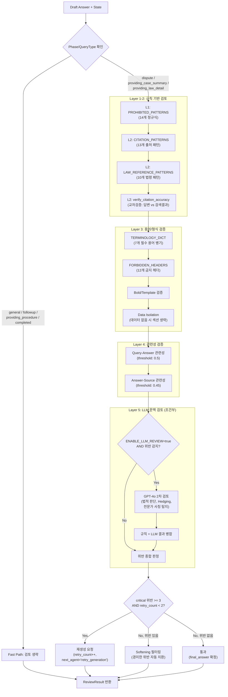

# Legal Review Agent (법률 검토 에이전트)

**최종 수정**: 2026-02-09

## 1. 개요 (Overview)

**Legal Review Agent**는 생성된 답변(Draft)이 사용자에게 전달되기 전에 마지막으로 검증하는 품질 관리자(Quality Assurance)입니다. 특히 법률 및 분쟁 조정이라는 민감한 도메인 특성상, **잘못된 법적 조언**이나 **근거 없는 주장(Hallucination)**을 차단하는 것이 핵심 목표입니다.

### 주요 책임

1. **금지 표현 탐지 (Prohibited Check)**: 변호사법 위반 소지가 있거나("승소합니다", "반드시 ~해야 합니다"), 사용자에게 과도한 확신을 주는 단정적 표현을 걸러냅니다.
2. **출처 확인 (Citation Check)**: 답변에 `[출처]` 표기가 포함되어 있는지, 인용된 법령이 실제 검색 결과에 존재하는지 확인하여 Hallucination을 방지합니다.
3. **용어 병기 검증 (Terminology Check)**: 7개 필수 용어가 정의된 괄호 풀이와 함께 사용되었는지 검증합니다.
4. **관련성 검증 (Relevance Check)**: Query-Answer, Answer-Source 간 의미적 관련성을 임베딩 기반으로 측정합니다.
5. **신뢰도 점수 산출 (Confidence Score)**: 출처 커버리지(40%), 관련성(30%), 인용 정확도(30%)를 종합하여 0.0~1.0 점수를 산출합니다.
6. **답변 정제 (Refinement)**: 경미한 위반 사항(예: "무조건" -> "일반적으로")은 자동으로 수정하여 답변 품질을 높입니다.
7. **재생성 요청 (Retry Loop)**: 위반 사항이 심각하거나 수정이 불가능한 경우, Orchestrator에게 답변 재생성을 요청합니다.

---

## 2. 아키텍처 (Architecture)

### 2.1 5-Layer 하이브리드 검토 구조

Legal Review Agent는 규칙 기반(Rule-based) + LLM 기반의 5계층 하이브리드 검토 아키텍처를 사용합니다.

| Layer | 검토 항목 | 방식 | 모듈 |
|-------|-----------|------|------|
| **L1** | 금지 표현 탐지 (14개 패턴) | 정규식 매칭 | `agent.py` |
| **L2** | 출처/인용 검증 (13개 패턴 + 10개 법령 패턴) | 정규식 + 교차검증 | `agent.py` |
| **L3** | 용어 병기 + 형식 검증 (7개 용어, 12개 금지 헤더) | 패턴 매칭 | `terminology_checker.py` |
| **L4** | 관련성 검증 (Query-Answer, Answer-Source) | 임베딩 cosine similarity | `relevance_checker.py` |
| **L5** | LLM 문맥 검토 (법적 판단, Hedging, 전문가 사칭) | GPT-4o (조건부) | `llm_reviewer.py` |

### 2.2 전체 흐름도



### 2.3 v1 vs v2 노드 비교

| 구분 | v1 (`review_node`) | v2 (`review_node_v2`) |
|------|---------------------|----------------------|
| Phase 분기 | query_type만 확인 | conversation_phase + query_type |
| 엄격도 | 단일 모드 | Standard / Strict (`providing_law_detail`) |
| Violation 형식 | `List[str]` | `List[Dict]` (type, description, location, severity, suggestion) |
| 재생성 | retry_count 증가만 | retry_context 구성 + next_agent 반환 |
| 용어 검증 | 없음 | TerminologyChecker 통합 |
| 최대 재시도 | `AgentConfig.MAX_REVIEW_RETRIES` (2) | 1회 (하드코딩) |

---

## 3. ViolationType 정의 (10종)

`ViolationType`은 `backend/app/agents/protocols.py`에 정의되며, 각 위반 유형에 대한 심각도(`SeverityLevel`: `critical` | `warning`)가 할당됩니다.

| # | ViolationType | 설명 | 기본 Severity | 탐지 Layer |
|---|---------------|------|---------------|------------|
| 1 | `hallucination` | 검색 결과에 없는 법령/조문 인용 (Hallucination 의심) | `critical` | L2 |
| 2 | `legal_judgment` | 법적 판단/결론 탐지 (변호사법 위반 가능성) | `critical` | L5 (LLM) |
| 3 | `prohibited_expression` | 금지된 단정적/확정적 표현 | `critical` / `warning` | L1 |
| 4 | `query_mismatch` | 출처 누락 또는 근거 부족 | `warning` | L2 |
| 5 | `terminology_missing` | 필수 용어의 괄호 풀이 누락 | `critical` | L3 |
| 6 | `terminology_mismatch` | 용어 풀이가 사전 정의와 불일치 | `critical` | L3 |
| 7 | `forbidden_header` | 금지된 구조적 헤더 노출 | `critical` | L3 |
| 8 | `format_violation` | 마크다운 볼드체(`**`) 사용 | `critical` | L3 |
| 9 | `template_variable` | 치환되지 않은 템플릿 변수 `{...}` | `critical` | L3 |
| 10 | `data_isolation` | 데이터 없는 섹션에 대한 내용 생성 | `warning` | L3 |

**Severity 판정 기준**:
- `critical`: 즉시 수정 필요. critical 위반이 `PROHIBITED_VIOLATION_THRESHOLD`(3) 이상이면 재생성 트리거.
- `warning`: 주의 필요. 경미한 위반으로 Softening 자동 필터링 대상.

**`prohibited_expression`의 severity 결정 로직** (`agent.py` `_build_violation_details`):
- 패턴 설명에 "법적" 또는 "확실"이 포함되면 `critical`
- 그 외에는 `warning`

---

## 4. 검토 규칙 상세 (Review Rules)

### 4.1 금지 표현 패턴 (PROHIBITED_PATTERNS) - 14개

`agent.py`에 정의된 정규식 패턴으로, 변호사법 위반 소지가 있거나 사용자에게 잘못된 확신을 줄 수 있는 표현을 탐지합니다. 각 패턴은 `(regex, description)` 튜플입니다.

| # | 카테고리 | 정규식 패턴 | 설명 |
|---|----------|------------|------|
| 1 | 법적 단정 | `반드시\s+\S+(해야\s*합니다\|합니다\|하세요\|입니다)` | "반드시 ~합니다" |
| 2 | 법적 단정 | `법적으로\s+\S+입니다` | "법적으로 ~입니다" |
| 3 | 법적 단정 | `(위법\|불법)입니다` | "위법/불법입니다" |
| 4 | 법적 단정 | `소송\s*(을\|에서)\s*이길\s*(수\s*있\|것)` | "소송에서 이길 수 있다" |
| 5 | 예측 표현 | `(승소\|패소\|이길)\s*수\s*있(습니다\|어요)` | "승소/패소할 수 있습니다" |
| 6 | 예측 표현 | `(승소\|패소)\s*할\s*(것\|수\s*있)` | "승소/패소 예측 표현" |
| 7 | 예측 표현 | `확실히\s+\S+받을\s*수\s*있` | "확실히 ~받을 수 있다" |
| 8 | 예측 표현 | `100%\s*\S+` | "100% ~" |
| 9 | 확정적 판단 | `당연히\s+\S+해야` | "당연히 ~해야" |
| 10 | 확정적 판단 | `무조건\s+\S+` | "무조건 ~" |
| 11 | 확정적 판단 | `틀림없이\s+\S+` | "틀림없이 ~" |
| 12 | 확정적 판단 | `분명히\s+\S+할\s*것입니다` | "분명히 ~할 것입니다" |
| 13 | 전문가 사칭 | `법률\s*전문가로서` | "법률 전문가로서" |
| 14 | 전문가 사칭 | `변호사\s*입장에서` / `법적\s*조언을\s*드리자면` | 전문가 사칭 표현 |

> 패턴당 최대 3건의 매칭만 보고됩니다 (`matches[:3]`).

**대체 표현 (SOFTENING_PHRASES)** - 7개 매핑:

| 금지 표현 | 안전 표현 |
|-----------|-----------|
| `해야 합니다` | `~할 수 있습니다` |
| `입니다` | `~로 판단될 수 있습니다` |
| `이길 수 있` | `유리한 측면이 있을 수 있` |
| `받을 수 있` | `요청해 볼 수 있` |
| `확실히` | `가능성이 있` |
| `무조건` | `일반적으로` |
| `당연히` | `통상적으로` |

### 4.2 출처 표시 패턴 (CITATION_PATTERNS) - 13개

답변에 근거 자료가 인용되었는지 확인하는 패턴입니다. 검색 결과(`sources`)가 있는데도 출처가 없다면 Hallucination으로 간주합니다. 하나 이상 매칭되면 통과입니다.

| # | 패턴 | 설명 |
|---|------|------|
| 1 | `\[출처[:\s]` | `[출처: ...]` 형식 |
| 2 | `\[참고[:\s]` | `[참고: ...]` 형식 |
| 3 | `출처\s*:` | `출처:` 형식 |
| 4 | `근거\s*:` | `근거:` 형식 |
| 5 | `관련\s*법령\s*:` | `관련 법령:` 형식 |
| 6 | `관련\s*기준\s*:` | `관련 기준:` 형식 |
| 7 | `분쟁조정사례` | 분쟁조정사례 키워드 |
| 8 | `상담사례` | 상담사례 키워드 |
| 9 | `소비자보호법` | 법률명 직접 인용 |
| 10 | `전자상거래법` | 법률명 직접 인용 |
| 11 | `약관규제법` | 법률명 직접 인용 |
| 12 | `제\d+조` | 조문 번호 인용 (예: 제17조) |
| 13 | `별표\s*\d+` | 별표 인용 (예: 별표 1) |

### 4.3 법령/조문 추출 패턴 (LAW_REFERENCE_PATTERNS) - 10개

답변에서 인용된 법령이 실제 검색 결과에 존재하는지 교차검증(`verify_citation_accuracy`)하기 위한 법령 참조 추출 패턴입니다.

| # | 패턴 | 예시 |
|---|------|------|
| 1 | `제\s*(\d+)\s*조` | 제17조 |
| 2 | `제\s*(\d+)\s*조\s*제\s*(\d+)\s*항` | 제17조 제1항 |
| 3 | `별표\s*(\d+)` | 별표 1 |
| 4 | `(소비자보호법\|소비자기본법)` | 소비자보호법 |
| 5 | `(전자상거래법\|전자상거래\s*등에서의\s*소비자보호에\s*관한\s*법률)` | 전자상거래법 |
| 6 | `(약관규제법\|약관의\s*규제에\s*관한\s*법률)` | 약관규제법 |
| 7 | `(할부거래법\|할부거래에\s*관한\s*법률)` | 할부거래법 |
| 8 | `(방문판매법\|방문판매\s*등에\s*관한\s*법률)` | 방문판매법 |
| 9 | `(표시광고법\|표시·광고의\s*공정화에\s*관한\s*법률)` | 표시광고법 |
| 10 | `(제조물책임법)` / `(민법)` / `(상법)` | 제조물책임법, 민법, 상법 |

**인용 정확성 검증 모드** (`verify_citation_accuracy`):
- **관대 모드** (기본, `strict_mode=False`): 인용 정확도 >= 50%이면 통과
- **Strict 모드** (`strict_mode=True`, `providing_law_detail` 단계): 모든 인용이 검증되어야 통과 (`unverified_refs == 0`)

### 4.4 필수 용어 병기 사전 (TERMINOLOGY_DICT) - 7쌍

`terminology_checker.py`에 정의된 필수 용어와 괄호 풀이 쌍입니다. 답변에 해당 용어가 등장하면 반드시 `용어(풀이)` 형식으로 병기해야 합니다.

| # | 용어 | 필수 풀이 |
|---|------|-----------|
| 1 | 해제 | 계약을 처음부터 없었던 일로 하는 것 |
| 2 | 해지 | 앞으로 계약을 그만두는 것 |
| 3 | 위약금 | 계약 취소에 따른 손해 배상금 |
| 4 | 환급 | 돈을 돌려받는 것 |
| 5 | 공제 | 일정 금액을 뺀 나머지 |
| 6 | 청약철회 | 주문을 취소하는 것 |
| 7 | 항변권 | 결제 중지 요청권 |

**의미 일치 판단** (`_meanings_match`):
- 괄호 안의 핵심 의미가 일치하면 미세한 조사(은/는/이/가/을/를/의/에/로) 차이나 공백 차이는 PASS 처리
- 문자 집합 겹침 비율 >= `MEANING_MATCH_THRESHOLD` (0.7)이면 일치로 간주
- 풀이 자체가 아예 없거나 의미가 다르면 `terminology_missing` 또는 `terminology_mismatch` 위반

### 4.5 금지 헤더 (FORBIDDEN_HEADERS) - 12개

`terminology_checker.py`의 `FORBIDDEN_HEADERS`에 정의된 구조적 헤더로, 답변 본문에 노출되면 `forbidden_header` (severity: `critical`) 위반입니다.

| # | 금지 헤더 | # | 금지 헤더 |
|---|-----------|---|-----------|
| 1 | `[공감]` | 7 | `[법적 근거]` |
| 2 | `[가이드]` | 8 | `[근거 안내]` |
| 3 | `[출처]` | 9 | `[절차 안내]` |
| 4 | `[돌파 논리]` | 10 | `[법률]` |
| 5 | `[사건 요약]` | 11 | `[해결기준]` |
| 6 | `[상황 정리]` | 12 | `[유사사례]` |

> `DdoksoriReviewer`에는 추가 금지 헤더 7개가 포함되어 있습니다: `[상황 공감]`, `[위로와 전환]`, `[사건 요약 정리]`, `[논리적 근거 안내]`, `[행정 절차 안내]`, `[전문 기관 연결]`, `[근거 및 이유 안내]`

### 4.6 형식 검증 규칙

| 규칙 | 위반 유형 | Severity | 설명 |
|------|-----------|----------|------|
| 마크다운 볼드체 금지 | `format_violation` | `critical` | 답변에 `**` 포함 시 위반 |
| 템플릿 변수 미치환 | `template_variable` | `critical` | `{variable_name}` 패턴이 잔존 시 위반 |
| 데이터 고립 위반 | `data_isolation` | `warning` | 데이터 없는 섹션(법률/기준/사례)에 관련 내용 생성 시 위반 |

---

## 5. 설정값 (Configuration)

### 5.1 AgentConfig (`backend/app/common/config.py`)

| 설정 | 기본값 | 환경변수 | 설명 |
|------|--------|----------|------|
| `prohibited_violation_threshold` | `3` | `PROHIBITED_VIOLATION_THRESHOLD` | 금지 표현 위반 임계값 (이상이면 재생성 트리거) |
| `max_review_retries` | `2` | `MAX_REVIEW_RETRIES` | 최대 재검토 횟수 |
| `enable_llm_review` | `false` | `ENABLE_LLM_REVIEW` | LLM 2차 검토 활성화 여부 |

### 5.2 LLM 모델 설정

| 설정 | 값 | 소스 |
|------|-----|------|
| 기본 모델 | `gpt-4o` | `MODEL_REVIEW_AGENT` 환경변수 |
| LLM 최대 재시도 | 2회 | `MAX_LLM_RETRIES` (llm_reviewer.py 하드코딩) |
| 재시도 지연 | 1.0초 | `RETRY_DELAY_SEC` (llm_reviewer.py 하드코딩) |
| API 타임아웃 | 15초 | llm_reviewer.py 하드코딩 |
| 출처 최대 문자수 | 350자 | `MAX_SOURCE_CONTENT_CHARS` (llm_reviewer.py 하드코딩) |
| 프롬프트 최대 출처 수 | 5개 | `_format_sources_for_prompt` 하드코딩 |
| 프롬프트 최대 총 문자수 | 2000자 | `_format_sources_for_prompt` 기본값 |

```python
# 환경변수 설정 예시
MODEL_REVIEW_AGENT=gpt-4o
ENABLE_LLM_REVIEW=true  # LLM 2차 검토 활성화
```

### 5.3 관련성 검증 임계값 (`relevance_checker.py`)

| 검증 유형 | 기본 Threshold | 설명 |
|-----------|----------------|------|
| Query-Answer 관련성 | `0.5` | 질문-답변 의미 유사도 |
| Query-Retrieval 관련성 | `0.4` | 질문-검색결과 의미 유사도 |
| Answer-Source 관련성 | `0.45` | 답변-출처 의미 유사도 (Hallucination 탐지) |

임베딩 모델: `text-embedding-3-large` (1536d)

### 5.4 신뢰도 점수 등급 (`confidence_scorer.py`)

**가중치 구성**:
- 출처 커버리지 (`WEIGHT_SOURCE_COVERAGE`): 40%
- Query-Answer 관련성 (`WEIGHT_RELEVANCE`): 30%
- 인용 정확도 (`WEIGHT_CITATION_ACCURACY`): 30%

**등급 기준** (`GRADE_THRESHOLDS`):

| 등급 | 점수 범위 |
|------|-----------|
| **A** | >= 0.85 |
| **B** | >= 0.70 |
| **C** | >= 0.55 |
| **D** | >= 0.40 |
| **F** | < 0.40 |

신뢰 가능 임계값 (`RELIABILITY_THRESHOLD`): `0.6` (`is_reliable = total_score >= 0.6`)

**출처 커버리지 점수 계산** (`_calculate_source_coverage`):
- 출처/답변 길이 비율 >= 3.0: 1.0
- 출처/답변 길이 비율 >= 1.5: 0.8
- 출처/답변 길이 비율 >= 0.5: 0.6
- 그 미만: 0.3
- 출처 개수 보너스: `min(len(sources) * 0.05, 0.25)`

### 5.5 Phase 기반 검토 분기 (v2)

| Phase / QueryType | 검토 동작 | 엄격도 |
|-------------------|-----------|--------|
| `general` | 검토 생략 (Fast Path) | - |
| `followup` | 검토 생략 (Fast Path) | - |
| `providing_procedure` | 검토 생략 (템플릿 응답) | - |
| `completed` | 검토 생략 (템플릿 응답) | - |
| `providing_case_summary` | 정밀 검토 | Standard |
| `providing_law_detail` | 정밀 검토 | **Strict** (인용 정확성 100% 요구) |
| 그 외 (`dispute` 등) | 정밀 검토 | Standard |

### 5.6 용어 검증 설정 (`terminology_checker.py`)

| 설정 | 값 | 설명 |
|------|-----|------|
| `MEANING_MATCH_THRESHOLD` | `0.7` | 의미 일치 판단 임계값 (문자 집합 겹침 비율) |

---

## 6. 코드 구조 (Code Structure)

### 6.1 파일 목록

```
backend/app/agents/legal_review/
├── __init__.py              # 모듈 공개 API 및 지연 import 헬퍼
├── agent.py                 # 핵심 검토 로직: review_node (v1), review_node_v2
│                            # PROHIBITED_PATTERNS(14), CITATION_PATTERNS(13),
│                            # LAW_REFERENCE_PATTERNS(10), SOFTENING_PHRASES(7)
│                            # verify_citation_accuracy, CitationVerifyResult
├── llm_reviewer.py          # HybridLegalReviewer (규칙 + LLM 하이브리드)
│                            # LLM_REVIEW_SYSTEM_PROMPT, LLMReviewResult
│                            # get_reviewer (싱글턴), hybrid_review_node
├── reviewer_agent.py        # LegalReviewerAgent (BaseAgent 기반 MAS 통합)
│                            # 5단계: 하이브리드 리뷰 -> 관련성 -> Hallucination -> 신뢰도
├── terminology_checker.py   # TerminologyChecker: 용어 병기(7), 금지 헤더(12),
│                            # 볼드체, 템플릿 변수, 데이터 고립 검증
├── confidence_scorer.py     # ConfidenceScorer: 종합 신뢰도 점수 계산 (등급 A~F)
│                            # ConfidenceScoreResult, get_confidence_scorer (싱글턴)
├── relevance_checker.py     # RelevanceChecker: 임베딩 cosine similarity 기반 관련성 검증
│                            # RelevanceResult, get_relevance_checker (싱글턴)
├── ddoksori_reviewer.py     # DdoksoriReviewer: GPT-4o 기반 독립 품질 감사관 (v2.4.1)
│                            # 화이트리스트, 할루시네이션 완화, 용어 교정 인정
└── metrics.py               # ReviewMetrics: 위반 탐지 정밀도/재현율/F1 평가기
                             # PrometheusReviewMetrics: Prometheus 메트릭 수집기
                             # detect_violations, aggregate_review_results
```

### 6.2 주요 노드 함수

| 함수 | 위치 | 용도 | 동기/비동기 |
|------|------|------|------------|
| `review_node(state)` | `agent.py` | v1 검토 노드. 규칙 기반 3단계 검증 | 동기 |
| `review_node_wrapper(state)` | `agent.py` | v1 래퍼. chat_type 기반 Fast Path 분기 | 동기 |
| `review_node_v2(state, config)` | `agent.py` | v2 검토 노드. Phase 분기 + TerminologyChecker + 상세 Violation | **비동기** |
| `hybrid_review_node(state)` | `llm_reviewer.py` | 하이브리드 노드. 규칙 + 조건부 LLM | 동기 |
| `hybrid_review_node_wrapper(state)` | `llm_reviewer.py` | 하이브리드 래퍼. chat_type 기반 분기 | 동기 |

### 6.3 주요 클래스

| 클래스 | 위치 | 역할 | 패턴 |
|--------|------|------|------|
| `HybridLegalReviewer` | `llm_reviewer.py` | 2단계 하이브리드 검토기 (규칙 + LLM) | 싱글턴 (thread-safe) |
| `LegalReviewerAgent` | `reviewer_agent.py` | BaseAgent 상속. MAS Supervisor 통합용 에이전트 | 모듈 레벨 인스턴스 |
| `TerminologyChecker` | `terminology_checker.py` | 용어 병기 + 형식 + 데이터 고립 검증 | 인스턴스 생성 |
| `ConfidenceScorer` | `confidence_scorer.py` | 종합 신뢰도 점수 계산 (등급 A~F) | 싱글턴 |
| `RelevanceChecker` | `relevance_checker.py` | 임베딩 cosine similarity 기반 관련성 검증 | 싱글턴 |
| `DdoksoriReviewer` | `ddoksori_reviewer.py` | GPT-4o 기반 독립 품질 감사관 (v2.4.1) | 인스턴스 생성 |
| `ReviewMetrics` | `metrics.py` | 위반 탐지 정밀도/재현율/F1 평가기 | 인스턴스 생성 |
| `PrometheusReviewMetrics` | `metrics.py` | Prometheus 메트릭 수집기 | 싱글턴 |

### 6.4 데이터 클래스

| 데이터 클래스 | 위치 | 주요 필드 |
|---------------|------|-----------|
| `CitationVerifyResult` | `agent.py` | `passed`, `cited_refs`, `verified_refs`, `unverified_refs`, `accuracy` |
| `LLMReviewResult` | `llm_reviewer.py` | `passed`, `issues`, `severity`, `overall_comment`, `error`, `latency_ms`, `legal_judgment_detected`, `hedging_level`, `overall_severity` |
| `ConfidenceScoreResult` | `confidence_scorer.py` | `total_score`, `source_coverage_score`, `relevance_score`, `citation_accuracy_score`, `grade`, `is_reliable` |
| `RelevanceResult` | `relevance_checker.py` | `passed`, `score`, `threshold`, `message` |
| `ReviewEvalResult` | `metrics.py` | `item_id`, `answer_text`, `is_violation_predicted/expected`, `predicted/expected_violations`, `true_positive`, `false_positive`, `false_negative`, `true_negative`, `precision`, `recall`, `f1` |

### 6.5 공개 API (`__init__.py`)

```python
# Legacy 노드 함수
review_node, review_node_wrapper

# Enhanced Agent
LegalReviewerAgent, legal_reviewer_agent

# 인용 정확성
verify_citation_accuracy, CitationVerifyResult

# 관련성 검증
RelevanceChecker, RelevanceResult, get_relevance_checker

# 신뢰도 점수
ConfidenceScorer, ConfidenceScoreResult, get_confidence_scorer

# 평가 메트릭
ReviewMetrics, ReviewEvalResult, detect_violations, aggregate_review_results

# Prometheus 메트릭
PrometheusReviewMetrics, get_prometheus_review_metrics

# 지연 import 헬퍼
get_hybrid_reviewer()       # -> HybridLegalReviewer 클래스
get_hybrid_review_node()    # -> hybrid_review_node 함수
get_hybrid_review_node_wrapper()  # -> hybrid_review_node_wrapper 함수
```

---

## 7. Prometheus 모니터링 메트릭

`metrics.py`에 정의된 Prometheus 메트릭으로, `prometheus_client` 패키지를 사용합니다. 지연 초기화로 패키지 미설치 시 graceful degradation됩니다.

| 메트릭 | 유형 | 설명 | 라벨 |
|--------|------|------|------|
| `legal_review_violations_total` | Counter | 위반 탐지 총 건수 | `violation_type` |
| `legal_review_hallucination_detected_total` | Counter | Hallucination 탐지 건수 | - |
| `legal_review_legal_judgment_detected_total` | Counter | 법적 판단 탐지 건수 | - |
| `legal_review_confidence_score` | Histogram | 신뢰도 점수 분포 | buckets: 0.1~1.0 (10구간) |
| `legal_review_llm_calls_total` | Counter | LLM 리뷰 호출 건수 | `status` (success/failure/skipped) |
| `legal_review_processing_seconds` | Histogram | 리뷰 처리 시간 | buckets: 0.1, 0.5, 1.0, 2.0, 5.0, 10.0 |
| `legal_review_reviews_total` | Counter | 총 리뷰 처리 건수 | `result` (passed/failed/filtered) |
| `legal_review_relevance_score` | Histogram | 관련성 점수 분포 | buckets: 0.1~1.0 (10구간) |

### 평가 지표 목표 (ReviewMetrics)

| 지표 | 목표 | 설명 |
|------|------|------|
| Violation Detection Precision | >= 0.85 | 위반 탐지 정밀도 |
| Violation Detection Recall | >= 0.90 | 위반 탐지 재현율 |
| False Positive Rate | <= 0.10 | 오탐률 |
| Filter Effectiveness | >= 0.80 | 필터링 효과 |

---

## 8. LLM 검토 프롬프트 구조 (Layer 5)

### 8.1 시스템 프롬프트 검토 기준

`llm_reviewer.py`의 `LLM_REVIEW_SYSTEM_PROMPT`는 7가지 검토 기준을 정의합니다:

| # | 검토 기준 | 설명 |
|---|-----------|------|
| 1 | **용어 병기 사전 준수** | 7개 용어의 괄호 풀이 존재 및 의미 일치 검증. 미세한 조사 차이는 PASS. |
| 2 | **데이터 부재 시 완전 생략** | 데이터 없는 섹션 생성 금지. Fallback/해외 사안 시 헤더 사용 금지하되 핵심 논리 포함 시 PASS. |
| 3 | **논리적 위계** | Law -> Criteria -> Case 구조적 순서. Fallback 템플릿 사용 시 면제. |
| 4 | **법적 판단/결론 탐지** | 변호사법 위반 가능성 있는 명시적 법적 판단 탐지 (Critical). |
| 5 | **Hedging Language 분류** | 위험(확정적: "~해야 합니다") vs 안전(완화: "~할 수 있습니다") 표현 분류. |
| 6 | **전문가 사칭** | "변호사로서", "법률 전문가로서", "법적 조언을 드리자면" 탐지. |
| 7 | **형식 검증** | 마크다운 볼드체(`**`), 구조적 헤더(`[공감]` 등), 템플릿 변수(`{...}`) 검출. |

### 8.2 LLM 응답 형식

```json
{
  "passed": true,
  "issues": [
    {
      "type": "용어 병기|데이터 고립|법적 판단|전문가 사칭|근거 없는 주장|확정적 표현|형식 위반",
      "text": "발견된 텍스트",
      "severity": "low|medium|high",
      "suggestion": "수정 제안"
    }
  ],
  "legal_judgment_detected": false,
  "hedging_level": "safe|caution|dangerous",
  "overall_severity": "low|medium|high",
  "overall_comment": "전체 평가 요약"
}
```

**LLM severity 기준**:
- `high`: 용어 병기 누락, 데이터 고립 위반, 변호사법 위반 소지 -> 즉시 수정 필요
- `medium`: 주의 필요, 완화 표현 권장
- `low`: 경미한 문제, 개선 권장

### 8.3 LLM 호출 조건 (비용 최적화)

```
ENABLE_LLM_REVIEW=true AND 규칙 기반 위반 감지 -> LLM 호출
ENABLE_LLM_REVIEW=true AND 규칙 기반 위반 없음 -> LLM 호출 생략
ENABLE_LLM_REVIEW=false -> LLM 호출 생략
```

### 8.4 결과 병합 전략 (`_merge_results`)

| 조건 | 동작 |
|------|------|
| LLM 실패 (error) | 규칙 기반 결과만 사용 (graceful degradation) |
| LLM `legal_judgment_detected=true` | 강제 `passed=False` |
| LLM `passed=true` + `overall_severity='low'` | 규칙 위반 완화 (LLM 문맥 이해 우선) |
| LLM 이슈 발견 | `[LLM-severity]` 태그로 violations에 병합 |
| 그 외 | `rule.passed AND llm.passed`로 최종 판정 |

---

## 9. 사용 방법 (Usage)

### 9.1 기본 사용 (규칙 기반 검토)

```python
from app.agents.legal_review import review_node

state = {
    "draft_answer": "생성된 답변 텍스트",
    "query_analysis": {"query_type": "dispute"},
    "sources": [...],
    "retrieval": {...},
    "retry_count": 0
}

result = review_node(state)

if result["review"]["passed"]:
    final_answer = result["final_answer"]
else:
    retry_count = result.get("retry_count", 0)
```

### 9.2 하이브리드 검토 (규칙 + LLM)

```python
from app.agents.legal_review.llm_reviewer import HybridLegalReviewer

reviewer = HybridLegalReviewer(enable_llm=True)
result = reviewer.review(state)

# 메트릭 확인
metrics = reviewer.get_metrics()
print(f"LLM 호출 횟수: {metrics['llm_call_count']}")
print(f"평균 지연시간: {metrics['avg_llm_latency_ms']:.2f}ms")
```

### 9.3 v2 검토 노드 (Phase-based 엄격도)

```python
from app.agents.legal_review.agent import review_node_v2

state = {
    "draft_answer": "...",
    "conversation_phase": "providing_law_detail",  # Strict 모드
    "sources": [...],
    "retry_count": 0
}

result = await review_node_v2(state, config)

if result.get("next_agent") == "retry_generation":
    retry_context = result["retry_context"]
```

### 9.4 용어 검증

```python
from app.agents.legal_review.terminology_checker import TerminologyChecker

checker = TerminologyChecker()
violations = checker.check(response_text, state)

for v in violations:
    print(f"[{v['severity']}] {v['type']}: {v['description']}")
    if v.get('suggestion'):
        print(f"  -> 제안: {v['suggestion']}")
```

### 9.5 관련성 검증

```python
from app.agents.legal_review.relevance_checker import get_relevance_checker

checker = get_relevance_checker()

# Query-Answer 관련성
qa_result = checker.check_query_answer_relevance(query, answer, threshold=0.5)
if not qa_result.passed:
    print(f"관련성 부족: {qa_result.message}")

# Answer-Source 관련성 (Hallucination 탐지)
as_result = checker.check_answer_source_relevance(answer, source_texts, threshold=0.45)
```

### 9.6 신뢰도 점수 계산

```python
from app.agents.legal_review.confidence_scorer import get_confidence_scorer

scorer = get_confidence_scorer()
result = scorer.calculate(
    answer=final_answer,
    sources=sources,
    relevance_score=0.75,
    citation_accuracy=0.9
)

print(f"신뢰도: {result.total_score:.2f} (등급: {result.grade})")
print(f"신뢰 가능: {result.is_reliable}")
```

---

## 10. 테스트 (Testing)

### 10.1 테스트 파일 목록

| 파일 | 위치 | 테스트 내용 | 테스트 수 |
|------|------|------------|-----------|
| `test_review_logic.py` | `backend/scripts/testing/legal_review/` | HybridLegalReviewer, 규칙/LLM 기반 검토, 메트릭, 노드 함수 | 20개 |
| `test_enhanced_review.py` | `backend/scripts/testing/legal_review/` | 법령 추출, 인용 정확성, 관련성, 신뢰도, Enhanced LLM 검토 | 17개 |
| `test_hallucination_detection.py` | `backend/scripts/testing/legal_review/` | Hallucination, 금지 표현, 출처 확인, 용어 검증, 법령 추출 | 24개 |

### 10.2 테스트 항목 상세

#### test_review_logic.py (20개)

| 테스트 클래스 | 수 | 테스트 내용 |
|---------------|-----|------------|
| **TestHybridLegalReviewerInit** | 4 | `ENABLE_LLM_REVIEW` 환경변수 및 명시적 파라미터 우선순위 |
| **TestRuleBasedReview** | 5 | general 스킵, 깨끗한 답변 통과, 금지 표현 탐지, 재생성 트리거, max_retries |
| **TestLLMBasedReview** | 4 | 위반 시 LLM 호출, 심각한 위반 시 LLM 트리거, LLM 이슈 병합, LLM 실패 graceful |
| **TestMetrics** | 2 | LLM 호출 횟수/지연시간 추적, 메트릭 리셋 |
| **TestNodeFunctions** | 3 | hybrid_review_node, wrapper general/dispute |
| **TestLLMReviewSystemPrompt** | 1 | 프롬프트 필수 섹션 (법적 판단, 전문가 사칭, 용어 병기, 데이터 부재, 형식 검증, JSON) |
| **TestGetReviewer** | 1 | 싱글턴 패턴 검증 |

#### test_enhanced_review.py (17개)

| 테스트 클래스 | 수 | 테스트 내용 |
|---------------|-----|------------|
| **TestExtractLawReferences** | 5 | 제XX조, 제XX조 제X항, 별표, 법령명, 빈 텍스트 |
| **TestVerifyCitationAccuracy** | 4 | 인용 없음, 유효 인용, Hallucination 인용, 빈 소스 |
| **TestRelevanceChecker** | 3 | 높은 관련성, 빈 쿼리, 빈 답변 (Mock 임베딩) |
| **TestConfidenceScorer** | 3 | 높은/낮은 신뢰도, 등급 기준 (A~F) |
| **TestEnhancedLLMReview** | 2 | 위반 없음 (general 스킵), 금지 표현 포함, 일반 대화 스킵 |

#### test_hallucination_detection.py (24개)

| 테스트 클래스 | 수 | 테스트 내용 |
|---------------|-----|------------|
| **TestCitationAccuracyVerification** | 6 | 유효 인용, 조작 법령 탐지, 빈 답변, 법령 인용 없음, 관대 모드 부분 검증, Strict 모드 전체 검증 |
| **TestProhibitedExpressions** | 4 | 금지 표현 탐지, 안전 표현 통과, 전문가 사칭, 단정적 예측 |
| **TestCitationPresence** | 4 | 출처 마커, 법령명, 출처 없음 실패, 소스 없을 때 통과 |
| **TestTerminologyChecker** | 7 | 올바른 주석, 누락 주석, 금지 헤더, 볼드 마크다운, 템플릿 변수, 데이터 고립 위반/통과, 전체 결합 테스트 |
| **TestLawReferenceExtraction** | 3 | 조문 번호 추출, 법령명 추출, 참조 없음 |

### 10.3 실행 방법

```bash
# 전체 테스트 실행 (61개)
conda run -n dsr pytest backend/scripts/testing/legal_review/ -v

# 개별 파일 실행
conda run -n dsr pytest backend/scripts/testing/legal_review/test_review_logic.py -v
conda run -n dsr pytest backend/scripts/testing/legal_review/test_enhanced_review.py -v
conda run -n dsr pytest backend/scripts/testing/legal_review/test_hallucination_detection.py -v

# unit 마커만 실행
conda run -n dsr pytest backend/scripts/testing/legal_review/ -m unit -v

# 특정 테스트 클래스만 실행
conda run -n dsr pytest backend/scripts/testing/legal_review/test_review_logic.py::TestRuleBasedReview -v

# 특정 테스트 함수만 실행
conda run -n dsr pytest backend/scripts/testing/legal_review/test_review_logic.py::TestRuleBasedReview::test_clean_answer_passes -v
```

### 10.4 검증 스크립트

| 스크립트 | 위치 | 용도 |
|----------|------|------|
| `verify_hallucination.py` | `backend/scripts/testing/legal_review/` | Hallucination 탐지 수동 검증 |
| `verify_hallucination_v2.py` | `backend/scripts/testing/legal_review/` | Hallucination 탐지 v2 검증 |
| `verify_gym_refund.py` | `backend/scripts/testing/legal_review/` | 헬스장 환불 시나리오 검증 |
| `verify_gym_refund_v2.py` | `backend/scripts/testing/legal_review/` | 헬스장 환불 시나리오 v2 검증 |
| `check_db_tables.py` | `backend/scripts/testing/legal_review/` | DB 테이블 확인 유틸 |

---

## 11. 변경 이력 (History)

| 날짜 | PR/Phase | 내용 |
|------|----------|------|
| 2026-01-14 | Sprint 1 | 초기 규칙 기반 검토 로직 (`PROHIBITED_PATTERNS` 14개) 구현 |
| 2026-01-22 | PR-1 | Fast Path 도입. `chat_type='general'` 시 검토 생략하는 `review_node_wrapper` 추가 |
| 2026-01-27 | PR-2 | `HybridLegalReviewer` (규칙 + LLM 하이브리드). `ConfidenceScorer`, `RelevanceChecker` 추가 |
| 2026-01-27 | Phase 8 | Review Agent 모델 gpt-4o 업그레이드. `MODEL_REVIEW_AGENT` 환경변수 도입 |
| 2026-01-28 | v2 | `review_node_v2`: Violation 상세 정보 구조 (type/description/location/severity/suggestion) |
| 2026-01-28 | v2 | retry_context 구성 + `next_agent='retry_generation'` 반환으로 재생성 루프 지원 |
| 2026-01-28 | v2 | Phase 기반 엄격도 분기: Standard vs Strict (`providing_law_detail`) |
| 2026-01-28 | v2 | `TerminologyChecker` 통합: 7개 용어 병기, 12개 금지 헤더, 형식/데이터 고립 검증 |
| 2026-01-28 | v2 | `LegalReviewerAgent` (BaseAgent 기반 MAS 통합), 5단계 Enhanced 검증 파이프라인 |
| 2026-02-09 | - | `DdoksoriReviewer` v2.4.1: 추상적 표현 허용, 업종별 용어 교정 인정, 화이트리스트 |
| 2026-02-09 | - | `PrometheusReviewMetrics` 추가 (8개 메트릭), 평가 지표 체계화 |
| 2026-02-09 | - | `test_hallucination_detection.py` 추가 (24개 테스트). 총 테스트 61개 |

---

## 12. 고도화 계획 (Future Enhancements)

1. **Self-Correction with LLM**: 단순 키워드 매칭을 넘어, 답변의 내용이 검색된 근거 문서와 의미적으로 일치하는지 검증하고 자동 수정하는 모델 도입.
2. **Context-aware Safety**: 대화 맥락을 고려하여 위험한 발언을 사전에 차단하는 Guardrail 강화.
3. **Fine-tuned Review Model**: Legal domain specific한 작은 검토 모델 학습으로 LLM API 비용 절감.
4. **Progressive Disclosure**: conversation_phase에 따른 동적 엄격도 조절 최적화.
5. **Prometheus 대시보드**: Grafana 연동을 통한 실시간 검토 품질 모니터링 대시보드 구축.

---

## 13. 참고 자료 (References)

- **ViolationType / SeverityLevel 정의**: `backend/app/agents/protocols.py`
- **AgentConfig 설정**: `backend/app/common/config.py`
- **Supervisor 상태 정의**: `backend/app/supervisor/state/`
- **테스트**: `backend/scripts/testing/legal_review/`
