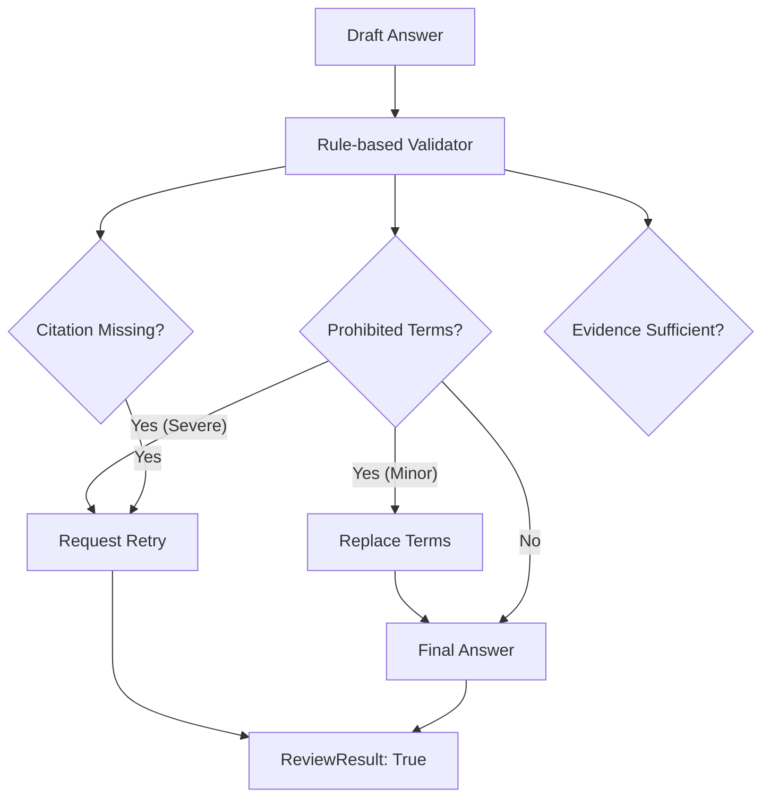

# Legal Review Agent (법률 검토 에이전트)

**최종 수정**: 2026-01-27 (Phase 8: gpt-4o 모델 업그레이드)

## 1. 개요 (Overview)

**Legal Review Agent**는 생성된 답변(Draft)이 사용자에게 전달되기 전에 마지막으로 검증하는 품질 관리자(Quality Assurance)입니다. 특히 법률 및 분쟁 조정이라는 민감한 도메인 특성상, **잘못된 법적 조언**이나 **근거 없는 주장(Hallucination)**을 차단하는 것이 핵심 목표입니다.

### 주요 책임
1.  **금지 표현 탐지 (Prohibited Check)**: 변호사법 위반 소지가 있거나("승소합니다", "반드시 ~해야 합니다"), 사용자에게 과도한 확신을 주는 단정적 표현을 걸러냅니다.
2.  **출처 확인 (Citation Check)**: 답변에 `[출처]` 표기가 포함되어 있는지 확인하여, 근거 기반의 답변인지를 검증합니다.
3.  **답변 정제 (Refinement)**: 경미한 위반 사항(예: "무조건" -> "일반적으로")은 자동으로 수정하여 답변 품질을 높입니다.
4.  **재생성 요청 (Retry Loop)**: 위반 사항이 심각하거나 수정이 불가능한 경우, Orchestrator에게 답변 재생성을 요청합니다.

---

## 2. 아키텍처 (Architecture)



---

## 3. 검토 규칙 (Review Rules)

### 3.1. 금지 표현 (Prohibited Patterns)
다음과 같은 유형의 표현을 엄격히 규제합니다.

| 유형 | 예시 표현 | 대체 표현 (Softening) |
|------|-----------|-----------------------|
| **법적 단정** | "무조건 승소합니다", "100% 받을 수 있습니다" | "승소 가능성이 있습니다", "요청해 볼 수 있습니다" |
| **의무 부과** | "반드시 ~해야 합니다" | "~하는 것이 좋습니다", "~할 수 있습니다" |
| **전문가 사칭** | "법률 전문가로서 말씀드리면" | (삭제 또는 "관련 정보에 따르면") |
| **불법/위법 단정** | "이것은 불법입니다" | "위법 소지가 있습니다" |

### 3.2. 출처 표시 (Citation)
답변 본문에 `[출처: ...]`, `관련 법령: ...`, `분쟁조정사례` 등의 키워드가 포함되어야 합니다. 검색 결과가 있는데도 출처가 없다면 **Hallucination**으로 간주하고 재생성을 요청합니다.

---

## 4. 코드 구조 (Code Structure)

### 파일 목록
- **`agent.py`**: 에이전트 진입점 (`review_node`). 규칙 기반 검토 로직(`PROHIBITED_PATTERNS`) 구현.
- **`llm_reviewer.py`**: LLM 기반 검토기. 복잡한 문맥 검토가 필요할 때 사용.
- **`reviewer_agent.py`**: 하이브리드 검토 시스템 (규칙 기반 + LLM).
- **`confidence_scorer.py`**: 답변 신뢰도 점수 계산.
- **`relevance_checker.py`**: 답변과 출처의 관련성 검증.
- **`metrics.py`**: 검토 통과율, 수정률 등의 지표 정의.

### 주요 함수
- `review_node(state)`: 초안을 검토하고 `ReviewResult`를 반환합니다.
- `_filter_prohibited_expressions(...)`: 정규식을 사용하여 금지 표현을 안전한 표현으로 치환합니다.

### 4.1 LLM 모델 설정 (Phase 8)

| 설정 | 값 | 환경변수 |
|------|-----|---------|
| 기본 모델 | gpt-4o | `MODEL_REVIEW_AGENT` |
| LLM 검토 활성화 | false (기본) | `ENABLE_LLM_REVIEW` |

```python
# 환경변수 설정 예시
MODEL_REVIEW_AGENT=gpt-4o
ENABLE_LLM_REVIEW=true  # LLM 2차 검토 활성화
```

**검토 흐름**:
1. **규칙 기반 검토** (항상 실행): `PROHIBITED_PATTERNS` 매칭
2. **LLM 검토** (선택적): `ENABLE_LLM_REVIEW=true` 시 gpt-4o로 문맥 검토

---

## 5. 테스트 방법 (Testing)

검토 에이전트 테스트는 다양한 위반 케이스(단정적 표현, 출처 누락 등)를 주입하고, 에이전트가 이를 올바르게 탐지하고 수정하는지 확인합니다. 총 20개 테스트.

### 주요 테스트 스크립트
- **`backend/scripts/testing/legal_review/test_review_logic.py`**: HybridLegalReviewer 및 규칙/LLM 기반 검토 로직 단위 테스트 (20개 테스트).

### 테스트 항목 상세

#### TestHybridLegalReviewerInit (4개 테스트)
HybridLegalReviewer 초기화 및 환경 변수 설정 검증

| 테스트 | 검증 내용 |
|--------|-----------|
| `test_init_default_llm_disabled` | 기본값: LLM 비활성화 (`ENABLE_LLM_REVIEW=false`) |
| `test_init_llm_enabled_via_env` | 환경 변수 `ENABLE_LLM_REVIEW=true` → LLM 활성화 |
| `test_init_explicit_enable_override` | 명시적 `enable_llm=True` 파라미터 우선 적용 |
| `test_init_explicit_disable_override` | 환경 변수 true여도 `enable_llm=False`면 비활성화 |

#### TestRuleBasedReview (5개 테스트)
규칙 기반 검토 로직 검증

| 테스트 | 검증 내용 |
|--------|-----------|
| `test_general_query_skips_review` | `query_type='general'` → 검토 생략, 바로 통과 |
| `test_clean_answer_passes` | 위반 없는 깨끗한 답변 → passed=True |
| `test_prohibited_expression_detected` | "반드시", "100%" 등 금지 표현 → passed=False, violations 포함 |
| `test_severe_violations_trigger_retry` | 심각한 위반 3개 이상 → retry_count 증가 |
| `test_max_retries_respected` | retry_count >= 2면 재시도 없이 최종 답변 반환 |

#### TestLLMBasedReview (4개 테스트)
LLM 기반 2차 검토 로직 검증

| 테스트 | 검증 내용 |
|--------|-----------|
| `test_llm_review_called_when_rule_passes` | 규칙 기반 통과 후 LLM 검토 호출 |
| `test_llm_review_skipped_on_severe_rule_violation` | 심각한 규칙 위반 시 LLM 검토 생략 (비용 절감) |
| `test_llm_issues_merged_into_violations` | LLM 발견 이슈 → violations에 `[LLM]` 태그로 병합 |
| `test_llm_failure_graceful_degradation` | LLM API 오류 시 규칙 기반 결과로 graceful 처리 |

#### TestMetrics (2개 테스트)
검토 지표 수집 및 리셋

| 테스트 | 검증 내용 |
|--------|-----------|
| `test_metrics_tracking` | LLM 호출 횟수, 총 지연시간 추적 |
| `test_metrics_reset` | `reset_metrics()` 호출 시 카운터 초기화 |

#### TestNodeFunctions (3개 테스트)
LangGraph 노드 함수 검증

| 테스트 | 검증 내용 |
|--------|-----------|
| `test_hybrid_review_node` | `hybrid_review_node(state)` 정상 동작 |
| `test_hybrid_review_node_wrapper_general` | `chat_type='general'` → 검토 우회 (Fast Path) |
| `test_hybrid_review_node_wrapper_dispute` | `chat_type='dispute'` → 정상 검토 수행 |

#### TestLLMReviewSystemPrompt (1개 테스트)
LLM 검토용 시스템 프롬프트 검증

| 테스트 | 검증 내용 |
|--------|-----------|
| `test_prompt_contains_required_sections` | 프롬프트에 '법적 단정', '전문가 사칭', '근거 없는 주장', 'JSON' 등 필수 섹션 포함 |

#### TestGetReviewer (1개 테스트)
싱글톤 패턴 검증

| 테스트 | 검증 내용 |
|--------|-----------|
| `test_singleton_pattern` | `get_reviewer()` 반복 호출 시 동일 인스턴스 반환 |

### 실행 방법
```bash
conda activate dsr
cd backend
pytest scripts/testing/legal_review/test_review_logic.py -v
```

### 최신 테스트 결과 (2026-01-22)
```
20 passed in 0.47s
```

모든 테스트 통과:
- **PASSED**: 20개
- **SKIP**: 0개
- **FAIL**: 0개

---

## 6. 변경 이력 (History)

| 날짜 | PR | 내용 |
|------|----|------|
| 2026-01-14 | **Sprint 1** | 초기 규칙 기반 검토 로직(`PROHIBITED_PATTERNS`) 구현. |
| 2026-01-22 | **PR 1** | Fast Path 도입. `chat_type='general'`인 경우 검토를 생략하는 `review_node_wrapper` 추가. |
| 2026-01-27 | **Phase 8** | Review Agent 모델 gpt-4o 업그레이드. `MODEL_REVIEW_AGENT` 환경변수 도입. |

---

## 7. 고도화 계획 (To-Be)

1.  **LLM-based Fact Checking**: 단순 키워드 매칭을 넘어, 답변의 내용이 검색된 근거 문서와 의미적으로 일치하는지 검증하는 모델 도입 (Self-Correction).
2.  **Context-aware Safety**: 대화 맥락을 고려하여 위험한 발언을 사전에 차단하는 Guardrail 강화.
