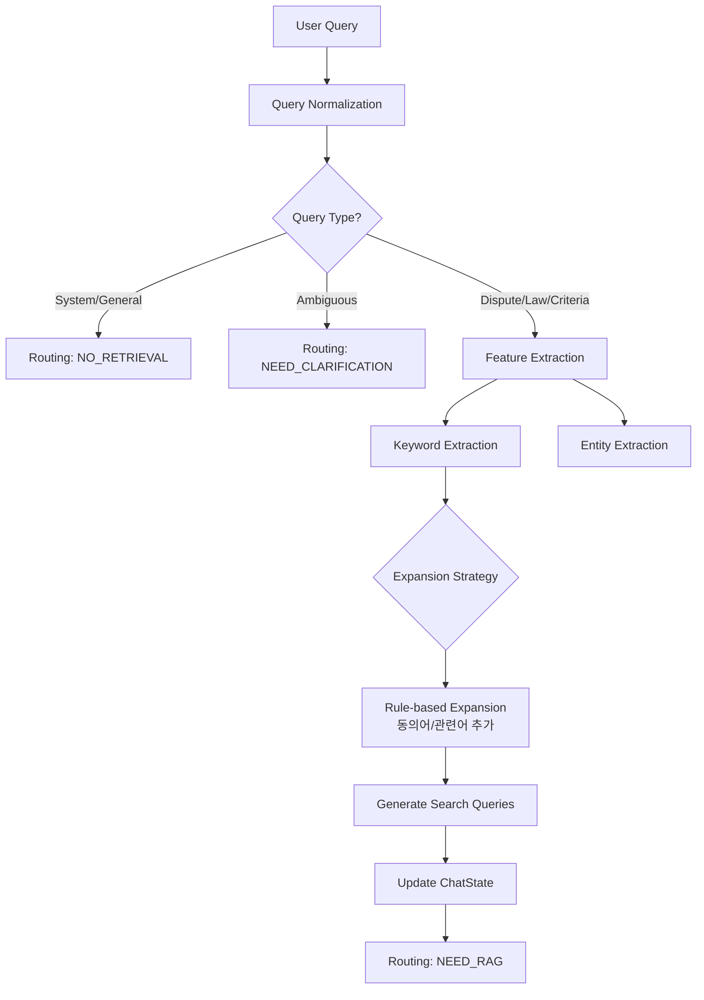

# Query Analysis Agent (질의 분석 에이전트)

**최종 수정**: 2026-01-28 (Phase 9: Conversation Phase 통합 반영)

## 1. 개요 (Overview)

**Query Analysis Agent**는 사용자의 자연어 입력을 시스템이 이해할 수 있는 구조화된 데이터로 변환하는 첫 번째 관문입니다. 사용자의 의도를 파악하여 RAG 검색이 필요한지 결정하고(Routing), 검색에 필요한 키워드를 추출하며, 불완전한 쿼리를 보완(Expansion/Rewrite)합니다.

### 주요 책임
1.  **의도 분류 (Intent Classification)**: 질문 유형을 `dispute`(분쟁), `law`(법령), `general`(일반), `system_meta`(시스템) 등으로 분류합니다.
2.  **라우팅 결정 (Routing)**: 분류 결과에 따라 검색을 수행할지(`NEED_RAG`), 바로 답변할지(`NO_RETRIEVAL`), 사용자에게 되물어야 할지(`NEED_USER_CLARIFICATION`) 결정합니다.
3.  **키워드 추출 (Keyword Extraction)**: 검색 엔진(Vector/Keyword Search)에 전달할 핵심 키워드를 추출합니다.
4.  **쿼리 확장 (Query Expansion)**: 동의어, 관련 법률 용어 등을 추가하여 재현율(Recall)을 높입니다.
5.  **엔티티 추출 (Entity Extraction)**: 구매 품목, 날짜, 금액 등 온보딩 정보를 추출합니다.

---

## 2. 아키텍처 (Architecture)



---

## 3. 코드 구조 (Code Structure)

```
backend/app/agents/query_analysis/
├── __init__.py              # 모듈 export
├── agent.py                 # 메인 에이전트 (query_analysis_node)
├── classifier.py            # 의도 분류 로직
├── classifiers.py           # 분류기 유틸리티
├── constants.py             # 상수 정의 (불용어, 키워드 등)
├── detectors.py             # 쿼리 패턴 감지
├── expanders.py             # 쿼리 확장 로직 (도메인별)
├── extractors.py            # 엔티티 추출 (슬롯 필링)
├── llm_classifier.py        # LLM 기반 분류
├── llm_expander.py          # LLM 기반 확장
├── metrics.py               # 품질 메트릭
├── tools.py                 # 유틸리티 함수
└── docs/                    # 추가 문서
```

### 주요 함수
- **`agent.py`**:
    - `query_analysis_node(state)`: LangGraph 노드 진입점.
    - `_classify_query_type(query)`: 정규식 및 키워드 기반 의도 분류.
    - `_extract_keywords(query)`: 불용어 제거 및 핵심어 추출.
    - `_expand_query_by_type(...)`: 질의 유형별 확장 로직 (HyDE/LLM Rewrite 포함).
    - `_check_missing_onboarding_fields(...)`: 필수 정보 누락 여부 확인.

### 주요 로직 설명

#### Hybrid Intent Classification
초기에는 Rule-base(정규식)로 빠르게 분류하고, 모호한 경우(Ambiguous)에는 LLM을 활용하거나 사용자에게 되묻는 하이브리드 방식을 사용합니다.
- **System Meta**: "너 누구야?" 같은 질문은 검색 없이 처리.
- **General**: "안녕" 같은 인사는 검색 없이 처리 (단, "소송", "환불" 등 특정 키워드 포함 시 RAG로 승격).

#### 쿼리 확장 (현재)

QueryAnalysisAgent가 LLM 기반 쿼리 확장 및 키워드 추출을 전담합니다.

**현재 역할**:
- 키워드 추출 및 동의어 확장 (규칙 기반 + LLM)
- 의도 분류 및 라우팅 결정
- 엔티티 추출 (구매 품목, 날짜, 금액)
- 도메인 특화 쿼리 확장 (`expanders.py` — 법률 용어, 분쟁 유형, 상황 요약)

---

## 4. 테스트 방법 (Testing)

이 에이전트에 대한 테스트 코드는 `backend/scripts/testing/query_analysis/` 디렉토리에 위치합니다.

### 주요 테스트 스크립트
- **`test_pr2_hybrid.py`**: 하이브리드 의도 분류 및 동의어 처리 로직
- **`test_classifier.py`**: 쿼리 분류기 단위 테스트
- **`test_intent_cache.py`**: 의도 분류 캐싱 검증
- **`test_ambiguous_queries.py`**: 모호한 쿼리 처리
- **`test_new_query_types.py`**: 신규 쿼리 유형 감지

### 실행 방법
```bash
# Conda 가상환경 활성화
conda activate dsr

# 테스트 실행
pytest backend/scripts/testing/query_analysis/test_pr2_hybrid.py -v
```

### 예상 출력
```text
test_pr2_hybrid.py::test_synonym_recognition PASSED  # 동의어 인식 확인
test_pr2_hybrid.py::test_definitional_query_is_general PASSED # 정의형 질문 분류 확인
...
```

---

## 5. 변경 이력 (History)

| 날짜 | PR | 내용 |
|------|----|------|
| 2026-01-14 | **PR 1** | 초기 아키텍처 구현. 기본적인 Rule-based 분류 로직 적용. |
| 2026-01-22 | **PR 2** | **Hybrid Query Analysis** 도입. 동의어 사전 확장, 정의형 질문 패턴 추가, Multi-Query Expansion 구현. |
| 2026-01-22 | **PR 3** | Data Collection Pipeline 연동을 위한 로그 스냅샷 구조(`query_analysis_v2`) 개선. |
| 2026-01-27 | **Phase 8** | Query Rewriter 모듈 아카이브. Phase 11에서 Pre-retrieval LLM 제거, QueryAnalysisAgent가 쿼리 확장 전담. |

---

## 6. Conversation Phase 통합 (Phase 9)

### 슬롯 추출 레이어

분쟁 상담 시 필요한 정보를 수집하기 위해 2단계 슬롯 추출을 수행합니다.

**Layer 1 (Rule-based)**: 비용 $0
- 정규식 기반 엔티티 추출 (구매 품목, 날짜, 금액)
- 분쟁 유형 키워드 매핑: `환불/반품/교환/수리/취소/해지/해약`
- 일반 제품명 사전 매칭 (COMMON_PRODUCTS)

**Layer 2 (LLM Fallback)**: gpt-4o-mini
- 필수 슬롯 누락 시에만 트리거
- 3초 타임아웃, JSON 스키마 강제
- 3-tier 폴백: EXAONE → gpt-4o-mini → OpenAI legacy

### ConversationManager 통합

```python
from ...supervisor.conversation_manager import (
    update_slots_and_phase,
    should_trigger_clarification,
    get_retriever_types_for_phase,
)

# 슬롯 업데이트 및 단계 전환
phase_updates = update_slots_and_phase(temp_state)

# 역질문 필요 시 모드 설정
if should_trigger_clarification({'conversation_phase': new_phase}):
    mode = 'NEED_USER_CLARIFICATION'

# 단계별 검색 대상 조정
retriever_types = get_retriever_types_for_phase(new_phase)
```

### 필수 슬롯

| 슬롯 | 필수 여부 | 설명 |
|------|----------|------|
| `purchase_item` | Required | 구매 품목/서비스 |
| `problem_details` | Required | 문제 상황 설명 |
| `dispute_type` | Optional | 환불/교환/수리/해지 |
| `purchase_date` | Optional | 구매 시기 |
| `purchase_place` | Optional | 구매처 |

### 슬롯 → 모드 매핑

```text
필수 슬롯 채움 → NEED_RAG (검색 진행)
필수 슬롯 누락 → NEED_USER_CLARIFICATION (역질문)
```

---

## 7. 고도화 계획 (To-Be)

1.  **Fine-tuned SLM 도입**: 현재의 Rule+LLM 방식을 Fine-tuned EXAONE 2.4B 모델로 완전히 대체하여 분류 정확도를 95% 이상으로 끌어올릴 예정입니다.
2.  **개인화된 쿼리 확장**: 사용자의 이전 대화 이력을 반영하여 쿼리를 확장하는 기능이 필요합니다.
