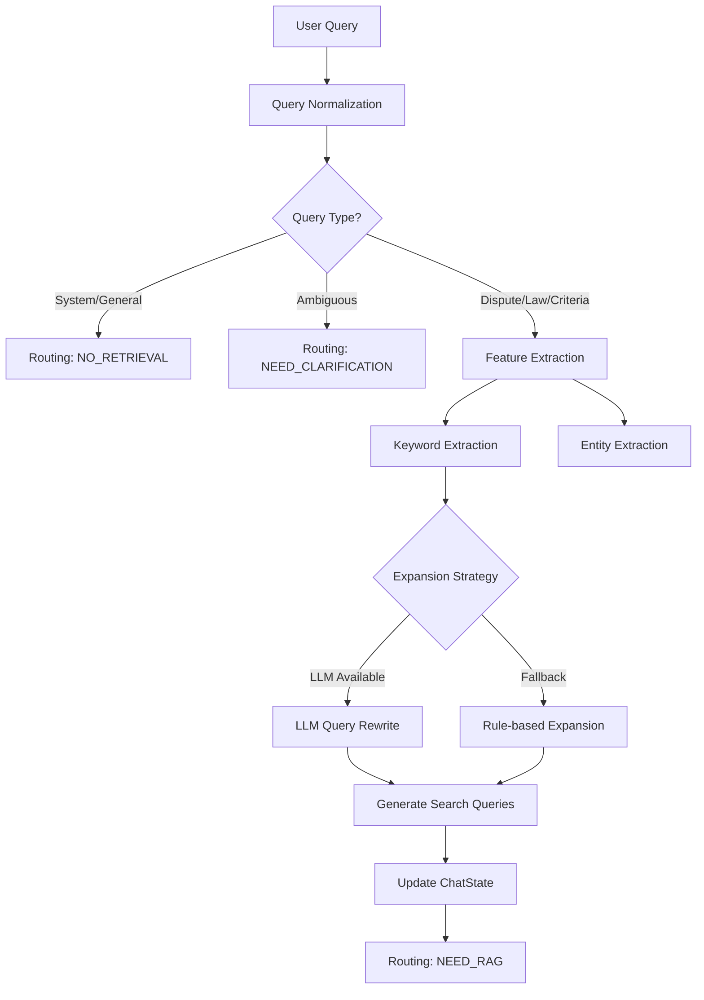

# Query Analysis Agent (질의 분석 에이전트)

## 1. 개요 (Overview)

**Query Analysis Agent**는 사용자의 자연어 입력을 시스템이 이해할 수 있는 구조화된 데이터로 변환하는 첫 번째 관문입니다. 사용자의 의도를 파악하여 RAG 검색이 필요한지 결정하고(Routing), 검색에 필요한 키워드를 추출하며, 불완전한 쿼리를 보완(Expansion/Rewrite)합니다.

### 주요 책임
1.  **의도 분류 (Intent Classification)**: 질문 유형을 `dispute`(분쟁), `law`(법령), `general`(일반), `system_meta`(시스템) 등으로 분류합니다.
2.  **라우팅 결정 (Routing)**: 분류 결과에 따라 검색을 수행할지(`NEED_RAG`), 바로 답변할지(`NO_RETRIEVAL`), 사용자에게 되물어야 할지(`NEED_USER_CLARIFICATION`) 결정합니다.
3.  **키워드 추출 (Keyword Extraction)**: 검색 엔진(Vector/Keyword Search)에 전달할 핵심 키워드를 추출합니다.
4.  **쿼리 확장 (Query Expansion)**: 동의어, 관련 법률 용어 등을 추가하여 재현율(Recall)을 높입니다.
5.  **엔티티 추출 (Entity Extraction)**: 구매 품목, 날짜, 금액 등 온보딩 정보를 추출합니다.

---

## 2. 아키텍처 (Architecture)



---

## 3. 코드 구조 (Code Structure)

- **`agent.py`**: 에이전트의 모든 로직이 포함된 메인 파일입니다.
    - `query_analysis_node(state)`: LangGraph 노드 진입점.
    - `_classify_query_type(query)`: 정규식 및 키워드 기반 의도 분류.
    - `_extract_keywords(query)`: 불용어 제거 및 핵심어 추출.
    - `_expand_query_by_type(...)`: 질의 유형별 확장 로직 (HyDE/LLM Rewrite 포함).
    - `_check_missing_onboarding_fields(...)`: 필수 정보 누락 여부 확인.

### 주요 로직 설명

#### Hybrid Intent Classification
초기에는 Rule-base(정규식)로 빠르게 분류하고, 모호한 경우(Ambiguous)에는 LLM을 활용하거나 사용자에게 되묻는 하이브리드 방식을 사용합니다.
- **System Meta**: "너 누구야?" 같은 질문은 검색 없이 처리.
- **General**: "안녕" 같은 인사는 검색 없이 처리 (단, "소송", "환불" 등 특정 키워드 포함 시 RAG로 승격).

#### Query Rewriting (S2-10)
복잡한 법률 용어나 구어체 질문을 검색에 용이한 형태로 변환합니다.
- **LLM Rewrite**: EXAONE 모델을 사용하여 문맥을 파악하고 재작성합니다.
- **Fallback**: LLM 호출 실패 시 규칙 기반으로 동의어를 추가합니다.

---

## 4. 테스트 방법 (Testing)

이 에이전트에 대한 테스트 코드는 `backend/scripts/testing/query_analysis/` 디렉토리에 위치합니다.

### 주요 테스트 스크립트
- **`test_pr2_hybrid.py`**: 하이브리드 의도 분류 및 동의어 처리 로직을 검증합니다.

### 실행 방법
```bash
# Conda 가상환경 활성화
conda activate dsr

# 테스트 실행
pytest backend/scripts/testing/query_analysis/test_pr2_hybrid.py -v
```

### 예상 출력
```text
test_pr2_hybrid.py::test_synonym_recognition PASSED  # 동의어 인식 확인
test_pr2_hybrid.py::test_definitional_query_is_general PASSED # 정의형 질문 분류 확인
...
```

---

## 5. 변경 이력 (History)

| 날짜 | PR | 내용 |
|------|----|------|
| 2026-01-14 | **PR 1** | 초기 아키텍처 구현. 기본적인 Rule-based 분류 로직 적용. |
| 2026-01-22 | **PR 2** | **Hybrid Query Analysis** 도입. 동의어 사전 확장, 정의형 질문 패턴 추가, Multi-Query Expansion 구현. |
| 2026-01-22 | **PR 3** | Data Collection Pipeline 연동을 위한 로그 스냅샷 구조(`query_analysis_v2`) 개선. |

---

## 6. 고도화 계획 (To-Be)

1.  **Fine-tuned SLM 도입**: 현재의 Rule+LLM 방식을 Fine-tuned EXAONE 2.4B 모델로 완전히 대체하여 분류 정확도를 95% 이상으로 끌어올릴 예정입니다.
2.  **개인화된 쿼리 확장**: 사용자의 이전 대화 이력을 반영하여 쿼리를 확장하는 기능이 필요합니다.
