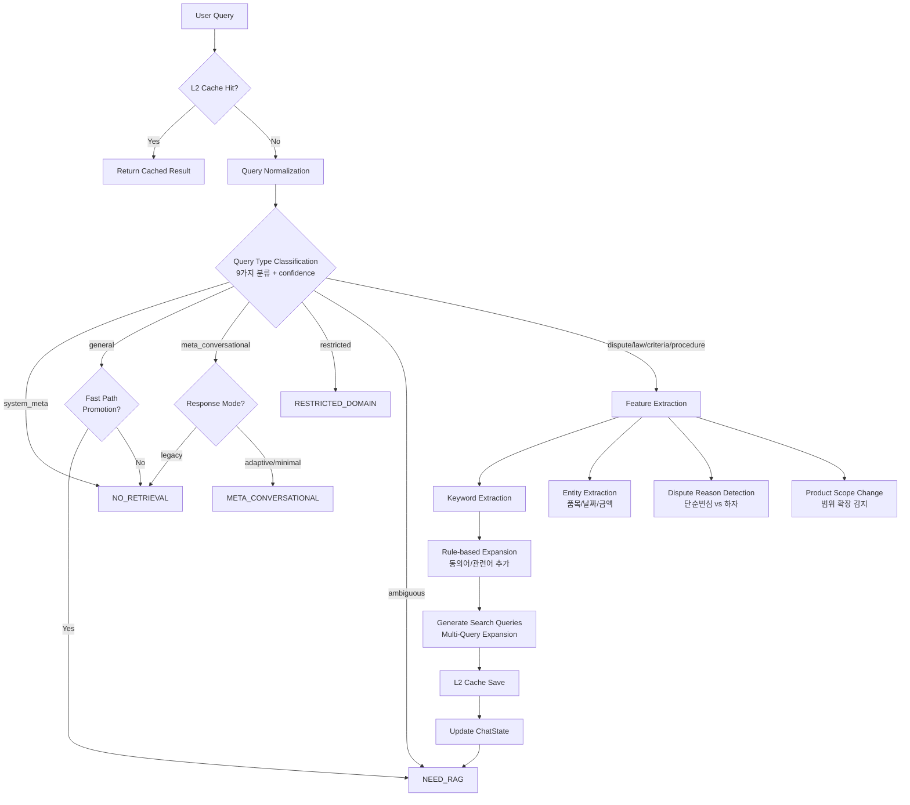
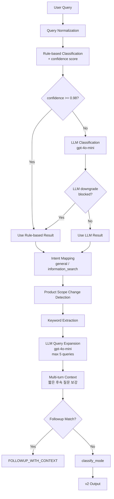

# Query Analysis Agent (질의분석 에이전트)

**최종 수정**: 2026-02-09

## 1. 개요 (Overview)

**Query Analysis Agent**는 사용자의 자연어 입력을 시스템이 이해할 수 있는 구조화된 데이터로 변환하는 첫 번째 관문입니다. 사용자의 의도를 파악하여 RAG 검색이 필요한지 결정하고(Routing), 검색에 필요한 키워드를 추출하며, 불완전한 쿼리를 보완(Expansion/Rewrite)합니다.

### 주요 책임

1.  **의도 분류 (Intent Classification)**: 질문 유형을 9가지 중 하나로 분류합니다.
2.  **라우팅 결정 (Routing)**: 분류 결과에 따라 6가지 라우팅 모드 중 하나를 결정합니다.
3.  **키워드 추출 (Keyword Extraction)**: 검색 엔진(Vector/Keyword Search)에 전달할 핵심 키워드를 추출합니다.
4.  **쿼리 확장 (Query Expansion)**: 동의어, 관련 법률 용어 등을 추가하여 재현율(Recall)을 높입니다.
5.  **엔티티 추출 (Entity Extraction)**: 구매 품목, 날짜, 금액 등 온보딩 정보를 추출합니다.
6.  **분쟁 사유 감지 (Dispute Reason Detection)**: 단순변심 vs 하자를 구분합니다.
7.  **제품 범위 변경 감지 (Product Scope Change Detection)**: 후속 질문에서 범위 확장/변경을 감지합니다.

### 질의 유형 (Query Types) - 9가지

| 유형 | 설명 | 예시 |
|------|------|------|
| `dispute` | 소비자 분쟁 상담 | "노트북 환불이 안 돼요" |
| `general` | 일반 대화, 인사, 정의형 질문 | "안녕", "환불이 뭐예요?" |
| `law` | 법령/법조항 정보 요청 | "소비자기본법 몇 조에요?" |
| `criteria` | 분쟁해결기준 정보 요청 | "세탁기 하자 시 보상 기준" |
| `procedure` | 절차/방법 질문 | "분쟁조정 어떻게 신청해요?" |
| `restricted` | 전문기관 도메인 (금융/의료/개인정보/부동산/건설) | "금융 분쟁 어떻게 해결하나요?" |
| `system_meta` | 시스템/봇 관련 질문 | "너 누구야?", "어떤 AI야?" |
| `ambiguous` | 맥락 없는 단순 요청, 의도 불명확 | "이거 뭐야", "도와줘" (단독) |
| `meta_conversational` | 서비스 이용 가이드 요청 | "뭘 물어봐야 할까?", "어떻게 시작해?" |

### 라우팅 모드 (RoutingMode) - 6가지

| 모드 | 설명 | 트리거 조건 |
|------|------|------------|
| `NO_RETRIEVAL` | 검색 없이 바로 답변 | `system_meta`, `general` (Fast Path 미승격), legacy 모드의 `meta_conversational` |
| `NEED_RAG` | RAG 파이프라인 필요 | `dispute`, `law`, `criteria`, `procedure`, `ambiguous`, Fast Path 승격된 `general` |
| `CACHED_RAG` | 캐시된 Retrieval 사용 (예약, 현재 미사용) | (reserved) |
| `RESTRICTED_DOMAIN` | 전문기관 안내 + 유사 사례 검색 | `restricted` 도메인 감지 시 |
| `META_CONVERSATIONAL` | 가이드 응답 생성 (RAG 없이) | `meta_conversational` (non-legacy response_mode에서만) |
| `FOLLOWUP_WITH_CONTEXT` | 이전 턴 후속 질문 매칭 (캐시 재사용) | 이전 턴의 followup_questions와 유사도 >= threshold |

---

## 2. 아키텍처 (Architecture)

### v1 (query_analysis_node) - 규칙 기반



### v2 (query_analysis_node_v2) - LLM 기반



---

## 3. 코드 구조 (Code Structure)

```
backend/app/agents/query_analysis/
├── __init__.py              # 모듈 export (모든 public API 재export)
├── agent.py                 # 메인 에이전트 노드 (v1 + v2 진입점)
├── classifier.py            # gpt-4o-mini Intent Classifier (Function Calling 기반)
├── classifiers.py           # 규칙 기반 쿼리 유형 분류, 라우팅 모드 결정
├── constants.py             # 상수 정의 (키워드, 패턴, 매핑, Feature Flags)
├── detectors.py             # 쿼리 패턴 감지 (도메인/모호함/시스템메타/메타대화/후속질문)
├── expanders.py             # 쿼리 확장 로직 (규칙 기반 + LLM v2 래퍼)
├── extractors.py            # 엔티티 추출, 키워드 추출, 정규화, 분쟁사유 감지
├── llm_classifier.py        # LLM Fallback 분류기 (Issue #3: Hybrid Intent)
├── llm_expander.py          # LLM 기반 쿼리 확장 (v2, gpt-4o-mini)
├── metrics.py               # 품질 평가 메트릭 (Precision/Recall/F1)
├── tools.py                 # 추가 질문 노드 (ask_clarification_node)
└── README.md                # 본 문서
```

### 주요 함수 및 클래스

#### `agent.py` - 메인 진입점

| 함수 | 설명 | 버전 |
|------|------|------|
| `query_analysis_node(state)` | LangGraph 동기 노드 (규칙 기반 확장) | v1 |
| `query_analysis_node_v2(state, config)` | LangGraph 비동기 노드 (LLM 기반 확장) | v2 |

#### `classifiers.py` - 분류 로직

| 함수/클래스 | 설명 |
|------------|------|
| `QueryType` | 9가지 질의 유형 Literal 타입 |
| `QueryComplexity` | 쿼리 복잡도 Enum (`SIMPLE` / `MODERATE` / `COMPLEX`) |
| `DISPUTE_COMPOUND_PATTERNS` | 분쟁 의도 복합 정규식 패턴 리스트 (confidence 포함) |
| `classify_query_type_with_confidence(query)` | 9가지 유형 분류 + confidence score 반환 |
| `classify_query_type(query)` | 위 함수의 backward-compatible wrapper (type만 반환) |
| `classify_mode(query_type, needs_clarification, query, ...)` | 6가지 RoutingMode 결정 |
| `classify_query_complexity(query)` | 쿼리 복잡도 분류 (SIMPLE/MODERATE/COMPLEX) |

#### `classifier.py` - LLM 기반 분류기 (PR-2)

| 클래스/함수 | 설명 |
|------------|------|
| `IntentClassificationResult` | 분류 결과 dataclass (`query_type`, `domain`, `agency`, `confidence`, `reasoning`, `from_cache`, `model_used`) |
| `IntentClassifier` | gpt-4o-mini Function Calling 기반 단일 분류기 |
| `HybridIntentClassifier` | Rule-based Fast Path + Redis Cache (L3) + LLM Fallback 3계층 분류기 |
| `get_intent_classifier()` | `HybridIntentClassifier` 싱글톤 반환 |
| `classify_intent(query, context)` | 편의 함수 (싱글톤 사용) |

#### `llm_classifier.py` - LLM Fallback (Issue #3)

| 함수/상수 | 설명 |
|----------|------|
| `llm_classify(query, timeout)` | gpt-4o-mini structured output (JSON mode)으로 의도 분류. `(query_type, confidence, reasoning)` 반환 |
| `FEW_SHOT_EXAMPLES` | Few-shot 프롬프트용 분류 예시 리스트 (14개) |
| `SYSTEM_PROMPT` | LLM 분류기 시스템 프롬프트 |

#### `llm_expander.py` - LLM 쿼리 확장 (v2)

| 함수 | 설명 |
|------|------|
| `expand_query_with_llm(query, keywords, max_queries, timeout)` | gpt-4o-mini 기반 다중 쿼리 확장 (비동기) |
| `expand_query_with_llm_sync(...)` | 위 함수의 동기 버전 |
| `expand_query_for_law_search(query, item, channel, dispute_type, keywords, timeout)` | 법령 검색 전용 쿼리 확장 (일상어 -> 법률 용어) |
| `expand_query_for_criteria_search(query, item, channel, dispute_type, keywords, timeout)` | 분쟁해결기준 검색 전용 쿼리 확장 |

#### `detectors.py` - 패턴 감지

| 함수 | 설명 |
|------|------|
| `is_system_meta_query(query)` | 시스템/봇 관련 질문 감지 |
| `is_meta_conversational(query)` | 대화형 안내 요청 감지 ("뭘 물어봐야 할까?") |
| `is_ambiguous_query(query)` | 하이브리드 모호 쿼리 감지 (Rule Layer 0~1 + LLM Layer 2) |
| `check_ambiguity_with_llm(query)` | LLM 기반 모호성 판단 (EXAONE Primary, gpt-4o-mini Fallback) |
| `is_procedure_query(query)` | 절차 안내 질문 감지 |
| `detect_restricted_domain(query)` | 전문기관 도메인 감지 (5개 도메인) |
| `should_promote_to_rag(query)` | General -> RAG Fast Path 승격 판단 |
| `is_followup_with_context(query, followups, threshold, previous_query)` | 후속 질문 매칭 (SequenceMatcher + 품목 변경 감지) |
| `detect_requested_detail_type(query, available_details)` | 후속 질문에서 요청된 상세 정보 유형 감지 (`laws`/`cases`/`criteria`/`procedure`/`full`) |

#### `extractors.py` - 정보 추출

| 함수/타입 | 설명 |
|----------|------|
| `DisputeReason` | 분쟁 사유 Literal 타입 (`simple_change_of_mind` / `defect` / `unknown`) |
| `PRODUCT_CATEGORY_MAP` | 품목 -> 카테고리 매핑 dict (8개 카테고리) |
| `normalize_query(query)` | 쿼리 정규화 + 대화 히스토리 방어 (`extract_user_question_from_conversation` 포함) |
| `extract_user_question_from_conversation(text)` | 대화 히스토리가 포함된 텍스트에서 실제 사용자 질문만 추출 |
| `extract_keywords(query)` | 불용어 제거 + 동의어 정규화 키워드 추출 (최대 10개) |
| `extract_info_from_message(query)` | 정규식 기반 엔티티 추출 (품목/날짜/금액/구매처/분쟁유형) |
| `extract_dispute_type(text)` | 분쟁 유형 추출 (refund/exchange/repair/cancellation/withdrawal) |
| `detect_dispute_reason(query)` | 분쟁 사유 감지: `simple_change_of_mind` / `defect` / `unknown` |
| `detect_product_scope_change(query, onboarding)` | 제품 범위 변경 감지 ("모니터 말고 전자제품으로") |
| `rewrite_query_for_scope_change(query, change)` | 범위 변경 시 쿼리 재작성 |
| `check_missing_onboarding_fields(chat_type, onboarding, extracted_info)` | 필수 정보 누락 확인 |
| `get_missing_fields_description(missing_fields, extracted_info)` | 누락 필드 설명 문자열 생성 |
| `determine_agency_hint(query)` | 분쟁조정 기관 추천 (KCA/ECMC/None) |
| `compute_days_since_purchase(date_str)` | 구매일로부터 경과 일수 계산 |
| `determine_product_category(item)` | 품목 카테고리 결정 |

#### `expanders.py` - 쿼리 확장

| 함수 | 설명 |
|------|------|
| `expand_query_by_type(query, query_type, onboarding, extracted_info, keywords)` | v1 규칙 기반 유형별 확장 |
| `generate_search_queries(original, expanded, keywords)` | v1 Multi-Query Expansion (최대 4개) |
| `create_synonym_variant_query(original, keywords)` | 동의어 변형 쿼리 생성 |
| `expand_query_with_llm_v2(query, keywords, intent, use_fallback)` | v2 LLM 기반 확장 래퍼 (최대 5개) |
| `generate_search_queries_v2_fallback(query, keywords)` | v2 규칙 기반 폴백 (LLM 실패 시) |
| `generate_search_queries_v2(original, expanded_queries, keywords)` | v2 다중 검색 쿼리 최종 정리 |

#### `tools.py` - 추가 질문 노드

| 함수 | 설명 |
|------|------|
| `ask_clarification_node(state)` | 추가 질문 노드 (누락 필드 안내 메시지 생성) |
| `_build_clarification_message(missing_fields, extracted_info)` | 누락 필드에 대한 추가 질문 메시지 생성 |
| `_extract_clarifying_questions(missing_fields)` | 누락 필드에서 질문 목록 추출 (최대 5개) |

#### `metrics.py` - 평가 메트릭

| 클래스/함수 | 설명 |
|------------|------|
| `QueryAnalysisEvalResult` | 단일 질의분석 평가 결과 dataclass |
| `QueryAnalysisMetrics` | 질의분석 에이전트 평가기 |
| `aggregate_query_analysis_results(results)` | 여러 평가 결과 집계 (query_type_accuracy, keyword_f1 등) |
| `calculate_set_precision(predicted, expected)` | 정밀도 계산 |
| `calculate_set_recall(predicted, expected)` | 재현율 계산 |
| `calculate_f1(precision, recall)` | F1 스코어 계산 |

---

## 4. 핵심 로직 상세 (Key Logic)

### 4.1 Hybrid Intent Classification

Rule-based 분류기와 LLM Fallback을 결합한 하이브리드 방식입니다.

**v1 (query_analysis_node)**: 규칙 기반만 사용
- `classify_query_type_with_confidence()` 호출
- confidence score를 로깅에 활용하지만 LLM fallback은 호출하지 않음

**v2 (query_analysis_node_v2)**: LLM Primary 방식
1. Rule-based 분류 수행 -> `(query_type, confidence)` 반환
2. confidence < 0.98이면 `llm_classify()` 호출 (gpt-4o-mini)
3. LLM이 specific type을 `general`로 다운그레이드하려 할 때, rule-based confidence >= 0.8이면 다운그레이드 차단
4. PROTECTED_TYPES: `{law, criteria, procedure, restricted}`

**분류 우선순위** (`classifiers.py` - `classify_query_type_with_confidence`):

```
1.  system_meta (0.95) - "너 누구야?" 패턴
2.  general (0.90) - 인사/감사 패턴 (GENERAL_PATTERNS)
3.  law (0.90) - 법률명 패턴 (\S+법)
4.  general/definitional (0.85) - "환불이 뭐예요?" 패턴 (DEFINITIONAL_PATTERNS)
5.  restricted (0.90) - 전문기관 도메인 키워드
6.  procedure (0.85) - 절차 안내 키워드
7.  law (0.80) - 법령 키워드 2개 이상
8.  criteria (0.80~0.90) - "분쟁조정기준" 명시 / 기준+제품명 / 키워드 2개 이상
9.  meta_conversational (0.90) - "뭘 물어봐야 할까?" 패턴
10. dispute compound (0.80~0.85) - DISPUTE_COMPOUND_PATTERNS 매칭
11. ambiguous (0.60) - 하이브리드 모호 감지 (is_ambiguous_query)
12. dispute (0.50) - 기본값 (LLM fallback 대상)
```

### 4.2 쿼리 확장 전략 (Query Expansion)

#### v1 규칙 기반 확장 (`expand_query_by_type`)

| 유형 | 확장 전략 |
|------|----------|
| `dispute` | `{품목} {동의어} 분쟁조정 피해구제 소비자` |
| `law` | `{쿼리} {법률명} 관련 조항 조문` |
| `criteria` | `{품목} 분쟁해결기준 교환 환불 수리 보상 기간` |
| `procedure` | `{쿼리} 분쟁조정 신청 절차 서류 기간 방법` |
| `restricted` | `{쿼리} {도메인 키워드} 분쟁 사례` |
| `system_meta` / `general` / `ambiguous` | 확장 없음 |

#### v2 LLM 기반 확장 (`expand_query_with_llm_v2`)

1. `general` 의도는 확장하지 않음
2. `llm_expander.expand_query_with_llm()` 호출 (gpt-4o-mini, timeout 3초)
3. LLM 실패 시 `generate_search_queries_v2_fallback()` 규칙 기반 폴백
4. 최대 5개 쿼리 반환 (원본 포함)

#### 법령 검색 전용 확장 (`expand_query_for_law_search`)

- 일상어 -> 법률 용어 매핑 (`LEGAL_TERM_MAPPING`)
- 상황 -> 관련 법률 매핑 (`SITUATION_TO_LAWS`)
- 조문 번호 직접 지정 패턴 감지 ("민법 756조" -> `["제756조", "민법 제756조", ...]`)

#### 분쟁해결기준 검색 전용 확장 (`expand_query_for_criteria_search`)

- 품목 -> 기준 카테고리 매핑 (`PRODUCT_TO_CRITERIA_CATEGORY`)
- 분쟁유형 -> 기준 키워드 매핑 (`DISPUTE_TYPE_TO_CRITERIA`)

### 4.3 L2 Redis 캐싱 (PR-6)

`QueryAnalysisCache`를 사용하여 동일 쿼리에 대한 분석 결과를 Redis에 캐싱합니다.

```python
# agent.py에서의 캐시 흐름 (v1 노드)
from ...supervisor.cache import QueryAnalysisCache

# 1. 캐시 조회
cached = QueryAnalysisCache.get(user_query)
if cached:
    return {"query_analysis": cached, "mode": cached["mode"], "_qa_cache_hit": True}

# 2. 분석 수행 후 캐시 저장
cache_data = dict(analysis_result)
cache_data["mode"] = mode
QueryAnalysisCache.set(user_query, cache_data)
```

- 세션 무관 캐싱 (쿼리 자체의 특성이므로)
- `_qa_cache_hit: True` 플래그로 캐시 적중 여부 추적

### 4.4 분쟁 사유 감지 (Dispute Reason Detection)

`detect_dispute_reason()` 함수가 사용자 쿼리에서 분쟁 사유를 분류합니다.

| 분쟁 사유 | 키워드 예시 | 설명 |
|----------|-----------|------|
| `simple_change_of_mind` | "단순변심", "마음에 안 들", "사이즈 안 맞" | 제품 하자 없이 환불/교환 원하는 경우 |
| `defect` | "하자", "불량", "고장", "파손", "작동 안" | 제품에 결함이 있는 경우 |
| `unknown` | (해당 키워드 없음) | 판단 불가 |

- 양쪽 키워드 모두 매칭 시 `defect` 우선 (법적 보호 더 강함)
- `constants.py`의 `SIMPLE_CHANGE_OF_MIND_KEYWORDS` (34개), `DEFECT_KEYWORDS` (43개) 사용

### 4.5 제품 범위 변경 감지 (Product Scope Change Detection)

`detect_product_scope_change()` 함수가 후속 질문에서 범위 확장/변경을 감지합니다.

**예**: "모니터 말고 전자제품으로 더 범위를 넓혀서"

**감지 로직**:
1. 부정 키워드 감지: "말고", "제외", "대신", "빼고"
2. 범위 확장 키워드 감지: "범위를 넓혀", "확장", "포괄"
3. 넓은 카테고리 키워드 감지: "전자제품" -> "전자기기", "가전" -> "가전제품"
4. 제외 품목 추출: onboarding의 `purchase_item` 또는 `COMMON_PRODUCTS` 매칭

**반환 구조**:
```python
{
    "should_ignore_product_filter": bool,   # 기존 제품 필터 무시 여부
    "expanded_category": Optional[str],     # 확장된 카테고리
    "negated_items": List[str]              # 제외하려는 품목들
}
```

범위 변경 감지 시 `rewrite_query_for_scope_change()`로 쿼리를 재작성하여 벡터 검색이 더 다양한 결과를 반환하도록 합니다.

### 4.6 Adaptive RAG (쿼리 복잡도 분류)

`classify_query_complexity()` 함수가 쿼리 복잡도를 3단계로 분류합니다.

| 복잡도 | 조건 | 검색 전략 |
|--------|------|----------|
| `SIMPLE` | 단어 수 <= 5 | BM25 위주 검색 (HyDE 생략) |
| `MODERATE` | 나머지 | HyDE + RRF 기본 검색 |
| `COMPLEX` | 단어 수 >= 15 또는 복합 문장 구조 | HyDE + RRF + 확장 검색 |

**복합 문장 구조 패턴** (단어 수보다 우선 적용):
- `~인데/했는데/됐는데/거든요 + 가능/해줘/되나/어떻게`
- `구매/주문/결제 + 후/지난 + 불량/하자/파손/고장`
- `거부/무시/연락 + 어떻게/방법/도움`

---

## 5. 설정 (Configuration)

### Feature Flags (`constants.py`)

| 플래그 | 기본값 | 설명 |
|--------|-------|------|
| `ENABLE_FAST_PATH_PROMOTION` | `true` | General -> RAG 승격 기능 활성화 |
| `ENABLE_AMBIGUOUS_DETECTION` | `true` | 모호 쿼리 감지 기능 활성화 |
| `LLM_AMBIGUITY_CHECK_MAX_LENGTH` | `30` | LLM 모호성 판단 최대 쿼리 길이 (자) |

### Query Type -> Retriever 매핑 (`QUERY_TYPE_TO_RETRIEVERS`)

| Query Type | Retrievers |
|------------|-----------|
| `dispute` | `["law", "criteria", "case", "counsel"]` |
| `law` | `["law"]` |
| `criteria` | `["criteria"]` |
| `procedure` | `["law", "criteria"]` |
| `restricted` | `["case"]` |
| `ambiguous` | `["law", "criteria"]` |
| `general` | `[]` (검색 불필요) |
| `system_meta` | `[]` (검색 불필요) |
| `meta_conversational` | `[]` (검색 불필요 - 가이드 응답만) |

### Restricted Domain (전문기관 도메인) - 5개

| 도메인 | 전문기관 | 상위 기관 | 연락처 |
|--------|---------|----------|--------|
| `finance` | 금융분쟁조정위원회 | 금융감독원 | 1332 |
| `medical` | 의료분쟁조정위원회 | 한국의료분쟁조정중재원 | 1670-2545 |
| `privacy` | 개인정보분쟁조정위원회 | 개인정보보호위원회 | 1833-6972 |
| `realestate` | 임대차분쟁조정위원회 | 한국부동산원 | 1644-2828 |
| `construction` | 건설분쟁조정위원회 | 국토교통부 | 1599-0001 |

### 슬롯 필드

| 슬롯 | 필수 여부 | 설명 |
|------|----------|------|
| `purchase_item` | Required | 구매 품목/서비스 |
| `dispute_details` | Required | 문제 상황 설명 |
| `purchase_date` | Optional | 구매 시기 |
| `purchase_place` | Optional | 구매처 |
| `purchase_amount` | Optional | 구매 금액 |

---

## 6. 테스트 (Testing)

테스트 코드는 `backend/scripts/testing/query_analysis/` 디렉토리에 위치합니다.

### 주요 테스트 스크립트

| 파일 | 설명 |
|------|------|
| `test_pr2_hybrid.py` | 하이브리드 의도 분류 및 동의어 처리 로직 |
| `test_classifier.py` | 쿼리 분류기 단위 테스트 |
| `test_classifier_coverage.py` | 분류기 커버리지 확장 테스트 |
| `test_intent_cache.py` | 의도 분류 캐싱 검증 |
| `test_ambiguous_queries.py` | 모호한 쿼리 처리 |
| `test_new_query_types.py` | 신규 쿼리 유형 감지 (meta_conversational 등) |
| `conftest.py` | 테스트 픽스처 |

### 실행 방법

```bash
# 전체 query_analysis 테스트 실행
conda run -n dsr pytest backend/scripts/testing/query_analysis/ -v

# 특정 테스트 파일 실행
conda run -n dsr pytest backend/scripts/testing/query_analysis/test_pr2_hybrid.py -v

# 특정 테스트 함수 실행
conda run -n dsr pytest backend/scripts/testing/query_analysis/test_classifier.py::test_function_name -v

# Unit 테스트만 실행 (DB 불필요)
conda run -n dsr pytest backend/scripts/testing/query_analysis/ -m unit -v
```

---

## 7. 타입 정의 (Type References)

### RoutingMode (`backend/app/supervisor/state/control.py`)

```python
RoutingMode = Literal[
    "NO_RETRIEVAL",
    "NEED_RAG",
    "CACHED_RAG",
    "RESTRICTED_DOMAIN",
    "META_CONVERSATIONAL",
    "FOLLOWUP_WITH_CONTEXT",
]
```

### QueryType (`classifiers.py`)

```python
QueryType = Literal[
    "dispute", "general", "law", "criteria", "procedure",
    "restricted", "system_meta", "ambiguous", "meta_conversational",
]
```

### QueryComplexity (`classifiers.py`)

```python
class QueryComplexity(str, Enum):
    SIMPLE = "simple"
    MODERATE = "moderate"
    COMPLEX = "complex"
```

### DisputeReason (`extractors.py`)

```python
DisputeReason = Literal["simple_change_of_mind", "defect", "unknown"]
```

### IntentClassificationResult (`classifier.py`)

```python
@dataclass
class IntentClassificationResult:
    query_type: QueryType
    domain: Optional[RestrictedDomain]   # "finance" | "medical" | "privacy" | "realestate" | "construction"
    agency: Optional[Agency]             # "KCA" | "ECMC"
    confidence: float
    reasoning: str
    from_cache: bool
    model_used: str
```

### QueryAnalysisEvalResult (`metrics.py`)

```python
@dataclass
class QueryAnalysisEvalResult:
    item_id: str
    query: str
    category: str
    query_type_correct: bool
    predicted_query_type: str
    expected_query_type: str
    keyword_precision: float
    keyword_recall: float
    keyword_f1: float
    # ... (agency_hint, missing_field 평가 포함)
```

---

## 8. 변경 이력 (History)

| 날짜 | PR/Phase | 내용 |
|------|----------|------|
| 2026-01-14 | **PR-1** | 초기 아키텍처 구현. 기본적인 Rule-based 분류 로직 적용. |
| 2026-01-22 | **PR-2** | **Hybrid Query Analysis** 도입. 동의어 사전 확장, 정의형 질문 패턴 추가, Multi-Query Expansion 구현. Selective Retrieval (`QUERY_TYPE_TO_RETRIEVERS`) 추가. |
| 2026-01-22 | **PR-3** | Data Collection Pipeline 연동을 위한 로그 스냅샷 구조 개선. |
| 2026-01-27 | **Phase 8** | Query Rewriter 모듈 아카이브 (별도 모듈로 분리되어 있던 것을 질의분석 에이전트가 쿼리 확장 전담). |
| 2026-01-28 | **Phase 9** | Clarification 로직 제거. `NEED_USER_CLARIFICATION` 모드 삭제. 모호 쿼리는 `NEED_RAG`로 라우팅. KCDRC 분류 제거 (콘텐츠 분쟁 KCA 통합). |
| 2026-01-28 | **Issue #3** | **LLM Fallback Classifier** 추가 (`llm_classifier.py`). Rule-based confidence가 낮을 때 gpt-4o-mini structured output으로 분류. `meta_conversational` 쿼리 유형 추가. |
| 2026-01-28 | **PR-6** | **L2 Redis 캐싱** 추가 (`QueryAnalysisCache`). 동일 쿼리 분석 결과 재사용. |
| 2026-01-28 | **v2** | **LLM 기반 쿼리 확장** 추가 (`llm_expander.py`). gpt-4o-mini 다중 쿼리 확장, 법령/기준 전용 확장 함수. `query_analysis_node_v2` 비동기 노드 추가. |
| 2026-01-28 | **PR-7** | General 채팅에서 분쟁 의도 키워드 Safety Net 추가 (`DISPUTE_INTENT_KEYWORDS`). |
| 2026-01-28 | **리팩토링** | 모듈 분할 (`constants`, `detectors`, `classifiers`, `extractors`, `expanders`). |

---

## 9. 고도화 계획 (To-Be)

1.  **Fine-tuned SLM 도입**: 현재의 Rule+LLM 방식을 Fine-tuned EXAONE 2.4B 모델로 완전히 대체하여 분류 정확도를 95% 이상으로 끌어올릴 예정입니다.
2.  **개인화된 쿼리 확장**: 사용자의 이전 대화 이력을 반영하여 쿼리를 확장하는 기능이 필요합니다.
3.  **Multi-turn Context 강화**: 대화 이력 기반 의도 추론 정확도 향상.

---

## 10. 참고 자료 (References)

- **상위 시스템**: [`backend/app/supervisor/`](../../../supervisor/) - MAS Supervisor (LangGraph 오케스트레이션)
- **상태 스키마**: [`backend/app/supervisor/state/`](../../../supervisor/state/) - `ChatState`, `RoutingMode`, `QueryAnalysisResult`
- **캐시 모듈**: [`backend/app/supervisor/cache.py`](../../../supervisor/cache.py) - `QueryAnalysisCache`, `IntentClassificationCache`
- **검색 에이전트**: [`backend/app/agents/retrieval/`](../retrieval/) - 법령/기준/사례 검색 에이전트
- **답변 생성**: [`backend/app/agents/answer_generation/`](../answer_generation/) - LLM 답변 생성 에이전트
