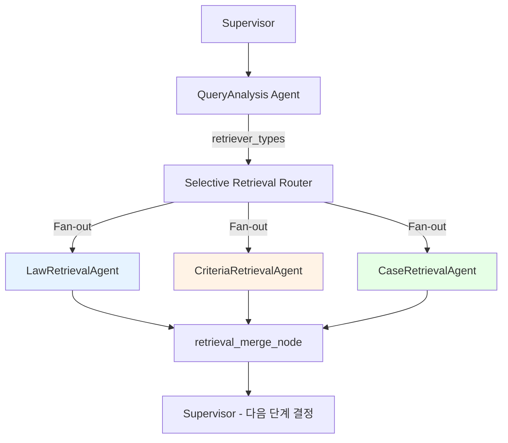

# Retrieval Agent (정보검색 에이전트)

**최종 수정**: 2026-07-05

> **변형 맥락**: 이 검색 에이전트는 **variant A/A-hub**의 spoke로, 활성 MAS 그래프(`app/supervisor/`)는 **law/criteria/case 3개**를 Fan-out 병렬 실행합니다(`counsel`은 구현·export됐으나 그래프 노드로는 미등록 — 아래 §Graph 디스패치 현황 참조). 검색은 코드가 `UnifiedRetriever`를 **무조건 호출**합니다(LLM tool-calling 아님). **variant B**(ReAct)는 자체 도구(`search_consumer_disputes`, `get_law_article`, `get_case_detail`, `verify_citation`)를 LLM이 자율 호출합니다. 전체 비교: [변형 시스템 아키텍처](../../../../docs/architecture/2026-07-05-variant-system-architecture.md).

## 1. 개요 (Overview)

**Retrieval Agent**는 사용자의 질문에 답변하기 위해 필요한 근거(Evidence)를 PostgreSQL + pgvector 데이터베이스에서 찾아오는 역할을 합니다.

### Agent 구조

MAS Supervisor 아키텍처에서 **4개의 전문 Agent**가 구현되어 있습니다:

| Agent | 데이터 | Retriever | 특화 기능 |
|-------|--------|-----------|----------|
| **LawRetrievalAgent** | 법령 (법률, 시행령) | `LawRetriever` (specialized) | 조문 번호 직접 검색, LLM 쿼리 확장, 삭제 조문 필터링 |
| **CriteriaRetrievalAgent** | 분쟁해결기준 (행정규칙, 별표) | `CriteriaRetriever` (specialized) | 키워드 추출, 계층 확장 (부모/조건/하위), LLM 쿼리 확장 |
| **CaseRetrievalAgent** | 분쟁조정사례 (조정/해결) | `UnifiedRetriever` (SQL RRF) | `dataset_filter='case'` 도메인 필터 |
| **CounselRetrievalAgent** | 상담사례 (상담) | `UnifiedRetriever` (SQL RRF) | `dataset_filter='case'`, `category_filter='상담'` |

> **Graph 디스패치 현황**: MAS Graph (`graph_mas.py`)에서는 현재 **Law, Criteria, Case 3개 Agent만** Fan-out 디스패치됩니다. `CounselRetrievalAgent`는 완전히 구현되어 `__init__.py`에서 export되며, `registry.py`를 통한 동적 선택도 가능하지만, Graph 노드로는 아직 등록되지 않았습니다.

### 주요 책임

1. **전문화된 검색**: 각 Agent가 담당 데이터 유형에 최적화된 검색 수행
2. **병렬 실행**: LangGraph Fan-out/Fan-in으로 Agent 동시 실행
3. **결과 병합**: `retrieval_merge_node`에서 Agent 결과를 통합
4. **메타데이터 구성**: 답변 생성 시 인용(Citation)에 사용할 출처 정보 구조화

---

## 2. 아키텍처 (Architecture)

### 2.1 MAS Supervisor 내 Retrieval 흐름



> `CounselRetrievalAgent`는 구현 완료되었으나 현재 Graph 노드에 미등록

### 2.2 Two-Tier Retriever 아키텍처

검색 구현은 **두 계층**으로 나뉩니다:

#### Tier 1: SQL-Level RRF (UnifiedRetriever)
- **사용 Agent**: `CaseRetrievalAgent`, `CounselRetrievalAgent`
- **구현**: PostgreSQL `search_hybrid_rrf()` 함수 직접 호출
- **특징**: BM25 + Vector + RRF가 SQL 레벨에서 처리됨
- **장점**: 빠른 성능, 데이터베이스 최적화 활용
- **필터링**: `_get_search_filters()`로 도메인별 필터만 지정

```python
# CaseRetrievalAgent 예시
def _get_search_filters(self, metadata_filter=None):
    return {"dataset_filter": "case"}

# CounselRetrievalAgent 예시
def _get_search_filters(self, metadata_filter=None):
    return {"dataset_filter": "case", "category_filter": "상담"}
```

#### Tier 2: Python-Level RRF (Specialized Retrievers)
- **사용 Agent**: `LawRetrievalAgent`, `CriteriaRetrievalAgent`
- **구현**: `specialized_retrievers.py` -> `RDSInternalRetriever.search_hybrid_rrf_2()`
- **특징**: Python 레벨에서 다중 쿼리 RRF Fusion + 도메인별 추가 로직
- **추가 기능**:
  - **Law**: 직접 조문 검색 (`chunk_id LIKE` 매칭), 삭제 조문 필터링, LLM 쿼리 확장 (EXAONE 2.4B)
  - **Criteria**: 키워드 추출 (RRF 오염 방지), 계층 확장 (부모/조건/하위 청크), LLM 쿼리 확장 (EXAONE 2.4B)

### 2.3 클래스 계층 구조

```
BaseAgent (app/agents/base.py)
    |
    +-- BaseRetrievalAgent (base_retrieval_agent.py)
            |
            +-- LawRetrievalAgent (law_agent.py)
            |       +-> _execute_search() 오버라이드
            |           -> LawRetriever (specialized_retrievers.py) -> Python RRF
            |
            +-- CriteriaRetrievalAgent (criteria_agent.py)
            |       +-> _execute_search() 오버라이드
            |           -> CriteriaRetriever (specialized_retrievers.py) -> Python RRF
            |
            +-- CaseRetrievalAgent (case_agent.py)
            |       +-> _get_search_filters() 오버라이드
            |           -> UnifiedRetriever (unified_retriever.py) -> SQL RRF
            |
            +-- CounselRetrievalAgent (counsel_agent.py)
                    +-> _get_search_filters() 오버라이드
                        -> UnifiedRetriever (unified_retriever.py) -> SQL RRF
```

---

## 3. 코드 구조 (Code Structure)

```
backend/app/agents/retrieval/
+-- __init__.py                    # 4개 Agent + Base export
|     export: BaseRetrievalAgent, LawRetrievalAgent, law_retrieval_agent,
|             CriteriaRetrievalAgent, criteria_retrieval_agent,
|             CaseRetrievalAgent, case_retrieval_agent,
|             CounselRetrievalAgent, counsel_retrieval_agent
|
+-- base_retrieval_agent.py        # BaseRetrievalAgent 공통 베이스
|     class: BaseRetrievalAgent(BaseAgent)
|     functions: _get_db_config(), process(), _get_search_filters(),
|                _execute_search(), _format_results(), _build_sources()
|
+-- law_agent.py                   # LawRetrievalAgent (법령 검색, LLM 확장)
|     class: LawRetrievalAgent(BaseRetrievalAgent)
|     functions: _execute_search(), _expand_for_law_search(),
|                _format_results(), _build_sources()
|     singleton: law_retrieval_agent
|
+-- criteria_agent.py              # CriteriaRetrievalAgent (기준 검색, 계층 확장)
|     class: CriteriaRetrievalAgent(BaseRetrievalAgent)
|     functions: _execute_search(), _extract_keywords_from_query(),
|                _expand_for_criteria_search(), _format_results(), _build_sources()
|     singleton: criteria_retrieval_agent
|
+-- case_agent.py                  # CaseRetrievalAgent (분쟁조정사례)
|     class: CaseRetrievalAgent(BaseRetrievalAgent)
|     functions: _get_search_filters(), _format_results(), _build_sources()
|     singleton: case_retrieval_agent
|
+-- counsel_agent.py               # CounselRetrievalAgent (상담사례)
|     class: CounselRetrievalAgent(BaseRetrievalAgent)
|     functions: _get_search_filters(), _format_results(), _build_sources()
|     singleton: counsel_retrieval_agent
|
+-- registry.py                    # Agent 클래스 동적 선택 (v2 파이프라인 지원)
|     functions: _use_v2(), get_case_agent_class(), get_counsel_agent_class()
|     env: USE_INTENT_PIPELINE_V2 (0/1)
|
+-- sufficiency.py                 # 검색 결과 충분성 판단
|     class: RetrievalSufficiencyChecker
|     dataclass: SufficiencyResult(confidence, is_sufficient, level, reason, clarifying_questions)
|     method: evaluate() - RRF top-k 방식 (결과 0건이면 insufficient, 1건 이상이면 sufficient)
|
+-- trace.py                       # 검색 추적/로깅
|     dataclass: RetrieverStep, RetrievalTrace
|     class: TraceContext (start/current/end)
|     decorator: trace_retriever() - 검색 단계별 소요 시간/결과 수 기록
|     env: ENABLE_RETRIEVAL_TRACE (true/false)
|
+-- metrics.py                     # 검색 품질 메트릭
|     class: RetrievalMetrics(k=3)
|     dataclass: SectionMetrics, EvaluationResult
|     functions: calculate_ndcg(), calculate_mrr(), calculate_precision_at_k(),
|                calculate_recall(), calculate_hit_rate(), calculate_domain_accuracy(),
|                aggregate_results()
|
+-- services/                      # 외부 서비스 연동
|   +-- __init__.py
|   +-- embedding_server.py        # 임베딩 서버 (FastAPI + SentenceTransformer)
|         model: nlpai-lab/KURE-v1 (기본), jhgan/ko-sroberta-multitask (fallback)
|         endpoints: POST /embed, GET /health
|         env: EMBEDDING_MODEL_NAME, PORT (9001)
|
+-- tools/                         # 검색 도구 구현체
|   +-- unified_retriever.py       # UnifiedRetriever: SQL search_hybrid_rrf() (Tier 1)
|   |     class: UnifiedRetriever
|   |     functions: search(), search_multi(), _create_embedding(),
|   |                _execute_rrf_search(), _to_search_results()
|   |     helpers: determine_rrf_k(), adaptive_similarity_threshold(), filter_by_threshold()
|   |
|   +-- specialized_retrievers.py  # LawRetriever, CriteriaRetriever: Python RRF (Tier 2)
|   |     class: LawRetriever
|   |       functions: hybrid_search(), direct_search_by_article_number(),
|   |                  search_by_article(), search_two_stage()
|   |     class: CriteriaRetriever
|   |       functions: hybrid_search(), fetch_chunk_texts(),
|   |                  search_by_category(), search_two_stage()
|   |     class: CaseRetriever (DocumentLevelResult 기반 문서 수준 유사도)
|   |     class: AgencyClassifier (추천 기관 분류: KCA/ECMC/KCDRC)
|   |     class: StructuredRetriever (4개 섹션 통합 검색기)
|   |
|   +-- rds_internal_retriever.py  # RDSInternalRetriever: DB stored function 호출
|   |     dataclass: SimilarChunkResult
|   |     class: RDSInternalRetriever
|   |       functions: embed_query(), dense_search(), hybrid_search(),
|   |                  search_with_keywords(), bm25_search(),
|   |                  hybrid_rrf_search(), search_hybrid_rrf_2()
|   |     convenience: search_hybrid_rrf_2() (모듈 레벨 함수)
|   |
|   +-- retriever.py               # SearchResult dataclass (현역) + [LEGACY] RAGRetriever
|   |     dataclass: SearchResult (chunk_id, doc_id, content, similarity, rrf_score, ...)
|   |     functions: _to_category_path(), _map_vector_chunks_doc_type()
|   |     class: RAGRetriever [LEGACY]
|   |
|   +-- embedding_client.py        # OpenAI text-embedding-3-large (1536d) 클라이언트
|   |     class: EmbeddingClient (embed, embed_query, embed_batch)
|   |     class: EmbeddingAdapter (EmbeddingClient 래퍼)
|   |     constant: EMBEDDING_DIMENSIONS = 1536
|   |
|   +-- rds_retriever.py           # RDS 검색기
|   +-- base.py                    # [LEGACY] Document dataclass, BaseRetriever ABC
|   +-- hybrid_retriever.py        # [LEGACY] HybridRetriever
|   +-- hyde.py                    # [LEGACY] HyDE (Hypothetical Document Embeddings)
|
+-- agent.py                       # [LEGACY] 통합 Retrieval 에이전트 (Phase 7에서 4개 전문 Agent로 대체)
```

---

## 4. 핵심 로직 상세 (Key Logic)

### 4.1 Agent별 검색 파이프라인

#### LawRetrievalAgent (Tier 2: Python RRF)

`_execute_search()`를 완전 오버라이드하여 `LawRetriever`를 직접 사용합니다.

```
Input: user_query + task_input(expanded_queries, metadata_filter)
  |
1. 조문 번호 직접 검색 (regex 패턴: "제N조" -> chunk_id LIKE 매칭)
  | (direct_results 발견 시 최우선 스코어 10.0 부여)
2. LLM 쿼리 확장 (EXAONE 2.4B via expand_query_for_law_search)
   "환불" -> "청약철회", "전자상거래법 제17조"
  |
3. 다중 쿼리 Hybrid RRF 검색 (최대 6개 쿼리)
   각 쿼리 -> LawRetriever.hybrid_search()
           -> RDSInternalRetriever.search_hybrid_rrf_2()
  |
4. Python-level RRF Fusion
   fused_scores[chunk_id] += 1.0 / (rrf_k + rank)
   direct_results 스코어 보존 (오버라이드 방지)
  |
5. 후처리
   - 삭제 조문 필터링 (regex: "()*삭제\s*<")
   - 동일 조문(article_key) 최대 2건 제한
  |
Output: List[SimilarChunkResult] (top_k건)
```

#### CriteriaRetrievalAgent (Tier 2: Python RRF)

`_execute_search()`를 완전 오버라이드하여 `CriteriaRetriever`를 직접 사용합니다.

```
Input: user_query + task_input(expanded_queries, metadata_filter)
  |
1. 키워드 추출 (_extract_keywords_from_query)
   우선순위: metadata.item -> COMMON_PRODUCTS 매칭 -> 명사 추출 (조사 제거)
   "종묘에 관련된 분쟁이 생겼을 때" -> "종묘"
  |
2. 검색 전략 결정
   - 키워드 추출 성공 -> 키워드 단독 검색 (RRF 오염 방지)
   - 키워드 추출 실패 -> 다중 쿼리 (원본 + LLM 확장 + expanded, 최대 6개)
  |
3. LLM 쿼리 확장 (EXAONE 2.4B via expand_query_for_criteria_search)
   "노트북 고장" -> "컴퓨터 하자", "전자제품 수리 기준"
  |
4. Hybrid RRF 검색
   CriteriaRetriever.hybrid_search()
   -> RDSInternalRetriever.search_hybrid_rrf_2()
   -> filter_document_type=["행정규칙", "별표"]
  |
5. Python-level RRF Fusion
  |
6. 계층 확장 (부모/조건/하위 chunk 조합)
   - 하위(grandchild) chunk: [부모] + [조건] + [하위] 합성
   - 조건(child) chunk: [부모] + [조건] 합성
   - 동적 길이 배분 (최대 1000자, 하위->조건->부모 순 우선)
  |
Output: List[SimilarChunkResult] (top_k건)
```

#### CaseRetrievalAgent (Tier 1: SQL RRF)

Base `_execute_search()`를 그대로 사용하고, `_get_search_filters()`만 오버라이드합니다.

```
Input: user_query + task_input(expanded_queries)
  |
1. 도메인 필터: dataset_filter='case'
  |
2. expanded_queries 유무에 따라 분기:
   - 2개 이상 -> UnifiedRetriever.search_multi() (Python-level RRF 추가)
   - 1개 이하 -> UnifiedRetriever.search() (단일 쿼리)
  |
3. SQL search_hybrid_rrf() 호출
   - BM25 (text_tsv + JSONB metadata ILIKE) + Vector (cosine)
   - RRF Fusion at SQL level
   - 동적 RRF k값 (40~80, determine_rrf_k)
   - 동적 유사도 임계값 (0.35~0.70, adaptive_similarity_threshold)
  |
Output: List[SearchResult]
```

#### CounselRetrievalAgent (Tier 1: SQL RRF)

CaseRetrievalAgent와 동일한 로직, 추가 `category_filter='상담'` 필터.

```
도메인 필터: dataset_filter='case', category_filter='상담'
나머지 파이프라인은 CaseRetrievalAgent와 동일
```

### 4.2 LLM 쿼리 확장 (EXAONE 2.4B)

Law Agent와 Criteria Agent만 사용하는 도메인 특화 쿼리 확장 기능입니다.

| 기능 | 모듈 | 적용 Agent | 타임아웃 |
|------|------|-----------|---------|
| `expand_query_for_law_search()` | `query_analysis/llm_expander.py` | LawRetrievalAgent | 5초 |
| `expand_query_for_criteria_search()` | `query_analysis/llm_expander.py` | CriteriaRetrievalAgent | 5초 |

**변환 예시:**
- 법령: "온라인 환불" -> "전자상거래법 청약철회", "소비자보호법 환급"
- 기준: "노트북 고장" -> "컴퓨터 하자", "전자제품 수리 기준"

실패 시 graceful fallback: 빈 리스트 반환, 원본 쿼리로 검색 계속 진행.

### 4.3 Hybrid RRF 검색 파이프라인

```
Input: query_text + query_embedding (text-embedding-3-large, 1536d)
  |
+--------------------------+--------------------------+
|   BM25 Search            |   Vector Search          |
| (PostgreSQL FTS)         | (pgvector cosine)        |
| text_tsv @@              | embedding <=>            |
| plainto_tsquery('simple')| query_embedding::vector  |
| + metadata ILIKE         |                          |
| (소분류,중분류,품목,     |                          |
|  dispute_type,           |                          |
|  category_name 등)       |                          |
| -> ts_rank_cd로 랭킹     | -> 유사도 순 랭킹        |
| LIMIT 100                | LIMIT 100                |
+---------+----------------+---------+----------------+
          |                          |
          +------------+-------------+
                       |
          +------------v-----------+
          |   RRF Fusion           |
          | score = S 1/(k+rank)   |
          | k = 40~80 (동적 결정)  |
          |                        |
          | k=40: 법령 직접 참조   |
          | k=50: 분쟁해결기준     |
          | k=60: 기본값           |
          | k=80: 사례/일반 질문   |
          +------------+-----------+
                       |
          +------------v-----------+
          | Threshold Filtering    |
          | adaptive (0.35~0.70)   |
          | max_sim * 0.70 기준    |
          | (최소 3건 보장)        |
          +------------+-----------+
                       |
          Output: sorted results
```

### 4.4 검색 도구 요약

| 도구 | 역할 | 사용처 |
|------|------|--------|
| `unified_retriever.py` | SQL search_hybrid_rrf() 호출, 동적 RRF k/threshold | Case, Counsel Agent (base `_execute_search`) |
| `specialized_retrievers.py` | LawRetriever, CriteriaRetriever (Python RRF + 도메인 로직) | Law, Criteria Agent (`_execute_search` 오버라이드) |
| `rds_internal_retriever.py` | `search_hybrid_rrf_2()` 등 DB stored function 호출 | Specialized retrievers 내부 |
| `retriever.py` | `SearchResult` dataclass, `_to_category_path()` 유틸 | UnifiedRetriever 결과 변환 |
| `embedding_client.py` | OpenAI text-embedding-3-large (1536d) | 공통 임베딩 생성 |

---

## 5. 설정 (Configuration)

### 5.1 환경 변수

| 변수 | 기본값 | 설명 |
|------|--------|------|
| `OPENAI_API_KEY` | (필수) | OpenAI 임베딩/LLM API 키 |
| `EMBEDDING_MODEL` | `text-embedding-3-large` | 임베딩 모델 |
| `EMBEDDING_DIMENSION` | `1536` | 임베딩 차원 (Matryoshka) |
| `ENABLE_DOCUMENT_LEVEL_SIMILARITY` | `true` | 문서 수준 유사도 검색 활성화 |
| `ENABLE_DISPUTE_METADATA_EXTRACTION` | `true` | 분쟁사례 EXAONE 메타데이터 추출 |
| `DOCUMENT_SIMILARITY_CANDIDATE_MULTIPLIER` | `5` | 문서 유사도 후보 배수 (top_k * N) |
| `USE_INTENT_PIPELINE_V2` | `0` | v2 파이프라인 Agent 사용 (registry.py) |
| `ENABLE_RETRIEVAL_TRACE` | `false` | 검색 추적 로깅 활성화 |
| `EMBEDDING_MODEL_NAME` | `nlpai-lab/KURE-v1` | 임베딩 서버 모델 (services/) |
| `SUFFICIENCY_MIN_SIMILARITY` | `0.5` | 충분성 판단 최소 유사도 |
| `SUFFICIENCY_MIN_DOCUMENTS` | `2` | 충분성 판단 최소 문서 수 |
| `SUFFICIENCY_LOW_THRESHOLD` | `0.3` | 충분성 판단 하한 임계값 |
| `SUFFICIENCY_MEDIUM_THRESHOLD` | `0.6` | 충분성 판단 중간 임계값 |

### 5.2 Retrieval Config (`app/common/config.py`)

| 설정 | 경로 | 설명 |
|------|------|------|
| `rrf_k_python` | `get_config().retrieval.rrf_k_python` | Python-level RRF k 파라미터 (기본 60) |
| `sufficiency_min_score` | `get_config().retrieval.sufficiency_min_score` | 최소 품질 점수 |

### 5.3 SQL 사전 조건

- `vector_chunks` 테이블: 임베딩(`embedding`) + BM25 tsvector(`text_tsv`) 저장
- `search_hybrid_rrf` SQL 함수: `004_add_rrf_search_functions.sql`로 생성
- pgvector 확장: HNSW 인덱스, `ef_search=100`으로 설정 (UnifiedRetriever.connect() 시)

---

## 6. 테스트 (Testing)

### 6.1 테스트 구조

```
backend/scripts/testing/
+-- retrieval/                         # Retrieval 전용 테스트
|   +-- test_embedding_client.py       # 임베딩 클라이언트 테스트
|   +-- test_retrieval_agents.py       # Agent 단위 테스트
|   +-- test_merge_results.py          # 결과 병합 테스트
|   +-- smoke_case_counsel.py          # Case/Counsel 스모크 테스트
+-- supervisor/
|   +-- test_retrieval_merge.py        # 검색 결과 병합 검증
|   +-- test_selective_retrieval.py    # 선택적 검색 로직
+-- e2e/
    +-- test_merged_retrieval.py       # E2E 검색 통합 테스트
```

### 6.2 테스트 실행

```bash
# Retrieval 단위 테스트 (전체)
conda run -n dsr pytest backend/scripts/testing/retrieval/ -v

# 개별 테스트 파일
conda run -n dsr pytest backend/scripts/testing/retrieval/test_retrieval_agents.py -v
conda run -n dsr pytest backend/scripts/testing/retrieval/test_embedding_client.py -v
conda run -n dsr pytest backend/scripts/testing/retrieval/test_merge_results.py -v

# Supervisor 통합 테스트 (Retrieval Merge + Selective Retrieval)
conda run -n dsr pytest backend/scripts/testing/supervisor/test_retrieval_merge.py -v
conda run -n dsr pytest backend/scripts/testing/supervisor/test_selective_retrieval.py -v

# E2E 테스트 (전체 워크플로우)
conda run -n dsr pytest backend/scripts/testing/e2e/test_merged_retrieval.py -v
```

### 6.3 테스트 영역

| 영역 | 파일 | 설명 |
|------|------|------|
| 임베딩 | `test_embedding_client.py` | OpenAI 임베딩 클라이언트 동작 검증 |
| Agent 검색 | `test_retrieval_agents.py` | 개별 Agent 검색 로직 검증 |
| 결과 병합 | `test_merge_results.py`, `test_retrieval_merge.py` | 병합/중복 제거 로직 |
| 선택적 검색 | `test_selective_retrieval.py` | QueryAnalysis 기반 Agent 선택 |
| 스모크 | `smoke_case_counsel.py` | Case/Counsel Agent 기본 동작 |
| E2E 통합 | `test_merged_retrieval.py` | 전체 파이프라인 통합 검증 |

---

## 7. 타입 정의 (Type References)

### 7.1 RetrieverType (protocols.py 교차 검증)

`supervisor/state/agent_results.py`에서 `retriever_types` 필드는 다음 4종을 지원합니다:

```python
retriever_types: List[str]  # ["law", "criteria", "case", "counsel"] 중 선택
```

| RetrieverType | Agent 클래스 | Graph 등록 | 데이터셋 |
|---------------|-------------|-----------|----------|
| `law` | `LawRetrievalAgent` | O | 법률, 시행령 |
| `criteria` | `CriteriaRetrievalAgent` | O | 행정규칙, 별표 |
| `case` | `CaseRetrievalAgent` | O | 분쟁조정사례 |
| `counsel` | `CounselRetrievalAgent` | X (미등록) | 상담사례 |

**Graph 디스패치** (`graph_mas.py`):

```python
# 현재 3개 Agent만 Fan-out
for rt in ["law", "criteria", "case"]:
    if rt in retriever_types:
        fan_out_list.append(Send(f"retrieval_{rt}", state))
```

### 7.2 주요 데이터 클래스

| 클래스 | 위치 | 사용처 |
|--------|------|--------|
| `SearchResult` | `tools/retriever.py` | UnifiedRetriever 결과 (Case/Counsel Agent) |
| `SimilarChunkResult` | `tools/rds_internal_retriever.py` | Specialized Retriever 결과 (Law/Criteria Agent) |
| `SufficiencyResult` | `sufficiency.py` | 검색 충분성 평가 결과 |
| `RetrievalTrace` | `trace.py` | 검색 추적 데이터 |
| `SectionMetrics` / `EvaluationResult` | `metrics.py` | 검색 품질 평가 |

---

## 8. 변경 이력 (History)

| 날짜 | 버전 | 내용 |
|------|------|------|
| 2026-01-14 | Sprint 1 | 초기 `StructuredRetriever` 구현. 4개 섹션 단순 병렬 검색. |
| 2026-01-22 | PR 2 | `HybridRetriever` 도입. `SearchPlan` 기반 동적 리트리버 선택. |
| 2026-01-26 | **Phase 4** | 4개 전문 Retrieval Agent 분리 (Law, Criteria, Case, Counsel). |
| 2026-01-26 | **Phase 5** | MAS Graph Fan-out/Fan-in 통합. `retrieval_merge_node` 추가. |
| 2026-01-26 | **Phase 7** | `agent.py` deprecated 표시. MAS 기본 운영 전환 완료. |
| 2026-01-27 | **Phase 8** | UnifiedRetriever 도입. Pre-retrieval LLM (EXAONE) 도입. text-embedding-3-large (1536d) 전환. |
| 2026-01-29 | **Phase 10** | Graph에서 counsel_agent 노드 제거, 3개 Agent Fan-out으로 전환. CounselRetrievalAgent 클래스는 유지. |
| 2026-01-29 | **Phase 11** | 검색 파이프라인 단순화: Pre-retrieval LLM Query Rewriting 제거 (Law/Criteria Agent 내부 확장으로 이관), BGE-M3 Sparse Search 제거, Hybrid RRF (BM25 + Vector) 유지. |
| 2026-02-09 | **문서 개선** | README 전면 개정: 통합 섹션 구조 적용, 코드 구조 함수/클래스 명세 추가, 타입 참조 섹션 신설. |

---

## 9. 고도화 계획 (To-Be)

1. **CounselAgent Graph 통합**: `CounselRetrievalAgent`를 MAS Graph 노드로 등록하여 4-Agent 병렬 디스패치 완성
2. **Re-ranking Model**: Cross-Encoder 기반 정밀 재순위화 (각 Agent별 적용)
3. **Query Decomposition**: 복잡한 질문을 하위 질문으로 분해 (Multi-hop)
4. **Adaptive RRF**: 쿼리 특성에 따라 Dense/Lexical 가중치 동적 조절
5. **Agent간 협력**: 한 Agent 결과가 다른 Agent 검색을 트리거하는 체인 검색
6. **성능 메트릭**: 각 Agent별 Precision/Recall/Latency 모니터링
7. **Fine-tuned EXAONE**: 쿼리 확장 모델을 도메인 특화 Fine-tuning

---

## 10. 참고 자료 (References)

- **MAS 아키텍처**: `docs/guides/MAS_SUPERVISOR_ARCHITECTURE.md`
- **진행 기록**: `AI_MEMO.md` (Phase 1-11 상세)
- **BaseAgent 프로토콜**: `backend/app/agents/base.py`
- **쿼리 분석 에이전트**: `backend/app/agents/query_analysis/README.md`
- **LLM 쿼리 확장**: `backend/app/agents/query_analysis/llm_expander.py`
- **SQL 함수**: `backend/migrations/004_add_rrf_search_functions.sql`
