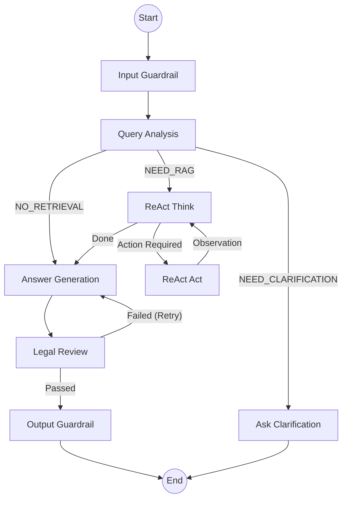

# LangGraph Orchestrator (오케스트레이터)

## 1. 개요 (Overview)

오케스트레이터는 **Multi-Agent System의 두뇌** 역할을 담당합니다. LangGraph를 기반으로 하여 각 에이전트(노드) 간의 실행 순서를 제어하고, 상태(State)를 관리하며, 데이터 흐름을 조정합니다.

### 주요 책임
1.  **워크플로우 관리 (Workflow)**: 질의 분석 -> 검색 -> 답변 생성 -> 검토 등 전체 프로세스의 실행 흐름을 정의합니다.
2.  **상태 관리 (State Management)**: `ChatState` 객체를 통해 대화 히스토리, 검색 결과, 생성된 답변 등을 에이전트 간에 공유하고 지속시킵니다.
3.  **동적 라우팅 (Dynamic Routing)**: 현재 상태와 분석 결과에 따라 다음 단계를 동적으로 결정합니다 (예: 검색이 필요 없는 경우 바로 답변 생성).
4.  **조건부 실행 (Conditional Execution)**: ReAct 패턴을 통해 추론(Thought)과 행동(Action)을 반복하거나, 검토 실패 시 재생성을 요청합니다.

---

## 2. 상태 스키마 (State Schema)

오케스트레이터는 `ChatState` (TypedDict)를 통해 시스템의 모든 데이터를 관리합니다.

### 주요 필드 설명 (`state.py`)

| 필드명 | 타입 | 설명 |
|--------|------|------|
| `messages` | `List[BaseMessage]` | 멀티턴 대화 히스토리 (LangChain 표준) |
| `user_query` | `str` | 현재 턴의 사용자 질문 |
| `mode` | `RoutingMode` | 라우팅 모드 (`NEED_RAG`, `NO_RETRIEVAL`, `NEED_CLARIFICATION`) |
| `query_analysis` | `dict` | 질의 분석 결과 (유형, 키워드, 확장 쿼리 등) |
| `retrieval` | `dict` | 검색 결과 (법령, 사례, 기준 등) |
| `final_answer` | `str` | 최종 생성된 답변 |
| `react_steps` | `List[ReActStep]` | ReAct 추론 과정 기록 (Thought-Action-Observation) |
| `retry_count` | `int` | 답변 재생성 횟수 (Review 실패 시 증가) |

---

## 3. 그래프 아키텍처 (Workflow)

현재 시스템은 **Unified ReAct Graph**를 사용합니다.



### 주요 노드
- **`query_analysis`**: 사용자의 의도를 분석하고 라우팅 모드를 결정합니다.
- **`react_think`**: 검색이 필요한 경우, 어떤 도구를 사용할지 추론합니다.
- **`react_act`**: 검색 도구(Retrieval Agent)를 실행하고 결과를 관찰합니다.
- **`generation`**: 검색된 정보와 대화 맥락을 바탕으로 답변을 생성합니다.
- **`review`**: 생성된 답변의 정확성과 안전성을 검토합니다.
- **`ask_clarification`**: 정보가 부족할 경우 사용자에게 되묻는 질문을 생성합니다.

---

## 4. 코드 구조 (Code Structure)

- **`graph.py`**: LangGraph 정의 파일.
    - `create_unified_chat_graph()`: 현재 사용 중인 메인 그래프 정의.
    - `_route_unified_...`: 각 노드 실행 후 분기 로직.
    - `_create_timed_node(...)`: 실행 시간 측정 및 입출력 스냅샷 로깅을 위한 래퍼.
- **`state.py`**: 상태 스키마 정의 (`ChatState`, `UnifiedState` 등).
- **`routing.py`**: (Deprecated) 레거시 라우팅 로직.
- **`checkpointer.py`**: 대화 상태 저장을 위한 체크포인트 설정 (Memory/Postgres).

### 라우팅 로직 설명

#### Query Analysis 후 분기
- **NO_RETRIEVAL**: 일반 대화(`general`), 시스템 질문(`system_meta`)은 검색 없이 바로 답변 생성으로 이동.
- **NEED_CLARIFICATION**: 필수 정보가 누락되었거나 질문이 모호한 경우 역질문 노드로 이동.
- **NEED_RAG**: 정보 검색이 필요한 경우 ReAct 루프로 진입.

#### ReAct 루프
- `react_think`에서 도구 사용 결정 -> `react_act` 실행 -> 결과 확인 후 다시 `react_think`로 복귀.
- `should_continue=False`가 되면 루프 종료 후 `generation`으로 이동.

#### Review 후 분기
- 검토 통과(`passed=True`) -> 종료.
- 검토 실패(`passed=False`) -> `retry_count`가 임계값 미만이면 `generation`으로 되돌아가 수정 요청.

---

## 5. 테스트 방법 (Testing)

오케스트레이터 테스트는 전체 흐름과 상태 전이를 검증합니다.

### 주요 테스트 스크립트
- **`backend/scripts/testing/orchestrator/test_pr1_integration.py`**: 그래프 구조 및 노드 존재 여부 확인.
- **`backend/scripts/testing/orchestrator/test_pr1_fastpath.py`**: Fast Path 라우팅 로직 검증.

### 실행 방법
```bash
conda activate dsr
pytest backend/scripts/testing/orchestrator/test_pr1_integration.py -v
```

---

## 6. 변경 이력 (History)

| 날짜 | PR | 내용 |
|------|----|------|
| 2026-01-14 | **PR 1** | Fast Path 구현. 일반 대화 시 Review 단계 건너뛰기 로직 추가. |
| 2026-01-22 | **PR 2** | **Unified Graph** 도입. ReAct 패턴과 일반 파이프라인을 단일 그래프로 통합. |
| 2026-01-22 | **PR 3** | Data Collection을 위한 `_node_timings` 로깅 스키마 개선. |

---

## 7. 고도화 계획 (To-Be)

1.  **Human-in-the-loop**: 전문가 개입이 필요한 경우 실행을 일시 중지하고 관리자 승인을 대기하는 기능.
2.  **Sub-graph 분리**: 그래프가 복잡해짐에 따라 RAG, Review 등 하위 프로세스를 독립적인 Sub-graph로 분리하여 모듈화.
