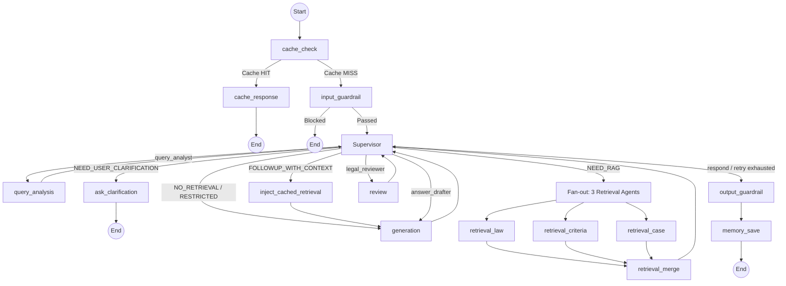

# MAS Supervisor (Multi-Agent System Orchestrator)

**Last modified**: 2026-02-09

## 1. Overview

The MAS (Multi-Agent System) Supervisor is the central orchestration layer of the DDOKSORI consumer dispute resolution chatbot. Built on **LangGraph** with a **Hub-Spoke architecture**, it coordinates 6 specialized agents through a stateful workflow graph.

### Core Responsibilities

1. **Workflow Management**: Defines the end-to-end execution flow -- query analysis, selective retrieval, answer generation, legal review, and output guardrails.
2. **State Management**: Shares conversation history, retrieval results, generated answers, and control flags across agents via the `ChatState` TypedDict.
3. **2-Strategy Routing**: Routes queries through either a **Fast Path** (no retrieval) or a **Full Pipeline** (retrieval + review) based on intent classification.
4. **Conversation Phase System**: Rule-based state machine for progressive information gathering and phased guidance in dispute consultations.
5. **Multi-Level Caching**: L1 through L5 Redis caches to minimize redundant LLM calls and retrieval operations.
6. **Security**: Input sanitization, prompt injection prevention, and input length limits.

### Architectural Highlights

- **3 Retrieval Agents** (law, criteria, case) execute in parallel via LangGraph Fan-out/Fan-in
- **Fallback Chain**: GPT-4o -> Claude 3.5 Sonnet -> Rule-based (guarantees response even when all LLMs fail)
- **Singleton Graph**: Compiled once, reused across all requests via `get_mas_supervisor_graph()`
- **Checkpointer**: Thread-based state persistence (MemorySaver for dev; PostgresSaver planned)

---

## 2. State Schema

The orchestrator manages all system data through `ChatState` (inherits `MessagesState`), defined across 7 submodules in the `state/` package.

### State Submodules

| Module | Key Types | Description |
|--------|-----------|-------------|
| `session.py` | `OnboardingInfo`, `SessionState`, `ChatType` | Session metadata, onboarding form data, chat type (`dispute` / `general`) |
| `agent_results.py` | `QueryAnalysisResult`, `RetrievalResult`, `IndividualRetrievalResult`, `ReviewResult`, `CitedCase`, `ViolationV2`, `RetryContext` | Agent execution results, MAS v2 types |
| `output.py` | `OutputState`, `ClaimEvidenceMapping`, `ResponseDepth` | Final answer, sources (cumulative via `operator.add`), claim-evidence mapping, Progressive Disclosure depth |
| `control.py` | `RoutingMode`, `ControlState`, `TraceEntry` | Routing mode literals, guardrail flags, node execution traces |
| `supervisor.py` | `SupervisorState`, `AgentMessage` | Supervisor decision state, inter-agent message protocol |
| `memory.py` | `MemoryState`, `ConversationTurn`, `CompactSummary`, `RAGConversationMemory`, `RAGTurn` | Conversation history, compact summaries, selective RAG memory (window-based) |
| `__init__.py` | `ChatState`, `create_initial_state` | Unified state schema integrating all submodules, initial state factory |

### RoutingMode (6 modes)

```python
RoutingMode = Literal[
    "NO_RETRIEVAL",           # Fast Path: greeting, system questions (skip retrieval + review)
    "NEED_RAG",               # Full Pipeline: retrieval + generation + review
    "CACHED_RAG",             # Follow-up turn using cached retrieval results
    "RESTRICTED_DOMAIN",      # Specialized agency referral (finance, medical, etc.)
    "META_CONVERSATIONAL",    # Meta-conversation (about the system itself)
    "FOLLOWUP_WITH_CONTEXT",  # Follow-up using previous turn's cached retrieval
]
```

### ConversationPhase (Progressive Disclosure)

The conversation phase system implements progressive information disclosure for dispute consultations:

```python
# Actual phase names from conversation_manager.py
ConversationPhase = str  # Legacy compat; actual values:

# Phase flow:
# "initial"                    -> First entry
# "info_gathering"             -> Collecting dispute slots
# "providing_case_summary"     -> Delivering case summary (first RAG turn)
# "awaiting_law_confirm"       -> "Want law/criteria details?" prompt
# "providing_law_detail"       -> Delivering law/criteria details
# "awaiting_procedure_confirm" -> "Want procedure info?" prompt
# "providing_procedure"        -> Delivering procedure guidance
# "completed"                  -> Consultation complete
```

### Key ChatState Fields

| Field | Type | Description |
|-------|------|-------------|
| `messages` | `List[BaseMessage]` | Multi-turn conversation history (LangChain standard, `add_messages` reducer) |
| `user_query` | `str` | Current turn user question |
| `chat_type` | `Literal["dispute", "general"]` | Session type |
| `onboarding` | `Optional[OnboardingInfo]` | Frontend form data (purchase item, amount, dispute details, etc.) |
| `session_id` | `Optional[str]` | Session ID (cache key) |
| `mode` | `RoutingMode` | Routing mode set by query analysis |
| `query_analysis` | `Optional[QueryAnalysisResult]` | Intent classification, keywords, retriever types, expanded queries |
| `retrieval` | `Optional[RetrievalResult]` | Merged retrieval results (4-section: laws, criteria, disputes, counsels) |
| `draft_answer` | `Optional[str]` | LLM-generated draft answer |
| `review` | `Optional[ReviewResult]` | Legal review result (pass/fail, violations, confidence score) |
| `final_answer` | `Optional[str]` | Final verified answer |
| `sources` | `Annotated[List[Dict], operator.add]` | Citation sources (cumulative) |
| `supervisor` | `Optional[SupervisorState]` | Supervisor decision state (phase, next_agent, iteration_count) |
| `individual_retrieval_results` | `Annotated[List[IndividualRetrievalResult], operator.add]` | Per-agent retrieval results (Fan-in accumulation) |
| `conversation_phase` | `str` | Current conversation phase (Progressive Disclosure) |
| `dispute_slots` | `Dict[str, Optional[str]]` | Dispute consultation slots (purchase_item, problem_details, etc.) |
| `rag_conversation_memory` | `Optional[List[Dict]]` | Selective RAG turn memory (window size 5) |
| `_last_turn_context` | `Optional[Dict]` | Previous turn context for FOLLOWUP_WITH_CONTEXT |
| `_node_timings` | `Annotated[Dict, _merge_dicts]` | Per-node execution timing (parallel-safe merge) |
| `_agent_trace_entries` | `Annotated[List[TraceEntry], operator.add]` | Agent trace entries (append-only, parallel fan-out compatible) |

---

## 3. Graph Architecture (Workflow)

The system uses a single **MAS Supervisor Graph** defined in `graph_mas.py`.

### Mermaid Diagram



### Node Registration Order (from `graph_mas.py`)

| # | Node Name | Source | Description |
|---|-----------|--------|-------------|
| 1 | `cache_check` | `graph_mas.py` | L1 cache lookup (session-aware, turn-aware) |
| 2 | `cache_response` | `graph_mas.py` | Return cached response (skips entire pipeline) |
| 3 | `input_guardrail` | `guardrail/nodes.py` | Input validation, safety check, moderation |
| 4 | `supervisor` | `nodes/supervisor.py` | Hub node: decides next agent via 2-strategy routing |
| 5 | `query_analysis` | `agents/query_analysis/` | Intent classification, keyword extraction, query expansion, slot extraction |
| 6 | `generation` | `agents/answer_generation/` | RAG-based answer generation (gpt-4o) with fallback chain |
| 7 | `review` | `agents/legal_review/` | Legal review: hallucination check, prohibited expression filter, citation verification |
| 8 | `retrieval_law` | `agents/retrieval/law_agent.py` | Law/statute retrieval agent (metadata filter: law_guide + legislation types) |
| 9 | `retrieval_criteria` | `agents/retrieval/criteria_agent.py` | Dispute resolution criteria retrieval agent (metadata filter: administrative rules) |
| 10 | `retrieval_case` | `agents/retrieval/case_agent.py` | Dispute/mediation case retrieval agent (categories: mediation, resolution, consultation) |
| 11 | `retrieval_merge` | `nodes/retrieval_merge.py` | Fan-in: merge 3 agent results into 4-section RetrievalResult + product relevance filtering |
| 12 | `memory_save` | `nodes/memory_save.py` | Save NEED_RAG turns to selective memory + L4 cache persistence |
| 13 | `inject_cached_retrieval` | `graph_mas.py` | Inject cached retrieval for FOLLOWUP_WITH_CONTEXT mode |

### Edge Configuration

```
Entry Point: cache_check

Conditional Edges:
  cache_check      -> cache_response | input_guardrail      (based on _cache_hit)
  input_guardrail  -> END | supervisor                       (based on guardrail_blocked)
  supervisor       -> query_analysis | retrieval_{law,criteria,case} | generation |
                      review | output_guardrail | inject_cached_retrieval
                      (based on _route_mas_supervisor)

Static Edges:
  cache_response          -> END
  retrieval_{law,criteria,case} -> retrieval_merge           (Fan-in)
  retrieval_merge         -> supervisor
  query_analysis          -> supervisor
  generation              -> supervisor
  review                  -> supervisor
  output_guardrail        -> memory_save
  memory_save             -> END
  inject_cached_retrieval -> generation
```

---

## 4. SupervisorNode

`nodes/supervisor.py` implements the central orchestrator as a class with dependency-injected LLM support.

### 2-Strategy Routing

| Mode | Strategy | Pipeline |
|------|----------|----------|
| `NO_RETRIEVAL` | **Fast Path** | Query Analysis -> Generation -> END (skip retrieval + review) |
| `RESTRICTED_DOMAIN` | **Fast Path** | Query Analysis -> Generation -> END (specialized agency referral) |
| `NEED_RAG` | **Full Pipeline** | Query Analysis -> Retrieval (Fan-out) -> Generation -> Review -> END |
| `CACHED_RAG` | **Full Pipeline** (skip retrieval) | Query Analysis -> Generation -> Review -> END |
| `FOLLOWUP_WITH_CONTEXT` | **Full Pipeline** (inject cache) | Query Analysis -> inject_cached_retrieval -> Generation -> Review -> END |

### Fallback Chain

The SupervisorNode initializes a multi-model fallback chain for LLM-based decision-making:

```
1. Primary:   GPT-4o (config.models.supervisor)        -- OpenAI
2. Fallback:  Claude 3.5 Sonnet (MODEL_SUPERVISOR_FALLBACK env)  -- Anthropic
3. Final:     Rule-based (_rule_based_fallback)         -- No LLM needed
```

Each level is tried in sequence. If primary times out (30s) or returns unparseable JSON, fallback is tried. If all LLMs fail, rule-based logic makes the routing decision deterministically.

### Security Features

| Feature | Implementation |
|---------|---------------|
| **Input Sanitization** | `_sanitize_user_input()` masks dangerous patterns (ignore, disregard, pretend, etc.) |
| **Length Limit** | User input truncated to 500 characters (`MAX_USER_INPUT_LENGTH`) |
| **Structure Protection** | Consecutive `###` and `---` patterns collapsed to prevent prompt structure attacks |
| **Korean Injection** | Korean-language injection patterns detected and masked |
| **Infinite Loop Prevention** | `MAX_SUPERVISOR_ITERATIONS = 10` forces termination with partial results |
| **JSON Parse Retry** | 1 retry with markdown cleanup before falling back to rule-based |

### Key Constants

| Constant | Value | Description |
|----------|-------|-------------|
| `MAX_SUPERVISOR_ITERATIONS` | 10 | Maximum supervisor invocations per turn |
| `LLM_TIMEOUT_SECONDS` | 30.0 | Per-LLM-call timeout |
| `MAX_JSON_PARSE_RETRIES` | 1 | JSON parsing retry before rule-based fallback |
| `MAX_USER_INPUT_LENGTH` | 500 | Input truncation limit (prompt injection prevention) |

### SupervisorState Phases

The supervisor tracks its current execution phase:

| Phase | Meaning |
|-------|---------|
| `analyzing` | Query analysis in progress |
| `retrieving` | Retrieval agents executing |
| `drafting` | Answer generation in progress |
| `reviewing` | Legal review in progress |
| `clarifying` | Awaiting user clarification |
| `done` | Pipeline complete |
| `processing` | Generic processing state |

---

## 5. Conversation Manager

`conversation_manager.py` is a **rule-based engine** for conversation phase transitions and slot management. It operates without LLM calls for cost efficiency.

### Core Functions

```python
def update_slots_and_phase(state: ChatState) -> Dict[str, Any]:
    """Main entry point. Merges slots, computes status, determines phase transition.
    Returns: dispute_slots, dispute_slot_status, conversation_phase, last_phase_transition_reason"""

def get_next_questions(state: ChatState) -> List[str]:
    """Returns 1-3 questions based on current phase and missing slots."""

def detect_yes_no(text: str) -> Optional[bool]:
    """Rule-based yes/no detection using Korean patterns."""

def should_trigger_clarification(state: ChatState) -> bool:
    """True if phase is info_gathering, awaiting_law_confirm, or awaiting_procedure_confirm."""

def get_retriever_types_for_phase(phase: str) -> List[str]:
    """Returns retrieval agent types for each phase."""

def compute_phase_transition(current_phase, user_query, slot_status, query_type) -> Tuple[str, str]:
    """Computes next phase and transition reason."""
```

### Slot Management

**Required Slots**: `purchase_item`, `problem_details`
**Optional Slots**: `dispute_type`, `purchase_date`, `purchase_place`

**Merge Priority** (highest to lowest):
1. `extracted_info` (current turn LLM extraction)
2. `onboarding` (frontend form data)
3. `existing_slots` (memory/previous turns)

### Phase Transition Table

```
initial -> info_gathering             (dispute intent detected + slots missing)
        -> providing_case_summary     (dispute intent + required slots filled)
        -> initial                    (no dispute intent)

info_gathering -> providing_case_summary  (required slots filled)
               -> info_gathering          (slots still missing)

providing_case_summary -> awaiting_law_confirm    (case summary provided)

awaiting_law_confirm -> providing_law_detail          (user says "yes")
                     -> awaiting_procedure_confirm    (user says "no")
                     -> initial                       (new topic detected)

providing_law_detail -> awaiting_procedure_confirm    (law detail provided)

awaiting_procedure_confirm -> providing_procedure     (user says "yes")
                           -> completed               (user says "no")
                           -> initial                  (new topic detected)

providing_procedure -> completed                      (procedure provided)

completed -> initial                                  (new query restarts flow)
```

### Phase-Based Retriever Selection

```python
# conversation_manager.py
if phase == "providing_case_summary":
    return ["law", "criteria", "case"]   # Full retrieval (cached for later phases)

if phase in ("providing_law_detail", "providing_procedure"):
    return []                             # Use cache, no re-retrieval needed

# Default:
return ["law", "criteria", "case"]
```

---

## 6. Caching System

The supervisor implements a 5-level Redis caching hierarchy. All caches inherit from `BaseRedisCache` in `app.common.cache`.

### Cache Levels

| Level | Class | Scope | TTL | Description |
|-------|-------|-------|-----|-------------|
| **L1** | `SupervisorResponseCache` | Session-aware | 1 hour | Full pipeline response cache. Identical query in same session skips entire pipeline. Turn-aware cache key prevents repeat answers. |
| **L2** | `QueryAnalysisCache` | Session-agnostic | 24 hours | Query analysis result cache. Reuses intent classification, keywords, retriever_types for identical queries. |
| **L3** | `IntentClassificationCache` | Session-agnostic | 7 days | Intent classification cache. gpt-4o-mini call results cached to reduce LLM cost/latency. |
| **L4** | `RetrievalResultCache` | Session-scoped | 1 hour | Per-session retrieval results for Progressive Disclosure. First turn results reused in follow-up turns. Invalidated on topic change. |
| **L5** | `RetrievalOverflowCache` | Session-scoped | 30 min (configurable) | Overflow results exceeding display limits. Served on "show more" requests. |

### Cache Flow in Graph

```
User Query
    |
    v
[cache_check] -- L1 HIT --> [cache_response] --> END
    |
    L1 MISS
    |
    v
[input_guardrail] --> [supervisor] --> [query_analysis]
                                           |
                                    (L2/L3 checked internally)
                                           |
                                           v
                                    [retrieval agents]
                                           |
                                           v
                                    [retrieval_merge]
                                       |       |
                                  L4 save   L5 overflow save
                                       |
                                       v
                                    [generation] --> [review] --> [output_guardrail]
                                                                        |
                                                                        v
                                                                    [memory_save]
                                                                   L4 persist
```

### Cache Management Utilities

```python
from app.supervisor.cache import clear_all_supervisor_caches, get_cache_stats

# Clear all caches
results = clear_all_supervisor_caches()
# Returns: {"l1_deleted": N, "l2_deleted": N, "l3_deleted": N, "l4_deleted": N, "l5_deleted": N}

# Get cache statistics
stats = get_cache_stats()
# Returns: {"enabled": True, "l1_supervisor_count": N, ..., "total": N}
```

---

## 7. Retrieval Merge Node

`nodes/retrieval_merge.py` implements the Fan-in merge of parallel retrieval results.

### Merge Process

1. **Section Mapping**: `law` -> `laws`, `criteria` -> `criteria`, `case` -> `disputes`, `counsel` -> `counsels`
2. **Product Relevance Filtering**: Scores each document against `purchase_item` and `product_category` from onboarding
3. **Display Limits**: Configurable per-domain limits (`config.retrieval.display_law`, etc.), overflow cached to L5
4. **Statistics**: Computes `max_similarity` and `avg_similarity` across all agents
5. **L4 Cache Save**: Stores merged results for Progressive Disclosure follow-up turns

### Product Relevance Scoring

| Score | Meaning |
|-------|---------|
| 1.0 | Direct product name match in document |
| 0.8 | Product category keyword match |
| 0.4 | Dispute type keyword match (generic relevance) |
| 0.2 | No relevance detected |
| 0.0 | Negated item detected (excluded) |

Documents with relevance < 0.3 are filtered when sufficient high-relevance results exist (minimum 2).

---

## 8. Memory System

### Conversation Memory (`memory.py`)

| Chat Type | Policy | Details |
|-----------|--------|---------|
| `general` | 10 turns max, no compact | Sliding window of 5 |
| `dispute` | 30 turns max, compact enabled | Sliding window of 10, structured field extraction |

### Compact Process (`compact.py`)

When turn limit is reached, the `compact_conversation()` function extracts structured fields from conversation history:
- `purchase_item`, `purchase_date`, `purchase_amount`, `purchase_place`
- `dispute_type`, `dispute_details`, `desired_resolution`
- `key_facts` (up to 5 core facts)

The compact summary is merged with any existing summary and the sliding window retains only the most recent N turns.

### RAG Conversation Memory (`state/memory.py`)

`RAGConversationMemory` selectively stores only `NEED_RAG` turns (skips `NO_RETRIEVAL` greetings/system queries):
- Window size: 5 (configurable via `CONVERSATION_MEMORY_WINDOW` env var)
- Stores: `user_query` + `answer_summary` (first 200 chars of `final_answer`)
- Used by Query Rewriter for multi-turn context

### Memory Save Node (`nodes/memory_save.py`)

Runs after `output_guardrail`, performs:
1. **RAG Memory**: Saves `NEED_RAG` turns to `rag_conversation_memory`
2. **Last Turn Context**: Saves `followup_questions`, `available_details`, and `retrieval` for `FOLLOWUP_WITH_CONTEXT`
3. **L4 Cache Persist**: Writes retrieval results to `RetrievalResultCache` for cross-turn persistence

### Database Persistence (`persistence/`)

| Module | Class | Description |
|--------|-------|-------------|
| `db.py` | `ConversationDB` | PostgreSQL DAL for conversations, turns, summaries. Per-call connection (concurrency-safe). |
| `cleanup.py` | `ConversationCleanupService` | Background service that periodically cleans expired guest sessions. |

---

## 9. Clarify Node

`nodes/clarify.py` generates clarification questions when information is insufficient.

### Trigger Conditions

1. **Missing required fields**: `purchase_item` or `dispute_details` absent
2. **Brand-only item**: Brand name detected without product category (e.g., "Samsung" without "phone")
3. **Phase-based**: Current phase is `info_gathering`, `awaiting_law_confirm`, or `awaiting_procedure_confirm`
4. **Ambiguous query**: Query classified as `ambiguous` type

### Question Generation

- Phase-based questions from `ConversationManager.get_next_questions()`
- Field-specific templates for missing slots
- Pre-clarification templates for very short or ambiguous queries
- Maximum 3 questions per clarification turn

---

## 10. Code Structure

```
backend/app/supervisor/
├── __init__.py                # Package exports (lazy-loaded graph functions)
├── graph.py                   # Entry point: get_graph_for_chat_type(), _create_timed_node()
├── graph_mas.py               # MAS Supervisor graph definition (current production)
├── conversation_manager.py    # Phase transitions, slot management (rule-based)
├── cache.py                   # L1-L5 Redis cache classes
├── checkpointer.py            # LangGraph checkpointer factory (Memory / Postgres)
├── compact.py                 # Conversation history compaction (structured field extraction)
├── memory.py                  # ConversationMemory class, memory policies
├── state.py                   # Backward-compat re-export shim for state/ package
├── state/
│   ├── __init__.py            # ChatState unified schema, create_initial_state()
│   ├── session.py             # OnboardingInfo, SessionState, ChatType
│   ├── agent_results.py       # QueryAnalysisResult, RetrievalResult, ReviewResult, CitedCase, ViolationV2, RetryContext
│   ├── output.py              # OutputState, ClaimEvidenceMapping, ResponseDepth
│   ├── control.py             # RoutingMode, ControlState, TraceEntry
│   ├── supervisor.py          # SupervisorState, AgentMessage
│   ├── memory.py              # MemoryState, ConversationTurn, CompactSummary, RAGConversationMemory, RAGTurn
│   └── README.md              # State module documentation
├── nodes/
│   ├── __init__.py            # Node exports
│   ├── supervisor.py          # SupervisorNode class (2-strategy routing, fallback chain, security)
│   ├── clarify.py             # ask_clarification node (information clarification)
│   ├── retrieval_merge.py     # Fan-in merge of 3 retrieval agents + product relevance filtering
│   └── memory_save.py         # Selective memory save (NEED_RAG only) + L4 cache persistence
└── persistence/
    ├── __init__.py            # Persistence module exports
    ├── db.py                  # ConversationDB (PostgreSQL DAL)
    └── cleanup.py             # ConversationCleanupService (expired session cleanup)
```

---

## 11. Testing

All supervisor tests are located in `backend/scripts/testing/supervisor/`.

### Test Files

| File | Description |
|------|-------------|
| `test_conversation_phase_manager.py` | ConversationManager unit tests (phase transitions, slot management) |
| `test_mas_supervisor_graph.py` | MAS graph structure and node existence verification |
| `test_supervisor.py` | SupervisorNode decision logic, routing strategies |
| `test_supervisor_state.py` | ChatState schema, create_initial_state validation |
| `test_graph_routing.py` | Graph routing and conditional edge tests |
| `test_fast_path.py` | Fast Path (NO_RETRIEVAL) end-to-end flow |
| `test_selective_retrieval.py` | Selective retrieval agent activation |
| `test_retrieval_merge.py` | Retrieval merge, product relevance filtering, display limits |
| `test_retry_context.py` | Retry/regeneration loop (review -> generation) |
| `test_followup_with_context.py` | FOLLOWUP_WITH_CONTEXT mode and inject_cached_retrieval |
| `test_progressive_disclosure.py` | Progressive Disclosure phase flow |
| `test_conversation_memory.py` | RAGConversationMemory window management |
| `test_memory_db.py` | ConversationDB PostgreSQL persistence |
| `test_answer_cache.py` | L1-L5 cache hit/miss behavior |
| `test_sufficiency.py` | Retrieval sufficiency scoring |
| `test_adaptive_rag.py` | Adaptive RAG complexity-based strategy |
| `test_agent_communication.py` | AgentMessage protocol tests |
| `test_agent_metrics.py` | Agent execution metrics and timing |
| `test_agent_trace.py` | TraceEntry and pipeline summary |
| `test_mas_integration.py` | MAS integration tests (requires LLM API keys) |
| `test_e2e_queries.py` | End-to-end query tests (requires full stack) |

### Running Tests

```bash
# All supervisor tests
conda run -n dsr pytest backend/scripts/testing/supervisor/ -v

# ConversationManager unit tests
conda run -n dsr pytest backend/scripts/testing/supervisor/test_conversation_phase_manager.py -v

# Graph structure tests
conda run -n dsr pytest backend/scripts/testing/supervisor/test_mas_supervisor_graph.py -v

# SupervisorNode routing tests
conda run -n dsr pytest backend/scripts/testing/supervisor/test_supervisor.py -v

# Skip slow/LLM tests
conda run -n dsr pytest backend/scripts/testing/supervisor/ -m "not slow and not llm" -v

# Unit tests only (no DB, no LLM)
conda run -n dsr pytest backend/scripts/testing/supervisor/ -m unit -v
```

---

## 12. Environment Variables

### Supervisor Configuration

| Variable | Default | Description |
|----------|---------|-------------|
| `SUPERVISOR_LLM_ENABLED` | `false` | Enable LLM-based supervisor decisions (vs. rule-based) |
| `SUPERVISOR_LLM_MODEL` | `gpt-4o-mini` | Model for supervisor LLM (graph_mas.py wrapper) |
| `MODEL_SUPERVISOR_FALLBACK` | `claude-3-5-sonnet-20241022` | Fallback model for SupervisorNode |
| `OPENAI_API_KEY` | (required) | OpenAI API key for primary LLM |
| `ANTHROPIC_API_KEY` | (optional) | Anthropic API key for fallback LLM |
| `CHECKPOINTER_MODE` | `memory` | Checkpointer backend: `memory` or `postgres` |

### Cache Configuration

| Variable | Default | Description |
|----------|---------|-------------|
| `REDIS_HOST` | `localhost` | Redis host for L1-L5 caches |
| `REDIS_PORT` | `6379` | Redis port |
| `ENABLE_ANSWER_CACHE` | `true` | Enable/disable answer caching |

### Memory Configuration

| Variable | Default | Description |
|----------|---------|-------------|
| `CONVERSATION_MEMORY_WINDOW` | `5` | RAGConversationMemory window size |

---

## 13. History

| Date | Version | Changes |
|------|---------|---------|
| 2026-01-14 | PR 1 | Fast Path implementation. Skip review for general conversations. |
| 2026-01-20 | PR 3 | Compact module, conversation memory, clarify node. |
| 2026-01-22 | PR 3 | Data collection logging schema improvements. |
| 2026-01-24 | Phase 7 | **MAS Supervisor introduced**. ReAct pattern archived. Hub-Spoke architecture with Fan-out/Fan-in retrieval. |
| 2026-01-26 | Phase 8 | SupervisorNode class with LLM fallback chain, security features, 2-strategy routing. |
| 2026-01-27 | Phase 7 | Module renamed: `orchestrator` -> `supervisor`. Legacy code removed. |
| 2026-01-28 | Phase 9 | **Conversation Phase System**. Slot-based info gathering, progressive disclosure, DB persistence. |
| 2026-01-28 | Track 2-3 | Follow-up questions, DB integration, conversation memory persistence. |
| 2026-01-29 | Phase 10 | **v2 tag cleanup**: v1 code removed, V2 suffixes removed from functions/types, files renamed. |
| 2026-01-31 | PR-B | RAGConversationMemory selective save, memory_save node. |
| 2026-02-01 | Phase 3-C | FOLLOWUP_WITH_CONTEXT mode, inject_cached_retrieval node, L4 RetrievalResultCache. |
| 2026-02-01 | Phase 3-E | Turn-aware L1 cache keys to prevent repeat answers on multi-turn. |
| 2026-02-01 | PR-6 | L1-L5 caching system, cache_check/cache_response nodes. |
| 2026-02-09 | Current | README updated to reflect current codebase state. |

---

## 14. Roadmap

1. **PostgreSQL Checkpointer**: Replace MemorySaver with AsyncPostgresSaver for production state persistence (currently `NotImplementedError`).
2. **Human-in-the-Loop**: Pause execution for expert intervention on complex legal questions.
3. **Multi-turn Summarization**: Compress long conversations while preserving key context.
4. **Phase Satisfaction Metrics**: Collect user feedback after each Progressive Disclosure phase.
5. **Adaptive Retrieval Strategy**: Dynamic HyDE/BM25 strategy selection based on query complexity.
