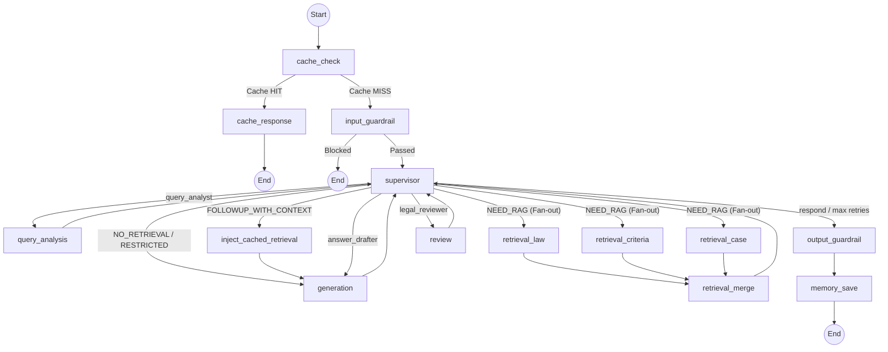

# Supervisor (MAS 슈퍼바이저)

**최종 수정**: 2026-02-09

## 1. 개요 (Overview)

MAS (Multi-Agent System) Supervisor는 DDOKSORI 소비자 분쟁 해결 챗봇의 중앙 오케스트레이션 레이어입니다. **LangGraph** 기반 **Hub-Spoke 아키텍처**로 구성되며, 전문 에이전트를 상태 기반 워크플로우 그래프를 통해 조율합니다.

### 핵심 역할

1. **워크플로우 관리**: 질의 분석, 선택적 검색, 답변 생성, 법률 검토, 출력 가드레일까지의 전체 실행 흐름을 **14개 노드** 그래프로 정의합니다.
2. **상태 관리**: 대화 이력, 검색 결과, 생성된 답변, 제어 플래그를 `ChatState` TypedDict를 통해 에이전트 간 공유합니다.
3. **2-전략 라우팅**: 의도 분류 결과에 따라 **Fast Path** (검색 없음) 또는 **Full Pipeline** (검색 + 검토)로 쿼리를 라우팅합니다.
4. **대화 단계 시스템**: 분쟁 상담에서 단계적 정보 수집과 점진적 안내를 위한 규칙 기반 상태 머신입니다.
5. **다단계 캐싱**: L1~L5 Redis 캐시로 중복 LLM 호출 및 검색 작업을 최소화합니다.
6. **보안**: 입력 정화, 프롬프트 인젝션 방지, 입력 길이 제한을 수행합니다.

### 아키텍처 특징

- **3개 검색 에이전트** (law, criteria, case)가 LangGraph Fan-out/Fan-in을 통해 병렬 실행됩니다.
- **폴백 체인**: GPT-4o -> Claude 3.5 Sonnet -> 규칙 기반 (모든 LLM이 실패해도 응답을 보장합니다)
- **싱글톤 그래프**: 한 번 컴파일되어 `get_mas_supervisor_graph()`를 통해 모든 요청에서 재사용됩니다.
- **체크포인터**: 스레드 기반 상태 영속화 (개발용 MemorySaver; PostgresSaver 예정)

---

## 2. 상태 스키마 (State Schema)

`ChatState` (`MessagesState` 상속)가 모든 시스템 데이터를 관리하며, `state/` 패키지의 6개 서브모듈에 걸쳐 정의됩니다.

### 상태 서브모듈

| 모듈 | 주요 타입 | 설명 |
|------|----------|------|
| `session.py` | `OnboardingInfo`, `SessionState`, `ChatType` | 세션 메타데이터, 온보딩 폼 데이터, 채팅 유형 (`dispute` / `general`) |
| `agent_results.py` | `QueryAnalysisResult`, `RetrievalResult`, `IndividualRetrievalResult`, `ReviewResult`, `CitedCase`, `ViolationV2`, `RetryContext` | 에이전트 실행 결과, MAS v2 타입 |
| `output.py` | `OutputState`, `ClaimEvidenceMapping`, `ResponseDepth` | 최종 답변, 출처 (누적: `operator.add`), 주장-증거 매핑, Progressive Disclosure 깊이 |
| `control.py` | `RoutingMode`, `ControlState`, `TraceEntry` | 라우팅 모드 리터럴, 가드레일 플래그, 노드 실행 트레이스 |
| `supervisor.py` | `SupervisorState`, `AgentMessage` | Supervisor 의사결정 상태, 에이전트 간 메시지 프로토콜 |
| `memory.py` | `MemoryState`, `ConversationTurn`, `CompactSummary`, `RAGConversationMemory`, `RAGTurn` | 대화 이력, 압축 요약, 선택적 RAG 메모리 (윈도우 기반) |

### 통합 ChatState (`__init__.py`)

`__init__.py`는 위 6개 서브모듈을 통합하여 `ChatState`와 `create_initial_state()` 팩토리를 제공합니다.

### RoutingMode (6종)

```python
RoutingMode = Literal[
    "NO_RETRIEVAL",           # Fast Path: 인사, 시스템 질문 (검색 + 검토 생략)
    "NEED_RAG",               # Full Pipeline: 검색 + 생성 + 검토
    "CACHED_RAG",             # 캐시된 검색 결과를 사용하는 후속 턴
    "RESTRICTED_DOMAIN",      # 전문기관 안내 (금융, 의료, 개인정보, 부동산, 건설)
    "META_CONVERSATIONAL",    # 메타 대화 (시스템 자체에 대한 질문)
    "FOLLOWUP_WITH_CONTEXT",  # 이전 턴의 캐시된 검색을 활용하는 후속 질문
]
```

### 주요 ChatState 필드

| 필드 | 타입 | 설명 |
|------|------|------|
| `messages` | `List[BaseMessage]` | 멀티턴 대화 이력 (LangChain 표준, `add_messages` 리듀서) |
| `user_query` | `str` | 현재 턴 사용자 질문 |
| `chat_type` | `Literal["dispute", "general"]` | 세션 유형 |
| `onboarding` | `Optional[OnboardingInfo]` | 프론트엔드 폼 데이터 (구매 품목, 금액, 분쟁 상세 등) |
| `session_id` | `Optional[str]` | 세션 ID (캐시 키) |
| `mode` | `RoutingMode` | 질의 분석에서 결정된 라우팅 모드 |
| `query_analysis` | `Optional[QueryAnalysisResult]` | 의도 분류, 키워드, 검색기 유형, 확장 쿼리 |
| `retrieval` | `Optional[RetrievalResult]` | 병합된 검색 결과 (4개 섹션: laws, criteria, disputes, counsels) |
| `draft_answer` | `Optional[str]` | LLM이 생성한 초안 답변 |
| `review` | `Optional[ReviewResult]` | 법률 검토 결과 (통과/실패, 위반 사항, 신뢰도 점수) |
| `final_answer` | `Optional[str]` | 최종 검증된 답변 |
| `sources` | `Annotated[List[Dict], operator.add]` | 인용 출처 (누적) |
| `supervisor` | `Optional[SupervisorState]` | Supervisor 의사결정 상태 (단계, next_agent, iteration_count) |
| `individual_retrieval_results` | `Annotated[List[IndividualRetrievalResult], operator.add]` | 에이전트별 검색 결과 (Fan-in 누적) |
| `retry_context` | `Optional[RetryContext]` | 재생성 컨텍스트 (위반 사항, 이전 초안) |
| `cited_cases` | `List[CitedCase]` | 인용된 사례 정보 |
| `expanded_queries` | `List[str]` | LLM 기반 확장 쿼리 리스트 |
| `conversation_phase` | `str` | 현재 대화 단계 (Progressive Disclosure) |
| `dispute_slots` | `Dict[str, Optional[str]]` | 분쟁 상담 슬롯 (purchase_item, problem_details 등) |
| `followup_questions` | `List[str]` | 후속 질문 목록 |
| `rag_conversation_memory` | `Optional[List[Dict]]` | 선택적 RAG 턴 메모리 (윈도우 크기 5) |
| `_last_turn_context` | `Optional[Dict]` | FOLLOWUP_WITH_CONTEXT용 이전 턴 컨텍스트 |
| `_node_timings` | `Annotated[Dict, _merge_dicts]` | 노드별 실행 타이밍 (병렬 안전 병합) |
| `_agent_trace_entries` | `Annotated[List[TraceEntry], operator.add]` | 에이전트 트레이스 항목 (추가 전용, 병렬 Fan-out 호환) |

---

## 3. 아키텍처 (Architecture)

시스템은 `graph_mas.py`에 정의된 단일 **MAS Supervisor Graph**를 사용합니다. 총 **14개 노드**로 구성됩니다.

### Mermaid 다이어그램



### 14개 노드 목록 (`graph_mas.py` 등록 순서)

| # | 노드명 | 소스 | 설명 |
|---|--------|------|------|
| 1 | `cache_check` | `graph_mas.py` | L1 캐시 조회 (세션 인식, 턴 인식 캐시 키) |
| 2 | `cache_response` | `graph_mas.py` | 캐시된 응답 반환 (전체 파이프라인 생략) |
| 3 | `input_guardrail` | `guardrail/nodes.py` | 입력 검증, 안전성 검사, 모더레이션 |
| 4 | `output_guardrail` | `guardrail/nodes.py` | 출력 검증, 최종 안전성 검사 |
| 5 | `supervisor` | `nodes/supervisor.py` | 허브 노드: 2-전략 라우팅으로 다음 에이전트를 결정 |
| 6 | `query_analysis` | `agents/query_analysis/` | 의도 분류, 키워드 추출, 쿼리 확장, 슬롯 추출 |
| 7 | `generation` | `agents/answer_generation/` | RAG 기반 답변 생성 (gpt-4o) + 폴백 체인 |
| 8 | `review` | `agents/legal_review/` | 법률 검토: 환각 검사, 금지 표현 필터, 인용 검증 |
| 9 | `retrieval_law` | `agents/retrieval/law_agent.py` | 법률/법령 검색 에이전트 (메타데이터 필터: law_guide, 법률/시행령) |
| 10 | `retrieval_criteria` | `agents/retrieval/criteria_agent.py` | 분쟁해결기준 검색 에이전트 (메타데이터 필터: 행정규칙/별표) |
| 11 | `retrieval_case` | `agents/retrieval/case_agent.py` | 분쟁/조정 사례 검색 에이전트 (카테고리: 조정, 해결, 상담) |
| 12 | `retrieval_merge` | `nodes/retrieval_merge.py` | Fan-in: 3개 에이전트 결과를 4섹션 RetrievalResult로 병합 + 제품 관련성 필터링 |
| 13 | `memory_save` | `nodes/memory_save.py` | NEED_RAG 턴을 선택적 메모리에 저장 + L4 캐시 영속화 |
| 14 | `inject_cached_retrieval` | `graph_mas.py` | FOLLOWUP_WITH_CONTEXT 모드용 캐시된 검색 결과 주입 |

### 엣지 구성

```
진입점: cache_check

조건부 엣지:
  cache_check      -> cache_response | input_guardrail      (_cache_hit 기반)
  input_guardrail  -> END | supervisor                       (guardrail_blocked 기반)
  supervisor       -> query_analysis | retrieval_{law,criteria,case} | generation |
                      review | output_guardrail | inject_cached_retrieval
                      (_route_mas_supervisor 기반)

정적 엣지:
  cache_response                     -> END
  retrieval_{law,criteria,case}      -> retrieval_merge       (Fan-in)
  retrieval_merge                    -> supervisor
  query_analysis                     -> supervisor
  generation                         -> supervisor
  review                             -> supervisor
  output_guardrail                   -> memory_save
  memory_save                        -> END
  inject_cached_retrieval            -> generation
```

---

## 4. 코드 구조 (Code Structure)

```
backend/app/supervisor/
├── __init__.py                # 패키지 export (지연 로딩 그래프 함수)
├── graph.py                   # 진입점: get_graph_for_chat_type(), _create_timed_node()
├── graph_mas.py               # MAS Supervisor 그래프 정의 (14개 노드, 현재 프로덕션)
├── conversation_manager.py    # 대화 단계 전환, 슬롯 관리 (규칙 기반)
├── cache.py                   # L1-L5 Redis 캐시 클래스
├── checkpointer.py            # LangGraph 체크포인터 팩토리 (Memory / Postgres)
├── compact.py                 # 대화 이력 압축 (구조화된 필드 추출)
├── memory.py                  # ConversationMemory 클래스, 메모리 정책
├── state/
│   ├── __init__.py            # ChatState 통합 스키마, create_initial_state()
│   ├── session.py             # OnboardingInfo, SessionState, ChatType
│   ├── agent_results.py       # QueryAnalysisResult, RetrievalResult, ReviewResult 등
│   ├── output.py              # OutputState, ClaimEvidenceMapping, ResponseDepth
│   ├── control.py             # RoutingMode, ControlState, TraceEntry
│   ├── supervisor.py          # SupervisorState, AgentMessage
│   └── memory.py              # MemoryState, ConversationTurn, CompactSummary, RAGConversationMemory
├── nodes/
│   ├── __init__.py            # 노드 export
│   ├── supervisor.py          # SupervisorNode 클래스 (2-전략 라우팅, 폴백 체인, 보안)
│   ├── clarify.py             # ask_clarification 노드 (정보 명확화)
│   ├── retrieval_merge.py     # 3개 검색 에이전트의 Fan-in 병합 + 제품 관련성 필터링
│   └── memory_save.py         # 선택적 메모리 저장 (NEED_RAG만) + L4 캐시 영속화
└── persistence/
    ├── __init__.py            # 영속화 모듈 export
    ├── db.py                  # ConversationDB (PostgreSQL DAL)
    └── cleanup.py             # ConversationCleanupService (만료 세션 정리)
```

---

## 5. SupervisorNode 상세

`nodes/supervisor.py`는 의존성 주입 LLM을 지원하는 클래스로 중앙 오케스트레이터를 구현합니다.

### 2-전략 라우팅

| 모드 | 전략 | 파이프라인 |
|------|------|-----------|
| `NO_RETRIEVAL` | **Fast Path** | Query Analysis -> Generation -> END (검색 + 검토 생략) |
| `RESTRICTED_DOMAIN` | **Fast Path** | Query Analysis -> Generation -> END (전문기관 안내) |
| `META_CONVERSATIONAL` | **Fast Path** | Query Analysis -> Generation -> END (검색 생략) |
| `NEED_RAG` | **Full Pipeline** | Query Analysis -> Retrieval (Fan-out) -> Generation -> Review -> END |
| `CACHED_RAG` | **Full Pipeline** (검색 생략) | Query Analysis -> Generation -> Review -> END |
| `FOLLOWUP_WITH_CONTEXT` | **Full Pipeline** (캐시 주입) | Query Analysis -> inject_cached_retrieval -> Generation -> Review -> END |

### 폴백 체인

SupervisorNode는 LLM 기반 의사결정을 위한 다중 모델 폴백 체인을 초기화합니다:

```
1. Primary:   GPT-4o (config.models.supervisor)        -- OpenAI
2. Fallback:  Claude 3.5 Sonnet (MODEL_SUPERVISOR_FALLBACK env)  -- Anthropic
3. Final:     규칙 기반 (_rule_based_fallback)         -- LLM 불필요
```

각 단계는 순차적으로 시도됩니다. Primary가 타임아웃(30초)되거나 파싱 불가능한 JSON을 반환하면 Fallback을 시도합니다. 모든 LLM이 실패하면 규칙 기반 로직이 결정론적으로 라우팅 결정을 내립니다.

### 보안 기능

| 기능 | 구현 |
|------|------|
| **입력 정화** | `_sanitize_user_input()`가 위험 패턴(ignore, disregard, pretend 등)을 마스킹 |
| **길이 제한** | 사용자 입력을 500자로 절단 (`MAX_USER_INPUT_LENGTH`) |
| **구조 보호** | 연속된 `###` 및 `---` 패턴을 축소하여 프롬프트 구조 공격 방지 |
| **한국어 인젝션** | 한국어 인젝션 패턴 감지 및 마스킹 (`시스템 프롬프트`, `지시를 무시`) |
| **무한 루프 방지** | `MAX_SUPERVISOR_ITERATIONS = 10`으로 부분 결과와 함께 강제 종료 |
| **JSON 파싱 재시도** | 규칙 기반 폴백 전 마크다운 정리 후 1회 재시도 |

### 주요 상수

| 상수 | 값 | 설명 |
|------|-----|------|
| `MAX_SUPERVISOR_ITERATIONS` | 10 | 턴당 최대 Supervisor 호출 횟수 |
| `LLM_TIMEOUT_SECONDS` | 30.0 | LLM 호출당 타임아웃 |
| `MAX_JSON_PARSE_RETRIES` | 1 | 규칙 기반 폴백 전 JSON 파싱 재시도 횟수 |
| `MAX_USER_INPUT_LENGTH` | 500 | 입력 절단 제한 (프롬프트 인젝션 방지) |

### SupervisorState 단계

| 단계 | 의미 |
|------|------|
| `initial` | 초기 상태 |
| `analyzing` | 질의 분석 진행 중 |
| `retrieving` | 검색 에이전트 실행 중 |
| `drafting` | 답변 생성 진행 중 |
| `reviewing` | 법률 검토 진행 중 |
| `clarifying` | 사용자 명확화 대기 중 |
| `done` | 파이프라인 완료 |
| `processing` | 일반 처리 상태 |

---

## 6. 대화 관리자 (Conversation Manager)

`conversation_manager.py`는 대화 단계 전환과 슬롯 관리를 위한 **규칙 기반 엔진**입니다. 비용 효율성을 위해 LLM 호출 없이 동작합니다.

### 핵심 함수

```python
def update_slots_and_phase(state: ChatState) -> Dict[str, Any]:
    """메인 진입점. 슬롯 병합, 상태 계산, 단계 전환 결정.
    반환: dispute_slots, dispute_slot_status, conversation_phase, last_phase_transition_reason"""

def get_next_questions(state: ChatState) -> List[str]:
    """현재 단계와 누락된 슬롯에 따라 1~3개의 질문을 반환."""

def detect_yes_no(text: str) -> Optional[bool]:
    """한국어 패턴을 사용한 규칙 기반 예/아니오 감지."""

def should_trigger_clarification(state: ChatState) -> bool:
    """단계가 info_gathering, awaiting_law_confirm, 또는 awaiting_procedure_confirm이면 True."""

def get_retriever_types_for_phase(phase: str) -> List[str]:
    """각 단계에 대한 검색 에이전트 유형을 반환."""

def compute_phase_transition(current_phase, user_query, slot_status, query_type) -> Tuple[str, str]:
    """다음 단계와 전환 사유를 계산."""
```

### 슬롯 관리

**필수 슬롯**: `purchase_item`, `problem_details`
**선택 슬롯**: `dispute_type`, `purchase_date`, `purchase_place`

**병합 우선순위** (높은 순):
1. `extracted_info` (현재 턴 LLM 추출)
2. `onboarding` (프론트엔드 폼 데이터)
3. `existing_slots` (메모리/이전 턴)

### ConversationPhase 단계 전환 테이블 (8단계)

```
initial -> info_gathering             (분쟁 의도 감지 + 슬롯 누락)
        -> providing_case_summary     (분쟁 의도 + 필수 슬롯 충족)
        -> initial                    (분쟁 의도 없음)

info_gathering -> providing_case_summary  (필수 슬롯 충족)
               -> info_gathering          (슬롯 미충족)

providing_case_summary -> awaiting_law_confirm    (사례 요약 제공 완료)

awaiting_law_confirm -> providing_law_detail          (사용자 "예" 응답)
                     -> awaiting_procedure_confirm    (사용자 "아니오" 응답)
                     -> initial                       (새 주제 감지)

providing_law_detail -> awaiting_procedure_confirm    (법률 상세 제공 완료)

awaiting_procedure_confirm -> providing_procedure     (사용자 "예" 응답)
                           -> completed               (사용자 "아니오" 응답)
                           -> initial                  (새 주제 감지)

providing_procedure -> completed                      (절차 안내 제공 완료)

completed -> initial                                  (새 쿼리로 흐름 재시작)
```

### 단계별 검색기 선택

```python
if phase == "providing_case_summary":
    return ["law", "criteria", "case"]   # 전체 검색 (이후 단계를 위해 캐싱)

if phase in ("providing_law_detail", "providing_procedure"):
    return []                             # 캐시 사용, 재검색 불필요

# 기본값:
return ["law", "criteria", "case"]
```

---

## 7. 캐싱 시스템 (L1-L5)

Supervisor는 5단계 Redis 캐싱 계층을 구현합니다. 모든 캐시는 `app.common.cache`의 `BaseRedisCache`를 상속합니다.

### L1-L5 캐시 계층

| 단계 | 클래스 | 범위 | TTL | 설명 |
|------|--------|------|-----|------|
| **L1** | `SupervisorResponseCache` | 세션 인식 | 1시간 | 전체 파이프라인 응답 캐시. 동일 세션에서 동일 쿼리 시 전체 파이프라인을 건너뜁니다. 턴 인식 캐시 키로 반복 답변을 방지합니다. |
| **L2** | `QueryAnalysisCache` | 세션 무관 | 24시간 | 질의 분석 결과 캐시. 동일 쿼리에 대한 의도 분류, 키워드, retriever_types를 재사용합니다. |
| **L3** | `IntentClassificationCache` | 세션 무관 | 7일 | 의도 분류 캐시. gpt-4o-mini 호출 결과를 캐싱하여 LLM 비용/지연을 줄입니다. |
| **L4** | `RetrievalResultCache` | 세션 범위 | 1시간 | Progressive Disclosure를 위한 세션별 검색 결과. 첫 턴 결과를 후속 턴에서 재사용합니다. 주제 변경 시 무효화됩니다. |
| **L5** | `RetrievalOverflowCache` | 세션 범위 | 30분 | 표시 제한을 초과하는 오버플로우 결과. "더 보기" 요청 시 제공됩니다. |

### 그래프 내 캐시 흐름

```
사용자 쿼리
    |
    v
[cache_check] -- L1 HIT --> [cache_response] --> END
    |
    L1 MISS
    |
    v
[input_guardrail] --> [supervisor] --> [query_analysis]
                                           |
                                    (L2/L3 내부에서 확인)
                                           |
                                           v
                                    [retrieval agents]
                                           |
                                           v
                                    [retrieval_merge]
                                       |       |
                                  L4 저장   L5 오버플로우 저장
                                       |
                                       v
                                    [generation] --> [review] --> [output_guardrail]
                                                                        |
                                                                        v
                                                                    [memory_save]
                                                                   L4 영속화
```

### 캐시 관리 유틸리티

```python
from app.supervisor.cache import clear_all_supervisor_caches, get_cache_stats

# 전체 캐시 초기화
results = clear_all_supervisor_caches()
# {"l1_deleted": N, "l2_deleted": N, "l3_deleted": N, "l4_deleted": N, "l5_deleted": N}

# 캐시 통계 조회
stats = get_cache_stats()
# {"enabled": True, "l1_supervisor_count": N, ..., "total": N}
```

---

## 8. 검색 병합 (Retrieval Merge)

`nodes/retrieval_merge.py`는 병렬 검색 결과의 Fan-in 병합을 구현합니다.

### 병합 프로세스

1. **섹션 매핑**: `law` -> `laws`, `criteria` -> `criteria`, `case` -> `disputes`, `counsel` -> `counsels`
2. **제품 관련성 필터링**: 온보딩의 `purchase_item` 및 `product_category`를 기준으로 각 문서의 관련성을 평가
3. **표시 제한**: 도메인별 설정 가능한 제한 (`config.retrieval.display_law` 등), 초과분은 L5에 캐싱
4. **통계**: 전체 에이전트에 걸친 `max_similarity` 및 `avg_similarity`를 계산
5. **L4 캐시 저장**: Progressive Disclosure 후속 턴을 위해 병합 결과를 저장

### 제품 관련성 점수

| 점수 | 의미 |
|------|------|
| 1.0 | 문서에서 제품명 직접 매칭 |
| 0.8 | 제품 카테고리 키워드 매칭 |
| 0.4 | 분쟁 유형 키워드 매칭 (일반적 관련성) |
| 0.2 | 관련성 미감지 |
| 0.0 | 부정 항목 감지 (제외됨) |

충분한 고관련성 결과(최소 2개)가 존재할 때 관련성 < 0.3인 문서는 필터링됩니다.

---

## 9. 메모리 시스템

### 대화 메모리 (`memory.py`)

| 채팅 유형 | 정책 | 상세 |
|-----------|------|------|
| `general` | 최대 10턴, 압축 없음 | 슬라이딩 윈도우 5 |
| `dispute` | 최대 30턴, 압축 활성화 | 슬라이딩 윈도우 10, 구조화된 필드 추출 |

### 압축 프로세스 (`compact.py`)

턴 제한에 도달하면 `compact_conversation()` 함수가 대화 이력에서 구조화된 필드를 추출합니다:
- `purchase_item`, `purchase_date`, `purchase_amount`, `purchase_place`
- `dispute_type`, `dispute_details`, `desired_resolution`
- `key_facts` (최대 5개 핵심 사실)

압축 요약은 기존 요약과 병합되며, 슬라이딩 윈도우는 가장 최근 N개의 턴만 유지합니다.

### RAG 대화 메모리 (`state/memory.py`)

`RAGConversationMemory`는 `NEED_RAG` 턴만 선택적으로 저장합니다 (`NO_RETRIEVAL` 인사/시스템 쿼리는 건너뜀):
- 윈도우 크기: 5 (`CONVERSATION_MEMORY_WINDOW` 환경 변수로 설정 가능)
- 저장 항목: `user_query` + `answer_summary` (`final_answer`의 처음 200자)
- Query Rewriter가 멀티턴 컨텍스트에 활용

### 메모리 저장 노드 (`nodes/memory_save.py`)

`output_guardrail` 후에 실행되며, 다음을 수행합니다:
1. **RAG 메모리**: `NEED_RAG` 턴을 `rag_conversation_memory`에 저장
2. **이전 턴 컨텍스트**: `FOLLOWUP_WITH_CONTEXT`를 위해 `followup_questions`, `available_details`, `retrieval`을 저장
3. **L4 캐시 영속화**: 교차 턴 영속성을 위해 검색 결과를 `RetrievalResultCache`에 기록

### 데이터베이스 영속화 (`persistence/`)

| 모듈 | 클래스 | 설명 |
|------|--------|------|
| `db.py` | `ConversationDB` | 대화, 턴, 요약을 위한 PostgreSQL DAL. 호출당 커넥션 (동시성 안전). |
| `cleanup.py` | `ConversationCleanupService` | 만료된 게스트 세션을 주기적으로 정리하는 백그라운드 서비스. |

---

## 10. 명확화 노드 (Clarify)

`nodes/clarify.py`는 정보가 불충분할 때 명확화 질문을 생성합니다.

### 트리거 조건

1. **필수 필드 누락**: `purchase_item` 또는 `dispute_details` 부재
2. **브랜드명만 입력**: 제품 카테고리 없이 브랜드명만 감지 (예: "삼성"만 있고 "폰"이 없는 경우)
3. **단계 기반**: 현재 단계가 `info_gathering`, `awaiting_law_confirm`, 또는 `awaiting_procedure_confirm`
4. **모호한 쿼리**: 쿼리가 `ambiguous` 유형으로 분류된 경우

### 질문 생성

- `ConversationManager.get_next_questions()`의 단계 기반 질문
- 누락된 슬롯에 대한 필드별 템플릿
- 매우 짧거나 모호한 쿼리에 대한 사전 명확화 템플릿
- 명확화 턴당 최대 3개 질문

---

## 11. 설정 (Configuration)

### Supervisor 환경 변수

| 변수 | 기본값 | 설명 |
|------|--------|------|
| `SUPERVISOR_LLM_ENABLED` | `false` | LLM 기반 Supervisor 의사결정 활성화 (규칙 기반 대비) |
| `SUPERVISOR_LLM_MODEL` | `gpt-4o-mini` | Supervisor LLM 모델 (graph_mas.py 래퍼) |
| `MODEL_SUPERVISOR_FALLBACK` | `claude-3-5-sonnet-20241022` | SupervisorNode 폴백 모델 |
| `OPENAI_API_KEY` | (필수) | OpenAI API 키 (Primary LLM용) |
| `ANTHROPIC_API_KEY` | (선택) | Anthropic API 키 (Fallback LLM용) |
| `CHECKPOINTER_MODE` | `memory` | 체크포인터 백엔드: `memory` 또는 `postgres` |

### 캐시 환경 변수

| 변수 | 기본값 | 설명 |
|------|--------|------|
| `REDIS_HOST` | `localhost` | L1-L5 캐시용 Redis 호스트 |
| `REDIS_PORT` | `6379` | Redis 포트 |
| `ENABLE_ANSWER_CACHE` | `true` | 답변 캐싱 활성화/비활성화 |

### 메모리 환경 변수

| 변수 | 기본값 | 설명 |
|------|--------|------|
| `CONVERSATION_MEMORY_WINDOW` | `5` | RAGConversationMemory 윈도우 크기 |

---

## 12. 테스트 (Testing)

모든 Supervisor 테스트는 `backend/scripts/testing/supervisor/`에 위치합니다.

### 테스트 파일

| 파일 | 설명 |
|------|------|
| `test_conversation_phase_manager.py` | ConversationManager 단위 테스트 (단계 전환, 슬롯 관리) |
| `test_mas_supervisor_graph.py` | MAS 그래프 구조 및 노드 존재 여부 검증 |
| `test_supervisor.py` | SupervisorNode 의사결정 로직, 라우팅 전략 |
| `test_supervisor_state.py` | ChatState 스키마, create_initial_state 검증 |
| `test_graph_routing.py` | 그래프 라우팅 및 조건부 엣지 테스트 |
| `test_fast_path.py` | Fast Path (NO_RETRIEVAL) 엔드투엔드 흐름 |
| `test_selective_retrieval.py` | 선택적 검색 에이전트 활성화 |
| `test_retrieval_merge.py` | 검색 병합, 제품 관련성 필터링, 표시 제한 |
| `test_retry_context.py` | 재시도/재생성 루프 (review -> generation) |
| `test_followup_with_context.py` | FOLLOWUP_WITH_CONTEXT 모드 및 inject_cached_retrieval |
| `test_progressive_disclosure.py` | Progressive Disclosure 단계 흐름 |
| `test_conversation_memory.py` | RAGConversationMemory 윈도우 관리 |
| `test_memory_db.py` | ConversationDB PostgreSQL 영속화 |
| `test_answer_cache.py` | L1-L5 캐시 적중/미적중 동작 |
| `test_sufficiency.py` | 검색 충분성 점수 산출 |
| `test_adaptive_rag.py` | 적응형 RAG 복잡도 기반 전략 |
| `test_agent_communication.py` | AgentMessage 프로토콜 테스트 |
| `test_agent_metrics.py` | 에이전트 실행 메트릭 및 타이밍 |
| `test_agent_trace.py` | TraceEntry 및 파이프라인 요약 |
| `test_mas_integration.py` | MAS 통합 테스트 (LLM API 키 필요) |
| `test_e2e_queries.py` | 엔드투엔드 쿼리 테스트 (전체 스택 필요) |

### 실행 방법

```bash
# 전체 Supervisor 테스트
conda run -n dsr pytest backend/scripts/testing/supervisor/ -v

# 그래프 구조 테스트
conda run -n dsr pytest backend/scripts/testing/supervisor/test_mas_supervisor_graph.py -v

# SupervisorNode 라우팅 테스트
conda run -n dsr pytest backend/scripts/testing/supervisor/test_supervisor.py -v

# 느린/LLM 테스트 제외
conda run -n dsr pytest backend/scripts/testing/supervisor/ -m "not slow and not llm" -v

# Unit 테스트만 실행 (DB 불필요, LLM 불필요)
conda run -n dsr pytest backend/scripts/testing/supervisor/ -m unit -v
```

---

## 13. 타입 정의 (Type References)

### 주요 타입 가져오기

```python
# 통합 ChatState
from app.supervisor.state import ChatState, create_initial_state

# 개별 상태 타입
from app.supervisor.state import (
    OnboardingInfo, ChatType, SessionState,
    QueryAnalysisResult, RetrievalResult, IndividualRetrievalResult,
    ReviewResult, CitedCase, ViolationV2, RetryContext,
    ClaimEvidenceMapping, ResponseDepth, OutputState,
    RoutingMode, TraceEntry, ControlState,
    SupervisorState, AgentMessage,
    ConversationTurn, CompactSummary, MemoryState,
    RAGConversationMemory, RAGTurn,
)

# SupervisorNode
from app.supervisor.nodes.supervisor import (
    SupervisorNode, supervisor_router, create_initial_supervisor_state,
)

# 캐시
from app.supervisor.cache import (
    SupervisorResponseCache,   # L1
    QueryAnalysisCache,        # L2
    IntentClassificationCache, # L3
    RetrievalResultCache,      # L4
    RetrievalOverflowCache,    # L5
    clear_all_supervisor_caches,
    get_cache_stats,
)

# 대화 관리
from app.supervisor.conversation_manager import (
    update_slots_and_phase, get_next_questions,
    compute_phase_transition, should_trigger_clarification,
)

# 메모리
from app.supervisor.memory import (
    ConversationMemory, get_memory_policy, should_use_memory,
)

# 영속화
from app.supervisor.persistence.db import ConversationDB
from app.supervisor.persistence.cleanup import ConversationCleanupService
```

---

## 14. 변경 이력 (History)

| 날짜 | 버전 | 변경 내용 |
|------|------|----------|
| 2026-01-14 | PR 1 | Fast Path 구현. 일반 대화에서 검토 생략. |
| 2026-01-20 | PR 3 | Compact 모듈, 대화 메모리, 명확화 노드. |
| 2026-01-24 | Phase 7 | **MAS Supervisor 도입**. Fan-out/Fan-in 검색이 포함된 Hub-Spoke 아키텍처. |
| 2026-01-26 | Phase 8 | LLM 폴백 체인, 보안 기능, 2-전략 라우팅이 포함된 SupervisorNode 클래스. |
| 2026-01-27 | Phase 7 | 모듈명 변경: `orchestrator` -> `supervisor`. 레거시 코드 제거. |
| 2026-01-28 | Phase 9 | **대화 단계 시스템**. 슬롯 기반 정보 수집, 점진적 공개, DB 영속화. |
| 2026-01-28 | Track 2-3 | 후속 질문, DB 통합, 대화 메모리 영속화. |
| 2026-01-29 | Phase 10 | v2 태그 정리: v1 코드 제거, 함수/타입에서 V2 접미사 제거. |
| 2026-01-31 | PR-B | RAGConversationMemory 선택적 저장, memory_save 노드. |
| 2026-02-01 | Phase 3-C | FOLLOWUP_WITH_CONTEXT 모드, inject_cached_retrieval 노드, L4 RetrievalResultCache. |
| 2026-02-01 | Phase 3-E | 멀티턴에서 반복 답변 방지를 위한 턴 인식 L1 캐시 키. |
| 2026-02-01 | PR-6 | L1-L5 캐싱 시스템, cache_check/cache_response 노드. |
| 2026-02-09 | 현재 | 현재 코드베이스 상태를 반영하여 README 갱신. |

---

## 15. 고도화 계획 (To-Be)

1. **PostgreSQL 체크포인터**: 프로덕션 상태 영속화를 위해 MemorySaver를 AsyncPostgresSaver로 교체 (현재 `NotImplementedError`).
2. **Human-in-the-Loop**: 복잡한 법적 질문에 대해 전문가 개입을 위한 실행 일시 중지.
3. **멀티턴 요약**: 핵심 컨텍스트를 보존하면서 긴 대화를 압축.
4. **단계 만족도 메트릭**: 각 Progressive Disclosure 단계 후 사용자 피드백을 수집.
5. **적응형 검색 전략**: 쿼리 복잡도에 기반한 동적 HyDE/BM25 전략 선택.

---

## 16. 참고 자료 (References)

- [LangGraph 공식 문서](https://langchain-ai.github.io/langgraph/)
- `backend/app/agents/` - 개별 에이전트 구현 (query_analysis, retrieval, answer_generation, legal_review)
- `backend/app/guardrail/` - 입력/출력 가드레일 노드
- `backend/app/common/cache.py` - `BaseRedisCache` 기반 클래스
- `backend/app/common/config.py` - Pydantic Settings 설정
- `backend/scripts/testing/supervisor/` - 테스트 스위트
