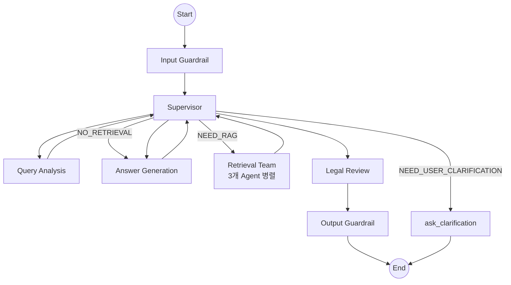

# MAS Supervisor (멀티 에이전트 시스템 오케스트레이터)

**최종 수정**: 2026-01-28 (Phase 9: Conversation Phase System 반영)

## 1. 개요 (Overview)

MAS(Multi-Agent System) Supervisor는 **GPT-5.1 기반 Hub-Spoke 아키텍처**로 6개 전문 에이전트를 조율합니다. LangGraph를 기반으로 각 에이전트(노드) 간의 실행 순서를 제어하고, 상태(State)를 관리하며, 데이터 흐름을 조정합니다.

### 주요 책임
1. **워크플로우 관리 (Workflow)**: 질의 분석 → 검색 → 답변 생성 → 검토 등 전체 프로세스 실행 흐름 정의
2. **상태 관리 (State Management)**: `ChatState` 객체를 통해 대화 히스토리, 검색 결과, 생성된 답변 등을 에이전트 간에 공유
3. **Conversation Phase System**: Rule-based 대화 단계 상태 머신으로 점진적 정보 수집 및 단계별 안내
4. **동적 라우팅 (Dynamic Routing)**: 현재 상태, 단계, 분석 결과에 따라 다음 단계를 동적으로 결정

---

## 2. 상태 스키마 (State Schema)

오케스트레이터는 `ChatState` (TypedDict)를 통해 시스템의 모든 데이터를 관리합니다.

### 주요 필드 설명 (`state/`)

| 필드명 | 타입 | 설명 |
|--------|------|------|
| `messages` | `List[BaseMessage]` | 멀티턴 대화 히스토리 (LangChain 표준) |
| `user_query` | `str` | 현재 턴의 사용자 질문 |
| `mode` | `RoutingMode` | 라우팅 모드 (`NEED_RAG`, `NO_RETRIEVAL`, `NEED_USER_CLARIFICATION`) |
| `query_analysis` | `dict` | 질의 분석 결과 (유형, 키워드, 확장 쿼리 등) |
| `retrieval` | `dict` | 검색 결과 (법령, 사례, 기준 등) |
| `final_answer` | `str` | 최종 생성된 답변 |
| `conversation_phase` | `ConversationPhase` | 대화 단계 (9단계 상태 머신) |
| `dispute_slots` | `Dict[str, Optional[str]]` | 분쟁 상담 슬롯 (구매 품목, 문제 상황 등) |
| `dispute_slot_status` | `Dict[str, SlotStatus]` | 슬롯별 채움 상태 (filled/partial/missing) |

### ConversationPhase (9단계)

```python
ConversationPhase = Literal[
    'initial',                    # 첫 진입
    'info_gathering',             # 정보 수집 중
    'ready_for_analysis',         # 분석 준비 완료
    'providing_law',              # 법령/기준 안내 중
    'awaiting_case_confirm',      # "사례 알려드릴까요?" 대기
    'providing_case',             # 사례 안내 중
    'awaiting_procedure_confirm', # "절차 알려드릴까요?" 대기
    'providing_procedure',        # 절차 안내 중
    'completed',                  # 상담 완료
]
```

---

## 3. 그래프 아키텍처 (Workflow)

현재 시스템은 **MAS Supervisor Graph**를 사용합니다.



### 주요 노드

| 노드 | 설명 |
|------|------|
| `input_guardrail` | 입력 검증 및 안전성 검사 |
| `supervisor` | Hub 역할, 다음 에이전트 결정 |
| `query_analysis` | 사용자 의도 분석, 라우팅 모드 결정, 슬롯 추출 |
| `retrieval_team` | 3개 전문 에이전트 병렬 검색 (법령/기준/사례) |
| `generation` | 검색 결과 기반 답변 생성 (gpt-4o) |
| `legal_review` | 생성 답변의 정확성/안전성 검토 |
| `ask_clarification` | 정보 부족 시 역질문 생성 |
| `output_guardrail` | 출력 검증 및 최종 가공 |

---

## 4. Conversation Manager

`conversation_manager.py`는 대화 단계 전환 및 슬롯 관리를 담당하는 **Rule-based 엔진**입니다.

### 핵심 함수

```python
def update_slots_and_phase(state: ChatState) -> Dict[str, Any]:
    """슬롯 병합 및 단계 전환을 수행. 반환값: dispute_slots, dispute_slot_status, conversation_phase"""

def get_next_questions(state: ChatState) -> List[str]:
    """현재 단계와 누락 슬롯에 따라 1-3개의 질문 반환"""

def detect_yes_no(text: str) -> Optional[bool]:
    """Rule-based 긍정/부정 감지. '네', '아니오' 등 패턴 매칭"""

def should_trigger_clarification(state: ChatState) -> bool:
    """info_gathering 또는 awaiting_*_confirm 단계면 True"""

def get_retriever_types_for_phase(phase: str) -> List[str]:
    """단계별 검색 대상 반환 (providing_law → ['law', 'criteria'])"""
```

### 슬롯 병합 우선순위

1. **extracted_info** (현재 턴 추출) - 최우선
2. **onboarding** (프론트엔드 폼 입력)
3. **existing_slots** (메모리 저장값) - 최후순

### 단계 전환 테이블

```text
initial → info_gathering (분쟁 의도 감지 + 슬롯 누락)
       → ready_for_analysis (분쟁 의도 + 슬롯 완료)

info_gathering → ready_for_analysis (필수 슬롯 채움)

ready_for_analysis → providing_law

providing_law → awaiting_case_confirm

awaiting_case_confirm → providing_case ("네")
                     → awaiting_procedure_confirm ("아니오")

providing_case → awaiting_procedure_confirm

awaiting_procedure_confirm → providing_procedure ("네")
                          → completed ("아니오")

providing_procedure → completed
```

---

## 5. 라우팅 로직

### Query Analysis 후 분기

| 모드 | 다음 노드 | 설명 |
|------|----------|------|
| `NO_RETRIEVAL` | `generation` | 일반 대화, 시스템 질문 (검색 생략) |
| `NEED_USER_CLARIFICATION` | `ask_clarification` | 필수 슬롯 누락, 역질문 필요 |
| `NEED_RAG` | `retrieval_team` | 정보 검색 필요 |
| `RESTRICTED_DOMAIN` | `generation` | 금융/의료 (전문기관 안내) |

### ask_clarification 노드

```python
# graph_mas.py:196-199
if mode in ('NEED_USER_CLARIFICATION', 'NEED_CLARIFICATION'):
    return 'ask_clarification'
```

- `ask_clarification` → END (역질문 후 사용자 응답 대기)
- 단계별 질문은 `ConversationManager.get_next_questions()` 사용

### 단계별 Retriever 선택

```python
# conversation_manager.py:287-295
if phase == 'providing_law':
    return ['law', 'criteria']
if phase == 'providing_case':
    return ['case']
if phase == 'providing_procedure':
    return ['procedure']
```

---

## 6. 코드 구조 (Code Structure)

```
backend/app/supervisor/
├── graph.py              # 그래프 엔트리포인트, get_graph_for_chat_type()
├── graph_mas.py          # MAS Supervisor 그래프 정의 (현재 운영)
├── conversation_manager.py  # Phase 전환, 슬롯 관리 (Rule-based)
├── state/
│   ├── __init__.py       # ChatState 통합, create_initial_state()
│   ├── control.py        # RoutingMode, ConversationPhase 타입
│   ├── session.py        # SessionState
│   ├── agent_results.py  # AgentResultsState
│   ├── output.py         # OutputState
│   ├── supervisor.py     # SupervisorState
│   └── memory.py         # MemoryState
├── nodes/
│   ├── supervisor.py     # Supervisor 노드 로직
│   ├── clarify.py        # ask_clarification 노드
│   ├── retrieval_merge.py  # 3개 Agent 결과 병합
│   └── guardrail.py      # Input/Output Guardrail
└── checkpointer.py       # 대화 상태 체크포인트 (Memory/Postgres)
```

---

## 7. 테스트 방법 (Testing)

오케스트레이터 테스트는 전체 흐름과 상태 전이를 검증합니다.

### 주요 테스트 스크립트

| 파일 | 설명 |
|------|------|
| `test_conversation_phase_manager.py` | ConversationManager 단위 테스트 (81개) |
| `test_mas_supervisor_graph.py` | MAS 그래프 구조 및 노드 존재 여부 |
| `test_pr3_graph.py` | Phase 라우팅 및 상태 전이 검증 |

### 실행 방법

```bash
conda activate dsr

# ConversationManager 테스트 (81개)
pytest backend/scripts/testing/supervisor/test_conversation_phase_manager.py -v

# 그래프 구조 테스트
pytest backend/scripts/testing/supervisor/test_mas_supervisor_graph.py -v
```

---

## 8. 변경 이력 (History)

| 날짜 | 버전 | 내용 |
|------|------|------|
| 2026-01-14 | PR 1 | Fast Path 구현. 일반 대화 시 Review 단계 건너뛰기 |
| 2026-01-22 | PR 3 | Data Collection 로깅 스키마 개선 |
| 2026-01-24 | Phase 7 | **MAS Supervisor 도입**. ReAct 패턴 아카이브 |
| 2026-01-28 | Phase 9 | **Conversation Phase System** 도입. 슬롯 기반 정보 수집, 단계별 라우팅 |
| 2026-01-29 | Phase 10 | **v2 태그 삭제**: v1 코드 제거, 함수명/타입명 V2 접미사 제거, 파일 리네임 |

---

## 9. 고도화 계획 (To-Be)

1. **Human-in-the-loop**: 전문가 개입이 필요한 경우 실행 일시 중지
2. **Multi-turn 요약**: 긴 대화에서 핵심 맥락만 유지하는 메모리 압축
3. **단계별 만족도 측정**: 각 Phase 완료 후 사용자 피드백 수집
