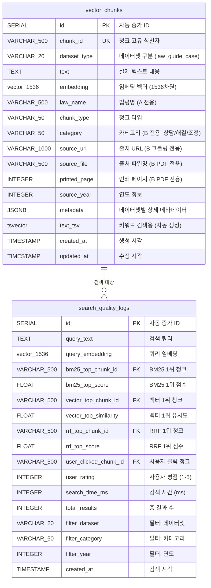

# ERD (Entity-Relationship Diagram)

**작성일**: 2026-01-23
**데이터베이스**: PostgreSQL 17.7 + pgvector 0.8.1
**목적**: A_law_ED_guide + B_case 통합 벡터 검색 시스템

---

## 📊 ERD 다이어그램



---

## 🗂️ 테이블 상세 설명

### 1. **vector_chunks** (메인 테이블)

**용도**: 모든 청크 데이터 통합 저장 (A_law_ED_guide + B_case)

#### 주요 컬럼

| 컬럼명 | 데이터 타입 | 제약조건 | 설명 | 인덱스 |
|--------|-------------|----------|------|--------|
| **id** | SERIAL | PRIMARY KEY | 자동 증가 ID | PK |
| **chunk_id** | VARCHAR(500) | UNIQUE NOT NULL | 청크 고유 식별자 | UNIQUE |
| **dataset_type** | VARCHAR(20) | NOT NULL, CHECK | 'law_guide' 또는 'case' | B-tree |
| **text** | TEXT | NOT NULL | 실제 텍스트 내용 (원본) | - |
| **embedding** | vector(1536) | NOT NULL | 임베딩 벡터 | HNSW |
| **text_tsv** | tsvector | - | 키워드 검색용 (자동 생성) | GIN |
| **law_name** | VARCHAR(500) | - | 법령명 (A 전용) | B-tree |
| **chunk_type** | VARCHAR(50) | - | 청크 타입 | B-tree |
| **category** | VARCHAR(50) | - | 카테고리 (B 전용) | B-tree |
| **source_url** | VARCHAR(1000) | - | 출처 URL (B 크롤링) | B-tree |
| **source_file** | VARCHAR(500) | - | PDF 파일명 (B PDF) | B-tree |
| **printed_page** | INTEGER | - | 인쇄 페이지 (B PDF) | - |
| **source_year** | INTEGER | - | 연도 정보 | B-tree |
| **metadata** | JSONB | - | 상세 메타데이터 | GIN |
| **created_at** | TIMESTAMP | DEFAULT NOW() | 생성 시각 | B-tree |
| **updated_at** | TIMESTAMP | DEFAULT NOW() | 수정 시각 | - |

#### 제약조건

```sql
CHECK (dataset_type IN ('law_guide', 'case'))
UNIQUE (chunk_id)
NOT NULL (chunk_id, dataset_type, text, embedding)
```

#### 인덱스 (총 16개)

**기본 인덱스**:
- `idx_chunk_id` (UNIQUE): chunk_id
- `idx_dataset_type` (B-tree): dataset_type
- `idx_law_name` (B-tree, WHERE law_name IS NOT NULL): law_name
- `idx_chunk_type` (B-tree): chunk_type
- `idx_category` (B-tree, WHERE category IS NOT NULL): category
- `idx_created_at` (B-tree): created_at

**출처 정보 인덱스**:
- `idx_source_url` (B-tree, WHERE source_url IS NOT NULL): source_url
- `idx_source_file` (B-tree, WHERE source_file IS NOT NULL): source_file
- `idx_source_year` (B-tree, WHERE source_year IS NOT NULL): source_year
- `idx_source_file_page` (복합, WHERE source_file IS NOT NULL): (source_file, printed_page)

**복합 인덱스**:
- `idx_dataset_category` (WHERE category IS NOT NULL): (dataset_type, category)
- `idx_law_chunk_type` (WHERE law_name IS NOT NULL): (law_name, chunk_type)

**전문 검색 인덱스**:
- `idx_text_tsv` (GIN): text_tsv (하이브리드 검색 BM25용)
- `idx_metadata_gin` (GIN): metadata
- `idx_metadata_keywords` (GIN, WHERE dataset_type = 'law_guide'): (metadata->'keywords')

**벡터 인덱스**:
- `idx_embedding_hnsw` (HNSW): embedding (vector_cosine_ops)

#### 트리거

**1. updated_at 자동 갱신**:
```sql
CREATE TRIGGER trigger_update_updated_at
BEFORE UPDATE ON vector_chunks
FOR EACH ROW
EXECUTE FUNCTION update_updated_at_column();
```

**2. tsvector 자동 생성** (키워드 검색용):
```sql
CREATE TRIGGER tsvector_update
BEFORE INSERT OR UPDATE ON vector_chunks
FOR EACH ROW EXECUTE FUNCTION
tsvector_update_trigger(text_tsv, 'pg_catalog.simple', text);
```

---

### 2. **search_quality_logs** (검색 품질 모니터링)

**용도**: 하이브리드 검색 품질 및 사용자 피드백 추적

#### 주요 컬럼

| 컬럼명 | 데이터 타입 | 제약조건 | 설명 |
|--------|-------------|----------|------|
| **id** | SERIAL | PRIMARY KEY | 자동 증가 ID |
| **query_text** | TEXT | NOT NULL | 검색 쿼리 |
| **query_embedding** | vector(1536) | - | 쿼리 임베딩 |
| **bm25_top_chunk_id** | VARCHAR(500) | - | BM25 1위 청크 ID |
| **bm25_top_score** | FLOAT | - | BM25 1위 점수 |
| **vector_top_chunk_id** | VARCHAR(500) | - | 벡터 검색 1위 청크 ID |
| **vector_top_similarity** | FLOAT | - | 벡터 1위 유사도 |
| **rrf_top_chunk_id** | VARCHAR(500) | - | RRF 통합 1위 청크 ID |
| **rrf_top_score** | FLOAT | - | RRF 1위 점수 |
| **user_clicked_chunk_id** | VARCHAR(500) | - | 사용자가 클릭한 청크 ID |
| **user_rating** | INTEGER | CHECK (1-5) | 사용자 평점 (1-5점) |
| **search_time_ms** | INTEGER | - | 검색 소요 시간 (밀리초) |
| **total_results** | INTEGER | - | 총 결과 수 |
| **filter_dataset** | VARCHAR(20) | - | 사용된 필터: 데이터셋 |
| **filter_category** | VARCHAR(50) | - | 사용된 필터: 카테고리 |
| **filter_year** | INTEGER | - | 사용된 필터: 연도 |
| **created_at** | TIMESTAMP | DEFAULT NOW() | 검색 시각 |

#### 제약조건

```sql
CHECK (user_rating BETWEEN 1 AND 5)
```

#### 인덱스

- `idx_search_logs_created_at` (B-tree): created_at
- `idx_search_logs_query_text` (GIN): to_tsvector('simple', query_text)

#### 관계

**논리적 외래키 (Foreign Key 미설정)**:
- `bm25_top_chunk_id` → `vector_chunks.chunk_id`
- `vector_top_chunk_id` → `vector_chunks.chunk_id`
- `rrf_top_chunk_id` → `vector_chunks.chunk_id`
- `user_clicked_chunk_id` → `vector_chunks.chunk_id`

**참고**: 성능상의 이유로 FK 제약조건은 설정하지 않음 (로그 테이블)

---

## 🔗 테이블 관계

### 관계 유형

```
vector_chunks (1) ────── (0..*) search_quality_logs
                    검색 대상

- vector_chunks: 청크 데이터 (검색 대상)
- search_quality_logs: 검색 로그 (어떤 청크가 검색되었는지 기록)
```

### 관계 설명

**1:N 관계**:
- 하나의 청크(`vector_chunks`)는 여러 번 검색될 수 있음
- 각 검색마다 로그(`search_quality_logs`)가 생성됨

**참조 무결성**:
- FK 제약조건은 설정하지 않음 (로그 테이블 특성상)
- 애플리케이션 레벨에서 참조 무결성 관리
- 청크 삭제 시 로그는 유지 (히스토리 보존)

---

## 📐 데이터셋별 컬럼 사용 패턴

### A_law_ED_guide (법령 데이터)

| 컬럼 | 사용 | 예시 값 |
|------|------|---------|
| dataset_type | ✅ 고정 | `'law_guide'` |
| text | ✅ | "제16조(청약철회) 소비자는..." |
| embedding | ✅ | [0.123, -0.456, ...] |
| law_name | ✅ | "소비자기본법" |
| chunk_type | ✅ | "조_전체", "항_조항" 등 |
| category | ❌ NULL | - |
| source_url | ❌ NULL | - |
| source_file | ❌ NULL | - |
| printed_page | ❌ NULL | - |
| source_year | ✅ | 2023 (시행일 연도) |
| metadata | ✅ | {"법령번호": "법률 제20432호", ...} |

### B_case - 크롤링 데이터

| 컬럼 | 사용 | 예시 값 |
|------|------|---------|
| dataset_type | ✅ 고정 | `'case'` |
| text | ✅ | "질문: 환불 거부... 답변: ..." |
| embedding | ✅ | [0.234, -0.567, ...] |
| law_name | ❌ NULL | - |
| chunk_type | ✅ 고정 | `'case'` |
| category | ✅ | "상담", "해결", "조정" |
| source_url | ✅ | "https://www.consumer.go.kr/..." |
| source_file | ❌ NULL | - |
| printed_page | ❌ NULL | - |
| source_year | ❌ NULL | (선택적) |
| metadata | ✅ | {"number": "11342", "title": "..."} |

### B_case - PDF 데이터

| 컬럼 | 사용 | 예시 값 |
|------|------|---------|
| dataset_type | ✅ 고정 | `'case'` |
| text | ✅ | "신청인은 2010.1.16. ..." |
| embedding | ✅ | [0.345, -0.678, ...] |
| law_name | ❌ NULL | - |
| chunk_type | ✅ 고정 | `'case'` |
| category | ✅ | "해결", "조정" |
| source_url | ❌ NULL | - |
| source_file | ✅ | "2020년 소비자분쟁 해결사례집.pdf" |
| printed_page | ✅ | 48 |
| source_year | ✅ | 2020 |
| metadata | ✅ | {"item_name": "가구", ...} |

---

## 🔍 주요 검색 쿼리 패턴

### 1. 하이브리드 검색 (BM25 + 벡터 + RRF)

```sql
SELECT * FROM search_hybrid_rrf(
    '소비자기본법 제16조 환불',        -- query_text
    '[0.1, 0.2, ...]'::vector(1536),  -- query_embedding
    'case',                            -- filter_dataset
    '조정',                            -- filter_category
    2020,                              -- filter_year
    10,                                -- result_limit
    60                                 -- rrf_k
);
```

**내부 조인**:
```sql
-- BM25 결과와 벡터 결과를 FULL OUTER JOIN
-- RRF 통합 후 vector_chunks와 JOIN하여 원본 데이터 가져오기
```

### 2. 카테고리별 검색

```sql
SELECT chunk_id, text, category, source_file
FROM vector_chunks
WHERE dataset_type = 'case'
  AND category = '조정'
  AND source_year = 2020;
```

### 3. 법령 검색

```sql
SELECT chunk_id, text, law_name, chunk_type
FROM vector_chunks
WHERE dataset_type = 'law_guide'
  AND law_name = '소비자기본법'
  AND chunk_type = '조_전체';
```

### 4. 검색 품질 분석

```sql
SELECT * FROM search_quality_analysis
WHERE search_date >= CURRENT_DATE - INTERVAL '30 days'
ORDER BY search_date DESC;
```

**내부 조인**:
```sql
-- search_quality_logs를 DATE로 그룹핑
-- 평균 CTR, 검색 시간, 정확도 계산
```

---

## 📊 데이터 통계 (예상)

| 항목 | A_law_ED_guide | B_case (Semantic Chunking) | 합계 |
|------|----------------|----------------------------|------|
| **총 레코드 수** | 6,138 | 46,314 | **52,452** |
| **평균 text 길이** | ~500자 | ~800자 | ~700자 |
| **평균 레코드 크기** | ~12KB | ~15KB | ~14KB |
| **총 테이블 크기** | ~75 MB | ~695 MB | **~770 MB** |
| **인덱스 크기** | ~200 MB | ~1,000 MB | **~1.2 GB** |
| **총 디스크 사용량** | - | - | **~2.0 GB** |

---

## 🎯 설계 특징

### 1. **단일 테이블 통합** (Single Table Design)

**장점**:
- ✅ 통합 벡터 검색 (HNSW 인덱스 1개)
- ✅ 하이브리드 검색 간소화 (UNION 불필요)
- ✅ 관리 복잡도 감소

**단점**:
- ⚠️ NULL 컬럼 존재 (dataset_type별 사용 컬럼 상이)
- ⚠️ 스키마 변경 시 영향 범위 큼

### 2. **컬럼 설계 전략**

**별도 컬럼 추출**:
- 자주 필터링되는 필드: law_name, category, source_year
- 출처 정보: source_url, source_file, printed_page
- **이유**: B-tree 인덱스 사용 가능, 검색 성능 향상

**JSONB 메타데이터**:
- 데이터셋별 고유 필드
- 자주 변경되는 필드
- **이유**: 스키마 유연성, GIN 인덱스로 검색 가능

### 3. **인덱스 전략**

**3가지 인덱스 타입 병행**:
1. **B-tree**: 정확한 일치, 범위 검색 (category, source_year)
2. **GIN**: 전문 검색, JSONB 검색 (text_tsv, metadata)
3. **HNSW**: 벡터 유사도 검색 (embedding)

### 4. **검색 품질 모니터링**

**별도 로그 테이블**:
- 메인 테이블과 분리 (성능 영향 최소화)
- FK 미설정 (로그 특성상 참조 무결성 불필요)
- 검색 알고리즘 비교 가능 (BM25 vs 벡터 vs RRF)

---

## 🔄 데이터 흐름

### 삽입 시

```
원본 JSONL 파일
    ↓
Python 스크립트 (02_01_insert_*.py)
    ↓
데이터 변환 (청크 → 테이블 레코드)
    ↓
PostgreSQL INSERT
    ↓
트리거 자동 실행:
  - text_tsv 생성 (to_tsvector)
  - updated_at 갱신
    ↓
인덱스 자동 업데이트:
  - B-tree, GIN, HNSW
```

### 검색 시

```
사용자 쿼리
    ↓
FastAPI 엔드포인트
    ↓
쿼리 임베딩 생성 (OpenAI API)
    ↓
PostgreSQL 하이브리드 검색:
  - BM25 검색 (GIN 인덱스)
  - 벡터 검색 (HNSW 인덱스)
  - RRF 통합
    ↓
결과 반환 (chunk_id, text, 출처 정보)
    ↓
검색 로그 기록 (search_quality_logs)
```

---

## 📝 참고사항

### 외래키 미사용 이유

**설계 결정**: search_quality_logs ↔ vector_chunks 간 FK 미설정

**이유**:
1. **성능**: 로그 테이블에 대량 INSERT 시 FK 검사 오버헤드
2. **유연성**: 청크 삭제 후에도 히스토리 보존
3. **독립성**: 로그 테이블 독립적 운영 가능

### tsvector 자동 생성

**트리거 사용**:
- 매 INSERT/UPDATE 시 text_tsv 자동 생성
- 수동 관리 불필요
- 항상 text와 동기화 보장

### JSONB vs 별도 컬럼

**별도 컬럼**:
- 자주 필터링: category, law_name, source_year
- B-tree 인덱스 활용

**JSONB**:
- 데이터셋별 고유 필드
- 스키마 유연성
- GIN 인덱스로 검색 가능

---

**문서 버전**: 1.0
**최종 수정**: 2026-01-23
