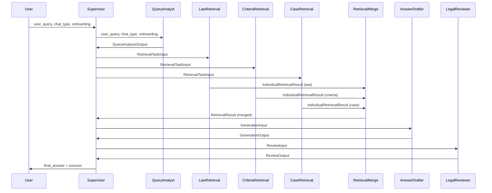

# Agent Protocols - 에이전트 간 통신 규약

**작성일**: 2026-01-29
**버전**: MAS v2 (Phase 7)

---

## 목차

1. [전체 데이터 흐름 개요](#1-전체-데이터-흐름-개요)
2. [에이전트별 Input/Output 스펙](#2-에이전트별-inputoutput-스펙)
3. [ChatState 필드 매핑 테이블](#3-chatstate-필드-매핑-테이블)
4. [Supervisor 조율 프로토콜](#4-supervisor-조율-프로토콜)
5. [참조 파일](#5-참조-파일)

---

## 1. 전체 데이터 흐름 개요

MAS Supervisor 시스템에서 각 에이전트는 명확한 입출력 인터페이스를 가지고 있습니다.
다음 시퀀스 다이어그램은 User 요청이 각 에이전트를 거쳐 최종 답변으로 변환되는 과정을 보여줍니다.



### 주요 흐름 단계

1. **Input**: User가 질문(`user_query`)과 메타데이터(`chat_type`, `onboarding`)를 Supervisor에 전달
2. **Query Analysis**: QueryAnalyst가 질문을 분석하여 확장 쿼리(`expanded_queries`)와 추천 에이전트(`retriever_types`) 생성
3. **Retrieval (Fan-out)**: Supervisor가 3개 Retrieval Agent에 병렬로 검색 요청
   - LawRetrieval: 법령 검색
   - CriteriaRetrieval: 분쟁해결기준 검색
   - CaseRetrieval: 조정/상담사례 검색
4. **Retrieval Merge (Fan-in)**: RetrievalMerge 노드가 3개 에이전트 결과를 병합
5. **Answer Generation**: AnswerDrafter가 검색 결과를 바탕으로 답변 초안 생성
6. **Legal Review**: LegalReviewer가 사실 검증 및 금지표현 검토
7. **Output**: 최종 답변(`final_answer`)과 인용 출처(`sources`) 반환

---

## 2. 에이전트별 Input/Output 스펙

### 2.1 QueryAnalysisAgent (질의분석)

사용자 질문을 분석하여 확장 쿼리와 추천 검색 에이전트를 결정합니다.

#### Input: `QueryAnalysisInput`

```python
class QueryAnalysisInput(TypedDict):
    """
    질의분석 노드 입력 (v2).

    Attributes:
        user_query: 사용자가 입력한 원본 질문
        chat_type: 채팅 유형 ('dispute' | 'general')
        onboarding: 온보딩 폼 데이터 (분쟁 상담 시)
    """
    user_query: str
    chat_type: ChatType  # 'dispute' | 'general'
    onboarding: Optional[OnboardingInfo]
```

**OnboardingInfo** (분쟁 상담 시 수집 정보):
```python
class OnboardingInfo(TypedDict, total=False):
    purchase_date: Optional[str]       # 구매 날짜
    purchase_place: Optional[str]      # 구매 장소
    purchase_platform: Optional[str]   # 구매 플랫폼
    purchase_item: Optional[str]       # 구매 품목
    purchase_amount: Optional[str]     # 구매 금액
    dispute_details: Optional[str]     # 분쟁 상세 내용
```

#### Output: `QueryAnalysisOutput`

```python
class QueryAnalysisOutput(TypedDict):
    """
    질의분석 노드 출력 (v2).

    LLM 기반 다중 쿼리 확장이 적용된 출력입니다.

    Attributes:
        intent: 의도 분류 ('general' | 'information_search')
        original_query: 원본 질문
        expanded_queries: 다중 확장 쿼리 리스트 (최대 5개)
        keywords: 핵심 키워드 목록
        retriever_types: 추천 검색 에이전트 타입 목록
        needs_clarification: 추가 정보 필요 여부
        missing_fields: 누락된 필드 목록
    """
    intent: IntentType  # 'general' | 'information_search'
    original_query: str
    expanded_queries: List[str]  # 최대 5개
    keywords: List[str]
    retriever_types: List[RetrieverType]  # ['law', 'criteria', 'case']
    needs_clarification: bool
    missing_fields: List[str]
```

**예시**:
```python
{
    "intent": "information_search",
    "original_query": "헬스장 환불 규정 알려줘",
    "expanded_queries": [
        "헬스장 환불 규정",
        "체육시설 환불 기준",
        "소비자분쟁해결기준 헬스장",
        "헬스장 중도해지 환불",
        "운동시설 위약금"
    ],
    "keywords": ["헬스장", "환불", "규정", "체육시설"],
    "retriever_types": ["law", "criteria", "case"],
    "needs_clarification": False,
    "missing_fields": []
}
```

---

### 2.2 RetrievalAgents (정보검색) - Law, Criteria, Case

3개의 전문 검색 에이전트가 병렬로 실행되어 각자의 도메인에서 관련 문서를 검색합니다.

#### 공통 Input: `RetrievalTaskInput`

```python
class RetrievalTaskInput(TypedDict):
    """
    Supervisor → Retrieval Agent 입력 (v2).

    Attributes:
        expanded_queries: 확장 쿼리 리스트
        agent_keywords: 해당 에이전트용 추출 키워드
        metadata_filter: 메타데이터 필터
        top_k: 반환 문서 수
        ignore_threshold: 임계치 무시 여부
    """
    expanded_queries: List[str]
    agent_keywords: List[str]
    metadata_filter: MetadataFilter
    top_k: int
    ignore_threshold: bool
```

#### 메타데이터 필터: `MetadataFilter`

```python
class MetadataFilter(TypedDict, total=False):
    """
    검색 메타데이터 필터.

    Attributes:
        dataset_type: 데이터셋 타입 ('law_guide' 등)
        document_types: 문서 타입 목록 (['법률', '시행령'] or ['행정규칙', '별표'])
        categories: 카테고리 목록 (['조정', '해결', '상담'])
    """
    dataset_type: Optional[str]
    document_types: Optional[List[str]]
    categories: Optional[List[str]]
```

**에이전트별 메타데이터 필터**:

| Agent | dataset_type | document_types | categories |
|-------|-------------|----------------|-----------|
| **LawRetrieval** | `law_guide` | `['법률', '시행령']` | - |
| **CriteriaRetrieval** | `law_guide` | `['행정규칙', '별표']` | - |
| **CaseRetrieval** | - | - | `['조정', '해결', '상담']` |

#### 공통 Output: `RetrievalResult`

```python
class RetrievalResult(TypedDict):
    """
    Retrieval Agent → Supervisor 출력 (v2).

    Attributes:
        source: 검색 소스 ('law' | 'criteria' | 'case')
        documents: 검색된 문서 목록
        max_similarity: 최대 유사도
        avg_similarity: 평균 유사도
        search_time_ms: 검색 소요 시간 (ms)
        error: 오류 메시지 (실패 시)
    """
    source: RetrieverType  # 'law' | 'criteria' | 'case'
    documents: List[RetrievedDocument]
    max_similarity: float
    avg_similarity: float
    search_time_ms: float
    error: Optional[str]
```

#### 에이전트별 Document 형식

**LawDocument** (법령 문서):
```python
class LawDocument(TypedDict):
    chunk_id: str           # 청크 ID
    content: str            # 법령 본문
    metadata: {
        law_name: str       # 법령명 (예: "소비자기본법")
        full_path: str      # 계층 경로 (예: "제2장 > 제7조 > 제1항")
        article: str        # 조문 번호
        document_type: str  # 문서 타입 ('법률', '시행령')
        dataset_type: str   # 'law_guide'
    }
    similarity: float       # 유사도 점수
```

**CriteriaDocument** (분쟁해결기준 문서):
```python
class CriteriaDocument(TypedDict):
    chunk_id: str           # 청크 ID
    content: str            # 기준 내용
    metadata: {
        source_label: str   # 출처 (예: "표1", "표2")
        category: str       # 대분류 (예: "물품", "서비스")
        item: str           # 품목 (예: "헬스장")
        title: str          # 제목
        document_type: str  # '행정규칙', '별표'
        dataset_type: str   # 'law_guide'
    }
    similarity: float
```

**CaseDocument** (조정/상담사례 문서):
```python
class CaseDocument(TypedDict):
    chunk_id: str               # 청크 ID
    content: str                # 사례 내용
    metadata: {
        doc_title: str          # 사례 제목
        source_org: str         # 출처 기관 ('KCA', 'ECMC', 'KCDRC')
        category: str           # 카테고리 ('조정', '해결', '상담')
        decision_date: str      # 결정 날짜 (YYYY-MM-DD)
        chunk_type: str         # 청크 유형
        url: Optional[str]      # 원문 URL
    }
    similarity: float
```

---

### 2.3 AnswerGenerationAgent (답변생성)

검색된 문서를 기반으로 답변 초안을 생성하고, 주장-근거 매핑과 사례 인용을 수행합니다.

#### Input: `GenerationInput`

```python
class GenerationInput(TypedDict):
    """
    답변생성 노드 입력 (v2).

    Attributes:
        user_query: 원본 사용자 쿼리
        expanded_queries: 확장 쿼리 리스트 (컨텍스트 제공용)
        retrieval_results: 모든 검색 결과
        retry_context: 재생성 시 위반사항 정보
    """
    user_query: str
    expanded_queries: List[str]
    retrieval_results: List[RetrievalResult]
    retry_context: Optional[RetryContext]
```

**RetryContext** (재생성 컨텍스트):
```python
class RetryContext(TypedDict):
    """
    재생성 컨텍스트.

    검토 실패 시 AnswerDrafter에게 전달되는 정보입니다.

    Attributes:
        violations: 이전 답변의 위반 사항 목록
        previous_draft: 이전 답변
        retry_count: 재시도 횟수 (max 1)
    """
    violations: List[str]
    previous_draft: str
    retry_count: int
```

#### Output: `GenerationOutput`

```python
class GenerationOutput(TypedDict):
    """
    답변생성 노드 출력 (v2).

    Attributes:
        draft_answer: 생성된 답변 초안
        claim_evidence_map: 주장-근거 매핑 목록
        cited_cases: 인용된 사례 정보 목록
        has_sufficient_evidence: 근거 충분 여부
        generation_time_ms: 생성 소요 시간 (ms)
    """
    draft_answer: str
    claim_evidence_map: List[ClaimEvidence]
    cited_cases: List[CitedCase]
    has_sufficient_evidence: bool
    generation_time_ms: float
```

**ClaimEvidence** (주장-근거 매핑):
```python
class ClaimEvidence(TypedDict):
    """
    주장-근거 매핑 (v2).

    Attributes:
        claim: 답변 내 주장
        evidence_chunk_ids: 근거가 되는 청크 ID 목록
        evidence_texts: 근거 텍스트 목록
        evidence_source: 근거 소스 ('law' | 'criteria' | 'case' | 'counsel')
        grounded: 근거 있음 여부
    """
    claim: str
    evidence_chunk_ids: List[str]
    evidence_texts: List[str]
    evidence_source: EvidenceSource  # 'law' | 'criteria' | 'case' | 'counsel'
    grounded: bool
```

**CitedCase** (인용된 사례 정보):
```python
class CitedCase(TypedDict):
    """
    인용된 사례 정보.

    Attributes:
        case_id: 사례 ID
        category: 카테고리 ('조정' | '해결' | '상담')
        title: 사례 제목
        summary: 사례 요약 (답변에 포함된 내용)
        relevance: 현재 질의와의 관련성 설명
    """
    case_id: str
    category: CaseCategory  # '조정' | '해결' | '상담'
    title: str
    summary: str
    relevance: str
```

**예시**:
```python
{
    "draft_answer": "헬스장 회원권 환불은 소비자분쟁해결기준에 따라...",
    "claim_evidence_map": [
        {
            "claim": "헬스장 환불 시 3개월 미만 사용 시 환불금은 70%입니다.",
            "evidence_chunk_ids": ["criteria_12345"],
            "evidence_texts": ["사용기간 3개월 미만: 위약금 30%"],
            "evidence_source": "criteria",
            "grounded": True
        }
    ],
    "cited_cases": [
        {
            "case_id": "case_67890",
            "category": "조정",
            "title": "헬스장 회원권 중도해지 환불 분쟁",
            "summary": "소비자가 3개월 사용 후 중도해지 요청...",
            "relevance": "유사한 환불 조건 적용 사례"
        }
    ],
    "has_sufficient_evidence": True,
    "generation_time_ms": 1234.5
}
```

---

### 2.4 LegalReviewAgent (법률검토)

생성된 답변을 검토하여 사실 검증, 금지표현 검출, 인용 검증을 수행합니다.

#### Input: `ReviewInput`

```python
class ReviewInput(TypedDict):
    """
    법률검토 노드 입력 (v2).

    Attributes:
        user_query: 원본 질문
        draft_answer: 검토할 답변
        claim_evidence_map: 주장-근거 매핑
        cited_cases: 인용된 사례 목록
        retrieval_results: 원본 검색 결과 (검증용)
        retry_count: 현재 재시도 횟수
    """
    user_query: str
    draft_answer: str
    claim_evidence_map: List[ClaimEvidence]
    cited_cases: List[CitedCase]
    retrieval_results: List[RetrievalResult]
    retry_count: int
```

#### Output: `ReviewOutput`

```python
class ReviewOutput(TypedDict):
    """
    법률검토 노드 출력 (v2).

    Attributes:
        passed: 검토 통과 여부
        violations: 위반 사항 목록 (passed=False일 때)
        final_answer: 수정된 최종 답변 (passed=True일 때)
        review_time_ms: 검토 소요 시간 (ms)
    """
    passed: bool
    violations: List[Violation]
    final_answer: Optional[str]
    review_time_ms: float
```

**Violation** (위반 사항):
```python
class Violation(TypedDict):
    """
    위반 사항 상세.

    Attributes:
        type: 위반 유형
            - 'hallucination': 근거 없는 사실 주장
            - 'legal_judgment': 법률적 판단 표현
            - 'prohibited_expression': 금지 표현 사용
            - 'query_mismatch': 질문과 무관한 답변
        description: 위반 내용 상세
        location: 위반 위치 (문장 또는 단락)
        severity: 심각도 ('critical' | 'warning')
        suggestion: 수정 제안
    """
    type: ViolationType
    description: str
    location: str
    severity: SeverityLevel  # 'critical' | 'warning'
    suggestion: Optional[str]
```

**예시 (검토 통과)**:
```python
{
    "passed": True,
    "violations": [],
    "final_answer": "헬스장 회원권 환불은 소비자분쟁해결기준에 따라...",
    "review_time_ms": 567.8
}
```

**예시 (검토 실패 - 재생성 필요)**:
```python
{
    "passed": False,
    "violations": [
        {
            "type": "legal_judgment",
            "description": "법률적 판단 표현 '~할 의무가 있습니다' 사용",
            "location": "두 번째 문단",
            "severity": "critical",
            "suggestion": "'~해야 합니다' 대신 '~할 수 있습니다'로 수정"
        }
    ],
    "final_answer": None,
    "review_time_ms": 890.1
}
```

---

## 3. ChatState 필드 매핑 테이블

각 노드가 어떤 ChatState 필드를 읽고 쓰는지 정리한 테이블입니다.

| ChatState 필드 | 쓰는 노드 | 읽는 노드 |
|---|---|---|
| **user_query** | `cache_check` | 모든 노드 |
| **chat_type** | (초기 설정) | `query_analysis` |
| **onboarding** | (초기 설정) | `query_analysis` |
| **query_analysis** | `query_analysis` | `supervisor`, `retrieval_*`, `generation` |
| **expanded_queries** | `query_analysis` | `supervisor`, `retrieval_*`, `generation` |
| **supervisor** | `supervisor` | 라우팅 로직 |
| **individual_retrieval_results** | `retrieval_*` (operator.add) | `retrieval_merge` |
| **retrieval** | `retrieval_merge` | `supervisor`, `generation`, `review` |
| **sources** | `retrieval_merge` (operator.add) | `output_guardrail` |
| **draft_answer** | `generation` | `supervisor`, `review` |
| **claim_evidence_map** | `generation` | `review` |
| **cited_cases** | `generation` | `review` |
| **retry_context** | `review` | `generation` |
| **retry_count** | `review` | 라우팅 로직 |
| **review** | `review` | `supervisor` |
| **final_answer** | `review` / `cache_response` / `ask_clarification` | `output_guardrail` |
| **mode** | `query_analysis` / `supervisor` | 라우팅 로직 |
| **guardrail_blocked** | `input_guardrail` / `output_guardrail` | 라우팅 로직 |

### 주요 reducer 필드

- **sources**: `operator.add`로 누적 (각 Retrieval Agent가 인용 출처 추가)
- **individual_retrieval_results**: `operator.add`로 누적 (3개 Retrieval Agent 병렬 실행)
- **messages**: `add_messages` reducer (MessagesState 상속)

---

## 4. Supervisor 조율 프로토콜

Supervisor는 MAS 시스템의 Hub로서 각 에이전트를 조율하고 Phase 진행을 관리합니다.

### 4.1 Phase Progression (단계 진행)

Supervisor는 다음 5개 Phase를 순차적으로 진행합니다:

```python
Phase = Literal['analyzing', 'retrieving', 'drafting', 'reviewing', 'done']
```

| Phase | 설명 | 다음 에이전트 |
|-------|-----|-----------|
| **analyzing** | 질의 분석 단계 | `query_analyst` |
| **retrieving** | 정보 검색 단계 | `retrieval_team` (Fan-out) |
| **drafting** | 답변 생성 단계 | `answer_drafter` |
| **reviewing** | 법률 검토 단계 | `legal_reviewer` |
| **done** | 완료 | `output_guardrail` |

### 4.2 Decision Factors (의사결정 요소)

Supervisor는 다음 State 필드를 체크하여 다음 에이전트를 결정합니다:

1. **current_phase**: 현재 진행 단계
2. **mode**: 라우팅 모드 (`NO_RETRIEVAL` | `NEED_RAG` | `NEED_CLARIFICATION`)
3. **query_analysis.retriever_types**: 추천 검색 에이전트 목록
4. **retry_count**: 재생성 횟수 (max 1회)
5. **review.passed**: 검토 통과 여부

### 4.3 Fast Path (빠른 경로)

`NO_RETRIEVAL` 모드 쿼리는 검색과 검토를 생략합니다:

- **대상 쿼리**: `general` 의도 (예: "안녕하세요", "도움말")
- **흐름**: `query_analysis` → `generation` → `output_guardrail`
- **생략**: `retrieval_team`, `legal_reviewer`

### 4.4 Retry Loop (재생성 루프)

검토 실패 시 최대 1회 재생성을 시도합니다:

```
1. generation → review (passed=False, violations=[...])
2. review → retry_context 생성 → supervisor
3. supervisor → next_agent='retry_generation' → generation
4. generation (retry) → review
5. review (passed=True or retry_count >= 1) → done
```

**최대 재시도 횟수**: 1회
**재시도 초과 시 동작**: 검토 실패한 답변을 그대로 반환하고 `done`으로 종료

### 4.5 Selective Retrieval (선택적 검색)

QueryAnalyst가 추천한 `retriever_types`에 따라 필요한 에이전트만 실행합니다:

```python
# 예시: Law와 Criteria만 필요한 경우
retriever_types = ['law', 'criteria']
→ Fan-out: [retrieval_law, retrieval_criteria]
→ retrieval_case는 실행 안 됨
```

**기본값**: `['law', 'criteria', 'case']` (3개 모두 실행)

---

## 5. 참조 파일

이 문서는 다음 소스 파일을 기반으로 작성되었습니다:

### 핵심 정의 파일
- **`backend/app/agents/protocols.py`**
  모든 에이전트의 Input/Output TypedDict 정의

- **`backend/app/supervisor/state/__init__.py`**
  ChatState 통합 정의 및 하위 상태 모듈

- **`backend/app/supervisor/graph_mas.py`**
  MAS Supervisor 그래프 구조 및 라우팅 로직

### 에이전트별 인터페이스 문서
- **`backend/app/agents/retrieval/INTERFACE_LAW_CRITERIA.md`**
  LawRetrieval, CriteriaRetrieval 에이전트 상세 스펙

- **`backend/app/agents/retrieval/INTERFACE_COUNSEL_CASE.md`**
  CaseRetrieval 에이전트 상세 스펙 (Counsel은 v2에서 제외됨)

### 에이전트 구현 파일
- **`backend/app/agents/query_analysis/agent.py`** - QueryAnalyst 구현
- **`backend/app/agents/retrieval/law_agent.py`** - LawRetrieval 구현
- **`backend/app/agents/retrieval/criteria_agent.py`** - CriteriaRetrieval 구현
- **`backend/app/agents/retrieval/case_agent.py`** - CaseRetrieval 구현
- **`backend/app/agents/answer_generation/agent.py`** - AnswerDrafter 구현
- **`backend/app/agents/legal_review/agent.py`** - LegalReviewer 구현

### Supervisor 노드
- **`backend/app/supervisor/nodes/supervisor.py`** - SupervisorNode 구현
- **`backend/app/supervisor/nodes/retrieval_merge.py`** - RetrievalMerge 노드

---

## 변경 이력

- **2026-01-29**: 최초 작성 (MAS v2 Phase 7 기준)
- 향후 에이전트 추가/변경 시 이 문서도 함께 업데이트 필요

---

**Note**: 이 문서는 개발자가 새로운 에이전트를 추가하거나 기존 에이전트를 수정할 때 반드시 참고해야 하는 계약(Contract) 역할을 합니다. 프로토콜을 위반하면 Supervisor 라우팅이 실패하거나 예상치 못한 동작이 발생할 수 있습니다.
