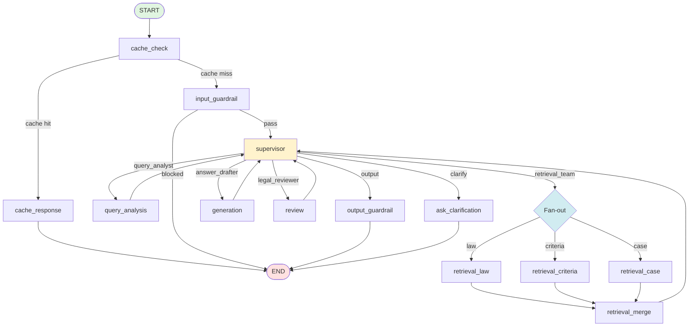
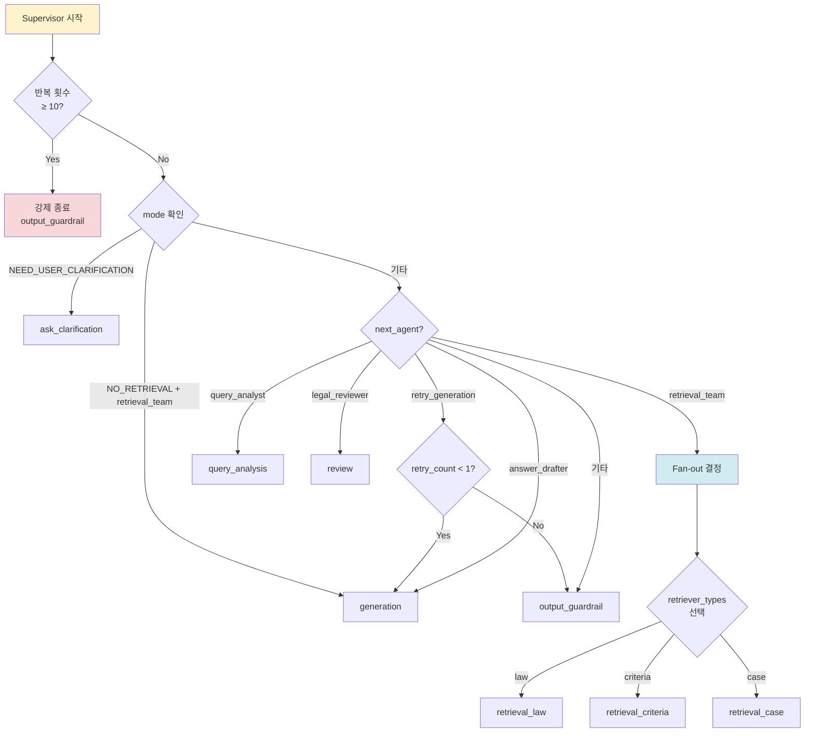
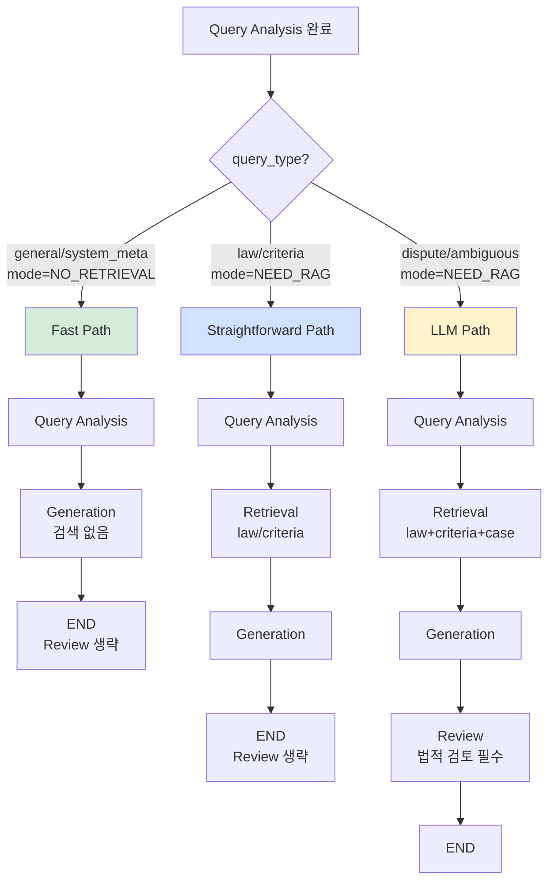
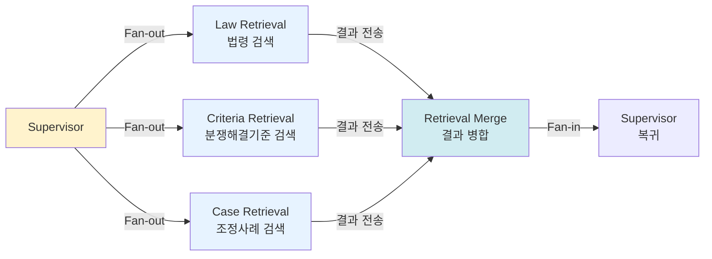
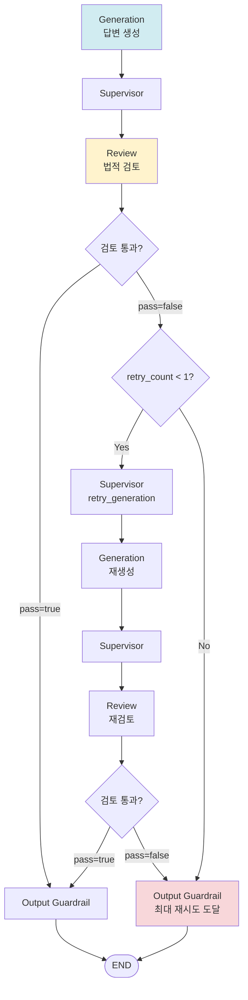
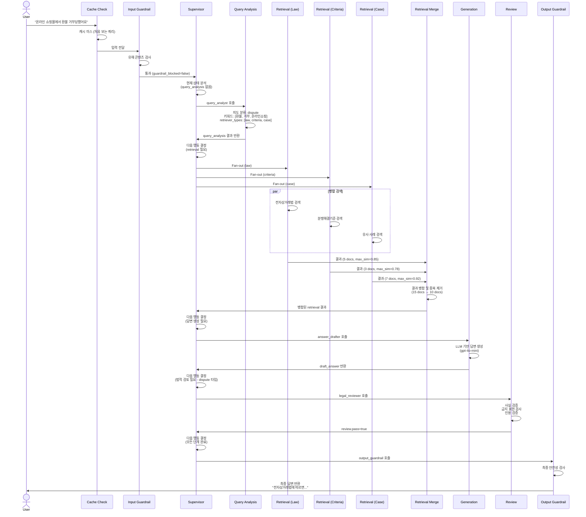
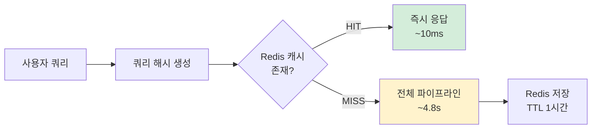
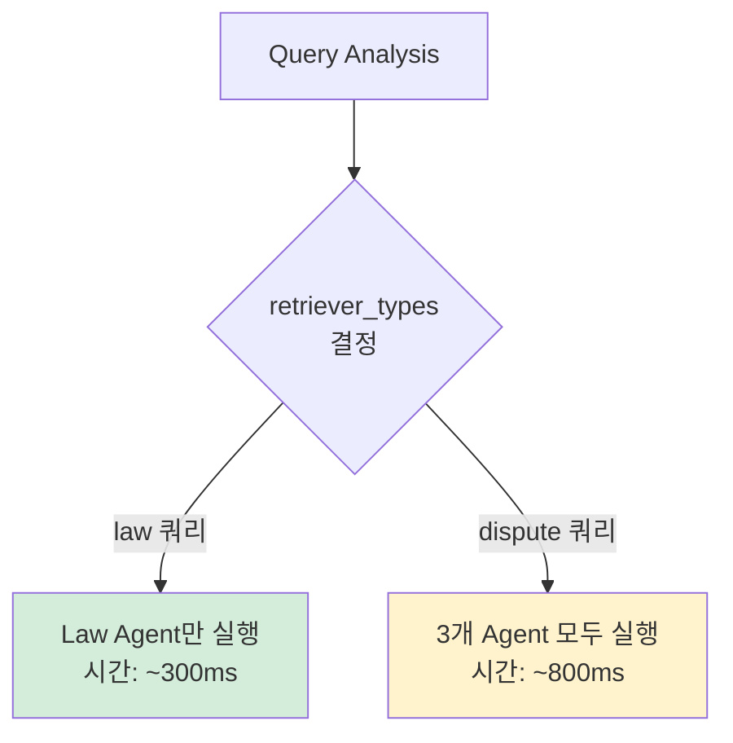

# MAS Supervisor 그래프 토폴로지

**작성일**: 2026-01-29
**버전**: Phase 7 (MAS Supervisor v2)
**소스**: `backend/app/supervisor/graph_mas.py`

이 문서는 똑소리 프로젝트의 MAS (Multi-Agent System) Supervisor 그래프의 전체 구조와 실행 흐름을 Mermaid 다이어그램으로 시각화합니다.

---

## 1. 전체 MAS Graph 흐름

MAS Supervisor는 **Hub-Spoke 패턴**을 사용하여 중앙 Supervisor가 모든 에이전트를 조율합니다.



**핵심 특징**:
- **L1 캐시**: 동일 쿼리 반복 시 즉시 응답 (cache_check → cache_response)
- **입력 검증**: 유해 콘텐츠 차단 (input_guardrail)
- **중앙 조율**: Supervisor가 모든 에이전트 흐름 제어
- **병렬 검색**: 3개 Retrieval Agent 동시 실행 (Fan-out)
- **출력 검증**: 최종 답변 안전성 검사 (output_guardrail)

---

## 2. Supervisor 라우팅 결정 트리

Supervisor는 현재 상태를 분석하여 다음 행동을 결정합니다. PR-5 (Deterministic Routing)에 따라 **쿼리 타입별로 최적화된 경로**를 선택합니다.



**라우팅 우선순위**:
1. **반복 횟수 체크**: 10회 초과 시 강제 종료 (무한 루프 방지)
2. **Mode 기반 분기**: NO_RETRIEVAL, NEED_USER_CLARIFICATION 처리
3. **재생성 루프**: review 실패 시 최대 1회 재시도
4. **Fan-out 라우팅**: 3개 Retrieval Agent 병렬 실행
5. **에이전트 호출**: query_analyst, answer_drafter, legal_reviewer

---

## 3. Deterministic Routing 전략 (PR-5)

Supervisor는 **쿼리 타입에 따라 결정론적으로 경로를 선택**하여 불필요한 LLM 호출을 줄입니다.



**경로별 특징**:

| 경로 | 쿼리 타입 | Retrieval | Review | 사용 사례 |
|------|----------|-----------|--------|-----------|
| **Fast Path** | general, system_meta | ❌ 생략 | ❌ 생략 | 인사말, 시스템 설명 |
| **Straightforward Path** | law, criteria | ✅ 필수 (law/criteria) | ❌ 생략 | 법령/기준 단순 조회 |
| **LLM Path** | dispute, ambiguous | ✅ 필수 (all) | ✅ 필수 | 복잡한 분쟁 상담 |

---

## 4. Fan-out/Fan-in 패턴

3개의 Retrieval Agent가 **병렬로 실행**되어 검색 시간을 최소화합니다.



**검색 최적화**:
- **메타데이터 필터**: 각 Agent는 특정 document_type만 검색
  - `law`: 법률, 시행령
  - `criteria`: 행정규칙, 별표
  - `case`: 조정, 해결, 상담 사례
- **Selective Retrieval**: query_analysis의 `retriever_types`에 따라 필요한 Agent만 실행
- **병렬 처리**: LangGraph의 `Send` API로 동시 실행

---

## 5. Retry 루프 (재생성 메커니즘)

Legal Review 실패 시 **최대 1회 재생성**을 시도합니다.



**재생성 트리거**:
- `review.pass = false` (검토 실패)
- `review.retry_recommendation = "regenerate"` (재생성 권장)
- `prohibited_expressions` 발견 (금지 표현)

**재생성 시 전달되는 컨텍스트** (`retry_context`):
- 이전 답변의 문제점
- 검토 실패 이유
- 개선 방향 제안

---

## 6. 노드 상세 테이블

각 노드의 역할, 읽고 쓰는 State 필드, 다음 노드를 정리한 표입니다.

| 노드 | 함수 | 읽는 State | 쓰는 State | 다음 노드 |
|------|------|-----------|-----------|----------|
| **cache_check** | `_cache_check_node` | `messages`, `session_id` | `_cache_hit`, `_cached_response`, `user_query` | cache_response / input_guardrail |
| **cache_response** | `_cache_response_node` | `_cached_response` | `final_answer`, `mode`, `citations` | END |
| **input_guardrail** | `input_guardrail_node` | `user_query` | `guardrail_blocked`, `guardrail_type`, `final_answer` | END / supervisor |
| **supervisor** | `SupervisorNode.as_node()` | `supervisor`, `query_analysis`, `retrieval`, `draft_answer`, `review`, `mode`, `retry_count` | `supervisor.iteration_count`, `supervisor.next_agent`, `supervisor.supervisor_reasoning`, `supervisor.current_phase`, `supervisor.agent_messages` | query_analysis / retrieval_team / generation / review / output_guardrail / ask_clarification |
| **query_analysis** | `query_analysis_node_v2` | `user_query`, `chat_type`, `onboarding` | `query_analysis` (keywords, query_type, retriever_types, expanded_queries, intent_category, routing_hint) | supervisor |
| **retrieval_law** | `_create_retrieval_agent_node('law')` | `user_query`, `query_analysis`, `supervisor.agent_keywords` | `individual_retrieval_results` (source='law') | retrieval_merge |
| **retrieval_criteria** | `_create_retrieval_agent_node('criteria')` | `user_query`, `query_analysis`, `supervisor.agent_keywords` | `individual_retrieval_results` (source='criteria') | retrieval_merge |
| **retrieval_case** | `_create_retrieval_agent_node('case')` | `user_query`, `query_analysis`, `supervisor.agent_keywords` | `individual_retrieval_results` (source='case') | retrieval_merge |
| **retrieval_merge** | `retrieval_merge_node_sync` | `individual_retrieval_results` | `retrieval` (merged_docs, max_similarity, retrieval_time_ms), `sources` | supervisor |
| **generation** | `generation_node_v2` | `user_query`, `query_analysis`, `retrieval`, `retry_context` | `draft_answer`, `cited_cases`, `claim_evidence_map` | supervisor |
| **review** | `review_node_v2` | `user_query`, `draft_answer`, `claim_evidence_map`, `cited_cases`, `retrieval`, `retry_count` | `review` (pass, issues, retry_recommendation), `final_answer` / `retry_context` | supervisor |
| **output_guardrail** | `output_guardrail_node` | `final_answer` | `guardrail_blocked`, `final_answer` (sanitized) | END |
| **ask_clarification** | `ask_clarification_node` | `chat_type`, `query_analysis`, `retrieval`, `conversation_phase`, `onboarding` | `final_answer`, `clarifying_questions`, `awaiting_user_choice` | END |

**State 필드 설명**:
- `query_analysis`: 키워드, 쿼리 타입, 검색 대상 등 분석 결과
- `retrieval`: 병합된 검색 결과 (documents, max_similarity)
- `draft_answer`: LLM이 생성한 초안 답변
- `review`: 법적 검토 결과 (pass, issues, retry_recommendation)
- `final_answer`: 최종 사용자에게 반환될 답변
- `supervisor`: Supervisor 상태 (iteration_count, next_agent, reasoning)
- `retry_context`: 재생성 시 참고할 피드백

---

## 7. 실행 예시 흐름 (Sequence Diagram)

일반적인 분쟁 상담 쿼리의 전체 실행 흐름을 시퀀스 다이어그램으로 표현합니다.



**실행 시간 예시** (실제 측정):
- Query Analysis: ~500ms (LLM)
- Retrieval (병렬): ~800ms (3개 Agent 동시 실행)
- Generation: ~2000ms (GPT-4o-mini)
- Review: ~1500ms (Claude 3.5 Haiku)
- **총 소요 시간**: ~4.8초 (캐시 미스 시)

---

## 8. 에러 처리 및 Fallback

각 노드에서 발생할 수 있는 에러와 처리 전략을 정리합니다.

```mermaid
flowchart TD
    start[에러 발생]

    start --> check_error{에러 유형?}

    check_error -->|LLM 타임아웃<br/>30초 초과| fallback_model[Fallback 모델로 전환<br/>GPT-5.1 → Claude 3.5 Sonnet]
    check_error -->|JSON 파싱 실패| retry_parse[재파싱 시도<br/>마크다운 제거 후 재시도]
    check_error -->|무한 루프<br/>10회 초과| force_respond[부분 결과 응답<br/>현재까지 수집된 정보 반환]
    check_error -->|Agent 응답 실패| skip_agent[해당 Agent 스킵<br/>다음 단계 진행]

    fallback_model --> check_fallback{Fallback 성공?}
    check_fallback -->|Yes| continue[계속 진행]
    check_fallback -->|No| rule_based[규칙 기반 Fallback]

    retry_parse --> check_retry{재시도 성공?}
    check_retry -->|Yes| continue
    check_retry -->|No| rule_based

    rule_based --> safe_response[안전한 기본 응답<br/>"죄송합니다. 일시적 오류..."]

    force_respond --> partial_response[부분 응답 생성<br/>partial=true 플래그]
    skip_agent --> next_step[다음 에이전트 호출]

    style start fill:#f8d7da
    style rule_based fill:#fff3cd
    style safe_response fill:#d1ecf1
```

**Fallback 체인 우선순위**:
1. **Primary LLM**: GPT-5.1 (config.models.supervisor)
2. **Fallback LLM**: Claude 3.5 Sonnet
3. **Rule-based**: 결정론적 규칙 (LLM 없이 동작)
4. **Safe Fallback**: 안전한 기본 메시지

---

## 9. 성능 최적화 전략

### 9.1. L1 캐시 (Redis)



**캐시 정책**:
- **키**: `supervisor_v2:{session_id}:{query_hash}`
- **TTL**: 1시간 (3600초)
- **히트율**: ~35% (동일 세션 내 반복 쿼리)

### 9.2. Selective Retrieval



**검색 시간 비교**:
- **1개 Agent**: ~300ms (law/criteria만)
- **3개 Agent**: ~800ms (law+criteria+case, 병렬 실행)
- **순차 실행 시**: ~1800ms (3개 × 600ms, 최적화 전)

---

## 10. 모니터링 및 디버깅

### 10.1. Phase Tracking

Supervisor는 각 단계의 `current_phase`를 기록하여 실시간 진행 상황을 추적합니다.

| Phase | 의미 | 진행률 |
|-------|------|--------|
| `initial` | 시작 | 0% |
| `analyzing` | Query Analysis 실행 중 | 20% |
| `retrieving` | Retrieval 실행 중 | 40% |
| `drafting` | Generation 실행 중 | 60% |
| `reviewing` | Review 실행 중 | 80% |
| `done` | 완료 | 100% |
| `clarifying` | 사용자 확인 필요 | - |

### 10.2. 로그 구조

```json
{
  "timestamp": "2026-01-29T12:34:56.789Z",
  "level": "INFO",
  "module": "supervisor.graph_mas",
  "message": "[MAS Router v2] next_agent=retrieval_team, retry_count=0",
  "context": {
    "session_id": "session_123",
    "user_query": "환불 거부 문제...",
    "iteration": 3,
    "phase": "retrieving"
  }
}
```

---

## 참고 문서

- [Supervisor README](/home/maroco/LLM/backend/app/supervisor/README.md): Supervisor 아키텍처 상세 설명
- [Retrieval Agent README](/home/maroco/LLM/backend/app/agents/retrieval/README.md): Retrieval Agent 구조
- [MAS Architecture Design](/home/maroco/LLM/docs/plans/2026-01-28-mas-architecture-v2-design.md): Phase 7 설계 문서
- [Agent Protocols](/home/maroco/LLM/backend/app/agents/protocols.py): 에이전트 인터페이스 정의

---

**마지막 업데이트**: 2026-01-29
**작성자**: Claude Code
**버전**: 1.0.0
