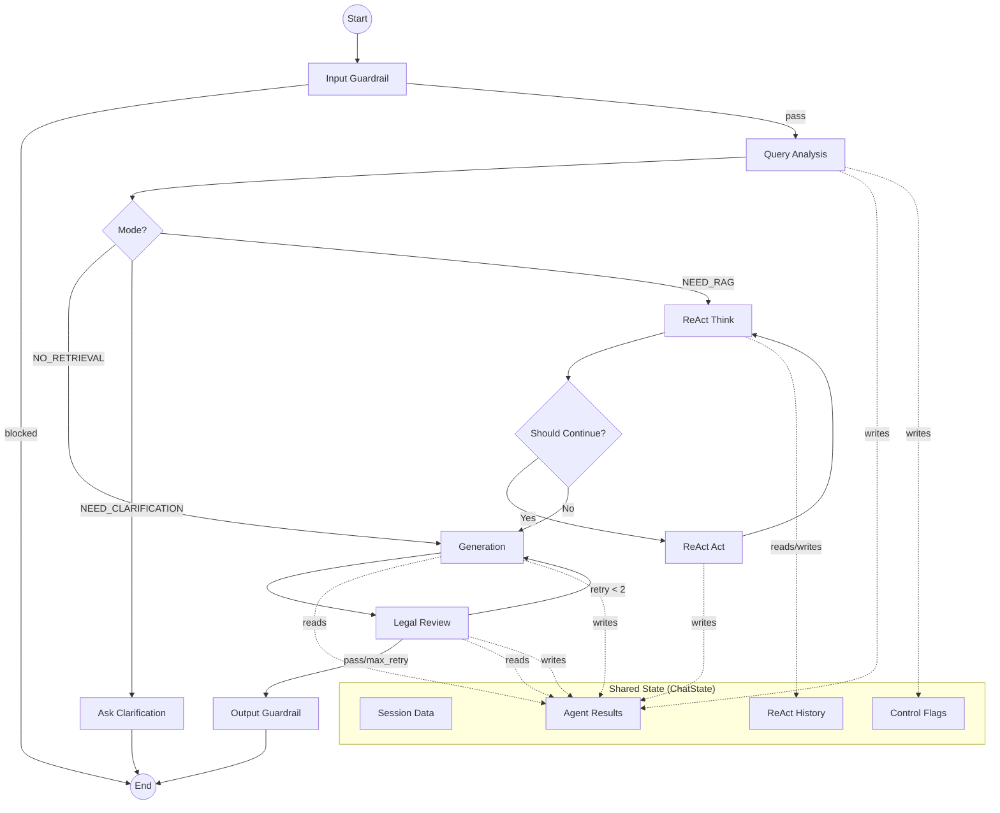

# PR1: Agent Communication Analysis

## Executive Summary
현재 똑소리(DDOKSORI) 오케스트레이터는 **Blackboard 아키텍처(Shared State)** 패턴을 사용하고 있습니다. 모든 에이전트(노드)는 `ChatState`라는 거대한 공유 상태 객체에 접근하여 필요한 정보를 읽고 자신의 실행 결과를 기록합니다. 이 방식은 에이전트 간의 데이터 전달을 유연하게 만들지만, 시스템이 복잡해짐에 따라 상태 비대화(State Bloat)와 암시적 의존성(Implicit Dependencies) 문제를 야기하고 있습니다.

본 문서는 `ChatState`의 40여 개 필드를 분석하고, 각 에이전트가 상태와 상호작용하는 방식을 시각화하여 향후 명시적 계약(Explicit Contract) 기반의 통신 구조로 개선하기 위한 기초 자료를 제공합니다.

## ChatState Field Analysis

### Field Groups
`ChatState` 필드는 역할에 따라 6개의 카테고리로 분류됩니다.

| Category | Fields | Description |
| :--- | :--- | :--- |
| **Session** | `messages`, `chat_type`, `onboarding`, `user_query` | 대화의 기본 컨텍스트 및 사용자 입력 정보 |
| **Agent Results** | `query_analysis`, `retrieval`, `draft_answer`, `review` | 각 에이전트 단계별 중간 실행 결과 |
| **Output** | `final_answer`, `sources`, `has_sufficient_evidence`, `clarifying_questions`, `claim_evidence_map` | 사용자에게 반환될 최종 데이터 및 근거 |
| **Control** | `retry_count`, `mode`, `guardrail_blocked`, `guardrail_type`, `awaiting_user_choice`, `low_similarity_mode`, `_node_timings` | 그래프 실행 흐름 제어 및 모니터링 플래그 |
| **ReAct** | `react_steps`, `current_iteration`, `max_iterations`, `should_continue`, `last_thought`, `last_action`, `last_observation` | ReAct 패턴(추론-행동 루프) 실행 상태 |
| **Memory** | `conversation_history`, `compact_summary`, `total_turn_count` | 장기 대화 및 메모리 압축 관리 데이터 |

### Agent-Field Mapping
각 노드가 어떤 필드를 읽고(R) 쓰는지(W) 나타내는 매트릭스입니다.

| Field | Input Guard | Query Analysis | Retrieval | ReAct Think | ReAct Act | Generation | Review | Output Guard |
| :--- | :---: | :---: | :---: | :---: | :---: | :---: | :---: | :---: |
| `user_query` | R | R | R | R | R | R | - | - |
| `chat_type` | - | R | - | - | - | R | - | - |
| `onboarding` | - | R | R | - | - | R | - | - |
| `query_analysis` | - | **W** | R | R | - | R | - | - |
| `mode` | - | **W** | - | - | - | - | - | - |
| `retrieval` | - | - | **W** | R | **W** | R | R | - |
| `sources` | - | - | **W** | - | - | - | R | - |
| `last_thought` | - | - | - | **W** | R | - | - | - |
| `last_action` | - | - | - | **W** | R | - | - | - |
| `should_continue` | - | - | - | **W** | **W** | - | - | - |
| `react_steps` | - | - | - | R | **W** | R | - | - |
| `draft_answer` | - | - | - | - | - | **W** | R | - |
| `final_answer` | - | - | - | - | - | **W** | **W** | R |
| `review` | - | - | - | - | - | - | **W** | - |
| `retry_count` | - | - | - | - | - | - | **W** | - |
| `guardrail_blocked` | **W** | - | - | - | - | - | - | **W** |

## State Flow Diagram



## Current Pattern: Blackboard Architecture

### How It Works
모든 에이전트는 `ChatState`라는 단일 TypedDict를 공유합니다. LangGraph의 `StateGraph`는 각 노드가 반환하는 딕셔너리를 기존 상태와 병합(Merge)하며, `Annotated[List, operator.add]`와 같은 리듀서를 통해 특정 필드의 데이터를 누적합니다.

### Advantages
- **유연성**: 새로운 에이전트를 추가할 때 기존 에이전트의 인터페이스를 수정할 필요 없이 상태 필드만 추가하면 됩니다.
- **단순성**: 노드 간의 복잡한 파이프라인 연결 없이 상태를 통해 데이터를 주고받을 수 있습니다.
- **디버깅**: 상태 스냅샷만 확인하면 전체 시스템의 현재 상황을 한눈에 파악할 수 있습니다.

### Disadvantages
- **암시적 의존성**: 어떤 에이전트가 어떤 필드에 의존하는지 코드 레벨에서 명확히 드러나지 않습니다.
- **상태 오염**: 한 에이전트의 실수가 전체 상태를 망가뜨릴 수 있습니다.
- **직렬화 비용**: 상태가 커질수록 체크포인트 저장 및 복원 비용이 증가합니다.

## Comparison: User's Proposed Explicit JSON Pattern

사용자는 에이전트 간에 필요한 데이터만 JSON 형태로 명시적으로 주고받는 구조를 제안했습니다.

### Proposed Structure
```
Query Analysis → {query, mode: NEED_RAG}
Retrieval → {results, sources}
Generation → {answer, claim_map}
```

### Trade-offs

| Aspect | Blackboard (Current) | Explicit JSON (Proposed) |
| :--- | :--- | :--- |
| **Data Scope** | Full State access | Minimal required data |
| **Contract** | Implicit (State fields) | Explicit (I/O Schema) |
| **Coupling** | Loose (via State) | Tight (via Direct I/O) |
| **Scalability** | High (Easy to add fields) | Medium (Requires schema updates) |
| **Traceability** | State Snapshots | Message Logs |

## Identified Issues

### 1. State Bloat
`ChatState`는 현재 40개 이상의 필드를 포함하고 있습니다. 특히 `ReAct` 관련 필드와 `Session` 메타데이터가 혼재되어 있어, 특정 모드(예: Fast Path)에서는 사용되지 않는 필드가 절반 이상을 차지합니다.

### 2. Implicit Dependencies
에이전트 함수 시그니처가 `def node(state: ChatState)`로 통일되어 있어, 해당 노드가 실제로 어떤 데이터를 필요로 하는지 알기 어렵습니다. 이는 리팩토링이나 테스트 코드 작성 시 큰 장애물이 됩니다.

### 3. Memory Growth
`sources`와 `react_steps` 필드는 `operator.add`를 사용하여 데이터를 누적합니다. ReAct 루프가 길어지거나 대화가 지속될 경우 이 리스트들이 비대해져 컨텍스트 윈도우를 압박하거나 시스템 성능을 저하시킬 수 있습니다.

## Recommendations

### Short-term (No code changes)
1. **Documentation**: 본 문서와 같은 필드 매핑 정보를 최신으로 유지하여 개발자 간의 혼선을 방지합니다.
2. **Type Hinting**: 에이전트 내부에서 상태를 읽을 때 `TypedDict`의 `get` 대신 명시적인 타입 캐스팅이나 검증을 수행합니다.

### Medium-term (Refactoring)
1. **Sub-states**: `ChatState`를 `SessionState`, `AgentState`, `ControlState` 등으로 논리적으로 분리하고, 에이전트가 필요한 서브 상태만 인자로 받도록 래퍼(Wrapper)를 도입합니다.
2. **Protocol Enforcement**: `backend/app/agents/protocols.py`에 정의된 프로토콜을 실제 노드 구현에 강제 적용하여 I/O 계약을 명확히 합니다.

### Long-term (Architecture)
1. **Functional Nodes**: 노드가 상태 전체를 받는 대신, 명확한 입력 파라미터를 받고 결과를 반환하는 순수 함수(Pure Function) 형태로 전환합니다. 오케스트레이터가 이 함수들 사이의 데이터 매핑을 담당하게 합니다.
2. **State Pruning**: 각 단계가 끝난 후 더 이상 필요 없는 중간 데이터(예: 대규모 검색 결과 원문)를 상태에서 제거하는 클린업 노드를 도입합니다.

## Appendix

### Full Field Reference
(상세 필드 정의는 `backend/app/orchestrator/state/__init__.py`의 docstring 참조)
